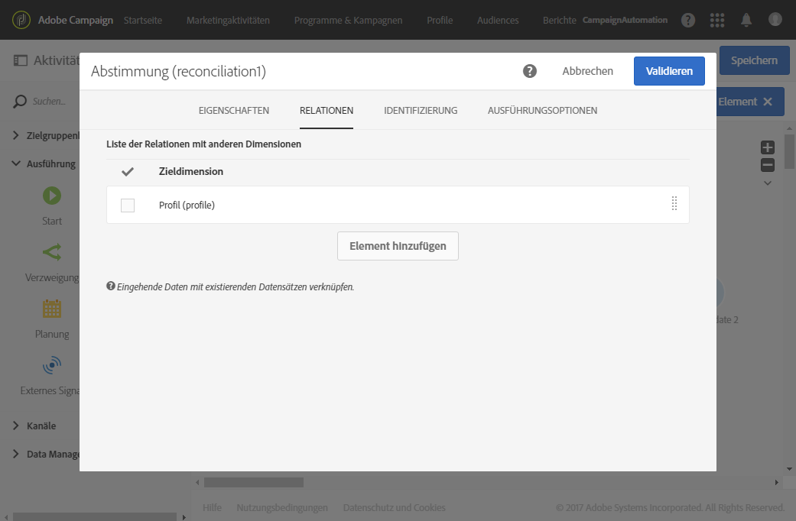
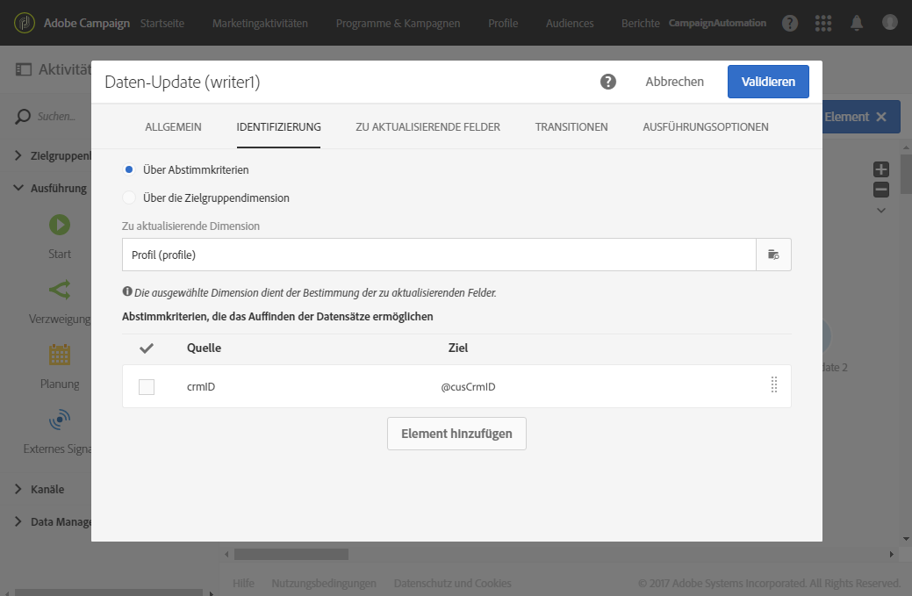
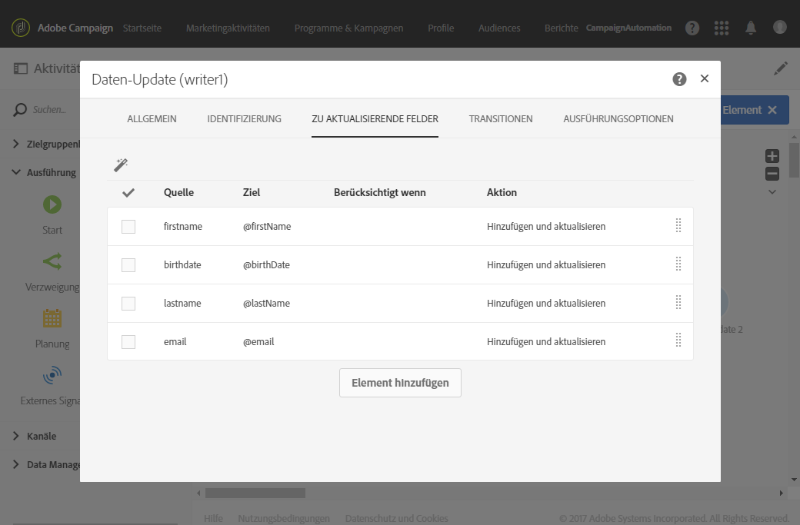
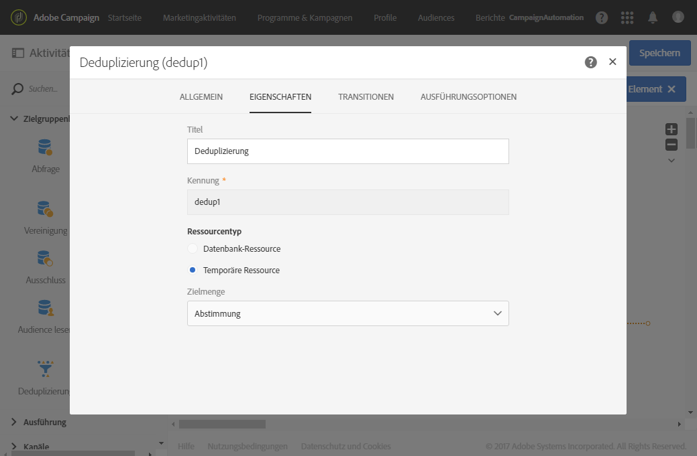
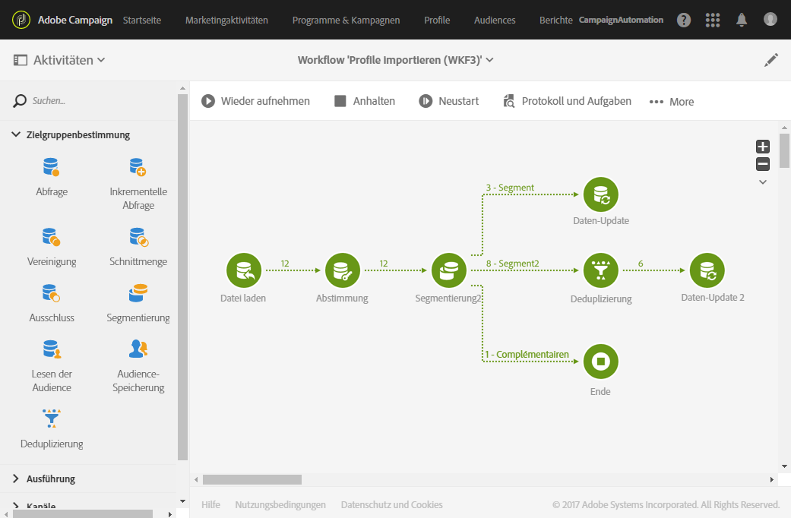

# Daten importieren{#importing-data}

## Daten erheben {#collecting-data}

Sie können die in einer Datei enthaltenen Daten erfassen und verarbeiten und/oder in die Adobe-Campaign-Datenbank importieren.

* Die Aktivität **[!UICONTROL Datei laden]** erlaubt den Import von strukturierten Dateidaten, um diese in Adobe Campaign verwenden zu können. Die importierten Daten werden nur vorübergehend gespeichert und erfordern die Verwendung einer weiteren Workflow-Aktivität, um definitiv in die Adobe Campaign-Datenbank integriert zu werden.

   Weiterführende Informationen zur Verwendung der Aktivität finden Sie in [diesem Abschnitt](../../automating/using/load-file.md).

* Die **[!UICONTROL Dateiübertragung]** dient dem Empfang und Versand von Dateien. Sie ermöglicht es zudem, das Vorhandensein von Dateien zu testen und die in Adobe Campaign enthaltenen Dateien aufzulisten.
Sie können diese Aktivität vor der Aktivität **[!UICONTROL Datei laden]** verwenden, um die Datei von einer externen Quelle abzurufen.

   Weiterführende Informationen zur Verwendung der Aktivität finden Sie in [diesem Abschnitt](../../automating/using/transfer-file.md).

## Best Practices beim Datenimport {#import-best-practices}

Eine sorgfältige Arbeitsweise und die Befolgung der unten stehenden einfachen Regeln helfen Ihnen, die Datenbank konsistent zu halten und gängige Fehler bei der Datenbankaktualisierung oder beim Datenexport zu vermeiden.

### Importvorlagen verwenden    {#using-import-templates}

Import-Workflows sollten die folgenden Aktivitäten beinhalten: **[!UICONTROL Datei laden]**, **[!UICONTROL Abstimmung]**, **[!UICONTROL Segmentierung]**, **[!UICONTROL Deduplizierung]**, **[!UICONTROL Daten-Update]**.

Importvorlagen vereinfachen die Durchführung ähnlicher Importe und halten die Datenbank konsistent.

In vielen Projekten werden Importe ohne **[!UICONTROL Deduplizierung]** erstellt, da die im Projekt verwendeten Dateien ohnehin keine Duplikate aufweisen. Beim Import verschiedener Dateien können jedoch Duplikate entstehen. Dann ist eine Deduplizierung schwierig. Deshalb ist eine Deduplizierung eine gute Vorsichtsmaßnahme bei jedem Import-Workflow.

Verlassen Sie sich nicht darauf, dass die eingehenden Daten konsistent und korrekt sind oder dass sich die IT-Abteilung oder der Adobe-Campaign-Verantwortliche darum kümmert. Führen Sie stattdessen während des Projekts die Datenbereinigung durch. Achten Sie beim Datenimport auf die Deduplizierung, die Abstimmung und die Gewährleistung der Konsistenz.

Ein Beispiel für eine allgemeine Workflow-Vorlage zum Datenimport finden Sie in Abschnitt [Import-Workflow-Vorlage](#example--import-workflow-template).

>[!NOTE]
>
>Sie können auch [Importvorlagen](../../automating/using/importing-data-with-import-templates.md) verwenden. Dies sind von einem Administrator definierte Workflow-Vorlagen, die nach ihrer Aktivierung nur mehr die Möglichkeit bieten, die Datei zu spezifizieren, die die Importdaten enthält.

**Verwandte Themen:**

* [Aktivität „Datei laden“](../../automating/using/load-file.md)
* [Aktivität „Abstimmung“](../../automating/using/reconciliation.md)
* [Aktivität „Segmentierung“](../../automating/using/segmentation.md)
* [Aktivität „Deduplizierung“](../../automating/using/deduplication.md)
* [Aktivität „Daten-Update“](../../automating/using/update-data.md)

### Dateiformate mit einfach strukturierten Daten verwenden    {#using-flat-file-formats}

Das effizienteste Format für Importe sind flache Dateien, die im Bulk-Modus auf Datenbankebene importiert werden können.

Beispiel:

* Trennzeichen: Tabulator oder Semikolon
* Erste Zeile mit Headern
* Keine Zeichenketten-Qualifizierer
* Datumsformat: JJJJ/MM/TT hh:mm:ss

Beispiel einer zu importierenden Datei:

```
lastname;firstname;birthdate;email;crmID
Smith;Hayden;23/05/1989;hayden.smith@example.com;124365
Mars;Daniel;17/11/1987;dannymars@example.com;123545
Smith;Clara;08/02/1989;hayden.smith@example.com;124567
Durance;Allison;15/12/1978;allison.durance@example.com;120987
```

### Komprimierung verwenden    {#using-compression}

Verwenden Sie für Importe und Exporte möglichst ZIP-Dateien. GZIP wird standardmäßig unterstützt. Beim Import von Dateien können Sie über die Workflow-Aktivität **[!UICONTROL Datei laden]** eine Vorbearbeitung hinzufügen. Bei der Datenextraktion können Sie über die Workflow-Aktivität **[!UICONTROL Dateiextraktion]** eine Nachbearbeitung hinzufügen.

**Verwandte Themen:**

* [Aktivität „Datei laden“](../../automating/using/load-file.md)
* [Aktivität „Dateiextraktion“](../../automating/using/extract-file.md)

### Im Deltamodus importieren {#importing-in-delta-mode}

Regelmäßige Importe müssen im Deltamodus durchgeführt werden. Damit wird gewährleistet, dass nicht jedes Mal die gesamte Tabelle, sondern nur geänderte oder neue Daten an Adobe Campaign gesendet werden.

Vollständige Importe sollten nur für das erstmalige Laden verwendet werden.

### Konsistenz gewährleisten    {#maintaining-consistency}

Um die Konsistenz der Adobe-Campaign-Datenbank zu gewährleisten, befolgen Sie die unten stehenden Grundsätze:

* Wenn die importierten Daten einer Referenztabelle in Adobe Campaign entsprechen, sollten sie im Workflow mit dieser Tabelle abgeglichen werden. Nicht übereinstimmende Datensätze sollten abgelehnt werden.
* Achten Sie darauf, dass die importierten Daten (E-Mail, Telefonnummer, Postanschrift) stets **&quot;bereinigt&quot;** werden und dass diese Bereinigung zuverlässig ist und sich im Laufe der Jahre nicht verändert. Andernfalls könnten in der Datenbank Duplikate entstehen. Da Adobe Campaign keine Tools zum &quot;unscharfen&quot; Abgleich besitzt, ist es dann sehr schwierig, diese Duplikate zu verwalten und zu entfernen.
* Transaktionsdaten sollten einen Abstimmschlüssel aufweisen und mit den bestehenden Daten abgestimmt werden, damit keine Duplikate entstehen.
* **Importieren Sie verknüpfte Dateien in der richtigen Reihenfolge**. Wenn der Import aus mehreren miteinander verbundenen Dateien besteht, sollte im Workflow darauf geachtet werden, dass die Dateien in der richtigen Reihenfolge importiert werden. Wenn der Import einer Datei fehlschlägt, werden auch die anderen nicht importiert.
* Achten Sie beim Datenimport auf die **Deduplizierung**, die Abstimmung und die Gewährleistung der Konsistenz.

## Verwalten verschlüsselter Daten {#managing-encrypted-data}

In manchen Fällen müssen die Daten, die Sie auf Campaign-Server importieren möchten, verschlüsselt werden, z. B. wenn sie PII-Daten enthalten.

Um verschlüsselte Dateien importieren oder exportieren zu können, müssen Sie sich zunächst an den Adobe-Kundendienst wenden, damit für Ihre Instanz die erforderlichen Verschlüsselungs-/Entschlüsselungsbefehle bereitgestellt werden.

Senden Sie dazu eine Anfrage mit folgenden Angaben:

* Dem **Titel**, der in der Campaign-Benutzeroberfläche angezeigt wird, zum Verwenden des Befehls. Beispiel: &quot;Datei verschlüsseln&quot;.
* Dem **Befehl** zum Installieren in Ihrer Instanz.
Um eine Datei beispielsweise mit PGP zu entschlüsseln, lautet der Befehl:

   ```
   <path-to_pgp_if-not_global_or_server/>pgp.exe --decrypt --input nl6/var/vp/import/filename.pgp --passphrase "your password" --recipient recipient @email.com --verbose --output nl6/var/vp/import/filename
   ```

Sobald die Anfrage verarbeitet wurde, stehen im Feld **!UICONTROL Vorab-Bearbeitungsetappe **der Aktivitäten **[!UICONTROL Datei laden]**und **[!UICONTROL Dateiextraktion]**die Verschlüsselungs-/Entschlüsselungsbefehle zur Verfügung. Diese können Sie zum Entschlüsseln oder Verschlüsseln der Dateien verwenden, die Sie importieren oder exportieren möchten.


**Verwandte Themen:**

* [Datei laden](../../automating/using/load-file.md)
* [Dateiextraktion](../../automating/using/extract-file.md)

## Erstellen von Workflow-Vorlagen zum Importieren von Daten {#example--import-workflow-template}

Für den regelmäßigen Import von Dateien derselben Struktur empfiehlt sich die Verwendung einer Importvorlage.

In diesem Beispiel wird gezeigt, wie ein Workflow für den wiederholten Import von Profilen aus einer CRM-Lösung in der Adobe-Campaign-Datenbank erstellt wird.

1. Erstellen Sie eine neue Workflow-Vorlage unter **[!UICONTROL Ressourcen > Vorlagen > Workflow-Vorlagen]**.
1. Fügen Sie die folgenden Aktivitäten hinzu:

   * **[!UICONTROL Datei laden]**: Definieren Sie die erwartete Struktur der Datei, die die zu importierenden Daten enthält.

      >[!NOTE]
      >
      >Im Zuge eines Imports können jeweils nur die Daten einer Datei importiert werden. Wenn der Workflow mehr als eine **[!UICONTROL Datei laden]**-Aktivität enthält, wird dieselbe Datei mehrmals verwendet.

   * **[!UICONTROL Abstimmung]**: Stimmen Sie die importierten Daten mit den Daten in der Datenbank ab.
   * **[!UICONTROL Segmentierung]**: Erstellen Sie Filter, um Datensätze, die abgestimmt werden konnten, und jene, die nicht abgestimmt werden konnten, unterschiedlich zu verarbeiten.
   * **[!UICONTROL Deduplizierung]**: Deduplizieren Sie die Daten aus der eingehenden Datei, bevor sie zur Datenbank hinzugefügt werden.
   * **[!UICONTROL Daten-Update]**: Aktualisieren Sie die Datenbank mit den importierten Profilen.
   

1. Konfigurieren Sie die Aktivität **[!UICONTROL Datei laden]**:

   * Definieren Sie die Struktur, die die Importdatei aufweisen soll, indem Sie eine Beispieldatei hochladen. Diese sollte nur einige wenige Zeilen aufweisen, aber alle für den Import erforderlichen Spalten. Prüfen und bearbeiten Sie das Dateiformat, um sicherzustellen, dass jeder Spaltentyp richtig eingerichtet ist: Text, Datum, Integer usw. Beispiel:

      ```
      lastname;firstname;birthdate;email;crmID
      Smith;Hayden;23/05/1989;hayden.smith@mailtest.com;123456
      ```

   * Wählen Sie im Bereich **[!UICONTROL Zu ladende Datei]** die Option **[!UICONTROL Andere lokale Datei laden]** und lassen Sie das Feld leer. Jedes Mal, wenn ein neuer Workflow von dieser Vorlage erstellt wird, können Sie hier die gewünschte Datei spezifizieren, solange sie der definierten Struktur entspricht.

      Sie können alle beliebigen Optionen verwenden, müssen aber die Vorlage entsprechend ändern. Wenn Sie beispielsweise **[!UICONTROL Datei der eingehenden Transition verwenden]** auswählen, können Sie die Aktivität **[!UICONTROL Dateiübertragung]** hinzufügen, bevor Sie die zu importierende Datei von einem FTP-/SFTP-Server abrufen.

      Wenn Sie Benutzern die Möglichkeit geben wollen, anschließend eine Datei mit während eines Imports aufgetretenen Fehlern herunterzuladen, aktivieren Sie die Option **[!UICONTROL Zurückweisungen in einer Datei speichern]** und geben Sie den **[!UICONTROL Dateinamen]** an.

      

1. Konfigurieren Sie die Aktivität **[!UICONTROL Abstimmung]**. Diese Aktivität hat in unserem Fall den Zweck, die eingehenden Daten zu identifizieren.

   * Wählen Sie im Tab **[!UICONTROL Relationen]** die Option **[!UICONTROL Element erstellen]** und definieren Sie eine Verknüpfung zwischen den importierten Daten und der Zielgruppendimension der Empfänger (siehe [Zielgruppendimensionen und Ressourcen](../../automating/using/query.md#targeting-dimensions-and-resources)). In unserem Beispiel wird diese Join-Bedingung mithilfe des benutzerdefinierten Feldes **Kennung im CRM** erstellt. Verwenden Sie das erforderliche Feld oder eine Kombination von Feldern, um eindeutige Datensätze zu identifizieren.
   * Lassen Sie im Tab **[!UICONTROL Identifizierung]** die Option **[!UICONTROL Dokument zur Zielgruppenbestimmung aufgrund der Arbeitsdaten identifizieren]** deaktiviert.
   

1. Konfigurieren Sie die Aktivität **[!UICONTROL Segmentierung]**, um abgestimmte Empfänger in einer Transition abzurufen und Empfänger, die nicht abgestimmt werden konnten, aber genügend Daten enthalten, in einer anderen Transition abzurufen.

   Danach kann die Datenbank mit der Transition mit abgestimmten Empfängern aktualisiert werden. Mit der Transition mit unbekannten Empfängern können dann neue Empfängereinträge in der Datenbank erstellt werden, vorausgesetzt die Datei enthält ein Mindestmaß an Daten.

   Empfänger, die nicht abgestimmt werden können und nicht genügend Daten aufweisen, werden in einer komplementären ausgehenden Transition ausgewählt und können in einer separaten Datei exportiert oder einfach ignoriert werden.

   * Wählen Sie im Tab **[!UICONTROL Allgemein]** der Aktivität für **[!UICONTROL Ressourcentyp]** die Option **[!UICONTROL Temporäre Ressource]** und danach **[!UICONTROL Abstimmung]** als Zielmenge.
   * Aktivieren Sie im Tab **[!UICONTROL Erweiterte Optionen]** die Option **[!UICONTROL Komplement erzeugen]**, um sich die Datensätze anzeigen zu lassen, die nicht in die Datenbank eingefügt werden können. Bei Bedarf können Sie dann für die komplementären Daten zusätzliche Verarbeitungsschritte setzen: Dateiexport, Listen-Update usw.
   * Fügen Sie dem ersten Segment des Tabs **[!UICONTROL Segmente]** eine Filterbedingung für die Eingangspopulation hinzu, um nur Datensätze auszuwählen, für die die Kennung im CRM nicht gleich 0 ist. Auf diese Weise werden in dieser Teilmenge Daten aus der Datei ausgewählt, die mit Empfängern aus der Datenbank abgestimmt sind.

      

   * Fügen Sie ein zweites Segment hinzu, das nicht abgestimmte Datensätze enthält, die aber genügend Informationen für die Aufnahme in die Datenbank aufweisen. Beispiel: E-Mail-Adresse, Vor- und Nachname. Nicht abgestimmte Datensätze weisen für Profile eine Kennung im CRM auf, deren Wert gleich 0 ist.

      

   * Alle nicht in den ersten beiden Teilmengen ausgewählten Datensätze werden im **[!UICONTROL Komplement]** ausgewählt.

1. Konfigurieren Sie die Aktivität **[!UICONTROL Daten-Update]**, die auf die erste ausgehende Transition der zuvor konfigurierten **[!UICONTROL Segmentierung]** folgt.

   * Wählen Sie als **[!UICONTROL Kampagnentyp]** die Option **[!UICONTROL Aktualisieren]** aus, da die eingehende Transition nur bereits in der Datenbank vorhandene Empfänger enthält.
   * Wählen Sie im Tab **[!UICONTROL Identifizierung]** die Option **[!UICONTROL Über Abstimmkriterien]** und definieren Sie einen Schlüssel zwischen **[!UICONTROL Zu aktualisierende Dimension]** – in unserem Fall Profile – und der in der Aktivität **[!UICONTROL Abstimmung]** erstellten Verknüpfung. In unserem Beispiel wird das benutzerdefinierte Feld **Kennung im CRM** verwendet.

      

   * Geben Sie im Tab **[!UICONTROL Zu aktualisierende Felder]** an, welche Felder aus der Profildimension mit dem Wert der entsprechenden Spalte in der Datei aktualisiert werden sollen. Wenn die Namen der Dateispalten mit den Namen der Dimensionsfelder der Empfänger übereinstimmen oder ihnen sehr ähnlich sind, können Sie die Felder mithilfe des Zauberstab-Symbols automatisch miteinander abstimmen.

      

      >[!NOTE]
      >
      >Wenn Sie diesen Profilen Briefpost senden möchten, fügen Sie eine Anschrift ein, da diese Informationen für den Briefpost-Dienstleister wesentlich sind. Beachten Sie außerdem, dass in der Profilinformation die Option **[!UICONTROL Anschrift angegeben]** aktiviert ist. Um diese Option in einem Workflow zu aktualisieren, fügen Sie einfach den zu aktualisierenden Feldern ein Element hinzu, geben Sie **1** für **[!UICONTROL Quelle]** an und wählen Sie für das Feld `postalAddress/@addrDefined`**[!UICONTROL Ziel]** aus. Weiterführende Informationen zu Briefpost und zur Verwendung der Option **[!UICONTROL Anschrift angegeben]** finden Sie in [diesem Dokument](../../channels/using/about-direct-mail.md#recommendations).

1. Konfigurieren Sie die Aktivität **[!UICONTROL Deduplizierung]**, die auf die Transition nicht abgestimmter Profile folgt:

   * Wählen Sie im Tab **[!UICONTROL Eigenschaften]** für **[!UICONTROL Ressourcentyp]** die vorübergehend durch die Aktivität **[!UICONTROL Abstimmung]** erzeugte Ressource des Workflows.

      

   * In diesem Beispiel wird das E-Mail-Feld zum Ermitteln eindeutiger Profile verwendet. Sie können aber auch jedes andere Feld verwenden, das ausgefüllt und Teil einer eindeutigen Kombination ist.
   * Wählen Sie eine **[!UICONTROL Deduplizierungsmethode aus]**. In diesem Fall wird von der Anwendung automatisch festgelegt, welche Datensätze im Fall von Duplikaten behalten werden.
   

1. Konfigurieren Sie die Aktivität **[!UICONTROL Daten-Update]**, die auf die zuvor konfigurierte Aktivität **[!UICONTROL Deduplizierung]** folgt.

   * Wählen Sie als **[!UICONTROL Kampagnentyp]** die Option **[!UICONTROL Nur hinzufügen]** aus, da die eingehende Transition nur noch nicht in der Datenbank vorhandene Profile enthält.
   * Wählen Sie im Tab **[!UICONTROL Identifizierung]** die Option **[!UICONTROL Über Abstimmkriterien]** und definieren Sie einen Schlüssel zwischen **[!UICONTROL Zu aktualisierende Dimension]** – in unserem Fall Profile – und der in der Aktivität **[!UICONTROL Abstimmung]** erstellten Verknüpfung. In unserem Beispiel wird das benutzerdefinierte Feld **Kennung im CRM** verwendet.

      

   * Geben Sie im Tab **[!UICONTROL Zu aktualisierende Felder]** an, welche Felder aus der Profildimension mit dem Wert der entsprechenden Spalte in der Datei aktualisiert werden sollen. Wenn die Namen der Dateispalten mit den Namen der Dimensionsfelder der Empfänger übereinstimmen oder ihnen sehr ähnlich sind, können Sie die Felder mithilfe des Zauberstab-Symbols automatisch miteinander abstimmen.

      

      >[!NOTE]
      >
      >Wenn Sie diesen Profilen Briefpost senden möchten, fügen Sie eine Anschrift ein, da diese Informationen für den Briefpost-Dienstleister wesentlich sind. Beachten Sie außerdem, dass in der Profilinformation die Option **[!UICONTROL Anschrift angegeben]** aktiviert ist. Um diese Option in einem Workflow zu aktualisieren, fügen Sie einfach den zu aktualisierenden Feldern ein Element hinzu, geben Sie als **Source** **[!UICONTROL 1]** an und wählen Sie als **[Destination]** das Feld **[!UICONTROL postalAddress/@addrDefined]** aus. Weiterführende Informationen zu Briefpost und zur Verwendung der Option **[!UICONTROL Anschrift angegeben]** finden Sie in [diesem Dokument](../../channels/using/about-direct-mail.md#recommendations).

1. Fügen Sie nach der dritten Transition der Aktivität **[!UICONTROL Segmentierung]** die Aktivität **[!UICONTROL Dateiextraktion]** und eine **[!UICONTROL Dateiübertragung]** hinzu, wenn Sie die noch nicht in die Datenbank übertragenen Daten verfolgen möchten. Konfigurieren Sie diese Aktivitäten, um die benötigte Spalte zu exportieren und die Datei auf einen FTP- oder SFTP-Server zu übertragen, wo Sie sie abrufen können.
1. Fügen Sie eine **[!UICONTROL Ende]**-Aktivität an und speichern Sie die Workflow-Vorlage.

Die Vorlage ist jetzt einsatzbereit und kann für jeden neuen Workflow verwendet werden. Dann muss nur noch die Datei spezifiziert werden, deren Daten in der Aktivität **[!UICONTROL Datei laden]** importiert werden sollen.


