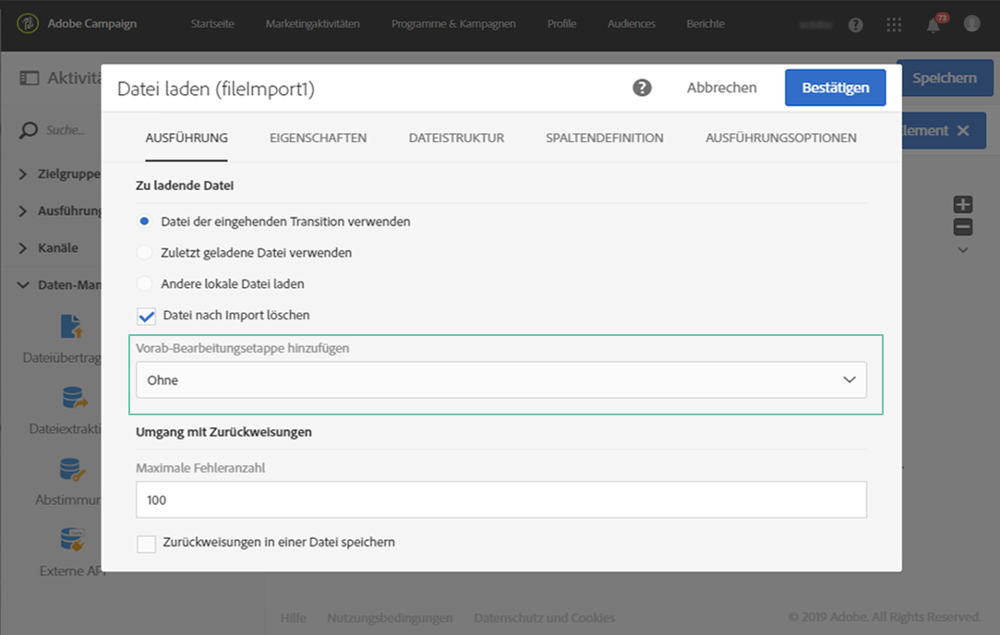
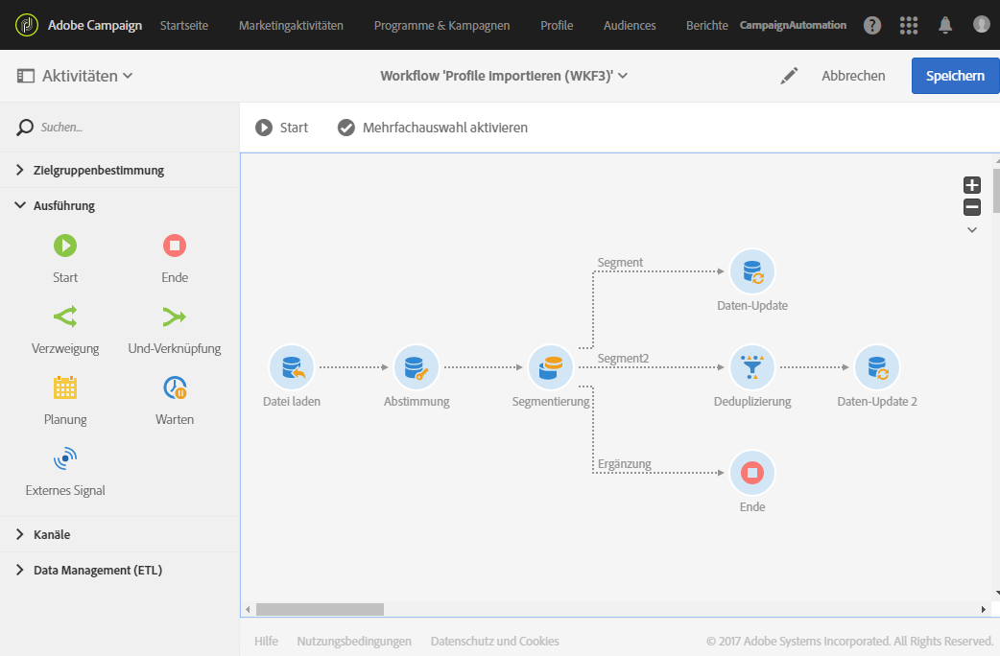
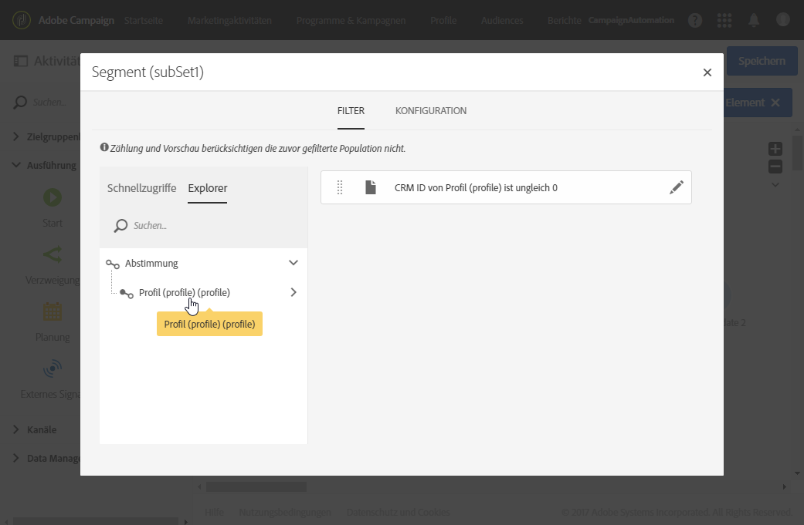
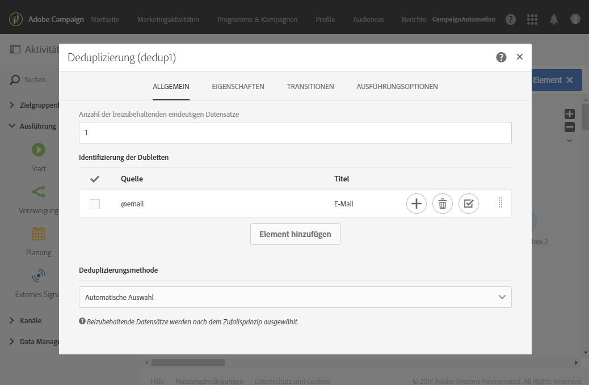

# Daten importieren{#importing-data}

## Daten erheben {#collecting-data}

Sie können die in einer Datei enthaltenen Daten erfassen und verarbeiten und/oder in die Adobe-Campaign-Datenbank importieren.

* The **[!UICONTROL Load file]** activity allows you to import data in one structured form to use this data in Adobe Campaign. Die importierten Daten werden nur vorübergehend gespeichert und erfordern die Verwendung einer weiteren Workflow-Aktivität, um definitiv in die Adobe Campaign-Datenbank integriert zu werden.

   For more on how to use this activity, refer to [this section](../../automating/using/load-file.md).

* The **[!UICONTROL Transfer file]** activity allows you to receive or send files, test whether there are files present, or list files in Adobe Campaign.
You can use this activity before a **[!UICONTROL Load file]** in case you need to retrieve the file from an external source.

   For more on how to use this activity, refer to [this section](../../automating/using/transfer-file.md).

## Best Practices beim Datenimport {#import-best-practices}

Eine sorgfältige Arbeitsweise und die Befolgung der unten stehenden einfachen Regeln helfen Ihnen, die Datenbank konsistent zu halten und gängige Fehler bei der Datenbankaktualisierung oder beim Datenexport zu vermeiden.

### Importvorlagen verwenden   {#using-import-templates}

Die meisten Workflows sollten die folgenden Aktivitäten enthalten: **[!UICONTROL Load file]**, **[!UICONTROL Reconciliation]**, **[!UICONTROL Segmentation]**, **[!UICONTROL Deduplication]**, **[!UICONTROL Update data]**.

Importvorlagen vereinfachen die Durchführung ähnlicher Importe und halten die Datenbank konsistent.

In many projects, imports are built without **[!UICONTROL Deduplication]** activity because the files used in the project do not have duplicates. Beim Import verschiedener Dateien können jedoch Duplikate entstehen. Dann ist eine Deduplizierung schwierig. Deshalb ist eine Deduplizierung eine gute Vorsichtsmaßnahme bei jedem Import-Workflow.

Verlassen Sie sich nicht darauf, dass die eingehenden Daten konsistent und korrekt sind oder dass sich die IT-Abteilung oder der Adobe-Campaign-Verantwortliche darum kümmert. Führen Sie stattdessen während des Projekts die Datenbereinigung durch. Achten Sie beim Datenimport auf die Deduplizierung, die Abstimmung und die Gewährleistung der Konsistenz.

Ein Beispiel für eine allgemeine Workflow-Vorlage zum Datenimport finden Sie in Abschnitt [Import-Workflow-Vorlage](#example--import-workflow-template).

>[!NOTE]
>
>Sie können auch [Importvorlagen](../../automating/using/importing-data-with-import-templates.md) verwenden. Dies sind von einem Administrator definierte Workflow-Vorlagen, die nach ihrer Aktivierung nur mehr die Möglichkeit bieten, die Datei zu spezifizieren, die die Importdaten enthält.

**Verwandte Themen:**

* [Datei laden, Aktivität](../../automating/using/load-file.md)
* [Aktivität der Versöhnung](../../automating/using/reconciliation.md)
* Aktivität [Segmentierung](../../automating/using/segmentation.md)
* [Deduplizierung-Duplikate-Aktivität](../../automating/using/deduplication.md)
* [Aktivität von Daten aktualisieren](../../automating/using/update-data.md)

### Dateiformate mit einfach strukturierten Daten verwenden   {#using-flat-file-formats}

Das effizienteste Format für Importe sind flache Dateien, die im Bulk-Modus auf Datenbankebene importiert werden können.

Beispiel:

* Trennzeichen: Tabulator oder Semikolon
* Erste Zeile mit Headern
* Keine Zeichenketten-Qualifizierer
* Datumsformat: JJJJ/MM/TT hh:mm:ss

Beispiel einer zu importierenden Datei:

```
lastname;firstname;birthdate;email;crmID
Smith;Hayden;23/05/1989;hayden.smith@example.com;124365
Mars;Daniel;17/11/1987;dannymars@example.com;123545
Smith;Clara;08/02/1989;hayden.smith@example.com;124567
Durance;Allison;15/12/1978;allison.durance@example.com;120987
```

### Komprimierung verwenden   {#using-compression}

Verwenden Sie für Importe und Exporte möglichst ZIP-Dateien. GZIP wird standardmäßig unterstützt. You can add pre-processing when importing files or post-processing when extracting data, respectively in the **[!UICONTROL Load file]** and **[!UICONTROL Extract file]** workflow activities.

**Verwandte Themen:**

* [Datei laden, Aktivität](../../automating/using/load-file.md)
* [Extrahieren der Aktivität](../../automating/using/extract-file.md)

### Im Deltamodus importieren {#importing-in-delta-mode}

Regelmäßige Importe müssen im Deltamodus durchgeführt werden. Damit wird gewährleistet, dass nicht jedes Mal die gesamte Tabelle, sondern nur geänderte oder neue Daten an Adobe Campaign gesendet werden.

Vollständige Importe sollten nur für das erstmalige Laden verwendet werden.

### Konsistenz gewährleisten   {#maintaining-consistency}

Um die Konsistenz der Adobe-Campaign-Datenbank zu gewährleisten, befolgen Sie die unten stehenden Grundsätze:

* Wenn die importierten Daten einer Referenztabelle in Adobe Campaign entsprechen, sollten sie im Workflow mit dieser Tabelle abgeglichen werden. Nicht übereinstimmende Datensätze sollten abgelehnt werden.
* Achten Sie darauf, dass die importierten Daten (E-Mail, Telefonnummer, Postanschrift) stets **&quot;bereinigt&quot;** werden und dass diese Bereinigung zuverlässig ist und sich im Laufe der Jahre nicht verändert. Andernfalls könnten in der Datenbank Duplikate entstehen. Da Adobe Campaign keine Tools zum &quot;unscharfen&quot; Abgleich besitzt, ist es dann sehr schwierig, diese Duplikate zu verwalten und zu entfernen.
* Transaktionsdaten sollten einen Abstimmschlüssel aufweisen und mit den bestehenden Daten abgestimmt werden, damit keine Duplikate entstehen.
* **Importieren Sie verknüpfte Dateien in der richtigen Reihenfolge**. Wenn der Import aus mehreren miteinander verbundenen Dateien besteht, sollte im Workflow darauf geachtet werden, dass die Dateien in der richtigen Reihenfolge importiert werden. Wenn der Import einer Datei fehlschlägt, werden auch die anderen nicht importiert.
* Achten Sie beim Datenimport auf die **Deduplizierung**, die Abstimmung und die Gewährleistung der Konsistenz.

## Verwalten verschlüsselter Daten {#managing-encrypted-data}

In manchen Fällen müssen die Daten, die Sie auf Campaign-Server importieren möchten, verschlüsselt werden, z. B. wenn sie PII-Daten enthalten.

Um verschlüsselte Dateien importieren oder exportieren zu können, müssen Sie sich zunächst an den Adobe-Kundendienst wenden, damit für Ihre Instanz die erforderlichen Verschlüsselungs-/Entschlüsselungsbefehle bereitgestellt werden.

Senden Sie dazu eine Anfrage mit folgenden Angaben:

* Dem **Titel**, der in der Campaign-Benutzeroberfläche angezeigt wird, zum Verwenden des Befehls. Beispiel: &quot;Datei verschlüsseln&quot;.
* Dem **Befehl** zum Installieren in Ihrer Instanz.
Um eine Datei beispielsweise mit PGP zu entschlüsseln, lautet der Befehl:

   ```
   <path-to_pgp_if-not_global_or_server/>pgp.exe --decrypt --input nl6/var/vp/import/filename.pgp --passphrase "your password" --recipient recipient @email.com --verbose --output nl6/var/vp/import/filename
   ```

Sobald die Anforderung verarbeitet ist, stehen die Verschlüsselungs-/Entschlüsselungsbefehle im **!UICONTROL Pre-processing stage]** Feld der **[!UICONTROL Load file]** und der **[!UICONTROL Extract file]** Aktivitäten zur Verfügung. Diese können Sie zum Entschlüsseln oder Verschlüsseln der Dateien verwenden, die Sie importieren oder exportieren möchten.



**Verwandte Themen:**

* [Datei laden](../../automating/using/load-file.md)
* [Dateiextraktion](../../automating/using/extract-file.md)

## Erstellen von Workflow-Vorlagen zum Importieren von Daten {#example--import-workflow-template}

Für den regelmäßigen Import von Dateien derselben Struktur empfiehlt sich die Verwendung einer Importvorlage.

In diesem Beispiel wird gezeigt, wie ein Workflow für den wiederholten Import von Profilen aus einer CRM-Lösung in der Adobe-Campaign-Datenbank erstellt wird.

1. Erstellen Sie eine neue Workflow-Vorlage aus **[!UICONTROL Resources > Templates > Workflow templates]**.
1. Fügen Sie die folgenden Aktivitäten hinzu:

   * **[!UICONTROL Load file]**: Definieren Sie die erwartete Struktur der Datei mit den zu importierenden Daten.

      >[!NOTE]
      >
      >Im Zuge eines Imports können jeweils nur die Daten einer Datei importiert werden. If the workflow has multiple **[!UICONTROL Load file]** activities, the same file will be used each time.

   * **[!UICONTROL Reconciliation]**: Verknüpfen Sie die importierten Daten mit den Datenbankdaten.
   * **[!UICONTROL Segmentation]**: Erstellen Sie Filter, um Datensätze je nachdem, ob sie abgeglichen werden können oder nicht, unterschiedlich zu verarbeiten.
   * **[!UICONTROL Deduplication]**: Deduplizieren Sie die Daten aus der eingehenden Datei, bevor sie in die Datenbank eingefügt werden.
   * **[!UICONTROL Update data]**: Aktualisieren Sie die Datenbank mit den importierten Profilen.
   

1. Konfigurieren Sie die **[!UICONTROL Load file]** Aktivität:

   * Definieren Sie die Struktur, die die Importdatei aufweisen soll, indem Sie eine Beispieldatei hochladen. Diese sollte nur einige wenige Zeilen aufweisen, aber alle für den Import erforderlichen Spalten. Prüfen und bearbeiten Sie das Dateiformat, um sicherzustellen, dass jeder Spaltentyp richtig eingerichtet ist: Text, Datum, Integer usw. Beispiel:

      ```
      lastname;firstname;birthdate;email;crmID
      Smith;Hayden;23/05/1989;hayden.smith@mailtest.com;123456
      ```

   * Wählen Sie im **[!UICONTROL File to load]** Abschnitt das Feld aus **[!UICONTROL Upload a new file from the local machine]** und lassen Sie es leer. Jedes Mal, wenn ein neuer Workflow von dieser Vorlage erstellt wird, können Sie hier die gewünschte Datei spezifizieren, solange sie der definierten Struktur entspricht.

      Sie können alle beliebigen Optionen verwenden, müssen aber die Vorlage entsprechend ändern. Wenn Sie beispielsweise **[!UICONTROL Use the file specified in the inbound transition]** auswählen, können Sie eine **[!UICONTROL Transfer file]** Aktivität hinzufügen, bevor Sie die Datei abrufen, die vom FTP-/SFTP-Server importiert werden soll.

      Wenn Sie möchten, dass Benutzer eine Datei mit Fehlern herunterladen können, die während eines Imports aufgetreten sind, aktivieren Sie die **[!UICONTROL Keep the rejects in a file]** Option und geben Sie die **[!UICONTROL File name]** Option an.

      

1. Konfigurieren Sie die **[!UICONTROL Reconciliation]** Aktivität. Diese Aktivität hat in unserem Fall den Zweck, die eingehenden Daten zu identifizieren.

   * In the **[!UICONTROL Relations]** tab, select **[!UICONTROL Create element]** and define a link between the imported data and the recipients targeting dimension (see [Targeting dimensions and resources](../../automating/using/query.md#targeting-dimensions-and-resources)). In unserem Beispiel wird diese Join-Bedingung mithilfe des benutzerdefinierten Feldes **Kennung im CRM** erstellt. Verwenden Sie das erforderliche Feld oder eine Kombination von Feldern, um eindeutige Datensätze zu identifizieren.
   * Lassen Sie die Option auf der **[!UICONTROL Identification]** Registerkarte **[!UICONTROL Identify the document from the working data]** deaktiviert.
   

1. Configure the **[!UICONTROL Segmentation]** activity to retrieve reconciled recipients in one transition and recipients that could not be reconciled but who have enough data in a second transition.

   Danach kann die Datenbank mit der Transition mit abgestimmten Empfängern aktualisiert werden. Mit der Transition mit unbekannten Empfängern können dann neue Empfängereinträge in der Datenbank erstellt werden, vorausgesetzt die Datei enthält ein Mindestmaß an Daten.

   Empfänger, die nicht abgestimmt werden können und nicht genügend Daten aufweisen, werden in einer komplementären ausgehenden Transition ausgewählt und können in einer separaten Datei exportiert oder einfach ignoriert werden.

   * Legen Sie auf der **[!UICONTROL General]** Registerkarte der Aktivität die **[!UICONTROL Resource type]** Einstellung fest **[!UICONTROL Temporary resource]** und wählen Sie **[!UICONTROL Reconciliation]** als Zielgruppe aus.
   * In the **[!UICONTROL Advanced options]** tab, check the **[!UICONTROL Generate complement]** option to be able to see if any record cannot be inserted in the database. Bei Bedarf können Sie dann für die komplementären Daten zusätzliche Verarbeitungsschritte setzen: Dateiexport, Listen-Update usw.
   * In the first segment of the **[!UICONTROL Segments]** tab, add a filtering condition on the inbound population to select only records for which the profile&#39;s CRM ID is not equal to 0. Auf diese Weise werden in dieser Teilmenge Daten aus der Datei ausgewählt, die mit Empfängern aus der Datenbank abgestimmt sind.

      

   * Fügen Sie ein zweites Segment hinzu, das nicht abgestimmte Datensätze enthält, die aber genügend Informationen für die Aufnahme in die Datenbank aufweisen. Beispiel: E-Mail-Adresse, Vor- und Nachname. Nicht abgestimmte Datensätze weisen für Profile eine Kennung im CRM auf, deren Wert gleich 0 ist.

      

   * All records that are not selected in the first two subsets are selected in the **[!UICONTROL Complement]**.

1. Configure the **[!UICONTROL Update data]** activity located after the first outbound transition of the **[!UICONTROL Segmentation]** activity configured previously.

   * Select **[!UICONTROL Update]** as **[!UICONTROL Operation type]** since the inbound transition only contains recipients already present in the database.
   * Wählen Sie auf der **[!UICONTROL Identification]** Registerkarte einen Schlüssel aus **[!UICONTROL Using reconciliation criteria]** und definieren Sie ihn zwischen dem in diesem Fall **[!UICONTROL Dimension to update]** - Profil - und dem in der **[!UICONTROL Reconciliation]** Aktivität erstellten Link. In unserem Beispiel wird das benutzerdefinierte Feld **Kennung im CRM** verwendet.

      

   * In the **[!UICONTROL Fields to update]** tab, indicate the fields from the Profiles dimension to update with the value of the corresponding column from the file. Wenn die Namen der Dateispalten mit den Namen der Dimensionsfelder der Empfänger übereinstimmen oder ihnen sehr ähnlich sind, können Sie die Felder mithilfe des Zauberstab-Symbols automatisch miteinander abstimmen.

      

      >[!NOTE]
      >
      >Wenn Sie diesen Profilen Briefpost senden möchten, fügen Sie eine Anschrift ein, da diese Informationen für den Briefpost-Dienstleister wesentlich sind. Also make sure that the **[!UICONTROL Address specified]** box in your profiles&#39; information is checked. Um diese Option in einem Workflow zu aktualisieren, fügen Sie einfach den zu aktualisierenden Feldern ein Element hinzu, geben Sie als **** **[!UICONTROL Source]** 1 an und wählen Sie als **** das Feld **[!UICONTROL Destination]** postalAddress/@addrDefined aus. For more on direct mail and the use of the **[!UICONTROL Address specified]** option, see [this document](../../channels/using/about-direct-mail.md#recommendations).

1. Configure the **[!UICONTROL Deduplication]** activity located after the transition containing unreconciled profiles:

   * In the **[!UICONTROL Properties]** tab, set the **[!UICONTROL Resource type]** to the temporary resource generated from the **[!UICONTROL Reconciliation]** activity of the workflow.

      

   * In diesem Beispiel wird das E-Mail-Feld zum Ermitteln eindeutiger Profile verwendet. Sie können aber auch jedes andere Feld verwenden, das ausgefüllt und Teil einer eindeutigen Kombination ist.
   * Wählen Sie eine **[!UICONTROL Deduplication method]**. In diesem Fall wird von der Anwendung automatisch festgelegt, welche Datensätze im Fall von Duplikaten behalten werden.
   

1. Konfigurieren Sie die **[!UICONTROL Update data]** Aktivität, die sich nach der zuvor konfigurierten **[!UICONTROL Deduplication]** Aktivität befindet.

   * Select **[!UICONTROL Insert only]** as **[!UICONTROL Operation type]** since the inbound transition only contains profiles not present in the database.
   * Wählen Sie auf der **[!UICONTROL Identification]** Registerkarte einen Schlüssel aus **[!UICONTROL Using reconciliation criteria]** und definieren Sie ihn zwischen dem in diesem Fall **[!UICONTROL Dimension to update]** - Profil - und dem in der **[!UICONTROL Reconciliation]** Aktivität erstellten Link. In unserem Beispiel wird das benutzerdefinierte Feld **Kennung im CRM** verwendet.

      

   * In the **[!UICONTROL Fields to update]** tab, indicate the fields from the Profiles dimension to update with the value of the corresponding column from the file. Wenn die Namen der Dateispalten mit den Namen der Dimensionsfelder der Empfänger übereinstimmen oder ihnen sehr ähnlich sind, können Sie die Felder mithilfe des Zauberstab-Symbols automatisch miteinander abstimmen.

      

      >[!NOTE]
      >
      >Wenn Sie diesen Profilen Briefpost senden möchten, fügen Sie eine Anschrift ein, da diese Informationen für den Briefpost-Dienstleister wesentlich sind. Also make sure that the **[!UICONTROL Address specified]** box in your profiles&#39; information is checked. Um diese Option in einem Workflow zu aktualisieren, fügen Sie einfach den zu aktualisierenden Feldern ein Element hinzu, geben Sie als **** **[!UICONTROL Source]** 1 an und wählen Sie als **[]** das Feld **[!UICONTROL Destination]** postalAddress/@addrDefined aus. For more on direct mail and the use of the **[!UICONTROL Address specified]** option, see [this document](../../channels/using/about-direct-mail.md#recommendations).

1. After the third transition of the **[!UICONTROL Segmentation]** activity, add a **[!UICONTROL Extract file]** activity and a **[!UICONTROL Transfer file]** activity if you want to keep track of data not inserted in the database. Konfigurieren Sie diese Aktivitäten, um die benötigte Spalte zu exportieren und die Datei auf einen FTP- oder SFTP-Server zu übertragen, wo Sie sie abrufen können.
1. Add an **[!UICONTROL End]** activity and save the workflow template.

Die Vorlage ist jetzt einsatzbereit und kann für jeden neuen Workflow verwendet werden. All is needed is then to specify the file containing the data to import in the **[!UICONTROL Load file]** activity.


