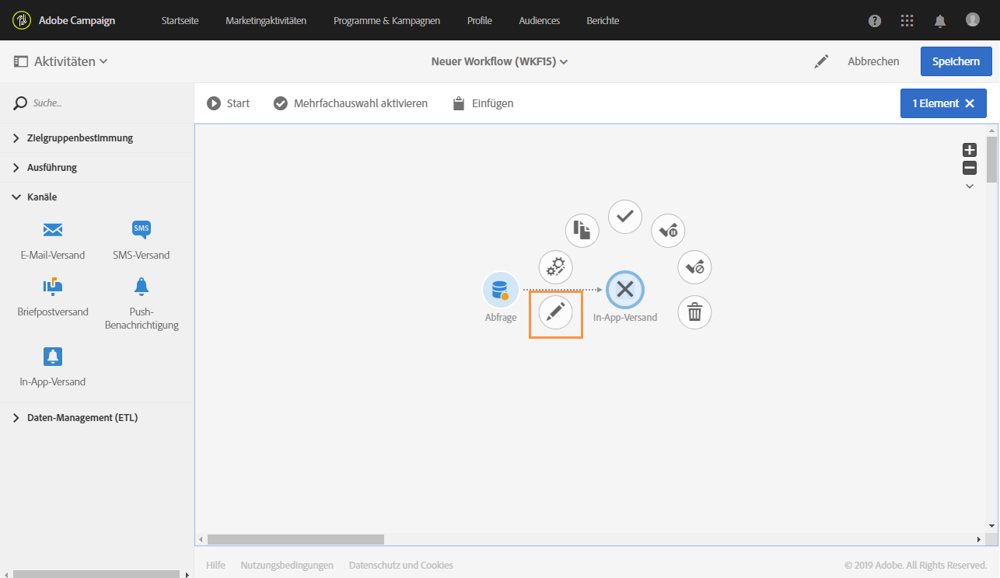
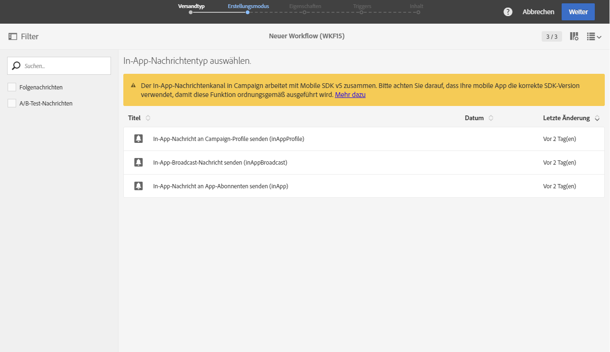
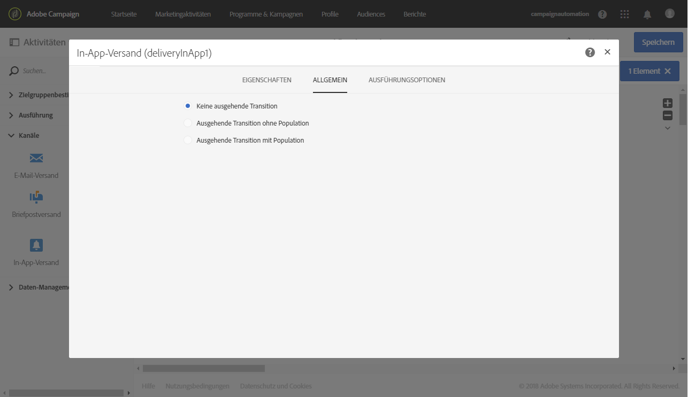

# In-App-Versand{#in-app-delivery}

## Beschreibung {#description}

Die Aktivität **In-App-Versand** ermöglicht das Konfigurieren des Versands von In-App-Nachrichten innerhalb eines Workflows. Mit In-App-Messaging haben Sie die Möglichkeit, in einer App eine Nachricht einzublenden, wenn ein Benutzer diese gerade verwendet. Weiterführende Informationen zum In-App-Versand finden Sie in diesem [Abschnitt](../../channels/using/about-in-app-messaging.md).

## Anwendungskontext     {#context-of-use}

Die Aktivität **[!UICONTROL In-App-Versand]** dient insbesondere der Automatisierung des In-App-Versands an eine innerhalb desselben Workflows berechnete Zielgruppe.

Die Empfänger werden in vorangeschalteten Zielgruppenbestimmungsaktivitäten des Workflows, wie beispielsweise Abfragen, Schnittmengen etc. definiert.

Die Vorbereitung der Nachricht wird in Abhängigkeit von den Ausführungsparametern des Workflows ausgelöst. Sie können im Nachrichten-Dashboard auswählen, ob eine manuelle Bestätigung zum Nachrichtenversand erforderlich ist oder nicht (standardmäßig erforderlich). Sie können den Workflow entweder manuell starten oder eine Planung verwenden, um die Ausführung zu automatisieren.

## Konfiguration          {#configuration}

1. Ziehen Sie eine **[!UICONTROL Abfrage]** in den Workflow-Arbeitsbereich. Bitte beachten Sie, dass die Zielgruppendimension der Aktivität **[!UICONTROL Abfrage]** im Tab **[!UICONTROL Eigenschaften]** entsprechend der in Schritt 4 ausgewählten Vorlage aktualisiert werden muss:

   * Für die Vorlage **[!UICONTROL Alle Nutzer einer Mobile App auswählen (inAppBroadcast)]** sollte als Zielgruppendimension **[!UICONTROL mobileApp (mobileAppV5)]** ausgewählt werden.
   * Für die Vorlage **[!UICONTROL Nutzer der Zielgruppe auf der Basis ihres Campaign-Profils (inAppProfile)]** sollte als Zielgruppendimension **[!UICONTROL Profil (profile)]** ausgewählt werden.
   * Für die Vorlage **[!UICONTROL Nutzer der Zielgruppe auf der Basis ihres mobilen Profils (inApp)]** sollte als Zielgruppendimension **[!UICONTROL Abonnements für eine Anwendung (`nms:appSubscriptionRcp:appSubscriptionRcpDetail`)]** ausgewählt werden.

1. Ziehen Sie die Aktivität **[!UICONTROL In-App-Versand]** in Ihren Workflow.
1. Markieren Sie die Aktivität und öffnen Sie sie mithilfe der in der Schnellaktion angezeigten Schaltfläche .

   >[!NOTE]
   >
   >Die Schaltfläche  in der Schnellaktion bietet Zugriff auf die allgemeinen Eigenschaften und erweiterten Optionen der Aktivität (aber nicht des Versands selbst). 

   

1. Wählen Sie den In-App-Nachrichtentyp aus. Dieser hängt von den in der **[!UICONTROL Abfrage]**-Aktivität verwendeten Daten ab.

   * **[!UICONTROL Nutzer der Zielgruppe auf der Basis ihres Campaign-Profils]**: Mit diesem Nachrichtentyp können Sie Adobe-Campaign-Profile auswählen, die sich für Ihre Mobile App angemeldet haben, und In-App-Nachrichten mit in Campaign verfügbaren Profilattributen personalisieren.
   * **[!UICONTROL Alle Nutzer einer Mobile App auswählen]**: Mit diesem Nachrichtentyp können Sie eine Nachricht an alle Benutzer Ihrer Mobile App senden, selbst wenn in Campaign kein Profil existiert.
   * **[!UICONTROL Nutzer der Zielgruppe auf der Basis ihres mobilen Profils]**: Mit diesem Nachrichtentyp können Sie alle Benutzer einer Mobile App auswählen, von denen ein bekanntes oder unbekanntes mobiles Profil in Campaign existiert, und In-App-Nachrichten mit vom Mobilgerät empfangenen Profilattributen personalisieren.

   

1. Geben Sie die Eigenschaften der In-App-Nachricht ein und wählen Sie im Feld **[!UICONTROL Mobile App einem Versand zuordnen]** die entsprechende Mobile App aus.
1. Ziehen Sie das Ereignis, das Ihre Nachricht auslösen soll, in den Tab **[!UICONTROL Triggers]**. Es sind drei Ereigniskategorien verfügbar:
1. Definieren Sie den Inhalt der In-App-Nachricht. Weiterführende Informationen hierzu finden Sie im Abschnitt [In-App-Einstellungen](../../channels/using/customizing-an-in-app-message.md).
1. Der **[!UICONTROL In-App-Versand]** verfügt standardmäßig über keinerlei ausgehende Transitionen. Sie haben jedoch die Möglichkeit, für Ihren **[!UICONTROL In-App-Versand]** eine ausgehende Transition zu erzeugen, indem Sie unter Verwendung der in den Schnellaktionen der Aktivität verfügbaren Schaltfläche **[!UICONTROL die erweiterten Optionen öffnen und im]** Allgemein-Tab eine der folgenden Optionen aktivieren:

   * **[!UICONTROL Ausgehende Transition ohne Population hinzufügen]**: ermöglicht die Erstellung einer ausgehenden Transition, die exakt dieselbe Population enthält wie die eingehende Transition.
   * **[!UICONTROL Ausgehende Transition mit Population hinzufügen]**: ermöglicht die Erstellung einer ausgehenden Transition, die die Population enthält, der die Nachricht gesendet wurde. Der Teil der Zielgruppe, der in der Versandvorbereitung ausgeschlossen wurde, ist von dieser Transition ebenfalls ausgeschlossen.

   

1. Validieren Sie die Konfiguration der Aktivität und speichern Sie Ihren Workflow.

Wenn Sie die Aktivität später erneut öffnen, gelangen Sie direkt in das Dashboard der In-App-Nachricht. Nur der Inhalt kann zu diesem Zeitpunkt noch geändert werden.

Standardmäßig wird durch den Versand-Workflow nur die Vorbereitung der Nachricht ausgelöst. Der in einem Workflow erstellte Nachrichtenversand muss noch bestätigt werden, nachdem der Workflow gestartet wurde. Sie können aber im Nachrichten-Dashboard die Option **[!UICONTROL Vor dem Nachrichtenversand Bestätigung einholen]** deaktivieren. Dies ist jedoch nur möglich, wenn die Nachricht in einem Workflow erstellt wurde. Ist diese Option deaktiviert, werden Nachrichten ohne weiteren Hinweis gesendet, sobald die Vorbereitung abgeschlossen ist.

## Bemerkungen          {#remarks}

Auf die von einem Workflow aus erstellten Sendungen kann in der Marketing-Aktivitätenliste der Anwendung zugegriffen werden. Über das Dashboard lässt sich der Ausführungsstatus des Workflows visualisieren. Über die Links im Übersichtsmenü der Push-Benachrichtigung können Sie direkt auf verknüpfte Elemente wie den Workflow oder die Kampagne zugreifen.

Ausgehend von den übergeordneten Sendungen, auf die über die Liste der Marketing-Aktivitäten zugegriffen werden kann, lässt sich die Gesamtheit aller getätigten Sendungen visualisieren (in Abhängigkeit vom bei der Konfiguration der **[!UICONTROL In-App-Versandaktivität]** festgelegten Aggregat-Zeitraum). Öffnen Sie hierzu mithilfe der Schaltfläche  die Detailansicht der Kachel **[!UICONTROL Bereitstellung]** des übergeordneten Versands.
