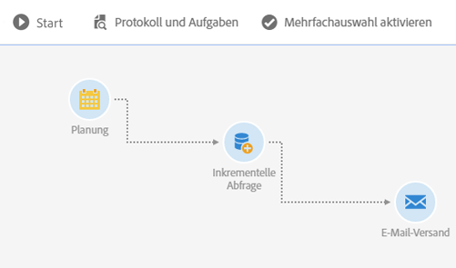
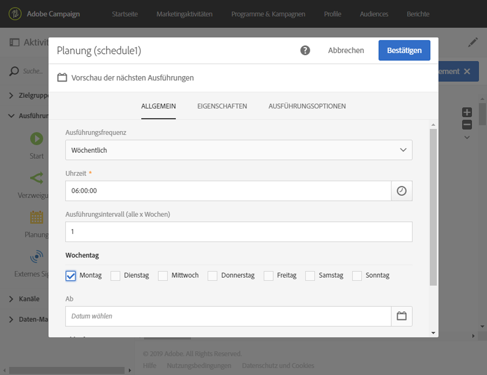
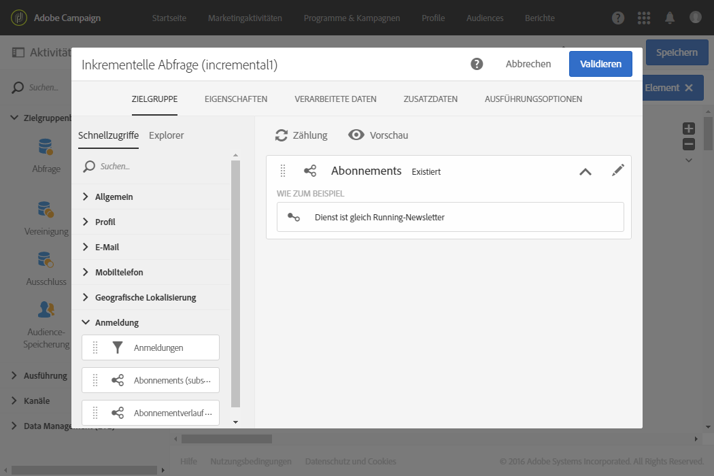

# Inkrementelle Abfrage bezüglich Dienst-Abonnenten {#example--incremental-query-on-subscribers-to-a-service}

Im folgenden Beispiel wird die Konfiguration der Aktivität **[!UICONTROL Inkrementelle Abfrage]** illustriert, die der Filterung der Profile der Adobe-Campaign-Datenbank dient, die Abonnenten des Diensts **Running-Newsletter** sind, um diesen eine Willkommens-E-Mail mit einem Sonderangebots-Code zu senden.

Der Workflow besteht aus folgenden Aktivitäten:

* Eine [Planung](../../automating/using/scheduler.md), damit der Workflow jeden Montag um 6 Uhr ausgeführt wird.

   

* Eine [Inkrementelle Abfrage](../../automating/using/incremental-query.md), die bei der ersten Ausführung zunächst den Abruf aller aktuellen Abonnenten, dann bei den folgenden Ausführungen nur den Abruf der im Laufe der Woche dazugekommenen, neuen Abonnenten ermöglicht.

   

* Ein [E-Mail-Versand. ](../../automating/using/email-delivery.md) Der Workflow wird einmal pro Woche ausgeführt, Sie haben jedoch die Möglichkeit, gesendete E-Mails sowie Ergebnisse pro Monat zu aggregieren, um so beispielsweise Berichte für einen ganzen Monat anstatt nur auf wöchentlicher Basis zu erzeugen.

   Wählen Sie hierzu an dieser Stelle die Erstellung einer **[!UICONTROL E-Mail zum wiederkehrenden Versand]** aus, die E-Mails und Ergebnisse **[!UICONTROL pro Monat]** zusammenfasst.

   Definieren Sie den Inhalt Ihrer E-Mail und fügen Sie den Willkommenscode für ein Sonderangebot ein. Weitere Informationen hierzu finden Sie in den Abschnitten zum [Definieren von E-Mail-Inhalten](../../designing/using/personalization.md).

Starten Sie nun die Ausführung des Workflows. Jede Woche erhalten neue Abonnenten die Willkommens-E-Mail mit dem Sonderangebotscode.
