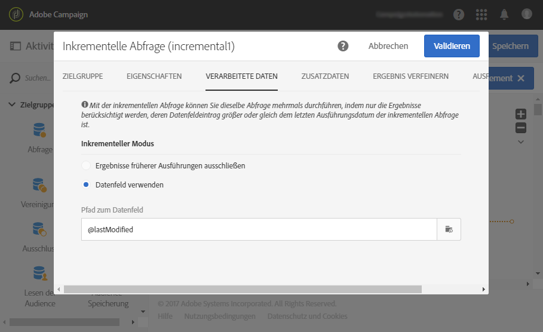

# Inkrementelle Abfrage{#incremental-query}

## Beschreibung {#description}

Eine **[!UICONTROL Inkrementelle Abfrage]** dient der Filterung und Extraktion einer Population, die sich aus Elementen der Adobe Campaign-Datenbank zusammensetzt. Bei jeder neuen Ausführung dieser Aktivität werden die Ergebnisse der vorangehenden Ausführungen ausgeschlossen. Dadurch lassen sich ausschließlich neue Elemente abrufen.

Mithilfe eines dedizierten Tabs können Sie **[!UICONTROL Zusatzdaten]** für die Zielpopulation definieren. Diese Daten werden in Zusatzspalten gespeichert und können ausschließlich für den laufenden Workflow verwendet werden.

Die Aktivität verwendet den Abfrage-Editor, dessen Funktionsweise in einem [gesonderten Kapitel](../../automating/using/editing-queries.md#about-query-editor) behandelt wird.

## Anwendungskontext       {#context-of-use}

Eine **[!UICONTROL Inkrementelle Abfrage]** muss mit einer **[!UICONTROL Planung]** einhergehen, um die Häufigkeit der Ausführung des Workflows und damit der Abfrage zu definieren.

Der für diese Aktivität spezifische Tab **[!UICONTROL Verarbeitete Daten]** ermöglicht es bei Bedarf, Ergebnisse vorangehender Ausführungen der Aktivität anzusehen.

**[!UICONTROL Inkrementelle Abfragen]** kommen in verschiedenen Kontexten zum Einsatz:

* Segmentierung von Einzelpersonen, um beispielsweise Zielgruppen für eine Nachricht zu definieren.

* Export von Daten

  Mit der Aktivität **[!UICONTROL Inkrementelle Abfrage]** können Sie regelmäßig neue Logs in Dateien exportieren. Diese Funktion kann verwendet werden, wenn Sie beispielsweise Ihre Log-Daten in externen Berichterstattungs- oder Business Intelligence Tools verwenden möchten. Ein vollständiges Beispiel finden Sie im Abschnitt [Logs exportieren](../../automating/using/exporting-logs.md).

**Verwandte Themen** 

* [Anwendungsfall: Inkrementelle Abfrage bezüglich Service-Abonnenten](../../automating/using/incremental-query-on-subscribers.md)

## Konfiguration {#configuration}

1. Ziehen Sie eine **[!UICONTROL Inkrementelle Abfrage]** in den Workflow-Arbeitsbereich.
1. Markieren Sie die Aktivität und öffnen Sie sie mithilfe der in der Schnellaktion angezeigten Schaltfläche .
1. Wenn sich Ihre Abfrage auf eine andere als die Profilressource beziehen soll, können Sie im **[!UICONTROL Eigenschaften]**-Tab der Aktivität die entsprechende **[!UICONTROL Ressource]** und eine **[!UICONTROL Zielgruppendimension]** auswählen.

   Die **[!UICONTROL Ressource]** entspricht dem Populationstyp, den Sie verwenden möchten (identifizierte Profile, Sendungen etc.). Die **[!UICONTROL Zielgruppendimension]** ist kontextuell in Bezug auf die ausgewählte Ressource und ermöglicht die gezielte Anzeige der verfügbaren Filter in der Palette.

1. Konfigurieren Sie im Tab **[!UICONTROL Zielgruppe]** die Abfrage, indem Sie Regeln definieren und/oder kombinieren.
1. Wählen Sie im Tab **[!UICONTROL Verarbeitete Daten]** den inkrementellen Modus, den Sie für die nächsten Ausführungen des Workflows verwenden möchten:

   * **[!UICONTROL Ergebnisse früherer Ausführungen ausschließen]**: Bei jeder neuen Ausführung werden die Ergebnisse der vorangehenden Ausführungen ausgeschlossen.
   * **[!UICONTROL Datumsfeld verwenden]**: Bei den nächsten Ausführungen werden nur die Ergebnisse berücksichtigt, deren ausgewählte Datumsangaben größer oder gleich dem letzten Ausführungsdatum der Aktivität **[!UICONTROL Inkrementelle Abfrage]** ist. Im Tab **[!UICONTROL Eigenschaften]** können Sie jedes zur ausgewählten Ressource gehörige Datumsfeld auswählen. Dieser Modus weist eine bessere Performance auf, wenn große Ressourcen wie zum Beispiel Log-Daten abgefragt werden.

     In diesem Tab ist nach der ersten Ausführung des Workflows das Datum der jeweils letzten Ausführung zu sehen, welches wiederum für die nächste Ausführung herangezogen wird. Es wird automatisch bei jeder Ausführung des Workflows aktualisiert. Sie können bei Bedarf diesen Wert auch überschreiben, indem Sie einen neuen eingeben.

   >[!NOTE]
   >
   >Der Modus **[!UICONTROL Datumsfeld verwenden]** ermöglicht je nach ausgewähltem Datumsfeld größere Flexibilität. Wenn beispielsweise das ausgewählte Feld ein Änderungsdatum ist, können Sie im Datumsfeldmodus Daten abrufen, die kürzlich aktualisiert wurden. Dagegen werden im anderen Modus Einträge ausgeschlossen, die schon in einer früheren Ausführung abgerufen worden waren, selbst wenn diese Daten seit der letzten Ausführung des Workflows geändert wurden.

   

1. Mithilfe eines dedizierten Tabs können Sie **[!UICONTROL Zusatzdaten]** für die Zielpopulation definieren. Diese Daten werden in Zusatzspalten gespeichert und können ausschließlich für den laufenden Workflow verwendet werden. Sie können insbesondere Daten aus Tabellen der Adobe Campaign-Datenbank hinzufügen, die mit der Zielgruppendimension der Abfrage in Relation stehen. Lesen Sie diesbezüglich auch den Abschnitt [Daten anreichern](../../automating/using/query.md#enriching-data).
1. Validieren Sie die Konfiguration der Aktivität und speichern Sie Ihren Workflow.

## Anreicherung von Daten {#enriching-data}

Aus einer **[!UICONTROL Inkrementellen Abfrage hervorgehende Daten lassen sich auf die gleiche Weise anreichern wie Daten, die aus einer einfachen Abfrage stammen]**. Lesen Sie diesbezüglich auch den Abschnitt [Daten anreichern](../../automating/using/query.md#enriching-data).
