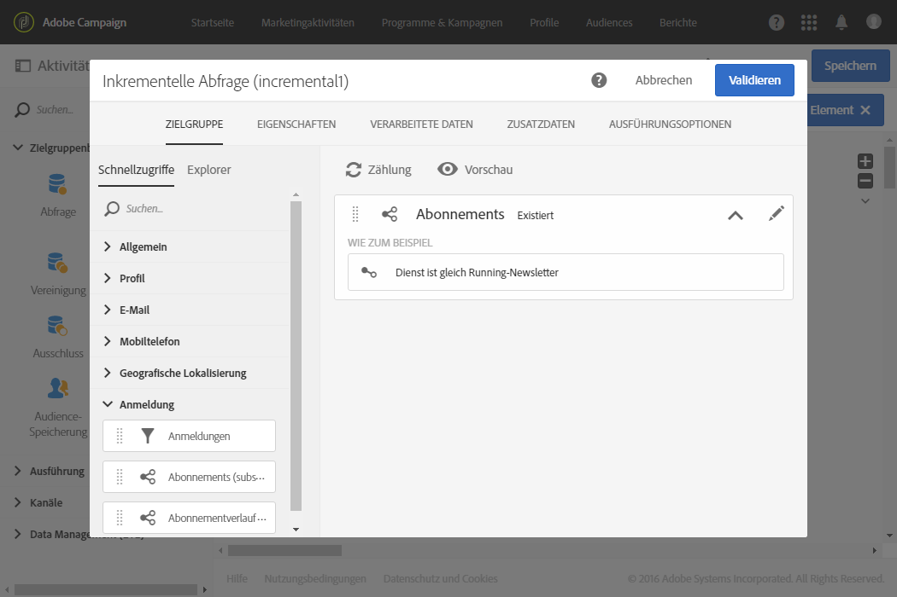

# Inkrementelle Abfrage{#incremental-query}

## Beschreibung {#description}

Eine **[!UICONTROL Inkrementelle Abfrage]dient der Filterung und Extraktion einer Population, die sich aus Elementen der Adobe-Campaign-Datenbank zusammensetzt.** Bei jeder neuen Ausführung dieser Aktivität werden die Ergebnisse der vorangehenden Ausführungen ausgeschlossen. Dadurch lassen sich ausschließlich neue Elemente abrufen.

Mithilfe eines dedizierten Tabs können Sie **[!UICONTROL Zusatzdaten]für die Zielpopulation definieren.** Diese Daten werden in Zusatzspalten gespeichert und können ausschließlich für den laufenden Workflow verwendet werden.

Die Aktivität verwendet das Abfragetool, dessen Funktionsweise in einem [gesonderten Kapitel](../../automating/using/editing-queries.md#about-query-editor) behandelt wird.

## Anwendungskontext {#context-of-use}

Eine **[!UICONTROL Inkrementelle Abfrage]** muss mit einer **Planung]einhergehen, um die Häufigkeit der Ausführung des Workflows und damit der Abfrage zu definieren.[!UICONTROL **

Der für diese Aktivität spezifische Tab **[!UICONTROL Verarbeitete Daten]ermöglicht es bei Bedarf, Ergebnisse vorangehender Ausführungen der Aktivität anzusehen.**

**[!UICONTROL Inkrementelle Abfragen]kommen in verschiedenen Kontexten zum Einsatz:**

* Segmentierung von Populationen, um beispielsweise Zielgruppen und Audiences zu definieren;
* Export von Daten.

## Konfiguration {#configuration}

1. Ziehen Sie eine **[!UICONTROL Inkrementelle Abfrage]in den Workflow-Arbeitsbereich.**
1. Markieren Sie die Aktivität und öffnen Sie sie mithilfe der 
1. Wenn sich Ihre Abfrage auf eine andere als die Profil-Ressource beziehen soll, können Sie im **[!UICONTROL Eigenschaften]**-Tab der Aktivität die entsprechende **[!UICONTROL Ressource]** und eine **Zielgruppendimension[!UICONTROL auswählen]**.

   The **[!UICONTROL Resource]** allows you to refine the filters displayed in the palette whereas the **[!UICONTROL Targeting dimension]**, contextual with regard to the resource selected, corresponds to the type of population that you would like to obtain (identified profiles, deliveries, data linked to the selected resource, etc.).

1. Konfigurieren Sie im Tab **[!UICONTROL Zielgruppe]die Abfrage, indem Sie Regeln definieren und/oder kombinieren.**
1. Wählen Sie im Tab **[!UICONTROL Verarbeitete Daten]den inkrementellen Modus, den Sie für die nächsten Ausführungen des Workflows verwenden möchten:**

   * **[!UICONTROL Ergebnisse früherer Ausführungen ausschließen]**: Bei jeder neuen Ausführung werden die Ergebnisse der vorangehenden Ausführungen ausgeschlossen.
   * **[!UICONTROL Datumsfeld verwenden]**: Bei den nächsten Ausführungen werden nur die Ergebnisse berücksichtigt, deren ausgewählte Datumsangaben größer oder gleich dem letzten Ausführungsdatum der Aktivität **[!UICONTROL Inkrementelle Abfrage]ist.** Im Tab **[!UICONTROL Eigenschaften]können Sie jedes zur ausgewählten Ressource gehörige Datumsfeld auswählen.** Dieser Modus weist eine bessere Leistung auf, wenn große Ressourcen wie zum Beispiel Log-Daten abgerufen werden.

      In diesem Tab ist nach der ersten Ausführung des Workflows das Datum der jeweils letzten Ausführung zu sehen, welches wiederum für die nächste Ausführung herangezogen wird. Es wird automatisch bei jeder Ausführung des Workflows aktualisiert. Sie können diesen Wert auch überschreiben, indem Sie einen neuen eingeben.
   >[!NOTE]
   >
   >Der Modus **[!UICONTROL Datumsfeld verwenden]ermöglicht je nach ausgewähltem Datumsfeld größere Flexibilität.** Wenn beispielsweise das ausgewählte Feld ein Änderungsdatum ist, können Sie im Datumsfeldmodus Daten abrufen, die kürzlich aktualisiert wurden. Dagegen werden im anderen Modus Einträge ausgeschlossen, die schon in einer früheren Ausführung abgerufen worden waren, selbst wenn diese Daten seit der letzten Ausführung des Workflows geändert wurden.

   

1. Mithilfe eines dedizierten Tabs können Sie **[!UICONTROL Zusatzdaten]für die Zielpopulation definieren.** Diese Daten werden in Zusatzspalten gespeichert und können ausschließlich für den laufenden Workflow verwendet werden. Sie können insbesondere Daten aus Tabellen der Adobe-Campaign-Datenbank hinzufügen, die mit der Zielgruppendimension der Abfrage in Relation stehen. Lesen Sie diesbezüglich auch den Abschnitt [Daten anreichern](../../automating/using/query.md#enriching-data).
1. Validieren Sie die Konfiguration der Aktivität und speichern Sie Ihren Workflow.

## Daten anreichern {#enriching-data}

Aus einer **[!UICONTROL Inkrementellen Abfrage hervorgehende Daten lassen sich auf die gleiche Weise anreichern wie Daten, die aus einer einfachen Abfrage stammen]**. Lesen Sie diesbezüglich auch den Abschnitt [Daten anreichern](../../automating/using/query.md#enriching-data).

## Beispiel: inkrementelle Abfrage bezüglich Dienst-Abonnenten {#example--incremental-query-on-subscribers-to-a-service}

Im folgenden Beispiel wird die Konfiguration der Aktivität **[!UICONTROL Inkrementelle Abfrage]** illustriert, die der Filterung der Profile der Adobe-Campaign-Datenbank dient, die Abonnenten des Diensts **Running-Newsletter** sind, um diesen eine Willkommens-E-Mail mit einem Sonderangebotscode zu senden.

Der Workflow besteht aus folgenden Aktivitäten:

* Eine **[!UICONTROL Planung], damit der Workflow jeden Montag um 7 Uhr ausgeführt wird.**

   

* Eine **[!UICONTROL Inkrementelle Abfrage], die bei der ersten Ausführung zunächst den Abruf aller aktuellen Abonnenten, dann bei den folgenden Ausführungen nur den Abruf der im Laufe der Woche dazugekommenen, neuen Abonnenten ermöglicht.**

   

* Ein **[!UICONTROL E-Mail-Versand.]** Der Workflow wird einmal pro Woche ausgeführt, Sie haben jedoch die Möglichkeit, gesendete E-Mails sowie Ergebnisse pro Monat zu aggregieren, um so beispielsweise Berichte für einen ganzen Monat anstatt nur auf wöchentlicher Basis zu erzeugen.

   To do this, choose to create a **[!UICONTROL Recurring email]** here regrouping the emails and the results **[!UICONTROL By month]**.

   Definieren Sie den Inhalt Ihrer E-Mail und fügen Sie den Willkommenscode für ein Sonderangebot ein.

   Lesen Sie für weiterführende Informationen die Abschnitte [E-Mail-Versand](../../automating/using/email-delivery.md) und [E-Mail-Inhalt erstellen](../../designing/using/about-personalization.md).

Starten Sie nun die Ausführung des Workflows. Jede Woche erhalten neue Abonnenten die Willkommens-E-Mail mit dem Sonderangebotscode.

## Beispiel: Inkrementelle Abfrage bei Versandlogs {#example--incremental-query-on-delivery-logs}

Mit der Aktivität **[!UICONTROL Inkrementelle Abfrage]können Sie regelmäßig neue Logs in Dateien exportieren.** Diese Funktion kann verwendet werden, wenn Sie beispielsweise Ihre Log-Daten in externen Berichterstattungs- oder Business Intelligence Tools verwenden möchten.

Ein vollständiges Beispiel finden Sie im Abschnitt [Logs exportieren](../../automating/using/exporting-logs.md).
