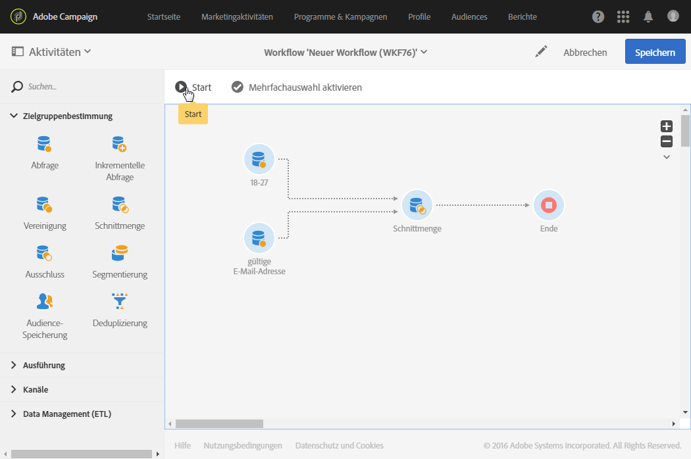

# Schnittmenge{#intersection}

## Beschreibung {#description}

Eine **[!UICONTROL Schnittmenge]** dient der Extraktion der gemeinsamen Population aus den eingehenden Aktivitäten.

## Anwendungskontext {#context-of-use}

Die **[!UICONTROL Schnittmenge]** wird insbesondere verwendet, um die Populationen der eingehenden Transitionen weiter einzugrenzen.

## Konfiguration {#configuration}

1. Ziehen Sie eine **[!UICONTROL Schnittmenge]** in den Workflow-Arbeitsbereich.
1. Schließen Sie sie an Aktivitäten wie beispielsweise Abfragen an.
1. Markieren Sie die Aktivität und öffnen Sie sie mithilfe der in der Schnellaktion angezeigten Schaltfläche .
1. Wählen Sie nun den **[!UICONTROL Abstimmtyp]**:

   * **[!UICONTROL Nur die Schlüssel]** – Standardmodus; die Aktivität behält die Elemente der eingehenden Transitionen bei, die denselben Schlüssel aufweisen.
   * **[!UICONTROL Alle gemeinsamen Spalten]** – die Abstimmung erfolgt auf Basis der Spalten, die in allen eingehenden Transitionen enthalten sind. In diesem Fall ist die Hauptmenge anzugeben, die zum Spaltenvergleich herangezogen werden soll. Diese Option bietet sich insbesondere an, wenn die eingehenden Populationen unterschiedliche Zielgruppendimensionen aufweisen.
   * **[!UICONTROL Auswahl an Spalten]** – die Abstimmung erfolgt auf Basis der von Ihnen angegebenen Spalten. Wählen Sie zunächst die die Quelldaten enthaltende Hauptmenge aus und definieren Sie dann die für die Herstellung der Relation zu verwendenden Felder.

1. Kreuzen Sie die Option **[!UICONTROL Nur gemeinsame Zusatzdaten verwenden]** an, wenn Sie nur die in allen eingehenden Transitionen enthaltenen Zusatzdaten beibehalten möchten.
1. Bei Bedarf können Sie unter Verwendung von [Transitionen](../../automating/using/activity-properties.md) auf erweiterte Optionen zur Ausgabepopulation zugreifen.
1. Validieren Sie die Konfiguration der Aktivität und speichern Sie Ihren Workflow.

## Beispiel  {#example}

Unten stehende Abbildung zeigt die Schnittmenge aus zwei Abfrageaktivitäten, die alle Profile der Adobe Campaign-Datenbank abrufen, die zwischen 18 und 27 Jahre alt sind bzw. deren E-Mail-Adresse korrekt angegeben ist.

