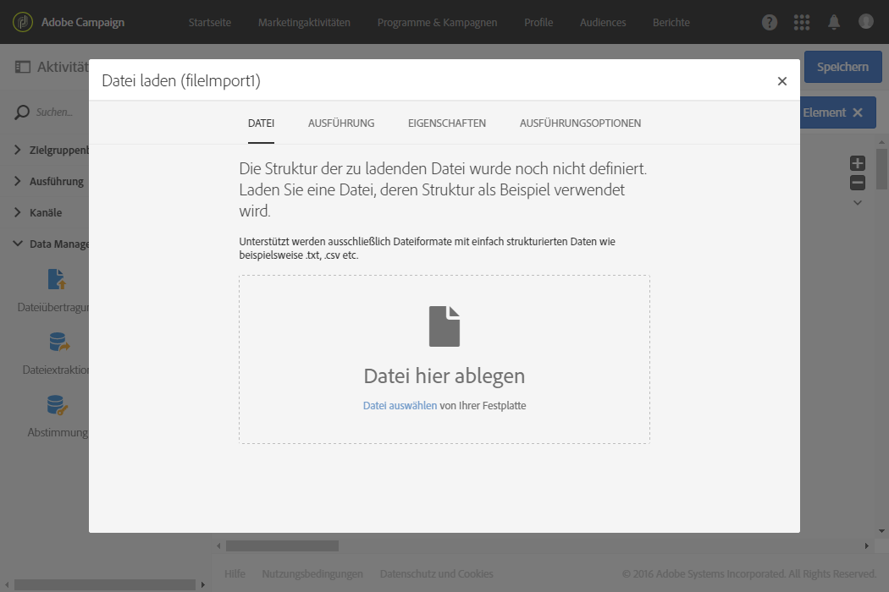
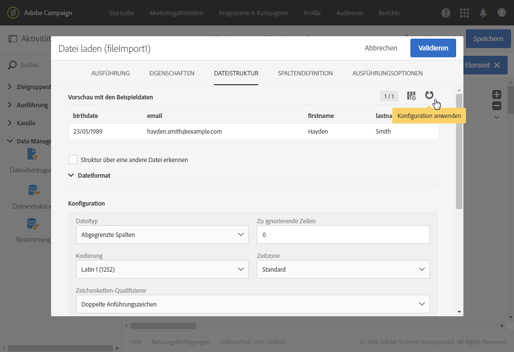
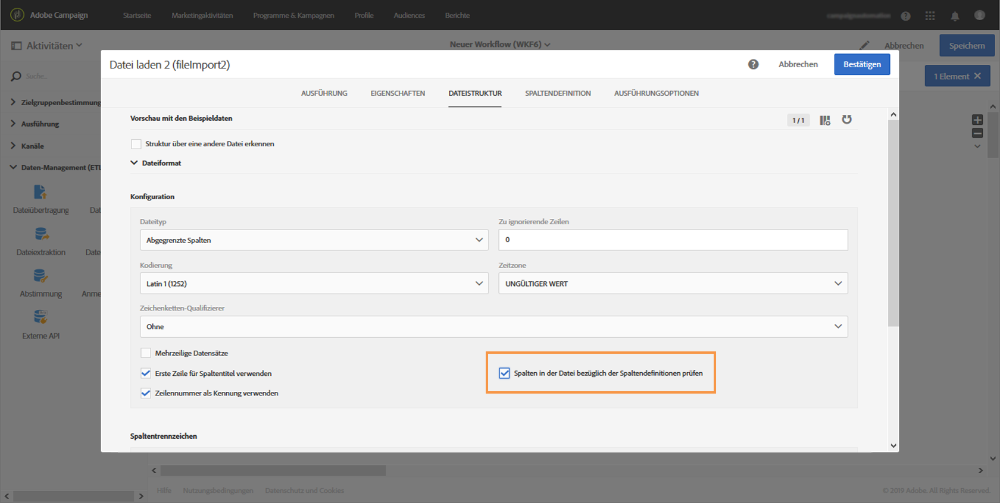
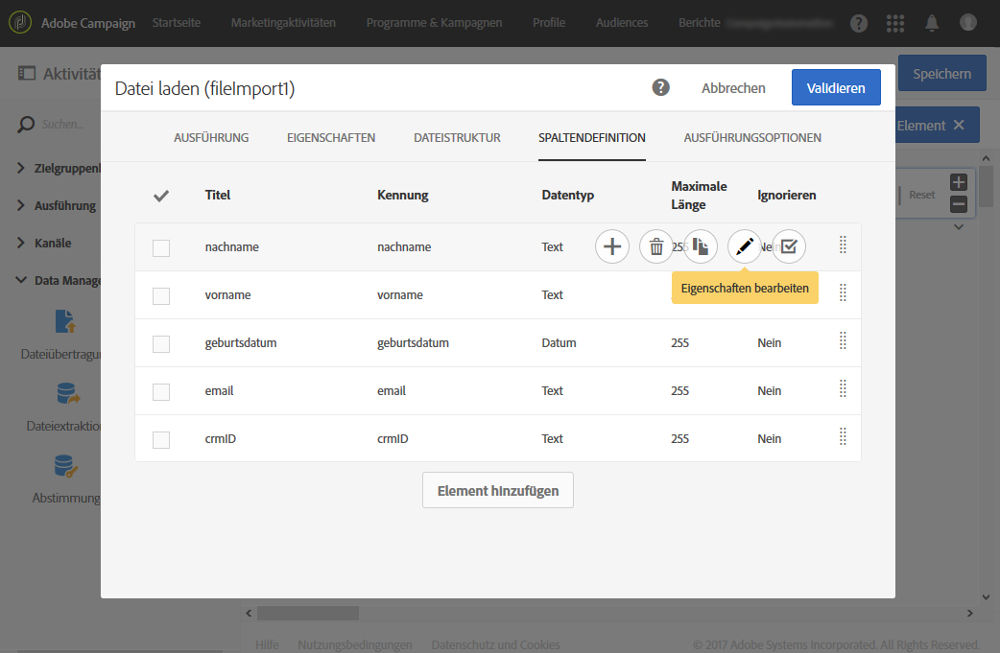
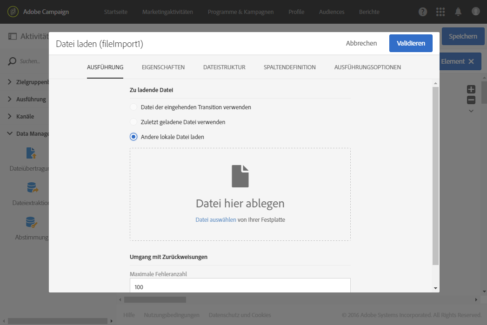
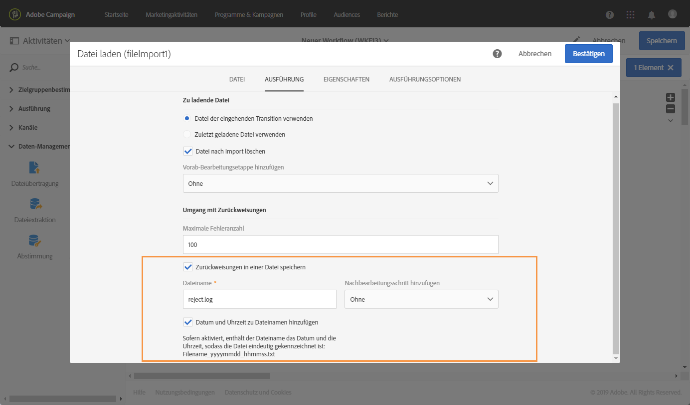

# Datei laden {#load-file}

## Beschreibung {#description}

>[!CAUTION]
>
>Beachten Sie bei Verwendung dieser Funktionalität die Einschränkungen für SFTP-Datenspeicherung, DB-Datenspeicherung und aktive Profile gemäß Ihrem Adobe Campaign-Vertrag.

Die Aktivität **[!UICONTROL Datei laden]** erlaubt den Import von strukturierten Dateidaten, um diese in Adobe Campaign verwenden zu können. Die importierten Daten werden nur vorübergehend gespeichert und erfordern die Verwendung einer weiteren Workflow-Aktivität, um definitiv in die Adobe Campaign-Datenbank integriert zu werden.

## Anwendungskontext {#context-of-use}

Die Art der Datenextraktion wird im Zuge der Aktivitätskonfiguration definiert. Bei der zu ladenden Datei kann es sich z. B. um eine Kontaktliste handeln.

Sie haben folgende Möglichkeiten:

* die Dateistruktur zu nutzen, um sie auf die Daten einer anderen (mithilfe der **[!UICONTROL Dateiübertragung]** abgerufenen) Datei anzuwenden, oder
* die Dateistruktur und die Daten zu nutzen, um letztere in Adobe Campaign zu importieren.

>[!IMPORTANT]
>
>Unterstützt werden ausschließlich Dateiformate mit einfach strukturierten Daten wie beispielsweise .txt, .csv etc.

**Verwandte Themen:**

* [Anwendungsfall: Datenbank mit externen Daten aktualisieren](../../automating/using/update-database-file.md)
* [Anwendungsfall: Daten basierend auf einem automatischen Datei-Download aktualisieren](../../automating/using/update-data-automatic-download.md)
* [Anwendungsfall: E-Mail mit erweiterten Feldern senden](../../automating/using/sending-email-enriched-fields.md)
* [Anwendungsfall: Eine Audience vom Typ &quot;Datei&quot; mit der Datenbank abstimmen](../../automating/using/reconcile-file-audience-with-database.md)

## Konfiguration {#configuration}

Die Konfiguration der Aktivität erfolgt in zwei Schritten. Definieren Sie zunächst die Struktur, die die Importdatei aufweisen soll, indem Sie eine Beispieldatei hochladen. Geben Sie im Anschluss daran die Herkunft der Datei an, die die zu importierenden Daten enthält.

>[!NOTE]
>
>Die Daten der Beispieldatei werden für die Konfiguration der Aktivität verwendet aber nicht importiert. Es wird empfohlen, Beispieldateien mit einer geringen Anzahl an Datensätzen zu verwenden.

1. Ziehen Sie eine **[!UICONTROL Datei laden]**-Aktivität in den Workflow-Arbeitsbereich.
1. Markieren Sie die Aktivität und öffnen Sie sie mithilfe der im Schnellzugriff angezeigten Schaltfläche .
1. Laden Sie die Beispieldatei hoch, die die Definition der Struktur ermöglicht, die die schließlich zu importierende Datei aufweisen soll.

   

   Zwei neue Tabs werden nach dem Laden der die Daten enthaltenden Datei in der Aktivität angezeigt: **[!UICONTROL Dateistruktur]** und **[!UICONTROL Spaltendefinition]**.

1. Prüfen Sie im **[!UICONTROL Dateistruktur]**-Tab die automatisch erkannte Struktur der Beispieldatei.

   Wenn die Dateistruktur falsch erkannt wurde, haben Sie mehrere Optionen, mögliche Fehler zu beheben:

   * Sollte die Struktur nicht Ihren Erwartungen entsprechen, können Sie die Option **[!UICONTROL Struktur über eine andere Datei erkennen]** nutzen.
   * Sie können die Standarderkennungsparameter verändern, um Sie Ihrer Datei anzupassen. Im Feld **[!UICONTROL Dateityp]** können Sie angeben, ob die zu importierende Datei aus Spalten mit fester Länge bestehen soll. In diesem Fall müssen Sie im Tab **[!UICONTROL Spaltendefinition]** auch die maximale Zeichenanzahl für jede Spalte festlegen.

      Im Bereich **[!UICONTROL Dateiformat]** befinden sich alle Optionen, die die korrekte Umsetzung der Dateidaten ermöglichen. Sie können diese ändern und anschließend unter Berücksichtigung der neuen Parameter die Struktur der zuletzt in der Aktivität geladenen Datei erneut erkennen lassen. Verwenden Sie dazu die Schaltfläche **[!UICONTROL Konfiguration anwenden]**. Sie können beispielsweise ein anderes Spaltentrennzeichen angeben.

      >[!NOTE]
      >
      >Bei diesem Vorgang wird lediglich die letzte in der Aktivität geladene Datei berücksichtigt. Sollte die erkannte Datei umfangreich sein, erstreckt sich die Datenvorschau lediglich auf die ersten 30 Zeilen.

      

      Im Bereich **[!UICONTROL Dateiformat]** können Sie mit der Option **[!UICONTROL Spalten in der Datei bezüglich der Spaltendefinitionen prüfen]** überprüfen, ob die Spalten der hochgeladenen Datei mit der Spaltendefinition übereinstimmen.

      Wenn die Anzahl und/oder der Name der Spalten nicht zur Spaltendefinition passt, erscheint bei der Ausführung des Workflows eine Fehlermeldung. Wenn die Option nicht aktiviert ist, wird in der Protokolldatei ein Warnhinweis angezeigt.

      

1. Prüfen Sie im **[!UICONTROL Spaltendefinition]**-Tab das Datenformat jeder Spalte und passen Sie gegebenenfalls die Parameter an.

   Im Tab **[!UICONTROL Spaltendefinition]** lässt sich die Datenstruktur für jede Spalte separat definieren, um fehlerfreie Daten zu importieren (u. a. durch die Definition des Umgangs mit Nullwerten) und die Kompatibilität mit den bereits in der Datenbank existierenden Daten zu gewährleisten.

   Es besteht beispielsweise die Möglichkeit, Spaltentitel und Datentyp (String, Ganze Zahl, Datum etc.) anzupassen bzw. den Umgang mit Fehlern zu bestimmen.

   Weiterführende Informationen hierzu finden Sie im Abschnitt [Spaltenformat](#column-format).

   

1. Geben Sie im Tab **[!UICONTROL Ausführung]** an, ob die für die Daten zu verwendende Datei

   * aus der eingehenden Transition im Workflow stammt,
   * im vorangehenden Schritt geladen wurde, oder
   * es sich dabei um eine neue zu ladende lokale Datei handelt. Wenn im Workflow bereits das Laden einer ersten Datei definiert wurde, wird die Option **[!UICONTROL Andere lokale Datei laden]** angezeigt. Sie ermöglicht den Upload einer anderen Datei, falls die erste nicht das gewünschte Ergebnis erzielt.

      

1. Sollte die Datei, deren Daten Sie laden möchten, in einer GZIP-Datei (.gz) komprimiert sein, wählen Sie im Feld **[!UICONTROL Vorab-Bearbeitungsetappe hinzufügen]** die Option **[!UICONTROL Datei-Dekomprimierung]** aus. Dadurch lässt sich die Datei dekomprimieren, bevor Sie mit dem Laden der Daten fortfahren. Diese Option steht nur zur Verfügung, wenn die Datei mit der in die Aktivität eingehenden Transition übermittelt wird.

   Das Feld **[!UICONTROL Vorab-Bearbeitungsetappe hinzufügen]** ermöglicht Ihnen auch, eine Datei zu entschlüsseln, bevor Sie sie in die Datenbank importieren. Weitere Informationen zum Arbeiten mit verschlüsselten Dateien finden Sie in [diesem Abschnitt](../../automating/using/managing-encrypted-data.md)

1. Mit der Option **[!UICONTROL Zurückweisungen in einer Datei speichern]** können Sie eine Datei herunterladen, die während des Imports aufgetretene Fehler enthält, und auf eine Anschlussvorgangsetappe anwenden. Wenn die Option aktiviert ist, wird der ausgehende Übergang in &quot;Zurückweisungen&quot; umbenannt.

   >[!NOTE]
   >
   >Mit der Option **[!UICONTROL Datum und Uhrzeit zu Dateinamen hinzufügen]** können Sie zum Namen der Datei, die die Zurückweisungen enthält, einen Zeitstempel hinzufügen.

   

1. Validieren Sie die Konfiguration der Aktivität und speichern Sie Ihren Workflow.

Wenn nach dem Ausführen des Workflows ein Fehler bei der Aktivität auftritt, lesen Sie die Protokolle, um weitere Details zu den Werten zu erhalten, die in der Datei falsch sind. Weiterführende Informationen zur Workflow-Logs finden Sie in [diesem Abschnitt](../../automating/using/monitoring-workflow-execution.md).

## Spaltenformat       {#column-format}

Beim Laden einer Beispieldatei wird das Spaltenformat automatisch erkannt und jedem Datentyp werden Standardparameter zugewiesen. Diese Standardparameter können angepasst werden, um einen bestimmten Umgang mit gewissen Daten vorzuschreiben, insbesondere in Bezug auf Fehler oder Leerwerte.

Wählen Sie hierfür aus dem Schnellzugriff der zu bearbeitenden Spalte die Option **[!UICONTROL Eigenschaften bearbeiten]** aus. Das Detailfenster des Spaltenformats wird geöffnet.

Für jede Spalte kann auf diese Weise das Format angepasst werden.

Verschiedene Optionen zum Umgang mit den Spaltenwerten stehen zur Auswahl:

* **[!UICONTROL Spalte ignorieren]**: Spalte wird beim Laden der Daten nicht berücksichtigt.
* **[!UICONTROL Datentyp]**: Angabe des in der Spalte erwarteten Datentyps.
* **[!UICONTROL Format und Trennzeichen]**, **Eigenschaften**: Angabe von Texteigenschaften, dem Format von Uhrzeit, Datum und numerischen Werten sowie dem durch den Spaltenkontext bestimmten Trennzeichen.

   * **[!UICONTROL Maximale Zeichenanzahl]**: Angabe der maximal zulässigen Zeichenanzahl für Spalten vom Typ Zeichenfolge.

      Dieses Feld muss ausgefüllt werden, wenn Dateien geladen werden, die aus Spalten mit fester Länge bestehen.

   * **[!UICONTROL Umgang mit Groß-/Kleinschreibung]**: Angabe, ob bei Daten vom Typ **Text** die Schreibung der geladenen Werte angepasst werden soll.
   * **[!UICONTROL Umgang mit Leerzeichen]**: Angabe, ob für Daten vom Typ **Text** gewisse Leerzeichen eines Strings ignoriert werden sollen.
   * **[!UICONTROL Uhrzeitformat]**, **[!UICONTROL Datumsformat]**: Definition des Formats für Uhrzeit und Datum für Daten vom Typ **Datum**, **Uhrzeit**, **Datum und Uhrzeit**.
   * **[!UICONTROL Format]**: Definition des Formats für numerische Werte wie **Ganze Zahl** und **Gleitkommazahl**.
   * **[!UICONTROL Trennzeichen]**: Angabe der Trennzeichen in Abhängigkeit vom Spaltenkontext (1000er-Trennzeichen oder Dezimaltrennzeichen für numerische Werte, Datums- bzw. Uhrzeittrennzeichen für Zeitangaben) für Daten vom Typ **Datum**, **Uhrzeit**, **Datum und Uhrzeit**, **Ganze Zahl** und **Gleitkommazahl**.

* **[!UICONTROL Neukodifizierung der Werte]**: Dieses Feld ist nur in der Detailkonfiguration einer Spalte verfügbar. Es ermöglicht die Umwandlung gewisser Werte beim Import. Sie können beispielsweise &quot;drei&quot; in &quot;3&quot; umwandeln.
* **[!UICONTROL Fehlerverarbeitung]**: Angabe des Umgangs mit Fehlern.

   * **[!UICONTROL Wert ignorieren]**: Der Wert wird ignoriert. Im Ausführungsprotokoll des Workflows wird ein Hinweis erzeugt.
   * **[!UICONTROL Zeile zurückweisen]**: Die gesamte Zeile wird nicht verarbeitet.
   * **[!UICONTROL Standardwert verwenden]**: Ersetzt den Fehler verursachenden Wert durch einen Standardwert, welcher im Feld **[!UICONTROL Standardwert]** definiert wird.
   * **[!UICONTROL Bei fehlender Neukodifizierung Standardwert verwenden]**: Ersetzt den Fehler verursachenden Wert durch einen Standardwert, welcher im Feld **[!UICONTROL Standardwert]** definiert wird, es sei denn, für den fehlerhaften Wert wurde eine Umwandlung definiert (siehe Option **[!UICONTROL Neukodifizierung der Werte]** weiter oben).
   * **[!UICONTROL Bei fehlender Neukodifizierung Zeile zurückweisen]**: Die gesamte Zeile wird nicht verarbeitet, es sei denn, für den fehlerhaften Wert wurde eine Umwandlung definiert (siehe Option **[!UICONTROL Neukodifizierung der Werte]** weiter oben).

   >[!NOTE]
   >
   >**[!UICONTROL Die Fehlerverarbeitung]** bezieht sich auf Fehler, die die in der Importdatei angegebenen Werte betreffen. Hierbei kann es sich beispielsweise um einen falschen Datentyp handeln (das ausgeschriebene Wort &quot;vier&quot; bei einer Spalte vom Typ &quot;Ganze Zahl&quot;), einen String, der die maximal zulässige Anzahl an Zeichen überschreitet, ein Datum mit dem falschen Trennzeichen etc. Diese Option bezieht sich jedoch nicht auf Fehler, die aus dem Umgang mit Leerwerten resultieren.

* **[!UICONTROL Standardwert]**: Angabe des Standardwerts, der im Bezug auf den jeweils definierten Umgang mit Fehlern zum Tragen kommt.
* **[!UICONTROL Umgang mit leeren Werten]**: Definition, wie beim Laden der Daten mit leeren Werten verfahren werden soll.

   * **[!UICONTROL Fehler für numerische Felder erzeugen]**: Erzeugt für numerische Felder einen Fehler, fügt andernfalls NULL ein.
   * **[!UICONTROL NULL in entsprechendes Feld einfügen]**: Leere Werte sind zulässig. Der Wert NULL wird eingefügt.
   * **[!UICONTROL Fehler erzeugen]**: Erzeugt im Fall eines Leerwerts einen Fehler.
