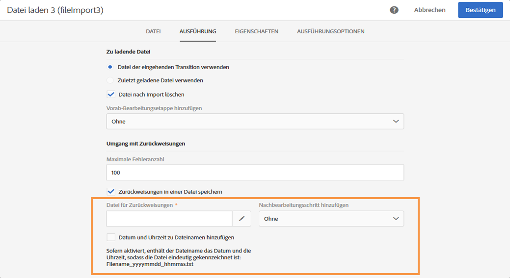
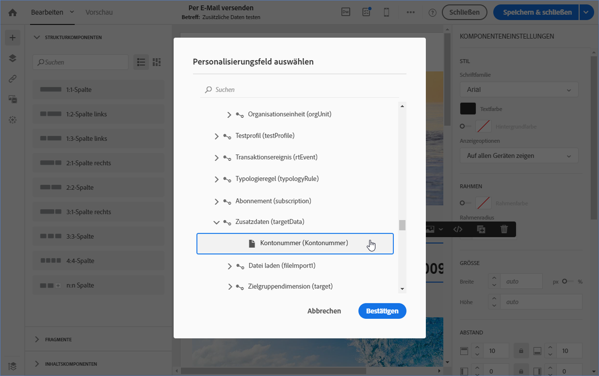

# Datei laden {#load-file}

## Beschreibung {#description}

The **[!UICONTROL Load file]** activity allows you to import data in one structured form to use this data in Adobe Campaign. Die importierten Daten werden nur vorübergehend gespeichert und erfordern die Verwendung einer weiteren Workflow-Aktivität, um definitiv in die Adobe Campaign-Datenbank integriert zu werden.

## Anwendungskontext {#context-of-use}

Die Art der Datenextraktion wird im Zuge der Aktivitätskonfiguration definiert. Bei der zu ladenden Datei kann es sich z. B. um eine Kontaktliste handeln.

>[!CAUTION]
>
>Es werden nur &quot;flache&quot;Strukturdateien berücksichtigt, z. B. .txt, .csv usw.

Sie haben folgende Möglichkeiten:

* Use the file structure to apply it to another file&#39;s data (recovered using the **[!UICONTROL Transfer file]** activity) or,
* die Dateistruktur und die Daten zu nutzen, um letztere in Adobe Campaign zu importieren.

## Konfiguration  {#configuration}

Die Konfiguration der Aktivität erfolgt in zwei Schritten. Definieren Sie zunächst die Struktur, die die Importdatei aufweisen soll, indem Sie eine Beispieldatei hochladen. Geben Sie im Anschluss daran die Herkunft der Datei an, die die zu importierenden Daten enthält.

>[!NOTE]
>
>Die Daten der Beispieldatei werden für die Konfiguration der Aktivität verwendet aber nicht importiert. Es wird empfohlen, Beispieldateien mit einer geringen Anzahl an Datensätzen zu verwenden.

1. Drag and drop a **[!UICONTROL Load file]** activity into your workflow.
1. Markieren Sie die Aktivität und öffnen Sie sie mithilfe der in den Quick Actions angezeigten Schaltfläche .
1. Laden Sie die Beispieldatei hoch, die die Definition der Struktur ermöglicht, die die schließlich zu importierende Datei aufweisen soll.

   

   Once the data file is uploaded, two new tabs appear in the activity: **[!UICONTROL File structure]** and **[!UICONTROL Column definition]**.

1. Go to the **[!UICONTROL File structure]** tab to view the structure that is automatically detected from the sample file.

   Wenn die Dateistruktur falsch erkannt wurde, haben Sie mehrere Optionen, mögliche Fehler zu beheben:

   * Sie können die Struktur einer anderen Datei verwenden, indem Sie die **[!UICONTROL Detect structure from a new file]** Option auswählen.
   * Sie können die Standarderkennungsparameter verändern, um Sie Ihrer Datei anzupassen. The **[!UICONTROL File type]** field lets you specify if the file you want to import is made up of columns with fixed length. In that case, you must also specify the maximum number of characters for each column in the **[!UICONTROL Column definition]** tab.

      All of the detection options necessary to correctly recover the data from the file are regrouped in **[!UICONTROL File format]**. Sie können diese ändern und anschließend unter Berücksichtigung der neuen Parameter die Struktur der zuletzt in der Aktivität geladenen Datei erneut erkennen lassen. Verwenden Sie dazu die **[!UICONTROL Apply configuration]** Schaltfläche. Sie können beispielsweise ein anderes Spaltentrennzeichen angeben.

      >[!NOTE]
      >
      >Bei diesem Vorgang wird lediglich die letzte in der Aktivität geladene Datei berücksichtigt. Sollte die erkannte Datei umfangreich sein, erstreckt sich die Datenvorschau lediglich auf die ersten 30 Zeilen.

      

      Im **[!UICONTROL File format]** Abschnitt können Sie mit der **[!UICONTROL Check columns from file against column definitions]** Option überprüfen, ob die Spalten der Datei, die Sie hochladen, der Spaltendefinition entsprechen.

      Wenn die Anzahl und/oder der Name der Spalten nicht zur Spaltendefinition passt, erscheint bei der Ausführung des Workflows eine Fehlermeldung. Wenn die Option nicht aktiviert ist, wird in der Protokolldatei ein Warnhinweis angezeigt.

      

1. Go to the **[!UICONTROL Column definition]** tab to check the data format for each column and adjust the parameters if necessary.

   The **[!UICONTROL Column definition]** tab allows you to precisely specify the data structure of each column in order to import data that does not contain any errors (for example, using null management) and make it match the types that are already present in the Adobe Campaign database for future operations.

   Es besteht beispielsweise die Möglichkeit, Spaltentitel und Datentyp (String, Ganze Zahl, Datum etc.) anzupassen bzw. den Umgang mit Fehlern zu bestimmen.

   Weiterführende Informationen hierzu finden Sie im Abschnitt [Spaltenformat](#column-format).

   

1. In the **[!UICONTROL Execution]** tab, specify whether the file is to be processed for loading data:

   * aus der eingehenden Transition im Workflow stammt,
   * im vorangehenden Schritt geladen wurde, oder
   * es sich dabei um eine neue zu ladende lokale Datei handelt. Die **[!UICONTROL Upload a new file from local machine]** Option wird angezeigt, wenn das Hochladen einer ersten Datei bereits im Workflow definiert war. Sie ermöglicht den Upload einer anderen Datei, falls die erste nicht das gewünschte Ergebnis erzielt.

      

1. If the file that you want to load the data from is compressed into a GZIP file (.gz), select the **[!UICONTROL Decompression]** option in the **[!UICONTROL Add a pre-processing step]** field. Dadurch lässt sich die Datei dekomprimieren, bevor Sie mit dem Laden der Daten fortfahren. Diese Option steht nur zur Verfügung, wenn die Datei mit der in die Aktivität eingehenden Transition übermittelt wird.
1. The **[!UICONTROL Keep the rejects in a file]** option enables you to download a file containing errors that occurred during the import, and to apply to it a post-processing stage. Wenn die Option aktiviert ist, wird der ausgehende Übergang in &quot;Zurückweisungen&quot; umbenannt.

   >[!NOTE]
   >
   >Mit der **[!UICONTROL Add date and time to the file name]** Option können Sie einen Zeitstempel für den Namen der Datei mit den Ablehnungen hinzufügen.

   

1. Validieren Sie die Konfiguration der Aktivität und speichern Sie Ihren Workflow.

Wenn nach dem Ausführen des Workflows ein Fehler bei der Aktivität auftritt, lesen Sie die Protokolle, um weitere Details zu den Werten zu erhalten, die in der Datei falsch sind. Weiterführende Informationen zur Workflow-Logs finden Sie in [diesem Abschnitt](../../automating/using/executing-a-workflow.md#monitoring).

## Spaltenformat  {#column-format}

Beim Laden einer Beispieldatei wird das Spaltenformat automatisch erkannt und jedem Datentyp werden Standardparameter zugewiesen. Diese Standardparameter können angepasst werden, um einen bestimmten Umgang mit gewissen Daten vorzuschreiben, insbesondere in Bezug auf Fehler oder Leerwerte.

To do this, select **[!UICONTROL Edit properties]** from the quick actions of the column whose format you would like to define. Das Detailfenster des Spaltenformats wird geöffnet.

Für jede Spalte kann auf diese Weise das Format angepasst werden.

Verschiedene Optionen zum Umgang mit den Spaltenwerten stehen zur Auswahl:

* **[!UICONTROL Ignore column]**: verarbeitet diese Spalte beim Laden der Daten nicht.
* **[!UICONTROL Data type]**: gibt den Datentyp an, der für jede Spalte erwartet wird.
* **[!UICONTROL Format and separators]**, **Eigenschaften**: Geben Sie die Eigenschaften eines Textes, das Format für Uhrzeit, Datum und numerische Werte sowie das vom Spaltenkontext angegebene Trennzeichen an.

   * **[!UICONTROL Maximum number of characters]**: gibt die maximale Anzahl von Zeichen für Zeichenfolgen-Typspalten an.

      Dieses Feld muss ausgefüllt werden, wenn Dateien geladen werden, die aus Spalten mit fester Länge bestehen.

   * **[!UICONTROL Letter case management]**: legt fest, ob für **Textdaten** ein Groß-/Kleinschreibung-Prozess angewendet werden muss.
   * **[!UICONTROL White space management]**: gibt an, ob bestimmte Leerzeichen in einer Zeichenfolge für **Textdaten** ignoriert werden müssen.
   * **[!UICONTROL Time format]**, **[!UICONTROL Date format]**: das Format für **Daten zu Datum**, **Uhrzeit** und **Datum und Uhrzeit** angeben.
   * **[!UICONTROL Format]**: Definition des Formats für numerische Werte wie **Ganze Zahl** und **Gleitkommazahl**.
   * **[!UICONTROL Separator]**: definiert das vom Spaltenkontext angegebene Trennzeichen (Tausender- oder Dezimaltrennzeichen für numerische Werte, Trennzeichen für Daten und Uhrzeit) für **Datums**-, **Uhrzeit**-, **Datum- und Uhrzeitdaten**, **Ganzzahl**- und **Gleitkommazahldaten** .

* **[!UICONTROL Remapping of values]**: Dieses Feld ist nur in der Spaltendetailkonfiguration verfügbar. Es ermöglicht die Umwandlung gewisser Werte beim Import. Sie können beispielsweise &quot;drei&quot; in &quot;3&quot; umwandeln.
* **[!UICONTROL Error processing]**: definiert das Verhalten, wenn ein Fehler auftritt.

   * **[!UICONTROL Ignore the value]**: der Wert wird ignoriert. Im Ausführungsprotokoll des Workflows wird ein Hinweis erzeugt.
   * **[!UICONTROL Reject the line]**: die gesamte Zeile wird nicht verarbeitet.
   * **[!UICONTROL Use a default value]**: ersetzt den Wert, der den Fehler verursacht, durch einen im **[!UICONTROL Default value]** Feld definierten Standardwert.
   * **[!UICONTROL Use a default value in case the value is not remapped]**: ersetzt den Wert, der den Fehler verursacht, durch einen Standardwert, der im **[!UICONTROL Default value]** Feld definiert ist, es sei denn, eine Zuordnung wurde für den fehlerhaften Wert definiert (siehe die **[!UICONTROL Remapping of values]** Option oben).
   * **[!UICONTROL Reject the line when there is no remapping value]**: die gesamte Zeile wird nur verarbeitet, wenn eine Zuordnung für den fehlerhaften Wert definiert wurde (siehe die **[!UICONTROL Remapping of values]** Option oben).
   >[!NOTE]
   >
   >**[!UICONTROL Error processing]** betrifft Fehler in Bezug auf Werte in der importierten Datei. Hierbei kann es sich beispielsweise um einen falschen Datentyp handeln (das ausgeschriebene Wort &quot;vier&quot; bei einer Spalte vom Typ &quot;Ganze Zahl&quot;), einen String, der die maximal zulässige Anzahl an Zeichen überschreitet, ein Datum mit dem falschen Trennzeichen etc. Diese Option bezieht sich jedoch nicht auf Fehler, die aus dem Umgang mit Leerwerten resultieren.

* **[!UICONTROL Default value]**: gibt den Standardwert entsprechend der gewählten Fehlerverarbeitung an.
* **[!UICONTROL Empty value management]**: gibt an, wie leere Werte beim Laden von Daten verwaltet werden.

   * **[!UICONTROL Generate an error for numerical fields]**: erzeugt nur einen Fehler für die numerischen Felder, andernfalls wird ein NULL-Wert eingefügt.
   * **[!UICONTROL Insert NULL in the corresponding field]**: erlaubt leere Werte. Der Wert NULL wird eingefügt.
   * **[!UICONTROL Generate an error]**: erzeugt einen Fehler, wenn ein Wert leer ist.

## Beispiel 1: Datenbank aktualisieren {#example-1-update-the-database}

Die Ladeaktivität dient in erster Linie der Strukturierung von Daten, die mithilfe der Dateiübertragung in die bereits in der Datenbank vorhandenen Daten integriert werden sollen.

Das folgende Beispiel zeigt das Laden einer Datei, die mithilfe einer Dateiübertragung abgerufen wurde. Im Anschluss erlauben die enthaltenen Daten die Aktualisierung der Datenbank. Dieser Workflow dient der Profilanreicherung der Adobe-Campaign-Datenbank oder der Aktualisierung bereits existierender Profile anhand aus der importierten Datei stammender Daten.

1. Drag and drop a **[!UICONTROL Transfer file]** activity into your workflow and configure it in a way so that it recovers the file you would like.
1. Drag and drop a **[!UICONTROL Load file]** activity into your workflow and place it after the **[!UICONTROL Transfer file]** activity.
1. Markieren Sie die Aktivität und öffnen Sie sie mithilfe der im Schnellzugriff angezeigten Schaltfläche .
1. Aktivieren Sie im **[!UICONTROL File to load]** Abschnitt der **[!UICONTROL Execution]** Registerkarte die **[!UICONTROL Use the file specified in the inbound transition]** Option.

   

1. Konfigurieren Sie die Aktivität wie oben beschrieben.
1. Drag and drop an **[!UICONTROL Update data]** activity into your workflow and place it after the **[!UICONTROL Load file]** activity, then configure it. Lesen Sie diesbezüglich auch den Abschnitt [Daten-Update](../../automating/using/update-data.md).

Starten Sie den Workflow. Die gewünschte Datei wird geladen, die Daten werden extrahiert und die Adobe-Campaign-Datenbank wird angereichert.

## Beispiel 2: Versand einer E-Mail mit erweiterten Feldern {#example-2-email-with-enriched-fields}

<!--A new example showing how to send an email containing additional data retrieved from a load file activity has been added. [Read more](example-2-email-with-enriched-fields)-->

Die Aktivität „Datei laden“ ermöglicht das Senden einer erweiterten E-Mail mit zusätzlichen Daten aus einer externen Datei im gleichen Workflow.

Das folgende Beispiel zeigt, wie eine E-Mail mit zusätzlichen Daten gesendet wird, die über die Aktivität „Datei laden“ aus einer externen Datei abgerufen wurden. In diesem Beispiel enthält die externe Datei eine Liste von Profilen mit den zugehörigen Kontonummern. Sie möchten diese Daten importieren, um eine E-Mail mit der entsprechenden Kontonummer an jedes Profil zu senden.

1. Drag and drop a **[!UICONTROL Query]** activity into your workflow and open it to define the main target.

   <!--The Query activity is presented in the [Query](../../automating/using/query.md) section.-->

1. Drag and drop a **[!UICONTROL Load file]** activity to assign some data to a profile. In diesem Beispiel möchten Sie eine Datei mit Kontonummern laden, die einigen Profilen aus der Datenbank entsprechen.

   

1. Drag and drop an **[!UICONTROL Enrichment]** activity into your workflow and link the load file and query activities to it.

1. Wählen Sie auf der **[!UICONTROL Advanced relations]** Registerkarte der Aktivität &quot;Anreicherung&quot;die gewünschten Felder aus **[!UICONTROL 0 or 1 cardinality simple link]** und definieren Sie die entsprechenden Felder. Hier verwenden wir die Nachnamen, um die Daten mit den Datenbankprofilen abzustimmen.

   

1. In the **[!UICONTROL Additional data]** tab, select the elements that you want to use in your email. Wählen Sie hier die Kontonummer aus (Spalte in der Datei, die Sie mittels der Aktivität „Datei laden“ aufgerufen haben).

   

   <!---->

   Weitere Informationen dazu finden Sie im Abschnitt [Erweiterung](../../automating/using/enrichment.md).

1. Drag and drop a **[!UICONTROL Segmentation]** activity into your workflow and open it to refine the main target.

   

   Weitere Informationen dazu finden Sie im Abschnitt [Segmentierung](../../automating/using/segmentation.md).

1. Drag and drop an **[!UICONTROL Email delivery]** activity into your workflow and open it.

   <!--The Email delivery activity is presented in the [Email delivery](../../automating/using/email-delivery.md) section.-->

1. Add a personalization field and select the additional data defined in the enrichment activity (here Account number) from the **[!UICONTROL Additional data (targetData)]** node. Dadurch kann die Kontonummer jedes Profils im E-Mail-Inhalt dynamisch verwendet werden.

   

1. Speichern Sie die E-Mail und starten Sie den Workflow.

Die E-Mail wird an das Ziel gesendet. Jedes Profil erhält eine E-Mail mit der entsprechenden Kontonummer.

