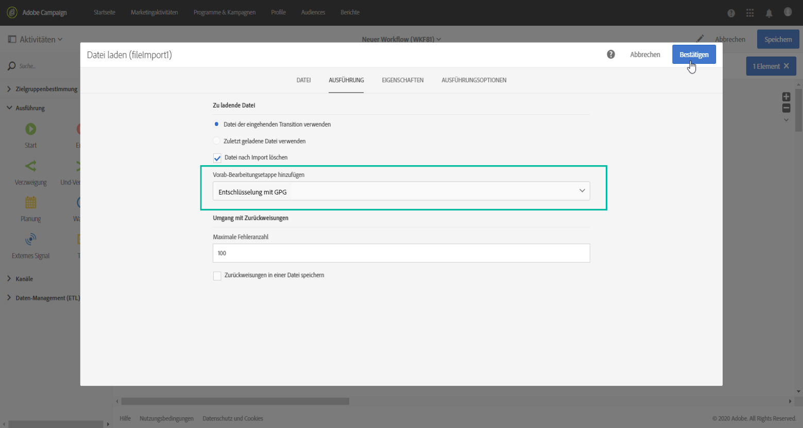

# Verwalten verschlüsselter Daten {#managing-encrypted-data}

## Informationen zu Vorab-Bearbeitungsetappen {#about-preprocessing-stages}

In manchen Fällen müssen die Daten, die Sie auf Campaign-Server importieren möchten, verschlüsselt werden, z. B. wenn sie PII-Daten enthalten.

Um ausgehende Daten verschlüsseln oder eingehende Daten entschlüsseln zu können, müssen Sie die GPG-Schlüssel über das [Control Panel](https://experienceleague.adobe.com/docs/control-panel/using/instances-settings/gpg-keys-management.html?lang=de) verwalten.

>[!NOTE]
>
>Das Control Panel steht allen auf AWS gehosteten Kunden zur Verfügung (mit Ausnahme von Kunden, die ihre Marketing-Instanzen auf einer lokalen Plattform hosten).

Wenn Sie nicht zur Verwendung von Control Panel berechtigt sind, wenden Sie sich an die Kundenunterstützung von Adobe, um die erforderlichen Verschlüsselungs-/Entschlüsselungsbefehle für Ihre Instanz zu erhalten. Senden Sie dazu eine Anfrage mit folgenden Angaben:

* Dem **Titel**, der in der Campaign-Benutzeroberfläche angezeigt wird, zum Verwenden des Befehls. Beispiel: &quot;Datei verschlüsseln&quot;.
* Dem **Befehl** zum Installieren in Ihrer Instanz.

Sobald die Anfrage verarbeitet wurde, stehen im Feld **[!UICONTROL Vorab-Bearbeitungsetappe]** der Aktivitäten **[!UICONTROL Datei laden]** und **[!UICONTROL Dateiextraktion]** die Verschlüsselungs-/Entschlüsselungsbefehle zur Verfügung. Diese können Sie zum Entschlüsseln oder Verschlüsseln der Dateien verwenden, die Sie importieren oder exportieren möchten.

**Verwandte Themen:**

* [Datei laden](../../automating/using/load-file.md)
* [Dateiextraktion](../../automating/using/extract-file.md)

## Anwendungsfall: Importieren von Daten, die mit einem vom Control Panel generierten Schlüssel verschlüsselt wurden {#use-case-gpg-decrypt}

In diesem Anwendungsfall erstellen wir einen Workflow, um Daten, die in einem externen System verschlüsselt wurden, mithilfe eines im Control Panel generierten Schlüssels zu importieren.

 [Entdecken Sie diese Funktion im Video](#video).

Die Schritte zum Ausführen dieses Anwendungsfalls lauten wie folgt:

1. Verwenden Sie das Control Panel, um ein Schlüsselpaar (öffentlich/privat) zu generieren. Ausführliche Anweisungen finden Sie in der [Control Panel-Dokumentation](https://experienceleague.adobe.com/docs/control-panel/using/instances-settings/gpg-keys-management.html?lang=de#decrypting-data?lang=de).

   * Der öffentliche Schlüssel wird mit dem externen System geteilt, das ihn zum Verschlüsseln der an Campaign zu sendenden Daten verwendet.
   * Der private Schlüssel wird von Campaign verwendet, um die eingehenden verschlüsselten Daten zu entschlüsseln.

   

1. Verwenden Sie im externen System den vom Control Panel heruntergeladenen öffentlichen Schlüssel, um die Daten für den Import in Campaign Standard zu verschlüsseln.

1. Erstellen Sie einen Workflow in Campaign Standard, um die verschlüsselten Daten zu importieren und mithilfe des über das Control Panel installierten privaten Schlüssels zu entschlüsseln. Zu diesem Zweck wird wie folgt ein Workflow erstellt:

   

   * Aktivität **[!UICONTROL Dateiübertragung]**: Überträgt die Datei von einer externen Quelle an Campaign. In diesem Beispiel soll die Datei von einem SFTP-Server übertragen werden.
   * Aktivität **[!UICONTROL Datei laden]**: Lädt die Daten aus der Datei in die Datenbank und entschlüsselt sie mithilfe des im Control Panel generierten privaten Schlüssels.

1. Öffnen Sie die Aktivität **[!UICONTROL Dateiübertragung]** und konfigurieren Sie sie entsprechend Ihren Anforderungen. Globale Konzepte zur Konfiguration der Aktivität finden Sie in [diesem Abschnitt](../../automating/using/load-file.md).

   Geben Sie im Tab **[!UICONTROL Protokoll]** Details zum SFTP-Server und der verschlüsselten .gpg-Datei an, die Sie übertragen möchten.

   

1. Öffnen Sie die Aktivität **[!UICONTROL Datei laden]** und konfigurieren Sie sie entsprechend Ihren Anforderungen. Globale Konzepte zur Konfiguration der Aktivität finden Sie in [diesem Abschnitt](../../automating/using/load-file.md).

   Fügen Sie der Aktivität eine Vorab-Bearbeitungsetappe hinzu, um die eingehenden Daten zu entschlüsseln. Wählen Sie dazu in der Liste die Option **[!UICONTROL Entschlüsselungs-GPG]** aus.

   >[!NOTE]
   >
   >Beachten Sie, dass Sie den privaten Schlüssel zum Entschlüsseln der Daten nicht angeben müssen. Der private Schlüssel wird im Control Panel gespeichert, das den zur Entschlüsselung der Datei zu verwendenden Schlüssel automatisch erkennt.

   

1. Wählen Sie **[!UICONTROL OK]** aus, um die Konfiguration der Aktivität zu bestätigen.

1. Sie können den Workflow jetzt ausführen.

## Anwendungsfall: Verschlüsseln und Exportieren von Daten mit einem im Control Panel installierten Schlüssel {#use-case-gpg-encrypt}

In diesem Anwendungsfall wird ein Workflow erstellt, um Daten mit einem im Control Panel installierten Schlüssel zu verschlüsseln und zu exportieren.

 [Entdecken Sie diese Funktion im Video](#video).

Die Schritte zum Ausführen dieses Anwendungsfalls lauten wie folgt:

1. Generieren Sie ein GPG-Schlüsselpaar (öffentlich/privat) mit einem GPG-Dienstprogramm und installieren Sie dann den öffentlichen Schlüssel im Control Panel. Ausführliche Anweisungen finden Sie in der [Control Panel-Dokumentation](https://experienceleague.adobe.com/docs/control-panel/using/instances-settings/gpg-keys-management.html?lang=de#encrypting-data?lang=de).

   

1. Erstellen Sie einen Workflow in Campaign Standard, um die Daten mithilfe des über das Control Panel installierten privaten Schlüssels zu exportieren und zu verschlüsseln. Zu diesem Zweck wird wie folgt ein Workflow erstellt:

   

   * Aktivität **[!UICONTROL Abfrage]**: In diesem Beispiel möchten wir eine Abfrage ausführen, die auf die Daten aus der Datenbank abzielt, die wir exportieren möchten.
   * Aktivität **[!UICONTROL Dateiextraktion]**: Verschlüsselt und extrahiert die Daten in eine Datei.
   * Aktivität **[!UICONTROL Dateiübertragung]**: Sendet die Datei mit den verschlüsselten Daten an einen SFTP-Server.

1. Konfigurieren Sie die Aktivität **[!UICONTROL Abfrage]** so, dass sie auf die gewünschten Daten aus der Datenbank abzielt. Weiterführende Informationen hierzu finden Sie in [diesem Abschnitt](../../automating/using/query.md).

1. Öffnen Sie die Aktivität **[!UICONTROL Dateiextraktion]** und konfigurieren Sie sie dann entsprechend Ihren Anforderungen (Ausgabedatei, Spalten, Format usw.). Globale Konzepte zur Konfiguration der Aktivität finden Sie in [diesem Abschnitt](../../automating/using/extract-file.md).

   Fügen Sie der Aktivität eine Vorab-Bearbeitungsetappe hinzu, um die zu extrahierenden Daten zu verschlüsseln. Wählen Sie dazu den GPG-Schlüssel zur Verschlüsselung der Daten aus.

   

   >[!NOTE]
   >
   >Der Wert in Klammern ist der **Kommentar**, den Sie beim Generieren des Schlüsselpaars mit Ihrem GPG-Verschlüsselungs-Tool definiert haben. Stellen Sie sicher, dass Sie den richtigen passenden Schlüssel auswählen, andernfalls kann der Empfänger die Datei nicht entschlüsseln.

1. Öffnen Sie die Aktivität **[!UICONTROL Dateiübertragung]** und geben Sie dann den SFTP-Server an, an den Sie die Datei senden möchten. Globale Konzepte zur Konfiguration der Aktivität finden Sie in [diesem Abschnitt](../../automating/using/transfer-file.md).

   

1. Sie können den Workflow jetzt ausführen. Nach der Ausführung werden die über die Abfrage abgerufenen Daten in eine verschlüsselte .gpg-Datei für den SFTP-Server exportiert.

## Anleitungsvideos {#video}

In diesem Video wird gezeigt, wie Daten mithilfe eines GPG-Schlüssels entschlüsselt werden.

>[!VIDEO](https://video.tv.adobe.com/v/35753?quality=12)

In diesem Video wird gezeigt, wie Daten mithilfe eines GPG-Schlüssels verschlüsselt werden.

>[!VIDEO](https://video.tv.adobe.com/v/36380?quality=12)

Weitere Anleitungsvideos zu Campaign Standard finden Sie [hier](https://experienceleague.adobe.com/docs/campaign-standard-learn/tutorials/overview.html?lang=de).
