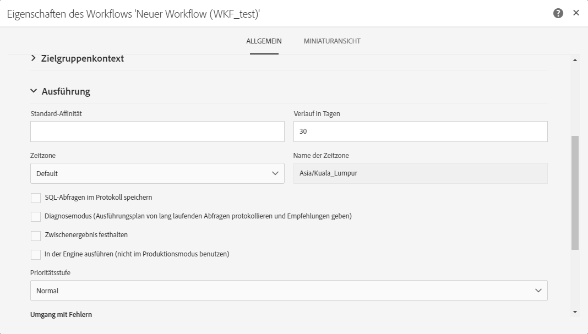

# Verwalten von Ausführungsoptionen {#managing-execution-options}

Sie haben die Möglichkeit, die globalen Ausführungsoptionen eines Workflows anzupassen. Verwenden Sie hierzu die Schaltfläche , um auf die Eigenschaften des Workflows zuzugreifen, und öffnen Sie den Bereich **[!UICONTROL Ausführung]**.

Mögliche Optionen sind:

* **[!UICONTROL Standard-Affinität]**: Hier können Sie für die Ausführung eines Workflows oder einer Workflow-Aktivität die Verwendung einer bestimmten Engine vorschreiben.

* **[!UICONTROL Verlauf in Tagen]**: Gibt die Anzahl der Tage an, nach denen der Verlauf bereinigt werden muss. Der Verlauf enthält Elemente, die mit dem Workflow verbunden sind: Protokolle, Aufgaben, Ereignisse (technische Objekte, die mit dem Workflow-Ablauf verknüpft sind) sowie Dateien, die von der Aktivität **[!UICONTROL Dateiübertragung]** heruntergeladen wurden. Der Standardwert bei vordefinierten Workflow-Vorlagen beträgt 30 Tage.

   Die Bereinigung des Verlaufs erfolgt durch den technischen Workflow für die Datenbankbereinigung, der standardmäßig täglich ausgeführt wird (siehe [Liste der technischen Workflows](../../administration/using/technical-workflows.md)).

   >[!IMPORTANT]
   >
   >Wenn das Feld **[!UICONTROL Verlauf in Tagen]** leer gelassen wird, wird sein Wert als „1“ betrachtet; der Verlauf wird also nach einem Tag bereinigt.

* **[!UICONTROL SQL-Abfragen im Protokoll speichern]**: Hier können Sie die SQL-Abfragen aus dem Workflow in den Protokollen speichern.

* ]**Zwischenergebnis festhalten**[!UICONTROL : Aktivieren Sie die diese Option, wenn Sie die Detailansicht der Transitionen visualisieren können möchten. Achtung: Durch das Aktivieren dieser Option kann sich die Ausführung des Workflows stark verlangsamen.

* **[!UICONTROL In der Engine ausführen (nicht im Produktionsmodus benutzen)]**: Ermöglicht Ihnen, den Workflow lokal auszuführen, um die Entwicklungsumgebung zu testen.

* **[!UICONTROL Prioritätsstufe]**: Hier haben Sie die Möglichkeit, die Workflow-Ausführung in Ihrer Adobe Campaign-Instanz als eher vorrangig oder eher nachrangig zu kennzeichnen. Kritische Workflows werden vorrangig ausgeführt.

Der Abschnitt **[!UICONTROL Umgang mit Fehlern]** enthält zusätzliche Optionen, mit denen Sie verwalten können, wie sich Workflows bei Fehlern verhalten. Diese Optionen werden im Abschnitt [Umgang mit Fehlern](#error-management) genauer beschrieben.
