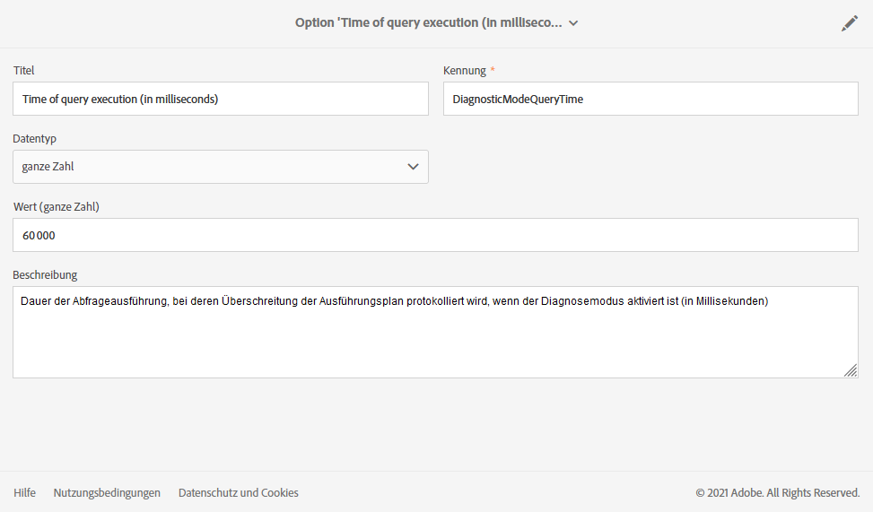
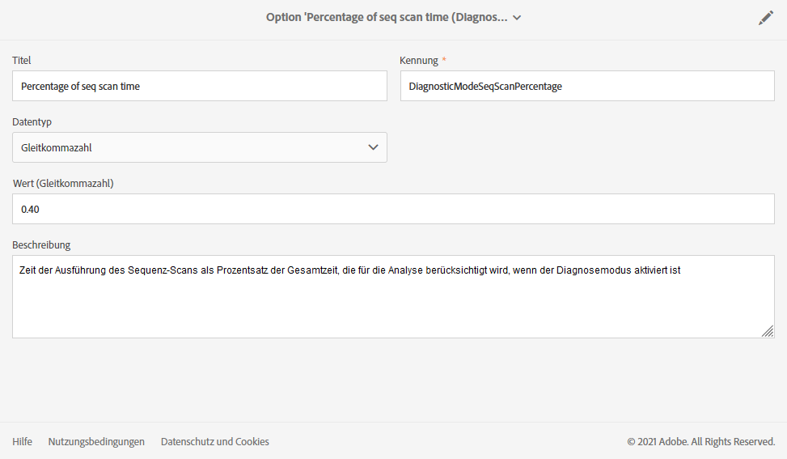

# Ausführungsoptionen verwalten {#managing-execution-options}

Sie haben die Möglichkeit, die globalen Ausführungsoptionen eines Workflows anzupassen. Verwenden Sie hierzu die Schaltfläche , um auf die Eigenschaften des Workflows zuzugreifen, und öffnen Sie den Bereich **[!UICONTROL Ausführung]**.

Mögliche Optionen sind:

* **[!UICONTROL Standard-Affinität]**: Hier können Sie für die Ausführung eines Workflows oder einer Workflow-Aktivität die Verwendung einer bestimmten Engine vorschreiben.

* **[!UICONTROL Verlauf in Tagen]**: Gibt die Anzahl der Tage an, nach denen der Verlauf bereinigt werden muss. Der Verlauf enthält Elemente, die mit dem Workflow verbunden sind: Protokolle, Aufgaben, Ereignisse (technische Objekte, die mit dem Workflow-Ablauf verknüpft sind) sowie Dateien, die von der Aktivität **[!UICONTROL Dateiübertragung]** heruntergeladen wurden. Der Standardwert bei nativen Workflow-Vorlagen beträgt 30 Tage.

  Die Bereinigung des Verlaufs erfolgt durch den technischen Workflow für die Datenbankbereinigung, der standardmäßig täglich ausgeführt wird (siehe [Liste der technischen Workflows](../../administration/using/technical-workflows.md)).

  >[!IMPORTANT]
  >
  >Wenn das Feld **[!UICONTROL Verlauf in Tagen]** leer gelassen wird, wird sein Wert als „1“ betrachtet; der Verlauf wird also nach einem Tag bereinigt.

* **[!UICONTROL SQL-Abfragen im Protokoll speichern]**: Hier können Sie die SQL-Abfragen aus dem Workflow in den Protokollen speichern.

* **[!UICONTROL Diagnosemodus (Ausführungsplan von lang laufenden Abfragen protokollieren und Empfehlungen geben)]**: Aktivieren Sie diese Option, wenn der gesamte Ausführungsplan protokolliert werden soll. Dies ist standardmäßig deaktiviert.

  Weiterführende Informationen dazu finden Sie in diesem [Abschnitt](#diagnostic-mode).

* **[!UICONTROL Zwischenergebnis festhalten]**: Aktivieren Sie diese Option, wenn Sie in der Lage sein möchten, die Detailansicht der Transitionen zu visualisieren.

  >[!CAUTION]
  >
  >Diese Option belegt viel Speicherplatz. Sie hilft Ihnen aber bei der Erstellung eines Workflows, dessen Konfiguration und Verhalten fehlerfrei sind. Aktivieren Sie sie nicht bei Produktionsinstanzen.

* **[!UICONTROL In der Engine ausführen (nicht im Produktionsmodus benutzen)]**: Ermöglicht Ihnen, den Workflow lokal auszuführen, um die Entwicklungsumgebung zu testen.

* **[!UICONTROL Prioritätsstufe]**: Hier haben Sie die Möglichkeit, die Workflow-Ausführung in Ihrer Adobe Campaign-Instanz als eher vorrangig oder eher nachrangig zu kennzeichnen. Dieses Feld wird von Adobe-Teams nur zu Überwachungszwecken verwendet.

Der Abschnitt **[!UICONTROL Umgang mit Fehlern]** enthält zusätzliche Optionen, mit denen Sie verwalten können, wie sich Workflows bei Fehlern verhalten. Diese Optionen werden im Abschnitt [Umgang mit Fehlern](../../automating/using/monitoring-workflow-execution.md#error-management) genauer beschrieben.

## Diagnosemodus {#diagnostic-mode}

>[!CAUTION]
>
>Diese Option kann sich erheblich auf Ihre Workflow-Performance auswirken und sollte daher wohl überlegt eingesetzt werden.

Wenn diese Option aktiviert ist, protokolliert die Option **[!UICONTROL Diagnosemodus (Ausführungsplan von lang laufenden Abfragen protokollieren und Empfehlungen geben)]** im Abschnitt **[!UICONTROL Ausführung]** der Workflow-Eigenschaften den gesamten Ausführungsplan, wenn eine Abfrage mehr als eine Minute dauert.

Wenn Sie diese Option aktivieren und Ihren Workflow starten, wird der Ausführungsplan protokolliert, wenn Ihre Abfrage länger als eine Minute dauert. Anschließend können Sie Ihren Ausführungsplan mit EXPLAIN ANALYZE abrufen.

Weiterführende Informationen dazu finden Sie in der [Dokumentation zu PostgreSQL](https://www.postgresql.org/docs/9.4/using-explain.html).

Wenn Sie eine Sequenzsuche in dieser Abfrage haben, bietet der **[!UICONTROL Diagnosemodus]** auch Empfehlungen zum Erstellen eines Index mithilfe eines Filterausdrucks.

>[!NOTE]
>
> Diese Empfehlungen dienen nur zu Referenzzwecken und sollten entsprechend Ihrem Anwendungsfall sorgfältig gewählt werden.

Die folgenden beiden Bedingungen müssen während der Ausführung des Workflows erfüllt sein, um Empfehlungen auszulösen:

* Die Dauer der Sequenzsuche ist länger als 40 % der Abfrage.

* Die resultierenden Zeilen nach der Sequenzsuche betragen weniger als 1 % der gesamten in der Tabelle vorhandenen Zeilen.

Sie können die Option im erweiterten Menü verwalten, indem Sie **[!UICONTROL Administration]** > **[!UICONTROL Anwendungskonfiguration]** > **[!UICONTROL Optionen]** auswählen:

* **[!UICONTROL Zeit der Abfrageausführung (in Millisekunden) (DiagnosticModeQueryTime)]**: Im Feld **[!UICONTROL Wert]** können Sie eine neue Zeit für die Ausführung Ihrer Abfrage festlegen. Wenn die Ausführung der Abfrage diesen Wert überschreitet, wird der Ausführungsplan protokolliert.

  

* **[!UICONTROL Prozentsatz der Sequenz-Scan-Zeit (DiagnosticModeSeqScanPercentage)]**: Im Feld **[!UICONTROL Wert]** können Sie den Prozentsatz der Abfragezeit ändern, die die Sequenzsuche benötigen soll, damit die Empfehlung erzeugt wird.

  
