# Package-Verwaltung{#managing-packages}

Administratoren können Packages definieren, mit denen der Austausch von Ressourcen zwischen verschiedenen Adobe-Campaign-Instanzen über strukturierte XML-Dateien ermöglicht wird. Packages können Konfigurationsparameter oder Daten enthalten.

Sie kommen insbesondere zur Replikation von Daten oder Parametern auf andere Server bzw. Instanzen zur Anwendung.

Packages sind über das Menü **[!UICONTROL Administration]** > **[!UICONTROL Freigabe]** > **[!UICONTROL Package-Exporte]** oder **[!UICONTROL Package-Importe]** verfügbar. Die Funktionen der beiden Menüs stimmen weitestgehend überein.

Die einzelnen Elemente der Export- oder Importliste werden standardmäßig in absteigender chronologischer Reihenfolge in Bezug auf die letzte Änderung oder Installation angezeigt.

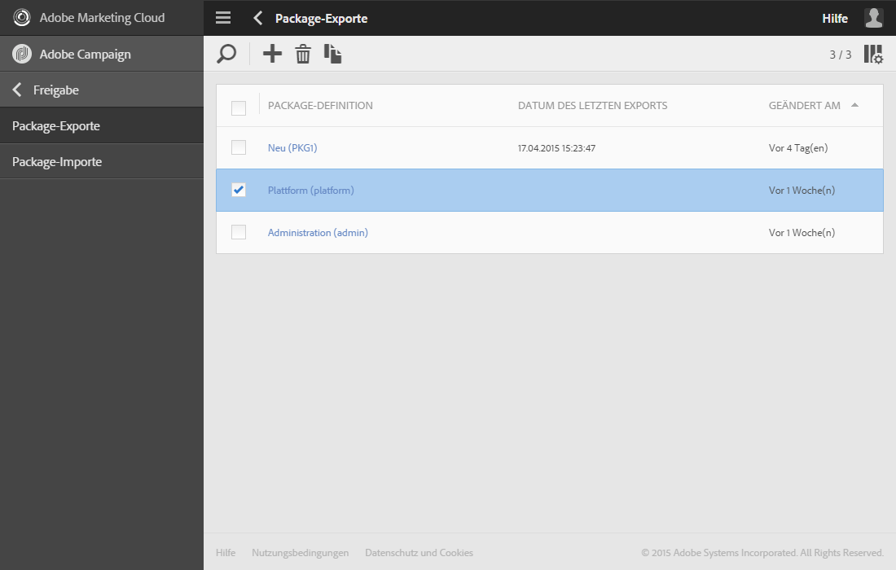

Klicken Sie zur Anzeige und Bearbeitung des Inhalts eines Elements auf dessen Titel. Lesen Sie diesbezüglich auch die Abschnitte [Package exportieren](#exporting-a-package) und [Package importieren](#importing-a-package).

## Package-Exporte  {#package-exports}

### Standard-Packages {#standard-packages}

**[!UICONTROL Die nativen Packages der Anwendung, Plattform]** und **[!UICONTROL Administration]**, enthalten jeweils eine vordefinierte Liste an zu exportierenden Ressourcen. Sie sind schreibgeschützt und können nur exportiert werden.

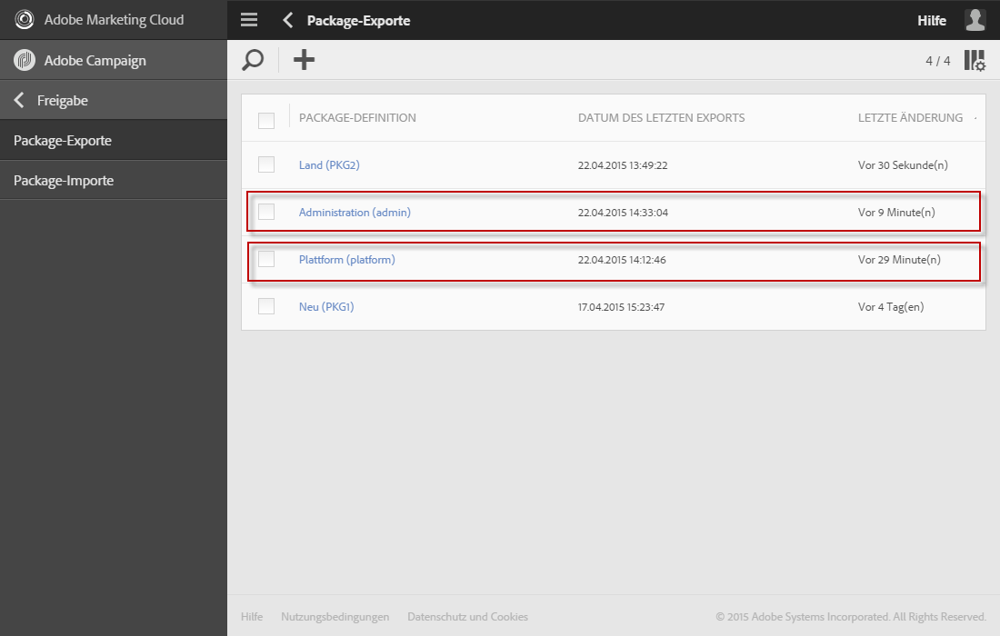

>[!IMPORTANT]
>
>Der Package-Export ist nicht zulässig, wenn die zu exportierenden Ressourcen Standard-Kennungen aufweisen. Deshalb ist es notwendig, die Kennungen exportierbarer Ressourcen so abzuändern, dass sie sich von den automatisch vergebenen Kennungen in Adobe-Campaign-Standard unterscheiden. Zum Beispiel darf beim Export von Testprofilen keine Kennung verwendet werden, die den Wert &quot;SDM&quot; bzw. &quot;sdm&quot; enthält.
>
>Wenn Sie versuchen, Packages zu exportieren, die Standard-Kennungen enthalten, wird beispielsweise folgender Fehler angezeigt: &quot;Die Entität vom Typ &#39;Marken (Branding)&#39; verwendet eine Standard-Kennung (&#39;BRD1&#39;), die beim Package-Import einen Konflikt auslösen könnte. Ändern Sie die Kennung und wiederholen Sie den Vorgang.&quot;

Der Package-Export wird im Abschnitt [Package exportieren](#exporting-a-package) beschrieben.

* Das **[!UICONTROL Plattform]**-Package enthält alle Ressourcen, die im Zuge der technischen Konfiguration hinzugefügt werden: benutzerdefinierte Ressourcen, benutzerdefinierte Ressourcensets, Triggers und Anwendungsoptionen vom Typ **[!UICONTROL System]**.
* Das **[!UICONTROL Administration]**-Package enthält alle Objekte, die im Zuge der anwendungsbezogenen Konfiguration hinzugefügt werden: z. B. Kampagnenvorlagen, Inhaltsvorlagen, Versandvorlagen, Landingpage-Vorlagen, Programmvorlagen und Workflow-Vorlagen.

   Es enthält auch die folgenden Objekte: Inhaltsbausteine, Zielgruppen-Mappings, externe Konten, Organisationseinheiten, Anwendungsoptionen vom Typ **[!UICONTROL Benutzer]**, Rollen, Typologien, Typologieregeln und Benutzer.

>[!NOTE]
>
>Der Inhalt dieser beiden Packages kann nicht verändert werden. Diese Packages enthalten immer die aktuellsten Daten. Sie können [Ihre eigenen Packages erstellen](#creating-a-package), um bestimmte Elemente zu exportieren.

### Package-Erstellung  {#creating-a-package}

Zum Export bestimmter Datensätze müssen Sie ein Package erstellen.

Zur Erstellung eines Packages benötigen Sie Administratorrechte.

1. Wählen Sie in **[!UICONTROL Administration]** > **[!UICONTROL Freigabe]** > **[!UICONTROL Package-Exporte]** in der Liste der Package-Definition die **[!UICONTROL Erstellen]**-Schaltfläche.

   Das Element wird sofort erstellt. Sollten Sie das Package doch nicht benötigen, müssen Sie es in der Liste ankreuzen und wie zuvor beschrieben löschen.

1. Benennen Sie im Definitionsbildschirm das Package und passen Sie gegebenenfalls die Kennung an.
1. Die Schaltfläche **[!UICONTROL Eigenschaften bearbeiten]** ermöglicht es Ihnen, eine Beschreibung hinzuzufügen oder den Zugriff auf bestimmte Benutzer zu begrenzen.

   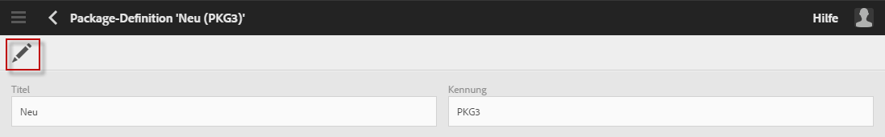

1. Wählen Sie im Tab **[!UICONTROL Definition des Exports]** mithilfe der Schaltfläche **[!UICONTROL Element erstellen]** die Ressourcen aus, die exportiert werden sollen.

   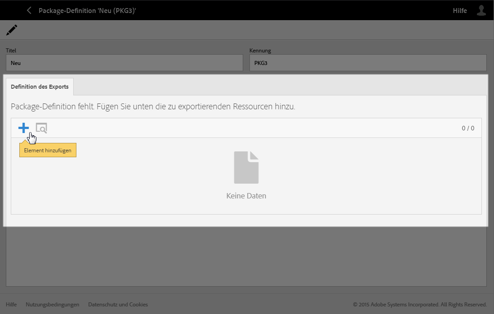

1. Die verfügbaren Ressourcen werden in alphabetischer Reihenfolge angezeigt und können nach Namen gefiltert werden. Ihr technischer Name wird in Klammern angezeigt. Markieren Sie ein Element der Liste und validieren Sie die Auswahl.

   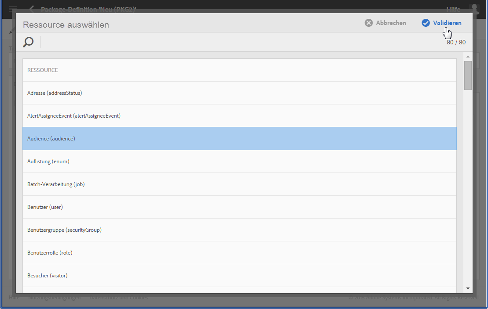

1. Der Name der hinzugefügten Ressource erscheint nun im Tab **[!UICONTROL Definition des Exports]**. Um die Ressource zu bearbeiten, kreuzen Sie sie an und verwenden Sie die Schaltfläche **[!UICONTROL Detail des ausgewählten Elements anzeigen]**.

   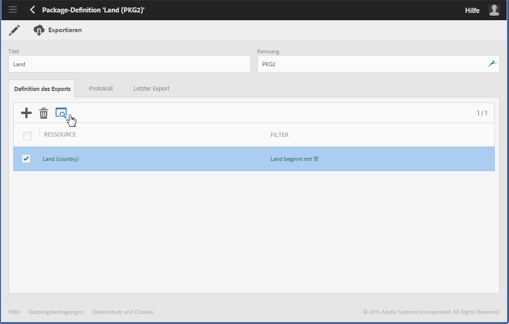

1. Daraufhin öffnet sich das Abfragetool und Sie können die zu exportierenden Elemente filtern. Weiterführende Informationen hierzu finden Sie im Abschnitt [Abfragetool](../../automating/using/editing-queries.md#creating-queries).

   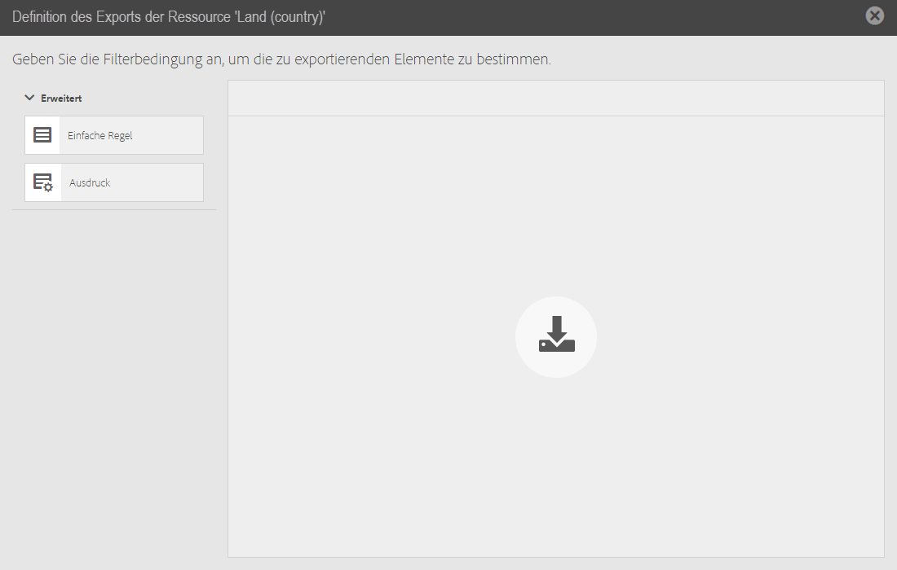

   >[!NOTE]
   >
   >Pro Ressource können bis zu 5000 Objekte exportiert werden.

1. Speichern Sie Ihre Auswahl, sobald Sie alle zu exportierenden Ressourcen definiert haben.

Ihr Package wurde erstellt und kann jetzt exportiert werden.

### Package exportieren  {#exporting-a-package}

Durch den Export von Packages können Sie einen bestimmten Status einer Ressource speichern. Diese können Sie in eine andere Instanz oder zu einem späteren Zeitpunkt in derselben Instanz wieder importieren

>[!CAUTION]
>
>Der Package-Export ist nicht zulässig, wenn die zu exportierenden Ressourcen Standard-Kennungen aufweisen. Deshalb ist es notwendig, die Kennungen exportierbarer Ressourcen so abzuändern, dass sie sich von den automatisch vergebenen Kennungen in Adobe-Campaign-Standard unterscheiden. Zum Beispiel darf beim Export von Testprofilen keine Kennung verwendet werden, die den Wert &quot;SDM&quot; bzw. &quot;sdm&quot; enthält.

1. Wählen Sie in **[!UICONTROL Administration]** > **[!UICONTROL Freigabe]** > **[!UICONTROL Package-Exporte]** ein Package, um dessen Details anzuzeigen.
1. Prüfen Sie, ob das Package die gewünschten Daten enthält.
1. Klicken Sie auf die Schaltfläche **[!UICONTROL Export starten]**.

Die exportierte Datei wird im Download-Verzeichnis des verwendeten Browsers gespeichert. Die Benennung erfolgt automatisch in &quot;package_xxx.xml&quot;, wobei &quot;xxx&quot; der Kennung des Packages entspricht.

Nach Abschluss des Vorgangs werden weitere Informationen angezeigt:

* **[!UICONTROL Der Exportstatus]** gibt Auskunft darüber, ob der Export korrekt ausgeführt wurde.

   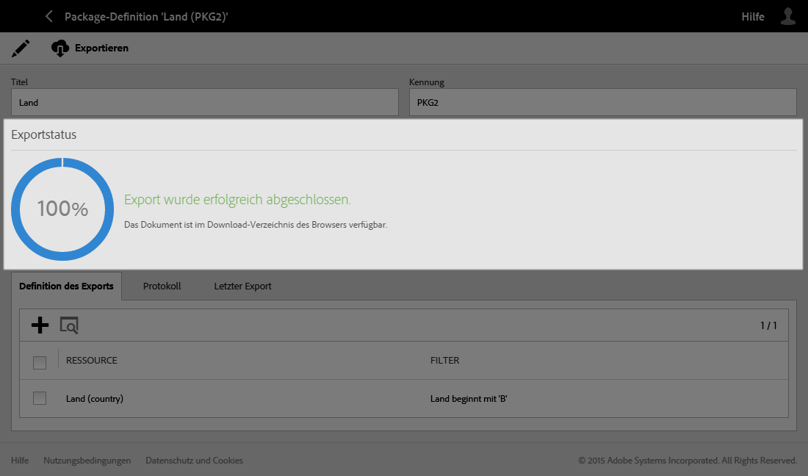

* Im **[!UICONTROL Protokoll]**-Tab werden alle Logs zu diesem und früheren Exporten angezeigt. Darin ist der Status aller früher durchgeführten Exporte zu sehen.

   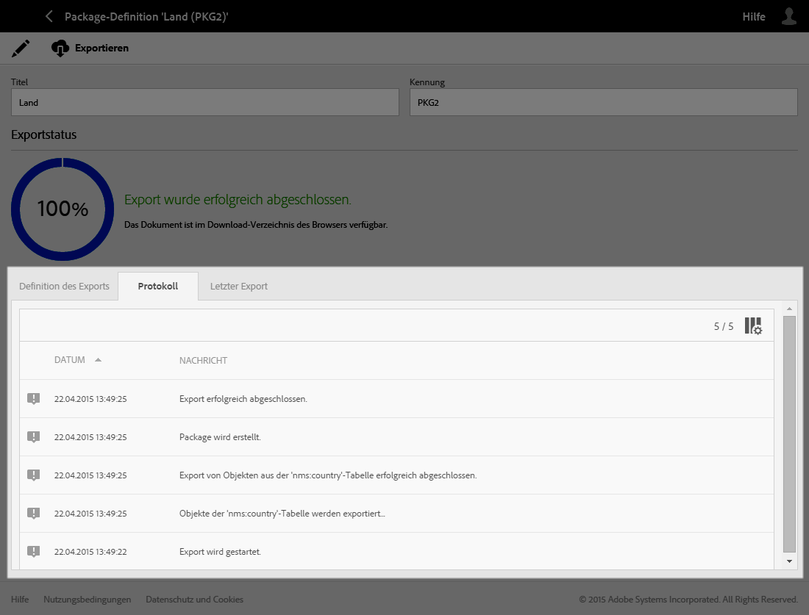

>[!NOTE]
>
>Wenn Sie ausgehend von der Package-Definition-Liste ein Element öffnen, das bereits exportiert wurde, stehen die Tabs **[!UICONTROL Protokoll]** und **[!UICONTROL Letzter Export]** noch immer zur Verfügung.

## Package-Importe {#package-imports}

### Systemaktualisierung {#system-updates}

Die Liste der Package-Importe entält insbesondere die im Zuge von Aktualisierungen durch Adobe vorgenommenen automatischen Importe.

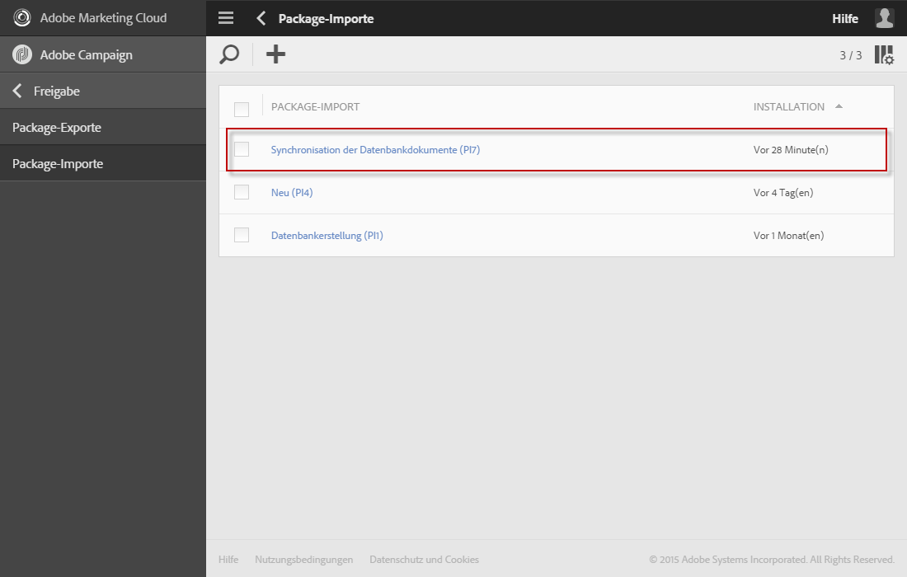

In der **[!UICONTROL Ausführungslogs]**-Ansicht werden alle Importetappen angezeigt. Im seitlichen Menü werden allgemeine Informationen angezeigt.

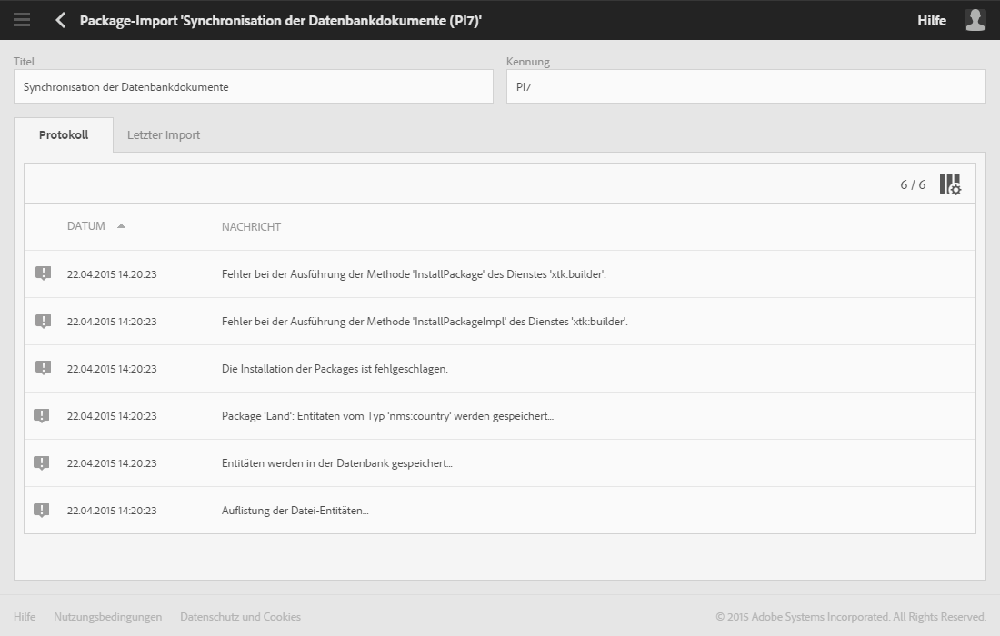

>[!NOTE]
>
>Diese Informationen sind schreibgeschützt.

### Package importieren  {#importing-a-package}

Ein Administrator kann ein zuvor aus einer Adobe-Campaign-Instanz exportiertes Package manuell importieren. Weiterführende Informationen finden Sie im Abschnitt [Package-Exporte](#package-exports).

Der manuelle Package-Import erfolgt in zwei Schritten: Eine Datei muss zunächst hochgeladen werden, bevor ihr Inhalt importiert werden kann.

1. Wählen Sie in **[!UICONTROL Administration]** > **[!UICONTROL Freigabe]** > **[!UICONTROL Package-Importe]** in der Liste der Package-Importe die **[!UICONTROL Erstellen]**-Schaltfläche.

   Das Element wird sofort erstellt. Sollten Sie das Package doch nicht benötigen, müssen Sie es in der Liste ankreuzen und wie zuvor beschrieben löschen.

1. Geben Sie einen Namen und eine Kennung für den neuen Import an.
1. Ziehen Sie die zu importierende Datei in den hierfür vorgesehenen Bereich oder verwenden Sie den Link **[!UICONTROL Festplatte durchsuchen]**.

   Importierte Dateien müssen entweder das Format XML oder ZIP (mit einer XML-Datei) aufweisen.

   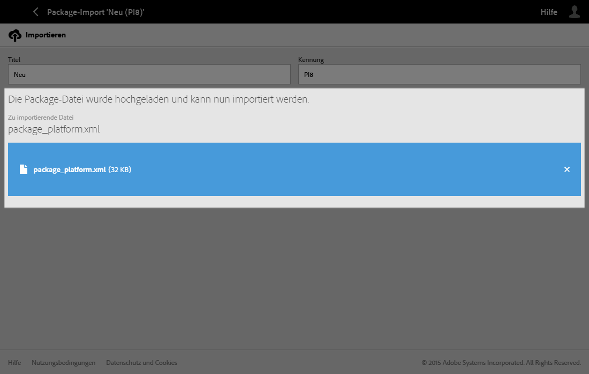

   >[!NOTE]
   >
   >Um eine bereits hochgeladene Datei zu ersetzen, muss diese zunächst mithilfe des Kreuzes rechts von ihrem Namen gelöscht werden, bevor eine andere Datei hochgeladen werden kann.

1. Nach dem Hochladen der Datei kann ihr Inhalt über die Schaltfläche **[!UICONTROL Import starten]** in die Datenbank integriert werden.

   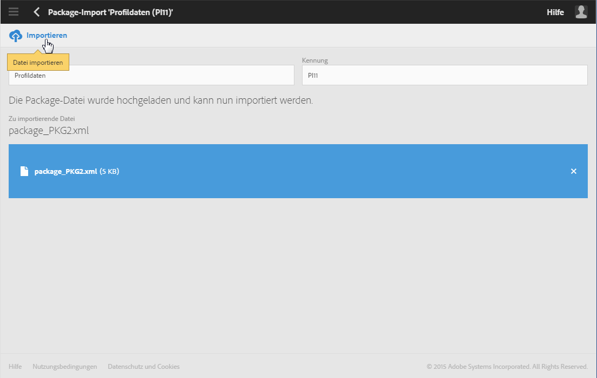

Nach Abschluss des Vorgangs werden weitere Informationen angezeigt:

* **[!UICONTROL Der Importstatus]** gibt Auskunft darüber, ob der Import korrekt ausgeführt wurde.
* In der **[!UICONTROL Ausführungslogs]**-Ansicht werden alle Importetappen und insbesondere Fehler angezeigt. Ein bereits importiertes Package kann nicht erneut importiert werden.

   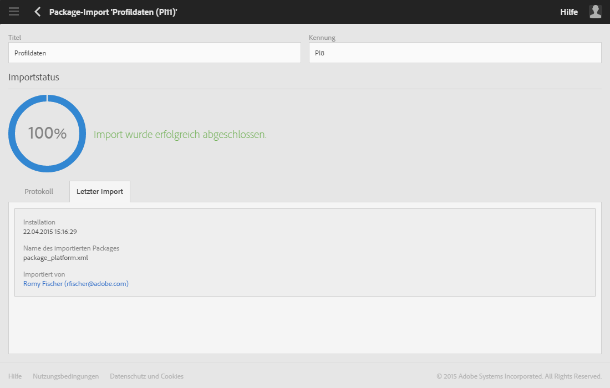

Nur sein Titel und seine Kennung können angepasst werden. Sie können nur den Titel und die Kennung ändern.

Um dieselben Daten erneut zu importieren, ist ausgehend von der Package-Liste ein neues Package zu erstellen und der Importvorgang wie zuvor beschrieben zu wiederholen.
