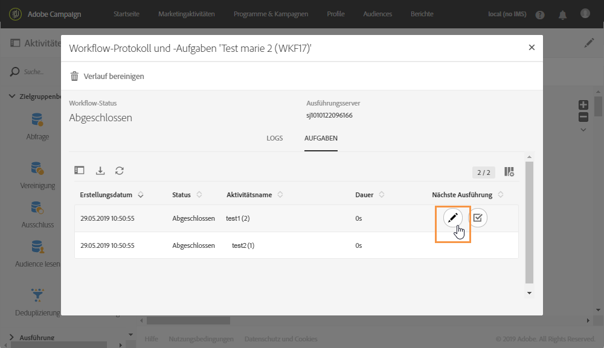
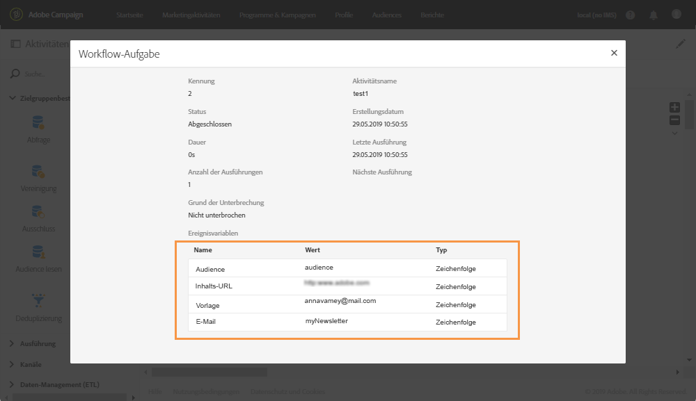

# Ereignisvariablen überwachen {#monitoring-the-events-variables}

Es ist möglich, die im Workflow verfügbaren Ereignisvariablen zu überwachen, einschließlich der deklarierten externen Parameter. Gehen Sie dazu wie folgt vor:

1. Wählen Sie die Aktivität aus, die der Aktivität **[!UICONTROL Externes Signal]** folgt, und wählen Sie die Schaltfläche **[!UICONTROL Protokoll und Aufgaben]** aus.
1. Wählen Sie im Tab **[!UICONTROL Aufgaben]** die Schaltfläche  aus.

   

1. Im Ausführungskontext der Aufgabe werden jetzt ID, Status, Dauer etc. angezeigt, einschließlich aller Ereignisvariablen, die im Workflow zur Verfügung stehen.

   
