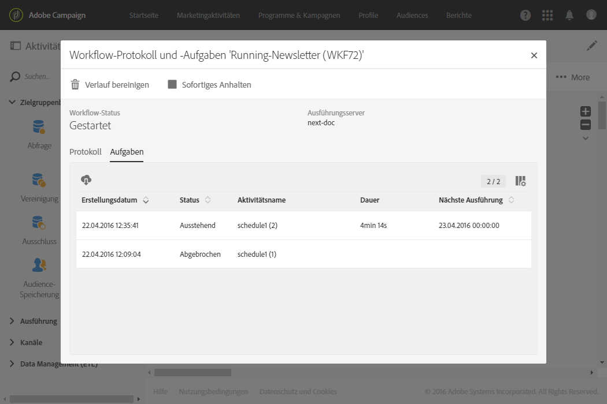

# Ausführung des Workflows überwachen {#monitoring}

## Workflow-Protokoll und -Aufgaben {#workflow-log-and-tasks}

Über die Schaltfläche  können Sie auf das Protokoll und die Aufgaben des Workflows zugreifen.

Der Workflow-Verlauf wird für die in den Ausführungseigenschaften eines Workflows angegebene Dauer gespeichert (siehe [Eigenschaften des Workflows](../../automating/using/managing-execution-options.md)). Innerhalb dieser Dauer werden alle Logs gespeichert, auch wenn der Workflow neu gestartet wurde. Wenn Sie die Logs einer früheren Ausführung nicht beibehalten möchten, können Sie den Verlauf unter Verwendung der Schaltfläche  bereinigen.

Der **[!UICONTROL Protokoll]**-Tab enthält den Ausführungsverlauf aller oder aller markierten Aktivitäten. Er zeigt in chronologischer Abfolge alle Vorgänge und Ausführungsfehler.

Der **[!UICONTROL Aufgaben]**-Tab liefert Details zur Ausführungsabfolge der Aktivitäten. Klicken Sie auf eine Aufgabe zur Anzeige weiterer Details.

In beiden Listen:

* gibt der Zähler Auskunft über die Anzahl an Listeneinträgen. Bei mehr als 30 Listenelementen wird durch einen Klick auf den Zähler die Gesamtzahl angezeigt.
* ermöglicht die Schaltfläche **[!UICONTROL Liste konfigurieren]** die Auswahl der anzuzeigenden Informationen, die Bestimmung der Spaltenreihenfolge sowie die Sortierung der Liste.
* Mithilfe von Filtern können Sie Informationen schneller auffinden. Über das Suchfeld können Sie nach einem bestimmten Text in den Namen der Workflow-Aktivitäten (Beispiel: &quot;Abfrage&quot;) und Protokollen suchen.

## Umgang mit Fehlern       {#error-management}

Wenn ein Fehler auftritt, wird der Workflow ausgesetzt und die bei Fehlerauftritt ausgeführte Aktivität blinkt rot.

Der Workflow wechselt in den roten Status und der Fehler wird im Protokoll verzeichnet.

Es besteht die Möglichkeit, das Aussetzen des Workflows im Falle von Fehlern zu vermeiden und die sich anschließenden Aufgaben wie geplant auszuführen. Öffnen Sie hierzu die Workflow-Eigenschaften mithilfe der Schaltfläche  und wählen Sie im Bereich **[!UICONTROL Ausführung]** im Feld **Bei Fehler** die Option **Ignorieren** aus der Dropdown-Liste aus.

In diesem Fall wird die fehlerhafte Aufgabe abgebrochen. Dieser Modus ist insbesondere bei Workflows mit wiederkehrenden Vorgängen angebracht, da die nächste Ausführung auf diese Weise wie geplant starten kann.

>[!NOTE]
>
>Es besteht die Möglichkeit, diese Vorgehensweise innerhalb eines Workflows nur für bestimmte Aktivitäten zu konfigurieren. Wählen Sie hierzu die gewünschte Aktivität aus, öffnen Sie sie mithilfe des Schnellzugriffs  und wählen Sie im Bereich **Ausführungsoptionen** den gewünschten Umgang mit Fehlern aus. Siehe [Ausführungsoptionen von Aktivitäten](../../automating/using/activity-properties.md).

In den [Eigenschaften des Workflows](../../automating/using/managing-execution-options.md) stehen zusätzliche Optionen zur Verwaltung von Fehlern zur Verfügung.

Mögliche Optionen sind:

* **[!UICONTROL Supervisoren]**: Hier wird die Gruppe von Personen festgelegt, die im Fall eines fehlerhaften Workflows benachrichtigt werden (E-Mail und In-App-Benachrichtigung). Sollte keine Gruppe angegeben sein, wird niemand benachrichtigt. Weiterführende Informationen zu Adobe Campaign-Benachrichtigungen finden Sie in Abschnitt [Benachrichtigungen in Adobe Campaign](../../administration/using/sending-internal-notifications.md).

* **[!UICONTROL Bei Fehler]**: Hier lassen sich mögliche Reaktionen bei Auftreten eines Fehlers festlegen. Zwei Optionen stehen zur Wahl:

   * **Prozess aussetzen** - der Workflow wird automatisch angehalten. Der Workflow-Status wechselt in **fehlerhaft** und sein Symbol wird rot hinterlegt. Nach Beseitigung der Fehlerursache kann der Workflow neu gestartet werden.
   * **Ignorieren** - die den Fehler verursachende Aktivität sowie alle im selben Zweig folgenden Aktivitäten werden nicht ausgeführt. Diese Konfiguration empfiehlt sich bei wiederkehrenden Aufgaben. Wenn der Workflow-Zweig eine Planungsaktivität enthält, führt diese automatisch zum nächsten geplanten Zeitpunkt zu einer erneuten Ausführung.

* **[!UICONTROL Folgefehler]**: Hier können Sie die Anzahl aufeinanderfolgender Fehler definieren, die autorisiert werden, bevor die Ausführung des Workflows automatisch ausgesetzt wird.

   * Bei Angabe von **[!UICONTROL 0]** bzw. bis zum Erreichen der angegebenen Fehleranzahl werden die fehlerhaften Aktivitäten ignoriert. Die anderen Workflow-Zweige werden regulär ausgeführt.

   * Bei Erreichen der angegebenen Anzahl wird der gesamte Workflow ausgesetzt und nimmt den Status **[!UICONTROL Mit Fehlern]** an.  Sollten zuvor Supervisoren bestimmt worden sein, werden diese automatisch per E-Mail benachrichtigt. Weiterführende Informationen dazu finden Sie im Abschnitt [Benachrichtigungen in Adobe Campaign](../../administration/using/sending-internal-notifications.md).
