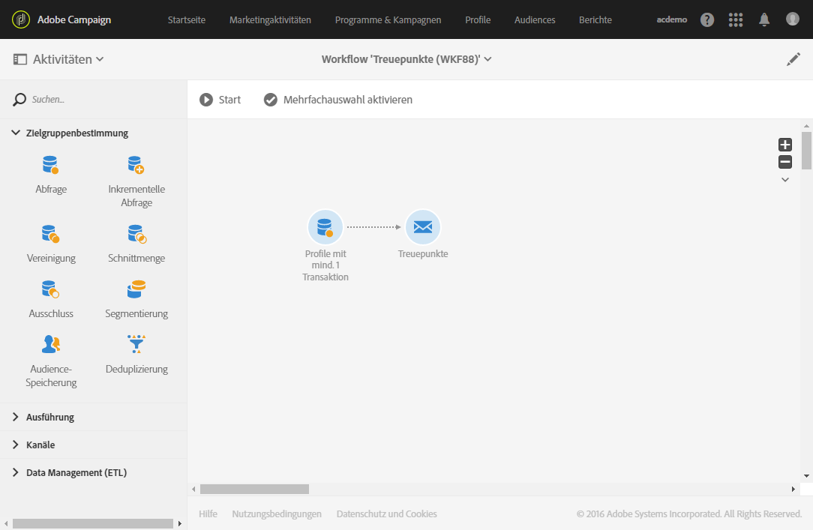
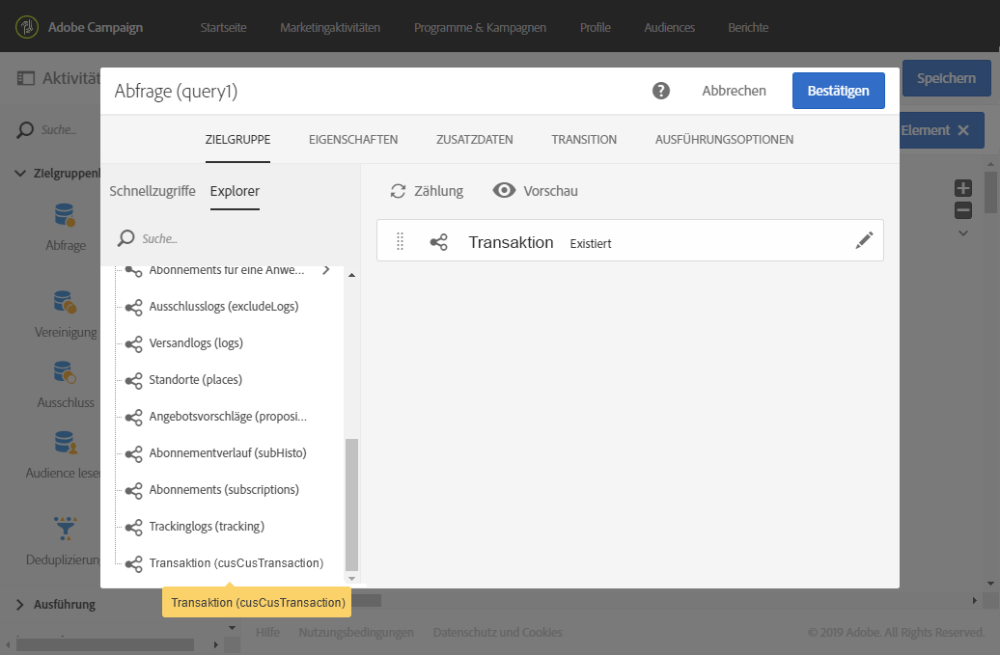
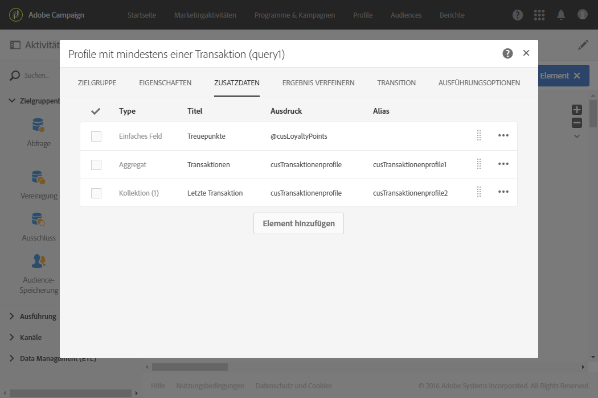
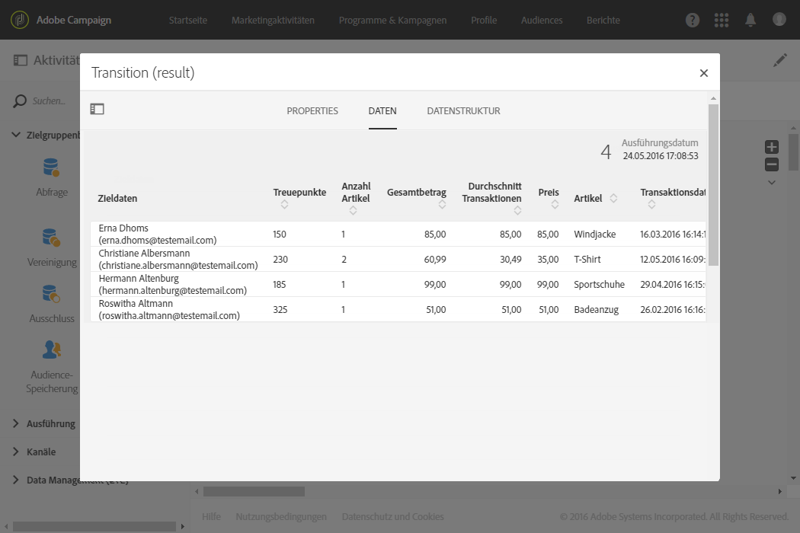
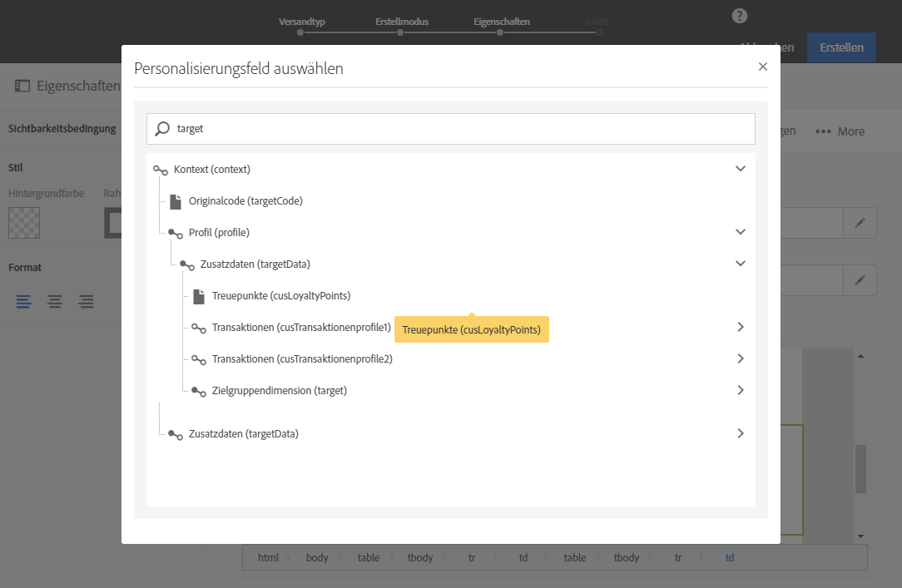

# E-Mail mit Zusatzdaten personalisieren {#example--personalizing-an-email-with-additional-data}

Das folgende Beispiel zeigt das Hinzufügen verschiedener Zusatzdatentypen zu einer Abfrage und die Verwendung von Zusatzdaten in Form von Personalisierungsfeldern in einer E-Mail. Weiterführende Informationen darüber, wie Sie die Daten anreichern können, auf die eine **[!UICONTROL Abfrageaktivität]** abzielt, finden Sie in [diesem Abschnitt](../../automating/using/query.md#enriching-data).

Für dieses Beispiel werden diverse [benutzerdefinierte Ressourcen](../../developing/using/data-model-concepts.md) verwendet:

* Die **Profil**-Ressource wurde erweitert, um ein Feld hinzuzufügen, das die Speicherung von Treuepunkten für jedes Profil ermöglicht.
* Eine **Transaktionen**-Ressource wurde erstellt. Sie enthält alle von den in der Datenbank enthaltenen Profilen getätigten Bestellungen. Für jede Transaktion wird ihr Datum, der bestellte Artikel und sein Preis gespeichert.
* Eine **Artikel**-Ressource wurde erstellt. Sie enthält alle zum Verkauf stehenden Artikel.

Ziel ist es, eine E-Mail an all jene Profile zu senden, für die mindestens eine Transaktion gespeichert wurde. In dieser E-Mail werden den Kunden die letzte von ihnen getätigte Transaktion sowie diverse Informationen zu allen bisher erfolgten Transaktionen in Erinnerung gerufen: Anzahl an bestellten Artikeln, Gesamtbetrag, Anzahl an bereits gesammelten Treuepunkten.

Der Workflow stellt sich folgendermaßen dar:

1. Ziehen Sie eine [Abfrage](../../automating/using/query.md) in den Arbeitsbereich, um alle Profile abzurufen, die mindestens eine Transaktion getätigt haben.

   

1. Definieren Sie im **[!UICONTROL Zusatzdaten]**-Tab der Abfrage die verschiedenen Daten, die in der E-Mail angezeigt werden sollen:

   * Treuepunkte anhand eines einfachen Felds aus der Dimension **Profile.** Lesen Sie diesbezüglich auch den Abschnitt [Einfaches Feld hinzufügen](../../automating/using/query.md#adding-a-simple-field).
   * Die Anzahl an bestellten Artikeln und der Gesamtbetrag anhand von zwei auf der Transaktionssammlung basierenden Aggregaten. Fügen Sie letztere im **[!UICONTROL Daten]**-Tab des Fensters zur Aggregatkonfiguration hinzu (Aggregate **Count** und **Sum**). Lesen Sie diesbezüglich auch den Abschnitt [Aggregat hinzufügen](../../automating/using/query.md#adding-an-aggregate).
   * Betrag, Datum und Artikel der letzten Transaktion, die anhand einer Sammlung ermittelt werden.

      Fügen Sie hierzu im **[!UICONTROL Daten]**-Tab des Fensters zur Sammlungskonfiguration die verschiedenen anzuzeigenden Felder hinzu.

      Damit nur die neueste Transaktion ausgegeben wird, ist im Feld **[!UICONTROL Anzahl an auszugebenden Zeilen]** die Ziffer „1“ anzugeben und das Sammlungsfeld **Datum** im Tab **[!UICONTROL Sortierung]** in absteigender Reihenfolge zu sortieren.

      Lesen Sie diesbezüglich auch die Abschnitte [Sammlung hinzufügen](../../automating/using/query.md#adding-a-collection) und [Hinzugefügte Daten sortieren](../../automating/using/query.md#sorting-additional-data).
   

1. Wenn Sie prüfen möchten, ob die Daten in der ausgehenden Transition der Aktivität korrekt übermittelt werden, starten Sie den Workflow an dieser Stelle (bevor Sie die **[!UICONTROL E-Mail-Versand]**-Aktivität anschließen) und öffnen Sie die aus der Abfrage ausgehende Transition.

   

1. Schließen Sie nun einen [E-Mail-Versand](../../automating/using/email-delivery.md) an. Verwenden Sie im E-Mail-Inhalt die Personalisierungsfelder, die den in der Abfrage berechneten Daten entsprechen. Folgen Sie hierzu im Explorer der Personalisierungsfelder der Relation **[!UICONTROL Zusatzdaten (targetData)]**.

   

Ihr Workflow kann nun ausgeführt werden. Die mithilfe der Abfrage abgerufenen Profile erhalten eine personalisierte E-Mail mit den ihren Transaktionen entsprechenden Daten.
