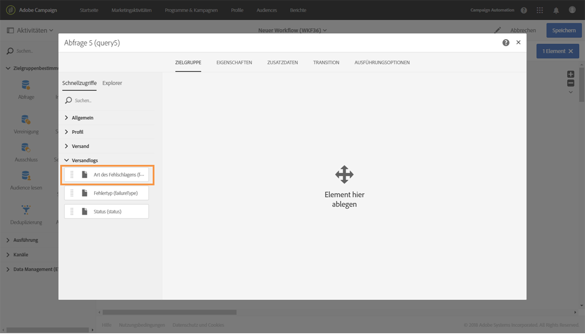

# Beispiele für Abfragen   {#query-samples}

In diesem Abschnitt wird der Anwendungsfall bei Verwendung einer **[!UICONTROL Abfrageaktivität]** erläutert. Weiterführende Informationen zur Verwendung einer **[!UICONTROL Abfrageaktivität]** finden Sie in [diesem Abschnitt](../../automating/using/query.md).

## Abfrage nach einfachen Profilattributen {#targeting-on-simple-profile-attributes}

Das folgende Beispiel zeigt eine Abfrage von Männern zwischen 18 und 30 Jahren, die in London leben.

## Abfrage nach E-Mail-Attributen   {#targeting-on-email-attributes}

Das folgende Beispiel zeigt eine Abfrage von Profilen, deren E-Mail-Adressen-Domain &quot;orange.co.uk&quot; lautet.

Das folgende Beispiel zeigt eine Abfrage von Profilen, deren E-Mail-Adresse vorhanden ist.

## Abfrage von Profilen, deren Geburtstag heute ist   {#targeting-profiles-whose-birthday-is-today}

Das folgende Beispiel zeigt eine Abfrage von Profilen, deren Geburtstag heute ist.

1. Ziehen Sie den Filter **[!UICONTROL Geburtstag]** in Ihre Abfrage.

   

1. Wählen Sie für den **[!UICONTROL Filtertyp]** die Option **[!UICONTROL Relativ]** und danach **[!UICONTROL Heute]** aus.

   

## Abfrage von Profilen, die einen bestimmten Versand geöffnet haben {#targeting-profiles-who-opened-a-specific-delivery}

Das folgende Beispiel zeigt eine Abfrage von Profilen, die den Versand mit dem Titel &quot;Sommerzeit&quot; geöffnet haben.

1. Ziehen Sie den Filter **[!UICONTROL Geöffnet]** in Ihre Abfrage.

   

1. Wählen Sie den entsprechenden Versand aus und danach **[!UICONTROL Bestätigen]**.

   

## Abfrage von Profilen, für die Sendungen aus einem bestimmten Grund fehlgeschlagen sind {#targeting-profiles-for-whom-deliveries-failed-for-a-specific-reason}

Das folgende Beispiel zeigt eine Abfrage von Profilen, für die Sendungen fehlgeschlagen sind, weil ihr Posteingang voll war. Diese Abfrage steht nur Benutzern mit Administratorrechten zur Verfügung, die den Organisationseinheiten **[!UICONTROL Alle (all)]** angehören (siehe [diesen Abschnitt](../../administration/using/organizational-units.md)).

1. Wählen Sie die Ressource **[!UICONTROL Versandlogs]** aus, um Filter direkt in der Versandlogtabelle zu verwenden (siehe [Von den Zielgruppendimensionen abweichende Ressourcen verwenden](../../automating/using/using-resources-different-from-targeting-dimensions.md)).

   

1. Ziehen Sie den Filter **[!UICONTROL Art des Fehlschlagens]** in Ihre Abfrage.

   

1. Wählen Sie den entsprechenden Fehlertyp aus. In unserem Fall ist das **[!UICONTROL Postfach voll]**.

   

## Abfrage von Profilen, die in den letzten sieben Tagen nicht kontaktiert wurden {#targeting-profiles-not-contacted-during-the-last-7-days}

Das folgende Beispiel zeigt eine Abfrage von Profilen, die in den letzten sieben Tagen nicht kontaktiert wurden.

1. Ziehen Sie den Filter **[!UICONTROL Versandlogs (logs)]** in Ihre Abfrage.

   

   Wählen Sie in der Dropdown-Liste die Option **[!UICONTROL Existiert nicht]** aus und ziehen Sie danach den Filter **[!UICONTROL Versand]** in Ihre Abfrage.

   

1. Konfigurieren Sie den Filter wie unten beschrieben.

   

## Abfrage von Profilen, die auf einen bestimmten Link geklickt haben   {#targeting-profiles-who-clicked-a-specific-link-}

1. Ziehen Sie den Filter **[!UICONTROL Trackinglogs (tracking)]** in Ihre Abfrage.

   

1. Ziehen Sie den Filter **[!UICONTROL Titel (urlLabel)]** in Ihre Abfrage.

   

1. Geben Sie im Feld **[!UICONTROL Wert]** den Titel ein, der beim Einfügen des Links in den Versand definiert wurde. Bestätigen Sie danach Ihre Eingabe.

   
