# Abfrage{#query}

## Beschreibung {#description}

Eine **[!UICONTROL Abfrage]** dient der Filterung und Extraktion einer Population, die sich aus Elementen der Adobe Campaign-Datenbank zusammensetzt. Mithilfe eines dedizierten Tabs können Sie **[!UICONTROL Zusatzdaten]** für die Zielpopulation definieren. Diese Daten werden in Zusatzspalten gespeichert und können ausschließlich für den laufenden Workflow verwendet werden.

Die Aktivität verwendet das Abfragetool, dessen Funktionsweise in einem [gesonderten Kapitel](../../automating/using/editing-queries.md#about-query-editor) behandelt wird.

**Verwandte Themen:**

* [Beispiele für Abfragen ](../../automating/using/query-samples.md)
* [Anwendungsfall: Retargeting-Workflow für eine erneute Versendung an Nicht-Öffner](../../automating/using/workflow-cross-channel-retargeting.md)

## Anwendungskontext {#context-of-use}

**[!UICONTROL Abfragen]** kommen in verschiedenen Kontexten zum Einsatz:

* Segmentierung von Populationen, um beispielsweise Zielgruppen und Audiences zu definieren;
* Anreicherung von Daten beliebiger Adobe-Campaign-Tabellen;
* Export von Daten.

## Konfiguration    {#configuration}

1. Ziehen Sie eine **[!UICONTROL Abfrage]** in den Workflow-Arbeitsbereich.
1. Markieren Sie die Aktivität und öffnen Sie sie mithilfe der im Schnellzugriff angezeigten Schaltfläche . Die Standardkonfiguration der Aktivität sieht die Suche nach Profilen vor.
1. Wenn sich Ihre Abfrage auf eine andere als die Profilressource beziehen soll, können Sie im **[!UICONTROL Eigenschaften]**-Tab der Aktivität die entsprechende **[!UICONTROL Ressource]** und eine **[!UICONTROL Zielgruppendimension]** auswählen.

   Die **[!UICONTROL Ressource]** entspricht dem Populationstyp, den Sie verwenden möchten (identifizierte Profile, Sendungen etc.). Die **[!UICONTROL Zielgruppendimension]** ist kontextgebunden in Bezug auf die ausgewählte Ressource und ermöglicht die gezielte Anzeige der verfügbaren Filter in der Palette.

   Lesen Sie diesbezüglich auch den Abschnitt [Zielgruppendimensionen und Ressourcen](#targeting-dimensions-and-resources).

1. Konfigurieren Sie im Tab **[!UICONTROL Zielgruppe]** die Abfrage, indem Sie Regeln definieren und/oder kombinieren.
1. Mithilfe eines dedizierten Tabs können Sie **[!UICONTROL Zusatzdaten]** für die Zielpopulation definieren. Diese Daten werden in Zusatzspalten gespeichert und können ausschließlich für den laufenden Workflow verwendet werden. Sie können insbesondere Daten aus Tabellen der Adobe-Campaign-Datenbank hinzufügen, die mit der Zielgruppendimension der Abfrage in Relation stehen. Lesen Sie diesbezüglich auch den Abschnitt [Daten anreichern](#enriching-data).

   >[!NOTE]
   >
   >Standardmäßig ist die Option **[!UICONTROL Dubletten löschen (DISTINCT)]** in **[!UICONTROL Erweiterte Optionen]** des Tabs **[!UICONTROL Zusatzdaten]** der Abfrage aktiviert. Wenn die Aktivität **[!UICONTROL Abfrage]** viele Zusatzdaten enthält (mehr als 100), ist es empfehlenswert, diese Option zur Leistungssteigerung zu deaktivieren. Beachten Sie jedoch, dass durch die Deaktivierung dieser Option abhängig von den abgefragten Daten Dubletten entstehen können.

1. Im Tab **[!UICONTROL Transition]** können Sie mit der Option **[!UICONTROL Ausgehende Transition erzeugen]** im Anschluss an eine Abfrageaktivität eine ausgehende Transition hinzufügen, selbst wenn keine Daten abgefragt werden.

   The outbound transition&#39;s segment code can be personalized using a standard expression and events variables (see [this page](../../automating/using/customizing-workflow-external-parameters.md)).

1. Validieren Sie die Konfiguration der Aktivität und speichern Sie Ihren Workflow.

## Zielgruppendimensionen und Ressourcen    {#targeting-dimensions-and-resources}

Mit Zielgruppendimensionen und Ressourcen können Sie definieren, auf welchen Elementen eine Abfrage basieren soll, um die Zielgruppe eines Versands zu bestimmen.

Sie werden in [Zielgruppen-Mappings](../../administration/using/target-mappings-in-campaign.md) konfiguriert und beim Erstellen eines Workflows im Tab **[!UICONTROL Eigenschaften]** einer Abfrage-Aktivität definiert.

>[!NOTE]
>
>Die Zielgruppendimension kann auch bei der Erstellung einer Audience definiert werden (siehe [diesen Abschnitt](../../audiences/using/creating-audiences.md)).

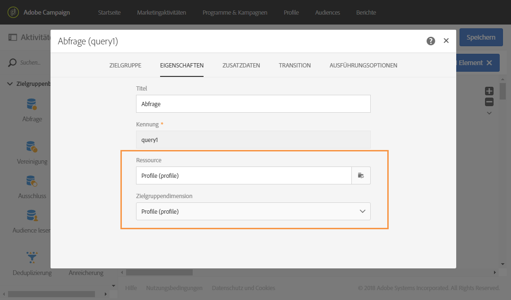

Zielgruppendimensionen und Ressourcen sind miteinander verknüpft. Die verfügbaren Zielgruppendimensionen hängen daher von den ausgewählten Ressourcen ab.

Beispielsweise sind für die Ressource **[!UICONTROL Profile (profile)]** die folgenden Zielgruppendimensionen verfügbar:

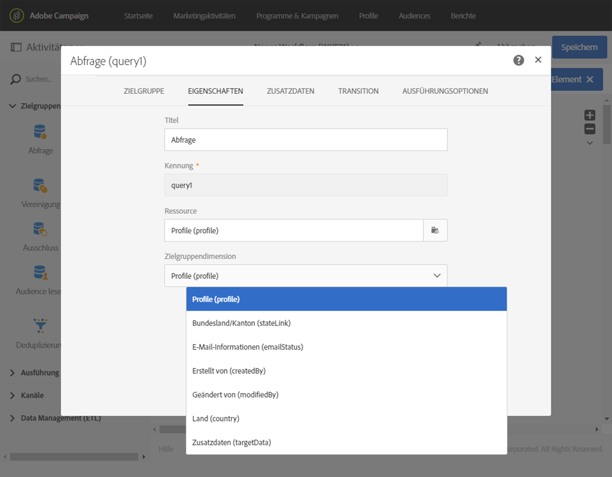

Dagegen enthält die Liste bei der Auswahl von **[!UICONTROL Sendungen (delivery)]** folgende Zielgruppendimensionen:

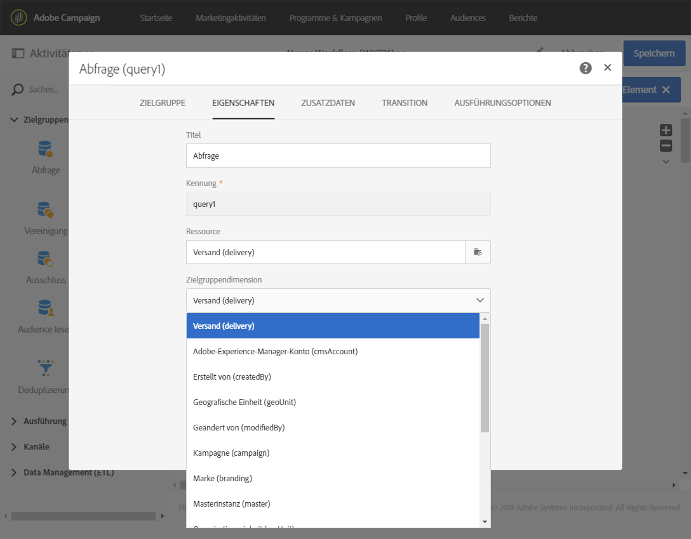

Sobald die Zielgruppendimension und die Ressource festgelegt wurden, stehen in der Abfrage unterschiedliche Filter zur Verfügung.

Beispiel für verfügbare Filter für die Ressource **[!UICONTROL Profile (profile)]**:

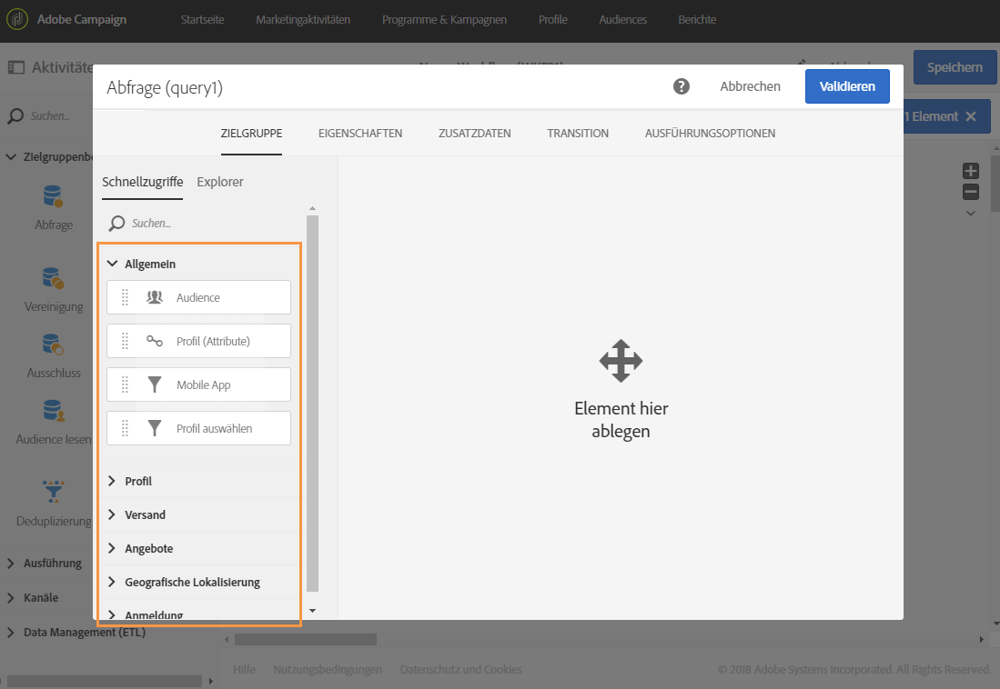

Beispiel für verfügbare Filter für die Ressource **[!UICONTROL Sendungen (delivery)]**:

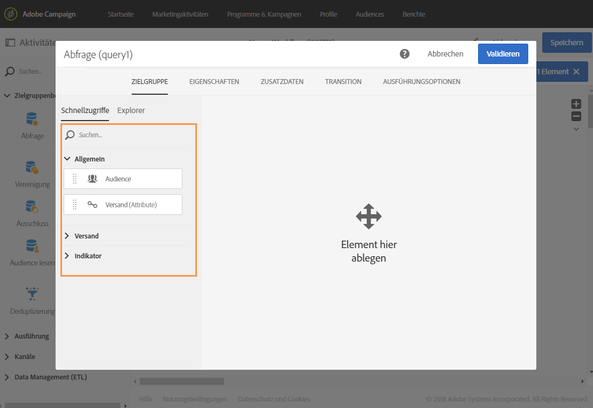

Normalerweise werden die Zielgruppendimension und die Ressource festgelegt, um Profile zu erfassen. Manchmal kann es aber nötig sein, eine von der Zielgruppendimension abweichende Ressource zu verwenden, um einen bestimmten Datensatz in einer entfernten Tabelle zu suchen.

Weitere Informationen hierzu finden Sie in diesem Anwendungsfall: [Von den Zielgruppendimensionen abweichende Ressourcen verwenden](../../automating/using/using-resources-different-from-targeting-dimensions.md)

## Anreichern von Daten {#enriching-data}

Mithilfe des Tabs **[!UICONTROL Zusatzdaten]** der Aktivitäten **[!UICONTROL Abfrage]**, **[!UICONTROL Inkrementelle Abfrage]** und **[!UICONTROL Anreicherung]** lassen sich die hervorgehenden Daten anreichern und an die Folgeaktivitäten des Workflows übermitteln, in denen sie weiterverwendet werden können. Insbesondere die folgenden Elemente lassen sich hinzufügen:

* einfache Daten
* Aggregate
* Kollektionen

Im Fall von Aggregaten und Kollektionen wird automatisch ein **[!UICONTROL Alias]** definiert, um komplexen Ausdrücken eine technische Kennung zuzuweisen. Dieser Alias, der eindeutig sein muss, erlaubt es, Aggregate und Kollektionen leicht zu finden. Sie können den automatisch erzeugten Alias so anpassen, dass Sie ihm einen leicht wiederzuerkennenden Namen verleihen.

>[!NOTE]
>
>Alias müssen folgende Syntax befolgen: Nur alphanumerische Zeichen und &quot;_&quot; sind zulässig. Alias beachten Groß- und Kleinschreibung. Alias müssen mit dem Zeichen &quot;@&quot; beginnen. Das direkt auf &quot;@&quot; folgende Zeichen darf keine Ziffer sein. Beispiel: @myAlias_1 und @_1Alias sind korrekt; @myAlias#1 und @1Alias sind falsch.

Nach dem Hinzufügen von Zusatzdaten können Sie die zunächst von der Abfrage ausgegebenen Daten weiter einschränken, indem Sie auf Basis der definierten Zusatzdaten Bedingungen erstellen.

>[!NOTE]
>
>Standardmäßig ist die Option **[!UICONTROL Dubletten löschen (DISTINCT)]** in **[!UICONTROL Erweiterte Optionen]** des Tabs **[!UICONTROL Zusatzdaten]** der Abfrage aktiviert. Wenn die Aktivität **[!UICONTROL Abfrage]** viele Zusatzdaten enthält (mehr als 100), ist es empfehlenswert, diese Option zur Leistungssteigerung zu deaktivieren. Beachten Sie jedoch, dass durch die Deaktivierung dieser Option abhängig von den abgefragten Daten Dubletten entstehen können.

In [diesem Abschnitt](../../automating/using/personalizing-email-with-additional-data.md) wird ein Anwendungsfall vorgestellt, wie eine E-Mail mit zusätzlichen Daten personalisiert werden kann.

### Einfaches Feld hinzufügen    {#adding-a-simple-field}

Das Hinzufügen eines einfachen Felds als Zusatzdatenelement macht ersteres direkt in der ausgehenden Transition der Aktivität sichtbar. Dadurch lässt sich beispielsweise überprüfen, ob die aus der Abfrage hervorgehenden Daten Ihren Vorstellungen entsprechen.

1. Rufen Sie den Tab **[!UICONTROL Zusatzdaten]** auf und fügen Sie ein neues Element hinzu.
1. Wählen Sie im sich öffnenden Fenster im Feld **[!UICONTROL Ausdruck]** ein Feld aus der Zielgruppendimension oder aus einer mit der Zielgruppendimension verknüpften Dimension aus. Sie haben die Möglichkeit, in den Dimensionsfeldern Ausdrücke zu bearbeiten und Funktionen oder einfache Berechnungen zu verwenden (außer Aggregate).

   Ein **[!UICONTROL Alias]** wird automatisch erstellt, wenn Sie einen Ausdruck bearbeiten, der kein einfacher XPATH ist (zum Beispiel: „Year(&lt;@birthDate>)“). Dieser kann bei Bedarf angepasst werden. Wenn Sie nur ein Feld (z. B. „@age“) wählen, ist es nicht erforderlich, einen **[!UICONTROL Alias]** zu definieren.

1. Verwenden Sie die Schaltfläche **[!UICONTROL Hinzufügen]**, um die Hinzufügung des Felds zu den Zusatzdaten zu validieren. Im Zuge der Abfragenausführung wird in der ausgehenden Transition der Aktivität eine dem hinzugefügten Feld entsprechende zusätzliche Spalte angezeigt.

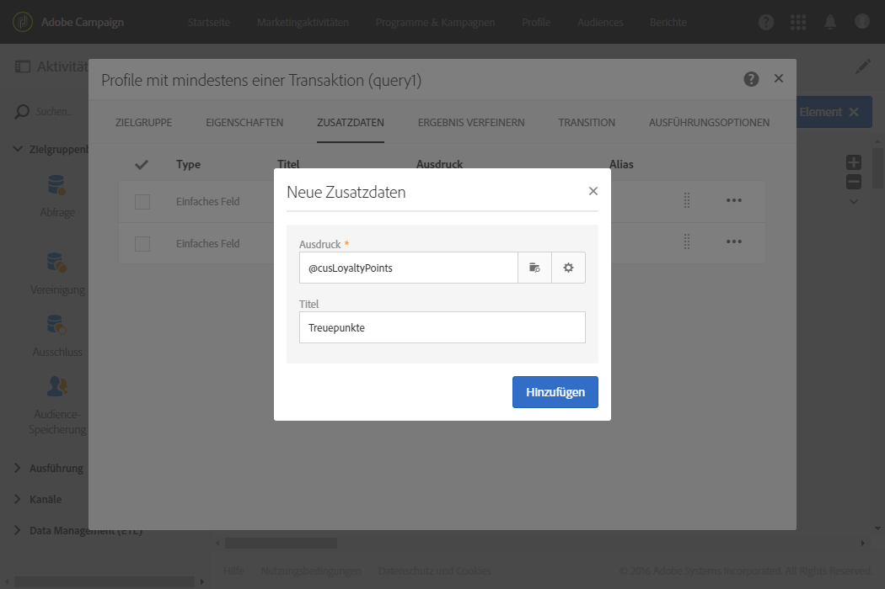

### Aggregat hinzufügen    {#adding-an-aggregate}

Aggregate dienen der Berechnung von Werten, die auf Feldern der Zielgruppendimension oder auf Feldern aus mit der Zielgruppendimension in Relation stehenden Dimensionen basieren. Zum Beispiel: der Durchschnitt der von einem Profil erteilten Bestellungen.
Bei Verwendung von Aggregat mit Abfrage kann die Funktion auf null zurückgesetzt werden, was dann als NULL gilt. Filtern Sie den aggregierten Wert auf dem Tab **[!UICONTROL Ergebnis verfeinern]** Ihrer Abfrage:

* Wenn Sie Nullwerte wünschen, sollten Sie nach **[!UICONTROL ist Null]** filtern.
* Wenn Sie keine Nullwerte wünschen, filtern Sie nach **[!UICONTROL ist nicht Null]**.

Hinweis: Wenn Sie eine Sortierung auf Ihr Aggregat anwenden müssen, sollten Sie Nullwerte herausfiltern. Andernfalls wird der NULL-Wert als höchste Zahl angezeigt.

1. Rufen Sie den Tab **[!UICONTROL Zusatzdaten]** auf und fügen Sie ein neues Element hinzu.
1. Wählen Sie im sich öffnenden Fenster im Feld **[!UICONTROL Ausdruck]** die Kollektion aus, die Sie zur Aggregaterstellung verwenden möchten.

   Es wird automatisch ein **[!UICONTROL Alias]** erzeugt. Dieser kann bei Bedarf im **[!UICONTROL Zusatzdaten]**-Tab der Abfrage angepasst werden.

   Das Fenster zur Aggregatdefinition öffnet sich.

1. Definieren Sie im **[!UICONTROL Daten]**-Tab ein Aggregat. Je nach ausgewähltem Aggregat sind im Feld **[!UICONTROL Ausdruck]** lediglich die Elemente verfügbar, deren Datentyp kompatibel ist. Beispielsweise lässt sich eine Summe ausschließlich mit numerischen Daten berechnen.

   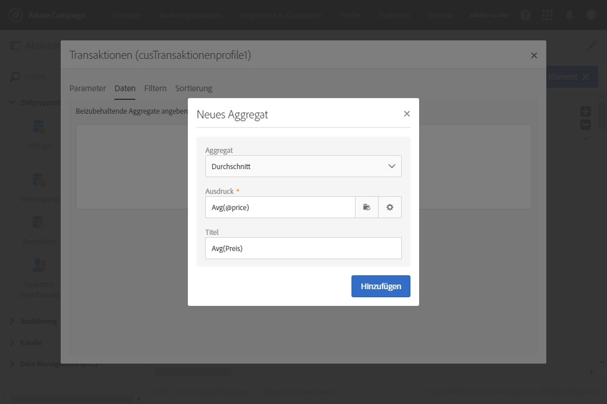

   Es besteht die Möglichkeit, mehrere, sich auf Felder der ausgewählten Kollektion beziehende Aggregate hinzuzufügen. Stellen Sie sicher, dass die vergebenen Titel eine korrekte Unterscheidung der verschiedenen Spalten in der Detailansicht der Daten in der ausgehenden Transition ermöglichen.

   Es besteht außerdem die Möglichkeit, die automatisch für jedes Aggregat erzeugten Alias anzupassen.

   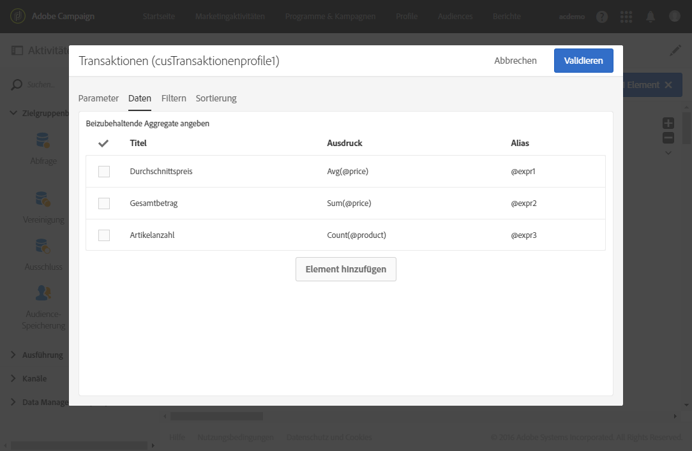

1. Bei Bedarf können Sie einen Filter hinzufügen, um die zu berücksichtigenden Daten zu begrenzen.

   Lesen Sie diesbezüglich auch den Abschnitt [Hinzugefügte Daten filtern](#filtering-added-data).

1. **[!UICONTROL Validieren]** Sie die Aggregaterstellung mithilfe der entsprechenden Schaltfläche.

>[!NOTE]
>
>Die Erstellung eines ein Aggregat enthaltenden Ausdrucks kann nicht direkt über das Feld **[!UICONTROL Ausdruck]** im Fenster **[!UICONTROL Neue Zusatzdaten]** vorgenommen werden.

### Hinzufügen einer Kollektion {#adding-a-collection}

1. Rufen Sie den Tab **[!UICONTROL Zusatzdaten]** auf und fügen Sie ein neues Element hinzu.
1. Wählen Sie im sich öffnenden Fenster im Feld **[!UICONTROL Ausdruck]** die Kollektion aus, die Sie hinzufügen möchten. Es wird automatisch ein **[!UICONTROL Alias]** erzeugt. Dieser kann bei Bedarf im **[!UICONTROL Zusatzdaten]**-Tab der Abfrage angepasst werden.
1. Bestätigen Sie die Angaben mithilfe der Schaltfläche **[!UICONTROL Hinzufügen]**. Im sich öffnenden Fenster haben Sie die Möglichkeit, die Kollektionsdaten, die Sie anzeigen möchten, zu verfeinern.
1. Wählen Sie im **[!UICONTROL Parameter]**-Tab die Option **[!UICONTROL Kollektion]** aus und definieren Sie die Anzahl an Kollektionszeilen, die hinzugefügt werden sollen. Wenn Sie beispielsweise für jedes Profil die letzten drei Bestellungen abfragen möchten, müssen Sie im Feld **[!UICONTROL Anzahl an auszugebenden Zeilen]** die Ziffer „3“ angeben.

   >[!NOTE]
   >
   >Nur Ziffern größer oder gleich 1 sind zulässig.

1. Definieren Sie im **[!UICONTROL Daten]**-Tab für jede Zeile die Felder der Kollektion, die angezeigt werden sollen.

   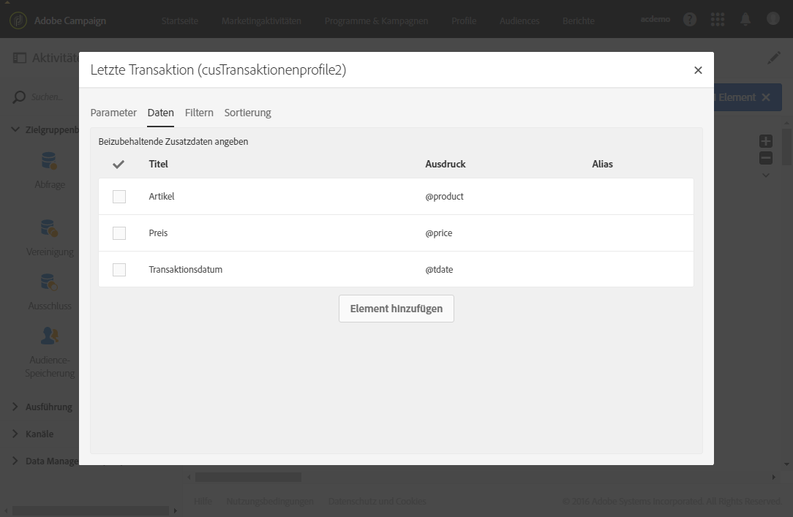

1. Bei Bedarf können Sie einen Filter hinzufügen, um die zu berücksichtigenden Zeilen der Kollektion zu begrenzen.

   Lesen Sie diesbezüglich auch den Abschnitt [Hinzugefügte Daten filtern](#filtering-added-data).

1. Bei Bedarf können Sie eine Sortierung für die Daten definieren.

   Wenn Sie beispielsweise im **[!UICONTROL Parameter]**-Tab angegeben haben, dass drei Zeilen ausgegeben werden sollen, und Sie die drei neuesten Bestellungen abfragen möchten, können Sie eine Sortierung in absteigender Reihenfolge für das Datumsfeld („date“) der den Transaktionen entsprechenden Kollektion definieren.

1. Lesen Sie diesbezüglich auch den Abschnitt [Hinzugefügte Daten sortieren](#sorting-additional-data).
1. **[!UICONTROL Validieren]** Sie die Kollektionserstellung mithilfe der entsprechenden Schaltfläche.

### Hinzugefügte Daten filtern {#filtering-added-data}

Beim Hinzufügen von Aggregaten oder Kollektionen besteht die Möglichkeit, einen zusätzlichen Filter zu bestimmen, um die Daten, die Sie angezeigt bekommen wollen, zu begrenzen.

Wenn Sie beispielsweise nur die Zeilen einer Transaktionskollektion abrufen möchten, bei denen der Transaktionsbetrag 50 Euro übersteigt, können Sie im **[!UICONTROL Filter]**-Tab für das dem Transaktionsbetrag entsprechende Feld eine Bedingung hinzufügen.

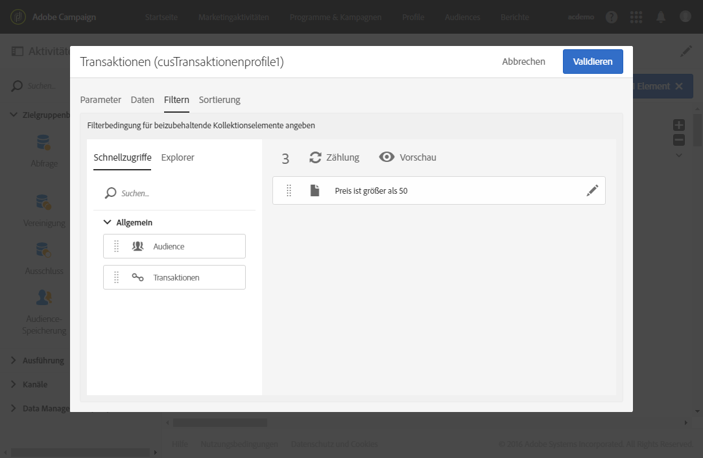

### Hinzugefügte Daten sortieren {#sorting-additional-data}

Beim Hinzufügen von Aggregaten oder Kollektionen zu Daten einer Abfrage können Sie angeben, ob Sie einen Filter - in auf- bzw. absteigender Reihenfolge - anwenden möchten, der auf dem Wert des Feldes oder des definierten Ausdrucks basiert.

Wenn Sie beispielsweise für ein Profil nur die neueste Transaktion beibehalten möchten, müssen Sie im **[!UICONTROL Parameter]**-Tab im Feld **[!UICONTROL Anzahl an auszugebenden Zeilen]** die Ziffer „1“ angeben und mithilfe des **[!UICONTROL Sortierung]**-Tabs das dem Transaktionsdatum entsprechende Feld in absteigender Reihenfolge sortieren.

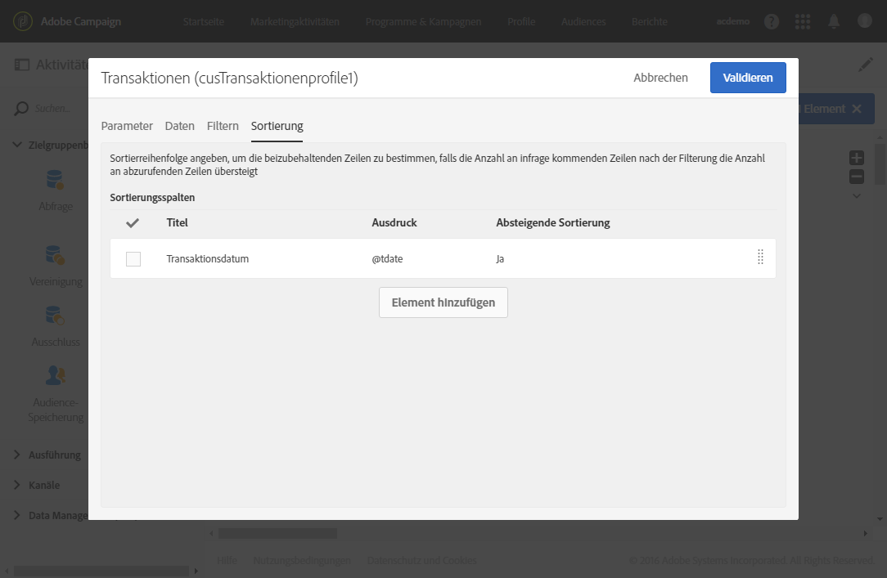

### Filtern der Zieldaten entsprechend den Zusatzdaten {#filtering-the-targeted-data-according-to-additional-data}

Im Zuge der Verwendung von Zusatzdaten erscheint in der **[!UICONTROL Abfrage]** ein neuer Tab namens **[!UICONTROL Ergebnis verfeinern]**. Dieser Tab ermöglicht es Ihnen, die im **[!UICONTROL Zielgruppe]**-Tab enthaltenen ursprünglichen Abfrageergebnisse unter Verwendung der Zusatzdaten weiter einzuschränken.

Wenn Sie beispielsweise alle Profile, die wenigstens eine Transaktion aufweisen, abgefragt und in den **[!UICONTROL Zusatzdaten]** ein Aggregat zur Berechnung des durchschnittlichen Transaktionsbetrags hinzugefügt haben, können Sie die zunächst ausgegebene Population anhand dieses Durchschnitts weiter einschränken.

Fügen Sie hierzu im Tab **[!UICONTROL Ergebnis verfeinern]** eine die Zusatzdaten betreffende Bedingung hinzu.

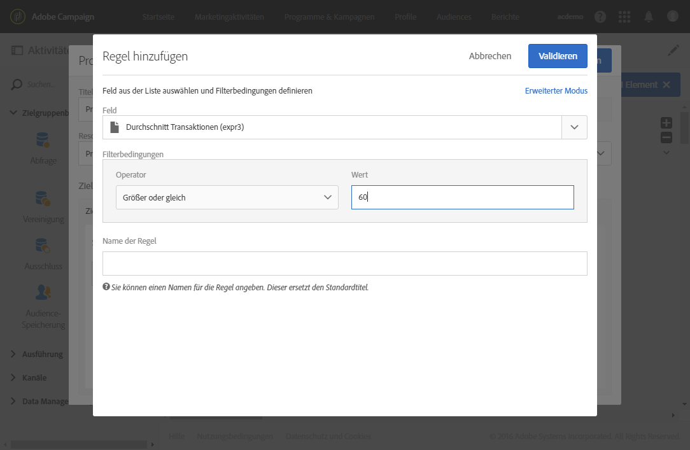

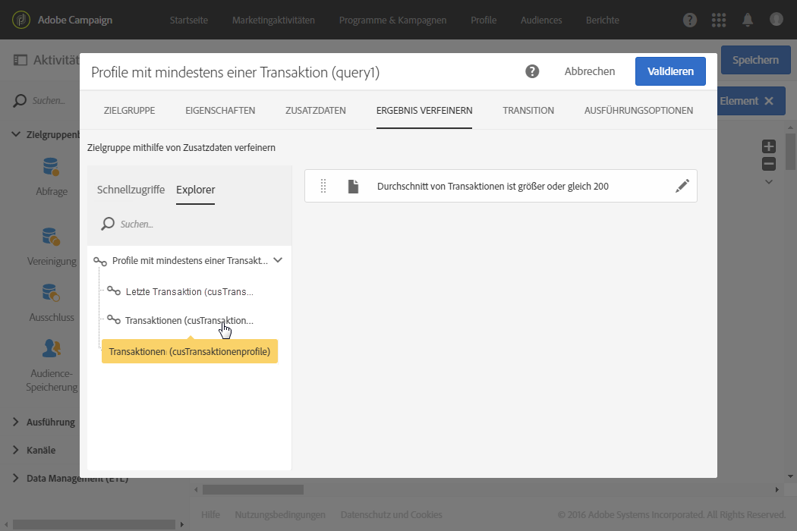
