# Abfrage{#query}

## Beschreibung {#description}

The **[!UICONTROL Query]** activity allows you to filter and extract a population of elements from the Adobe Campaign database. You can define **[!UICONTROL Additional data]** for the targeted population via a dedicated tab. Diese Daten werden in Zusatzspalten gespeichert und können ausschließlich für den laufenden Workflow verwendet werden.

Die Aktivität verwendet das Abfragetool, dessen Funktionsweise in einem [gesonderten Kapitel](../../automating/using/editing-queries.md#about-query-editor) behandelt wird.

## Anwendungskontext {#context-of-use}

The **[!UICONTROL Query]** activity can be used for various types of uses:

* Segmentierung von Populationen, um beispielsweise Zielgruppen und Audiences zu definieren;
* Anreicherung von Daten beliebiger Adobe-Campaign-Tabellen;
* Export von Daten.

## Konfiguration {#configuration}

1. Drag and drop a **[!UICONTROL Query]** activity into your workflow.
1. Markieren Sie die Aktivität und öffnen Sie sie mithilfe der im Schnellzugriff angezeigten Schaltfläche . Die Standardkonfiguration der Aktivität sieht die Suche nach Profilen vor.
1. If you would like to run a query on a resource other than the profile resource, go to the activity&#39;s **[!UICONTROL Properties]** tab and select a **[!UICONTROL Resource]** and a **[!UICONTROL Targeting dimension]**.

   The **[!UICONTROL Resource]** allows you to refine the filters displayed in the palette whereas the **[!UICONTROL Targeting dimension]**, contextual with regard to the resource selected, corresponds to the type of population that you would like to obtain (identified profiles, deliveries, data linked to the selected resource, etc.).

   Lesen Sie diesbezüglich auch den Abschnitt [Zielgruppendimensionen und Ressourcen](#targeting-dimensions-and-resources).

1. In the **[!UICONTROL Target]** tab, run your query by defining and combining rules.
1. You can define **[!UICONTROL Additional data]** for the targeted population via a dedicated tab. Diese Daten werden in Zusatzspalten gespeichert und können ausschließlich für den laufenden Workflow verwendet werden. Sie können insbesondere Daten aus Tabellen der Adobe-Campaign-Datenbank hinzufügen, die mit der Zielgruppendimension der Abfrage in Relation stehen. Lesen Sie diesbezüglich auch den Abschnitt [Daten anreichern](#enriching-data).

   >[!NOTE]
   >
   >Standardmäßig ist die **[!UICONTROL Remove duplicate rows (DISTINCT)]** Option auf der Registerkarte **[!UICONTROL Advanced options]** der **[!UICONTROL Additional data]** Abfrage aktiviert. If the **[!UICONTROL Query]** activity contains many (from 100) additional data defined, it is recommended to uncheck this option, for performance reasons. Beachten Sie jedoch, dass durch die Deaktivierung dieser Option abhängig von den abgefragten Daten Dubletten entstehen können.

1. In the **[!UICONTROL Transition]** tab, the **[!UICONTROL Enable an outbound transition]** option lets you add an outbound transition after the query activity, even if it retrieves no data.

   Der Segmentcode der ausgehenden Transition kann mit einem Standardausdruck und Ereignisvariablen personalisiert werden (siehe [Aktivitäten mit Ereignisvariablen anpassen](../../automating/using/calling-a-workflow-with-external-parameters.md#customizing-activities-with-events-variables)).

1. Validieren Sie die Konfiguration der Aktivität und speichern Sie Ihren Workflow.

## Zielgruppendimensionen und Ressourcen {#targeting-dimensions-and-resources}

Mit Zielgruppendimensionen und Ressourcen können Sie definieren, auf welchen Elementen eine Abfrage basieren soll, um die Zielgruppe eines Versands zu bestimmen.

Zielgruppendimensionen werden in Zielgruppen-Mappings definiert. Weiterführende Informationen hierzu finden Sie in [diesem Abschnitt](../../administration/using/target-mappings-in-campaign.md).

### Zielgruppendimension und Ressource einer Abfrage definieren {#defining-the-targeting-dimension-and-resource-of-a-query}

Targeting dimension and resources are defined when creating a workflow, in the **[!UICONTROL Properties]** tab of a Query activity.

>[!NOTE]
>
>Die Zielgruppendimension kann auch bei der Erstellung einer Audience definiert werden (siehe [diesen Abschnitt](../../audiences/using/creating-audiences.md)).

Zielgruppendimensionen und Ressourcen sind miteinander verknüpft. Die verfügbaren Zielgruppendimensionen hängen daher von den ausgewählten Ressourcen ab.

For example, for the Resource **[!UICONTROL Profiles (profile)]**, the following targeting dimensions will be available:

While for **[!UICONTROL Deliveries (delivery)]**, the list will contain the following targeting dimensions:

Sobald die Zielgruppendimension und die Ressource festgelegt wurden, stehen in der Abfrage unterschiedliche Filter zur Verfügung.

Example of available filters for the **[!UICONTROL Profiles (profile)]** resource:

Example of available filters for the **[!UICONTROL Deliveries (delivery)]** resource:

### Von den Zielgruppendimensionen abweichende Ressourcen verwenden {#using-resources-different-from-targeting-dimensions}

Normalerweise werden die Zielgruppendimension und die Ressource festgelegt, um Profile zu erfassen.

Manchmal kann es aber nötig sein, eine von der Zielgruppendimension abweichende Ressource zu verwenden, um einen bestimmten Datensatz in einer entfernten Tabelle zu suchen.

**Beispiel 1: Sie möchten Profile identifizieren, die im Versand mit dem Titel „Willkommen zurück!“ enthalten waren**.

* In diesem Fall möchten wir Profile erfassen. We will set the targeting dimension to **[!UICONTROL Profiles (profile)]**.
* Wir möchten die ausgewählten Profile nach dem Versandtitel filtern. We will therefore set the resource to **[!UICONTROL Delivery logs]**. Auf diese Weise filtern wir direkt in der Versandlog-Tabelle, wodurch die Ausführung beschleunigt wird.

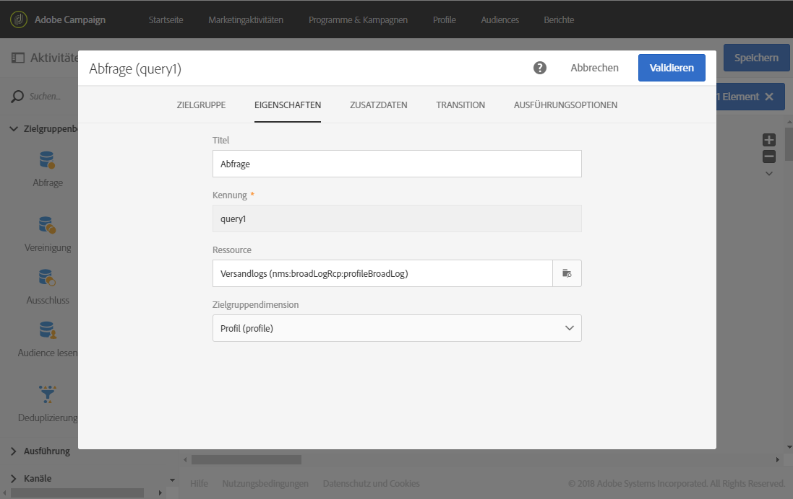

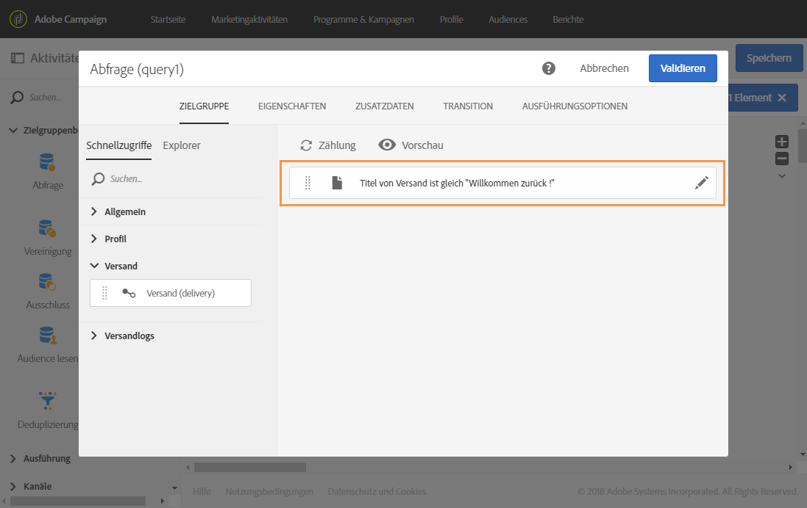

**Beispiel 2: Sie möchten Profile identifizieren, die nicht im Versand mit dem Titel &quot;Willkommen zurück!&quot; enthalten waren.**

Im vorherigen Beispiel haben wir eine von der Zielgruppendimension abweichende Ressource verwendet. Dieses Vorgehen ist nur möglich, wenn Sie einen Datensatz suchen, der in der entfernten Tabelle **vorhanden ist** (in unserem Beispiel Versandlogs).

Wenn wir einen Datensatz suchen, der in der entfernten Tabelle **nicht vorhanden** ist (z. B. Profile, die nicht in einem bestimmten Versand enthalten waren), müssen wir dieselbe Ressource und Zielgruppendimension verwenden, da der Datensatz nicht in der entfernten Tabelle (Versandlogs) vorhanden ist.

* In diesem Fall möchten wir Profile erfassen. We will set the targeting dimension to **[!UICONTROL Profiles (profile)]**.
* Wir möchten die ausgewählten Profile nach dem Versandtitel filtern. Es ist nicht möglich, direkt nach Versandlogs zu filtern, da wir nach einem Datensatz suchen, der nicht in der Versandlog-Tabelle vorhanden ist. We will therefore set the resource to **[!UICONTROL Profile (profile)]** and build our query on the profiles table.

## Daten anreichern {#enriching-data}

The **[!UICONTROL Additional data]** tab of the **[!UICONTROL Query]**, **[!UICONTROL Incremental query]** and **[!UICONTROL Enrichment]** activities allows you to enrich the data targeted and transfer this data to the following workflow activities, where it can be utilized. Insbesondere die folgenden Elemente lassen sich hinzufügen:

* einfache Daten
* Aggregate
* Kollektionen

Im Fall von Aggregaten und Kollektionen wird automatisch ein **[!UICONTROL Alias]** definiert, um komplexen Ausdrücken eine technische Kennung zuzuweisen. Dieser Alias, der eindeutig sein muss, erlaubt es, Aggregate und Kollektionen leicht zu finden. Sie können den automatisch erzeugten Alias so anpassen, dass Sie ihm einen leicht wiederzuerkennenden Namen verleihen.

>[!NOTE]
>
>Alias müssen folgende Syntax befolgen: Nur alphanumerische Zeichen und &quot;_&quot; sind zulässig. Alias beachten Groß- und Kleinschreibung. Alias müssen mit dem Zeichen &quot;@&quot; beginnen. Das direkt auf &quot;@&quot; folgende Zeichen darf keine Ziffer sein. Beispiel: @myAlias_1 und @_1Alias sind korrekt; @myAlias#1 und @1Alias sind falsch.

Nach dem Hinzufügen von Zusatzdaten können Sie die zunächst von der Abfrage ausgegebenen Daten weiter einschränken, indem Sie auf Basis der definierten Zusatzdaten Bedingungen erstellen.

>[!NOTE]
>
>Standardmäßig ist die **[!UICONTROL Remove duplicate rows (DISTINCT)]** Option auf der Registerkarte **[!UICONTROL Advanced options]** der **[!UICONTROL Additional data]** Abfrage aktiviert. If the **[!UICONTROL Query]** activity contains many (from 100) additional data defined, it is recommended to uncheck this option, for performance reasons. Beachten Sie jedoch, dass durch die Deaktivierung dieser Option abhängig von den abgefragten Daten Dubletten entstehen können.

### Einfaches Feld hinzufügen {#adding-a-simple-field}

Das Hinzufügen eines einfachen Felds als Zusatzdatenelement macht ersteres direkt in der ausgehenden Transition der Aktivität sichtbar. Dadurch lässt sich beispielsweise überprüfen, ob die aus der Abfrage hervorgehenden Daten Ihren Vorstellungen entsprechen.

1. From the **[!UICONTROL Additional data]** tab, add a new element.
1. In the window that opens, in the **[!UICONTROL Expression]** field, select one of the fields available directly in the targeting dimension or in one of the linked dimensions. Sie haben die Möglichkeit, auf Felder der Dimension bezogene Ausdrücke zu bearbeiten und Funktionen anzuwenden oder einfache Berechnungen (außer Aggregate) vorzunehmen.

   Ein **[!UICONTROL Alias]** wird automatisch erstellt, wenn Sie einen Ausdruck bearbeiten, der kein einfacher XPATH ist (zum Beispiel: &quot;Year(&lt;@birthDate>)&quot;). Dieser kann bei Bedarf angepasst werden. Wenn Sie nur ein Feld (z. B. &quot;@age&quot;) wählen, ist es nicht erforderlich, einen **[!UICONTROL Alias]** zu definieren.

1. Select **[!UICONTROL Add]** to confirm adding the field to the additional data. Im Zuge der Abfragenausführung wird in der ausgehenden Transition der Aktivität eine dem hinzugefügten Feld entsprechende zusätzliche Spalte angezeigt.

### Aggregat hinzufügen {#adding-an-aggregate}

Aggregate dienen der Berechnung von Werten, die auf Feldern der Zielgruppendimension oder auf Feldern aus mit der Zielgruppendimension in Relation stehenden Dimensionen basieren. Zum Beispiel: der Durchschnitt der von einem Profil erteilten Bestellungen.
Bei Verwendung von Aggregat mit Abfrage kann die Funktion auf null zurückgesetzt werden, was dann als NULL gilt. Verwenden Sie die **[!UICONTROL Output filtering]** Registerkarte Ihrer Abfrage, um den aggregierten Wert zu filtern:

* Wenn Sie Nullwerte verwenden möchten, sollten Sie nach diesen Werten filtern **[!UICONTROL is null]**.
* wenn Sie keine Nullwerte filtern möchten **[!UICONTROL is not null]**.

Beachten Sie, dass Sie, wenn Sie eine Sortierung auf Ihr Aggregat anwenden müssen, Nullwerte herausfiltern sollten. Andernfalls wird der NULL-Wert als die höchste Zahl angezeigt.

1. From the **[!UICONTROL Additional data]** tab, add a new element.
1. In the window that opens, select the collection that you want to use to create your aggregate in the **[!UICONTROL Expression]** field.

   An **[!UICONTROL Alias]** is created automatically. If you like, you can modify it by going back to the query&#39;s **[!UICONTROL Additional data]** tab.

   Das Fenster zur Aggregatdefinition öffnet sich.

1. Define an aggregate from the **[!UICONTROL Data]** tab. Depending on the type of aggregate selected, only the elements whose data is compatible are available in the **[!UICONTROL Expression]** field. Beispielsweise lässt sich eine Summe ausschließlich mit numerischen Daten berechnen.

   

   Es besteht die Möglichkeit, mehrere, sich auf Felder der ausgewählten Kollektion beziehende Aggregate hinzuzufügen. Stellen Sie sicher, dass die vergebenen Titel eine korrekte Unterscheidung der verschiedenen Spalten in der Detailansicht der Daten in der ausgehenden Transition ermöglichen.

   Es besteht außerdem die Möglichkeit, die automatisch für jedes Aggregat erzeugten Alias anzupassen.

   

1. Bei Bedarf können Sie einen Filter hinzufügen, um die zu berücksichtigenden Daten zu begrenzen.

   Lesen Sie diesbezüglich auch den Abschnitt [Hinzugefügte Daten filtern](#filtering-added-data).

1. Select **[!UICONTROL Confirm]** to add aggregates.

>[!NOTE]
>
>You cannot create an expression containing an aggregate directly from the **[!UICONTROL Expression]** field of the **[!UICONTROL New additional data]** window.

### Kollektion hinzufügen {#adding-a-collection}

1. From the **[!UICONTROL Additional data]** tab, add a new element.
1. In the window that opens, select the collection that you want to add in the **[!UICONTROL Expression]** field. An **[!UICONTROL Alias]** is created automatically. If you like, you can modify it by going back to the query&#39;s **[!UICONTROL Additional data]** tab.
1. Auswählen **[!UICONTROL Add]**. Im sich öffnenden Fenster haben Sie die Möglichkeit, die Kollektionsdaten, die Sie anzeigen möchten, zu verfeinern.
1. Wählen Sie auf der **[!UICONTROL Parameters]** Registerkarte die gewünschten Zeilen der Sammlung aus **[!UICONTROL Collection]** und definieren Sie sie. Wenn Sie z. B. die drei letzten Käufe pro Profil abrufen möchten, geben Sie in das **[!UICONTROL Number of lines to return]** Feld &quot;3&quot;ein.

   >[!NOTE]
   >
   >Nur Ziffern größer oder gleich 1 sind zulässig.

1. From the **[!UICONTROL Data]** tab, define the fields of the collection that you want to display for each line.

   

1. Bei Bedarf können Sie einen Filter hinzufügen, um die zu berücksichtigenden Zeilen der Kollektion zu begrenzen.

   Lesen Sie diesbezüglich auch den Abschnitt [Hinzugefügte Daten filtern](#filtering-added-data).

1. Bei Bedarf können Sie eine Sortierung für die Daten definieren.

   For example, if you have selected 3 lines to return in the **[!UICONTROL Parameters]** tab, and you want to determine the three most recent purchases, you can define a descending sort on the &quot;date&quot; field of the collection that corresponds to the transactions.

1. Lesen Sie diesbezüglich auch den Abschnitt [Hinzugefügte Daten sortieren](#sorting-additional-data).
1. Select **[!UICONTROL Confirm]** to add the collection.

### Hinzugefügte Daten filtern {#filtering-added-data}

Beim Hinzufügen von Aggregaten oder Kollektionen besteht die Möglichkeit, einen zusätzlichen Filter zu bestimmen, um die Daten, die Sie angezeigt bekommen wollen, zu begrenzen.

Wenn Sie beispielsweise nur die Zeilen einer Transaktionskollektion abrufen möchten, bei denen der Transaktionsbetrag 50 Euro übersteigt, können Sie im **[!UICONTROL Filter]**-Tab für das dem Transaktionsbetrag entsprechende Feld eine Bedingung hinzufügen.

### Hinzugefügte Daten sortieren {#sorting-additional-data}

Beim Hinzufügen von Aggregaten oder Kollektionen zu Daten einer Abfrage können Sie angeben, ob Sie einen Filter - in auf- bzw. absteigender Reihenfolge - anwenden möchten, der auf dem Wert des Feldes oder des definierten Ausdrucks basiert.

For example, if you want to save only the transaction that was carried out most recently by a profile, enter &quot;1&quot; in the **[!UICONTROL Number of lines to return]** field of the **[!UICONTROL Parameters]** tab, and apply a descending sort on the field corresponding to the transaction date via the **[!UICONTROL Sort]** tab.

### Abgefragte Daten unter Verwendung von Zusatzdaten filtern {#filtering-the-targeted-data-according-to-additional-data}

Once you have added additional data, a new **[!UICONTROL Output filtering]** tab appears in the **[!UICONTROL Query]**. This tab allows you to apply an additional filter on the data initially targeted in the **[!UICONTROL Target]** tab, by taking into account the added data.

For example, if you have targeted all of the profiles that carried out at least one transaction and an aggregate calculating the average transaction amount carried out for each profile was added to the **[!UICONTROL Additional data]**, you can refine the population initially calculated using this average.

To do this, in the **[!UICONTROL Output filtering]** tab, simply add a condition on this additional data.

### Beispiel: E-Mail mit Zusatzdaten personalisieren {#example--personalizing-an-email-with-additional-data}

Das folgende Beispiel zeigt die Hinzufügung verschiedener Zusatzdatentypen zu einer Abfrage und die Verwendung von Zusatzdaten in Form von Personalisierungsfeldern in einer E-Mail.

Für dieses Beispiel werden diverse [benutzerdefinierte Ressourcen](../../developing/using/data-model-concepts.md) verwendet:

* Die **Profil**-Ressource wurde erweitert, um ein Feld hinzuzufügen, das die Speicherung von Treuepunkten für jedes Profil ermöglicht.
* Eine **Transaktionen**-Ressource wurde erstellt. Sie enthält alle von den in der Datenbank enthaltenen Profilen getätigten Bestellungen. Für jede Transaktion wird ihr Datum, der bestellte Artikel und sein Preis gespeichert.
* Eine **Artikel**-Ressource wurde erstellt. Sie enthält alle zum Verkauf stehenden Artikel.

Ziel ist es, eine E-Mail an all jene Profile zu senden, für die mindestens eine Transaktion gespeichert wurde. In dieser E-Mail werden den Kunden die letzte von ihnen getätigte Transaktion sowie diverse Informationen zu allen bisher erfolgten Transaktionen in Erinnerung gerufen: Anzahl an bestellten Artikeln, Gesamtbetrag, Anzahl an bereits gesammelten Treuepunkten.

Der Workflow stellt sich folgendermaßen dar:

1. Add a **[!UICONTROL Query]** activity, which allows you to target the profiles that have carried out at least one transaction.

   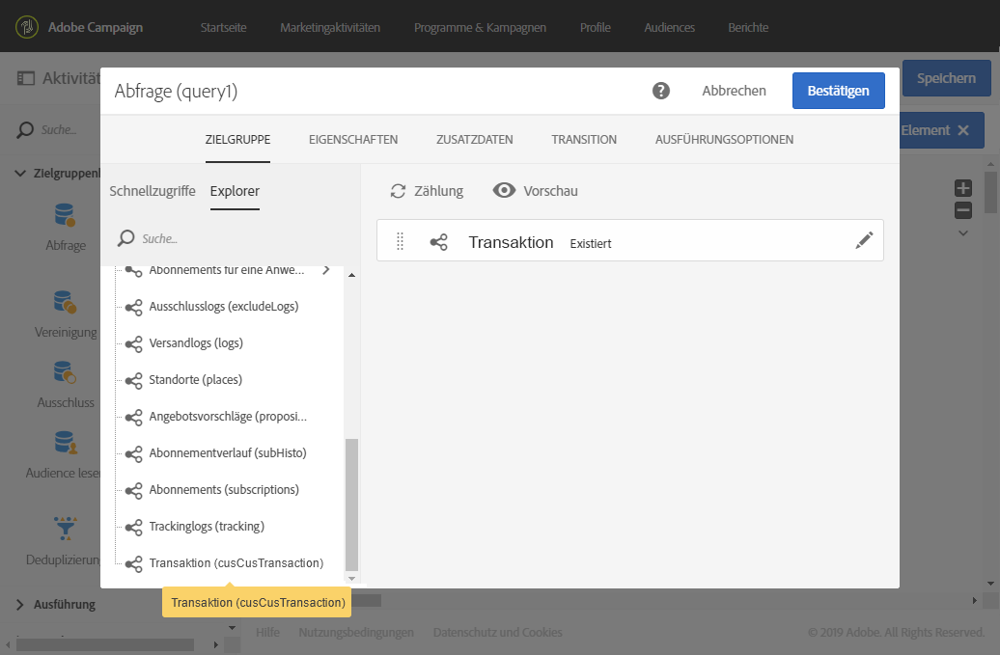

   From the query&#39;s **[!UICONTROL Additional data]** tab, define the different data to be displayed in the final email:

   * Treuepunkte anhand eines einfachen Felds aus der Dimension **Profile.** Lesen Sie diesbezüglich auch den Abschnitt [Einfaches Feld hinzufügen](#adding-a-simple-field).
   * Die Anzahl an bestellten Artikeln und der Gesamtbetrag anhand von zwei auf der Transaktionskollektion basierenden Aggregaten. You can add them from the **[!UICONTROL Data]** tab of the aggregate configuration window, using the **Count** and **Sum** aggregates. Lesen Sie diesbezüglich auch den Abschnitt [Aggregat hinzufügen](#adding-an-aggregate).
   * Betrag, Datum und Artikel der letzten Transaktion, die anhand einer Kollektion ermittelt werden.

      To do this, you have to add the different fields that you want to display from the **[!UICONTROL Data]** tab of the collection configuration window.

      To return only the most recent transaction, you have to enter &quot;1&quot; for the **[!UICONTROL Number of lines to return]** and apply a descending sort on the **Date** field of the collection from the **[!UICONTROL Sort]** tab.

      Lesen Sie diesbezüglich auch die Abschnitte [Kollektion hinzufügen](#adding-a-collection) und [Hinzugefügte Daten sortieren](#sorting-additional-data).
   

   If you would like to check that the data is correctly transferred by the activity&#39;s outbound transition, start the workflow for the first time (without the **[!UICONTROL Email delivery]** activity) and open the query&#39;s outbound transition.

   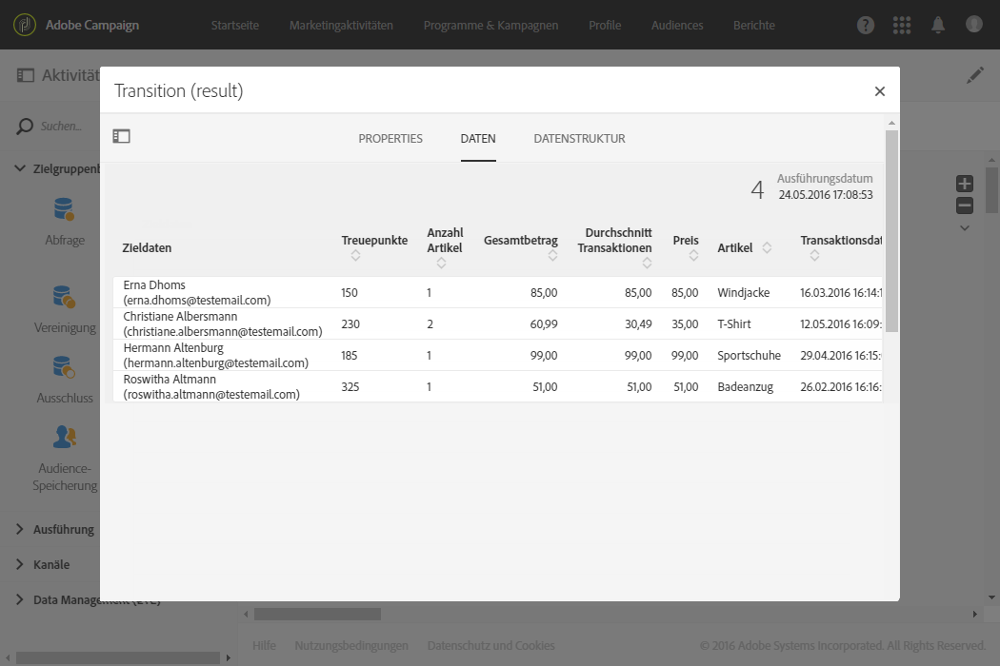

1. Hinzufügen eine **[!UICONTROL Email delivery]** Aktivität. Verwenden Sie im E-Mail-Inhalt die Personalisierungsfelder, die den in der Abfrage berechneten Daten entsprechen. You can find it via the **[!UICONTROL Additional data (targetData)]** link of the personalization fields explorer.

   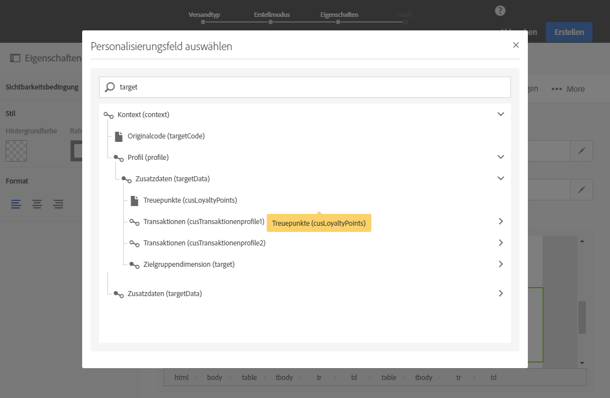

Ihr Workflow kann nun ausgeführt werden. Die mithilfe der Abfrage abgerufenen Profile erhalten eine personalisierte E-Mail mit den ihren Transaktionen entsprechenden Daten.

## Beispiele für Abfragen {#query-samples}

### Abfrage nach einfachen Profilattributen {#targeting-on-simple-profile-attributes}

Das folgende Beispiel zeigt eine Abfrage von Männern zwischen 18 und 30 Jahren, die in London leben.

### Abfrage nach E-Mail-Attributen {#targeting-on-email-attributes}

Das folgende Beispiel zeigt eine Abfrage von Profilen, deren E-Mail-Adressen-Domain &quot;orange.co.uk&quot; lautet.

Das folgende Beispiel zeigt eine Abfrage von Profilen, deren E-Mail-Adresse vorhanden ist.

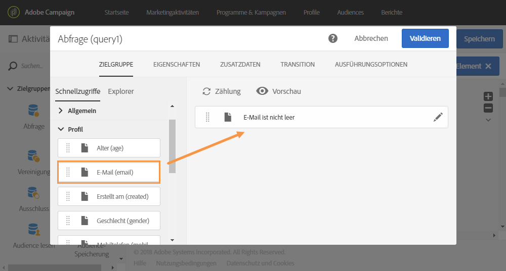

### Abfrage von Profilen, deren Geburtstag heute ist {#targeting-profiles-whose-birthday-is-today}

Das folgende Beispiel zeigt eine Abfrage von Profilen, deren Geburtstag heute ist.

1. Drag the **[!UICONTROL Birthday]** filter in your query.

   

1. Legen Sie **[!UICONTROL Filter type]** auf **[!UICONTROL Relative]** und wählen Sie **[!UICONTROL Today]**.

   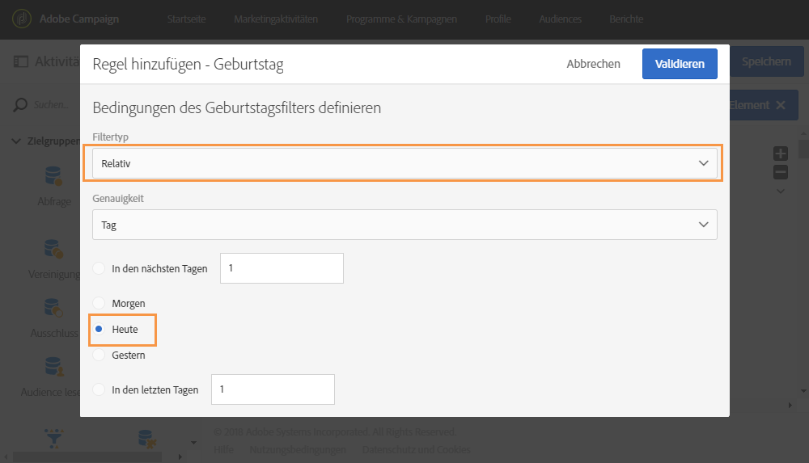

### Abfrage von Profilen, die einen bestimmten Versand geöffnet haben {#targeting-profiles-who-opened-a-specific-delivery}

Das folgende Beispiel zeigt eine Abfrage von Profilen, die den Versand mit dem Titel &quot;Sommerzeit&quot; geöffnet haben.

1. Drag the **[!UICONTROL Opened]** filter in your query.

   

1. Select the delivery then click **[!UICONTROL Confirm]**.

   

### Abfrage von Profilen, für die Sendungen aus einem bestimmten Grund fehlgeschlagen sind {#targeting-profiles-for-whom-deliveries-failed-for-a-specific-reason}

Das folgende Beispiel zeigt eine Abfrage von Profilen, für die Sendungen fehlgeschlagen sind, weil ihr Posteingang voll war. This query is only available for users with administration rights and belonging to the **[!UICONTROL All (all)]** organizational units (see [this section](../../administration/using/organizational-units.md)).

1. Select the **[!UICONTROL Delivery logs]** resource in order to filter directly in the delivery log table (see [Using resources different from targeting dimensions](#using-resources-different-from-targeting-dimensions)).

   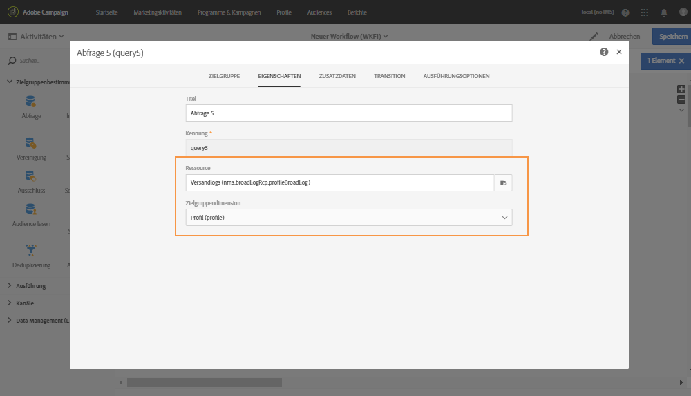

1. Drag the **[!UICONTROL Nature of failure]** filter in your query.

   

1. Wählen Sie den entsprechenden Fehlertyp aus. In unserem Fall **[!UICONTROL Mailbox full]**.

   

### Abfrage von Profilen, die in den letzten sieben Tagen nicht kontaktiert wurden {#targeting-profiles-not-contacted-during-the-last-7-days}

Das folgende Beispiel zeigt eine Abfrage von Profilen, die in den letzten sieben Tagen nicht kontaktiert wurden.

1. Drag the **[!UICONTROL Delivery logs (logs)]** filter in your query.

   

   Wählen Sie **[!UICONTROL Does not exist]** in der Dropdown-Liste aus und ziehen Sie dann den **[!UICONTROL Delivery]** Filter.

   

1. Konfigurieren Sie den Filter wie unten beschrieben.

   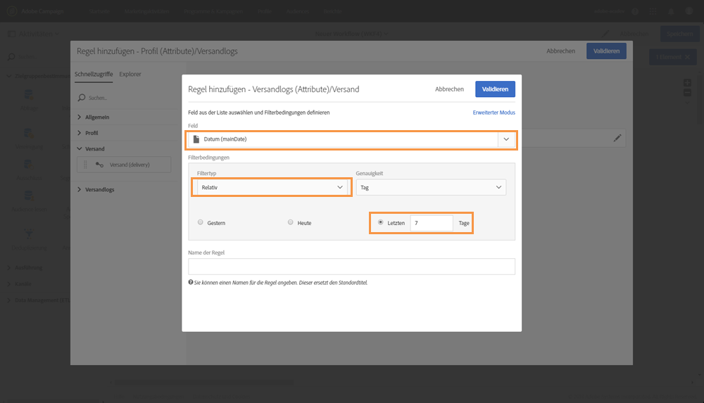

### Abfrage von Profilen, die auf einen bestimmten Link geklickt haben {#targeting-profiles-who-clicked-a-specific-link-}

1. Drag the **[!UICONTROL Tracking logs (tracking)]** filter in your query.

   

1. Ziehen Sie den **[!UICONTROL Label (urlLabel)]** Filter.

   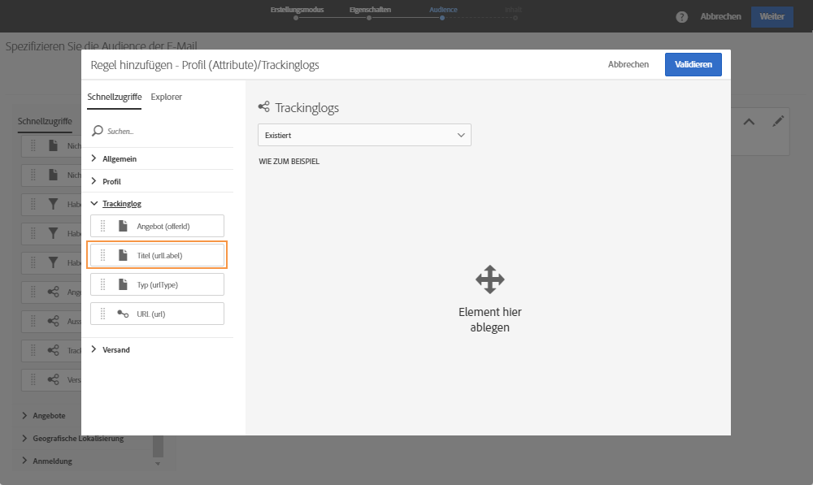

1. In the **[!UICONTROL Value]** field, type the label that was defined when inserting the link in the delivery, then confirm.

   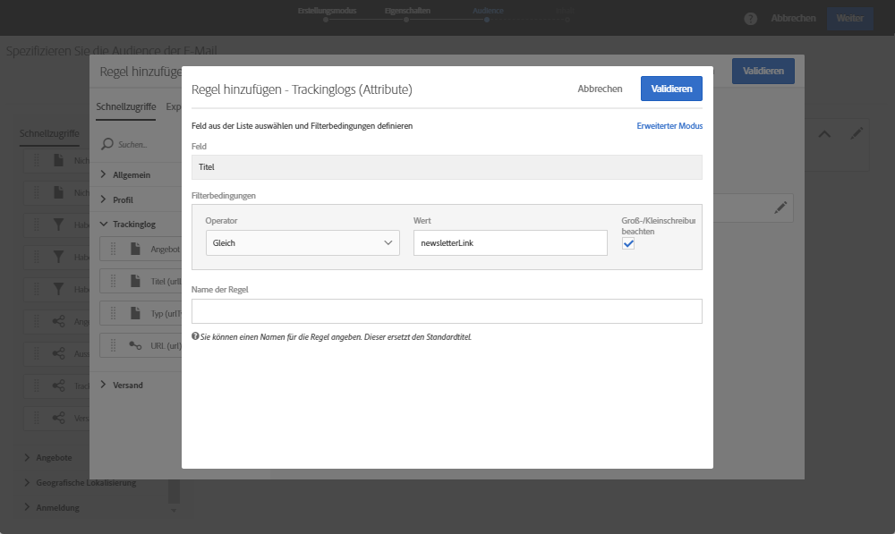

