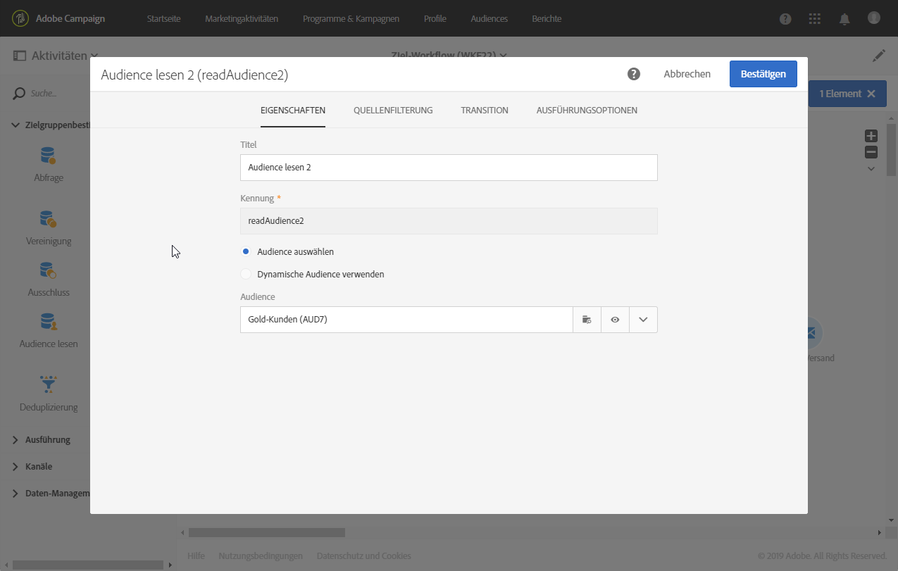

# Zielgruppe lesen{#read-audience}

## Beschreibung {#description}

Die Aktivität **[!UICONTROL Zielgruppe lesen]** ermöglicht es Ihnen, eine vorhandene Zielgruppe abzurufen und sie durch zusätzliche Filterbedingungen einzuengen.

## Anwendungskontext {#context-of-use}

Die Aktivität **[!UICONTROL Zielgruppe lesen]** ist eine einfachere Version der **[!UICONTROL Abfrage]**-Aktivität und eignet sich für Fälle, in denen Sie nur eine bestehende Zielgruppe auswählen müssen.

**Verwandte Themen**

* [Anwendungsfall: Vereinigung von zwei eingegrenzten Zielgruppen](../../automating/using/union-on-two-refined-audiences.md)
* [Anwendungsfall: Eine Zielgruppe vom Typ &quot;Datei&quot; mit der Datenbank abstimmen](../../automating/using/reconcile-file-audience-with-database.md)

## Konfiguration {#configuration}

1. Ziehen Sie eine **[!UICONTROL Zielgruppe lesen]**-Aktivität in den Workflow-Arbeitsbereich.
1. Markieren Sie die Aktivität und öffnen Sie sie mithilfe der in der Schnellaktion angezeigten Schaltfläche .
1. Wählen Sie die Zielgruppe, die Sie abrufen möchten, im Tab **[!UICONTROL Eigenschaften]** aus.

   Sie können die folgenden Typen von Audiences abrufen: **[!UICONTROL Liste]**, **[!UICONTROL Abfrage]**, **[!UICONTROL Datei]** und **[!UICONTROL Experience Cloud]**. Lesen Sie für weiterführende Informationen das [Zielgruppe-Handbuch](../../audiences/using/about-audiences.md).

   Mit der Option **[!UICONTROL Dynamische Zielgruppe verwenden]** können Sie den Namen der jeweiligen Zielgruppe auf der Basis der Ereignisvariablen des Workflows definieren. Weitere Informationen hierzu finden Sie auf [dieser Seite](../../automating/using/customizing-workflow-external-parameters.md).

   

1. Wenn Sie an die ausgewählte Zielgruppe weitere Filter anlegen möchten, fügen Sie Bedingungen über den Tab **[!UICONTROL Quellenfilterung]** der Aktivität hinzu.

   Weiterführende Informationen zur Erstellung von Filterbedingungen finden Sie im Abschnitt [Vorlagen erstellen](../../automating/using/editing-queries.md#creating-queries).

1. Validieren Sie die Konfiguration der Aktivität und speichern Sie Ihren Workflow.
