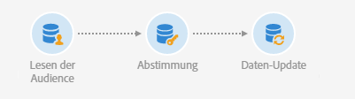

# Audience lesen{#read-audience}

## Beschreibung {#description}


Die Aktivität **[!UICONTROL Lesen der Audience]** ermöglicht es Ihnen, eine vorhandene Audience abzurufen und sie durch zusätzliche Filterbedingungen einzuengen.

## Anwendungskontext {#context-of-use}

Die Aktivität **[!UICONTROL Lesen der Audience]** ist eine einfachere Version der **[!UICONTROL Abfrage]**-Aktivität und eignet sich für Fälle, in denen Sie nur eine bestehende Audience auswählen müssen.

## Konfiguration {#configuration}

1. Ziehen Sie eine **[!UICONTROL Lesen der Audience]**-Aktivität in den Workflow-Arbeitsbereich.
1. Markieren Sie die Aktivität und öffnen Sie sie mithilfe der 
1. Wählen Sie die Audience, die Sie abrufen möchten, im Tab **[!UICONTROL Eigenschaften]** aus.

   Sie können die folgenden Typen von Audiences abrufen: **[!UICONTROL Liste]**, **[!UICONTROL Abfrage]**, **[!UICONTROL Datei]** und **[!UICONTROL Experience Cloud]**. Lesen Sie für weiterführende Informationen das [Audience-Handbuch](../../audiences/using/about-audiences.md).

   Mit der Option **[!UICONTROL Dynamische Audience verwenden]** können Sie den Namen der jeweiligen Audience auf der Basis der Ereignisvariablen des Workflows definieren. Weiterführende Informationen dazu finden Sie im Abschnitt [Aktivitäten mit Ereignisvariablen anpassen](../../automating/using/calling-a-workflow-with-external-parameters.md#customizing-activities-with-events-variables).

   

1. Wenn Sie an die ausgewählte Audience weitere Filter anlegen möchten, fügen Sie Bedingungen über den Tab **[!UICONTROL Quellenfilterung]** der Aktivität hinzu.

   Weiterführende Informationen zur Erstellung von Filterbedingungen finden Sie im Abschnitt [Vorlagen erstellen](../../automating/using/editing-queries.md#creating-queries).

1. Validieren Sie die Konfiguration der Aktivität und speichern Sie Ihren Workflow.

## Beispiel: Eine Audience vom Typ Datei mit der Datenbank abstimmen   {#example--reconcile-a-file-audience-with-the-database}

In diesem Beispiel wird gezeigt, wie die Aktivität **[!UICONTROL Lesen der Audience]** verwendet werden kann, um eine direkt von einem Dateiimport erstellte Audience abzustimmen.

Wenn Sie eine Datei importieren, können Sie ihren Inhalt direkt in einer Audience speichern. Diese Audience ist eine Audience des Typs Datei und mit keiner Datenbank-Ressource verknüpft.

Der Import-Workflow läuft folgendermaßen ab:


* Eine [Datei laden](../../automating/using/load-file.md)-Aktivität lädt eine Datei mit Profildaten hoch, die aus einem externen Tool extrahiert wurden.

   Beispiel:

   ```
   lastname;firstname;birthdate;email;crmID
   Smith;Hayden;23/05/1989;hayden.smith@example.com;124365
   Mars;Daniel;17/11/1987;dannymars@example.com;123545
   Smith;Clara;08/02/1989;hayden.smith@example.com;124567
   Durance;Allison;15/12/1978;allison.durance@example.com;120987
   Lucassen;Jody;28/03/1988;jody.lucassen@example.com;127634
   Binder;Tom;19/01/1982;tombinder@example.com;128653
   Binder;Tommy;19/01/1915;tombinder@example.com;134576
   Connor;Jade;10/10/1979;connor.jade@example.com;132452
   Mack;Clarke;02/03/1985;clarke.mack@example.com;149876
   Ross;Timothy;04/07/1986;timross@example.com;157643
   ```

* Mit der Aktivität [Audience-Speicherung](../../automating/using/save-audience.md) werden die eigehenden Daten als Audience gespeichert. Da die Daten noch nicht abgestimmt wurden, ist diese Audience eine Audience vom Typ Datei, deren Daten noch nicht als Profildaten erkannt werden.

Der Abstimmungs-Workflow läuft folgendermaßen ab:



* Mit der Aktivität **[!UICONTROL Lesen der Audience]** wird die im Import-Workflow erstellte Datei-Audience hochgeladen. Die Audience-Daten wurden noch nicht mit der Adobe-Campaign-Datenbank abgestimmt.
* In der Aktivität [Abstimmung](../../automating/using/reconciliation.md) werden die eingehenden Daten im Tab **[!UICONTROL Identifizierung]** als Profile identifiziert. Beispielsweise kann das **E-Mail**-Feld als Abstimmungskriterium verwendet werden.
* Durch die Aktivität [Daten-Update](../../automating/using/update-data.md) werden die eingehenden Daten eingefügt und die Profil-Ressource der Datenbank entsprechend aktualisiert. Da die Daten bereits als Profile identifiziert wurden, können Sie die Option **[!UICONTROL Über die Zielgruppendimension]** und danach **[!UICONTROL Profile]** im Tab **[!UICONTROL Identifizierung]** der Aktivität auswählen. Fügen Sie danach einfach die Liste der Felder hinzu, die im jeweiligen Tab zu aktualisieren sind.

## Beispiel: Vereinigung von zwei eingeschränkten Audiences   {#example--union-on-two-refined-audiences}

In diesem Beispiel werden im Workflow zwei **[!UICONTROL Lesen der Audience]**-Aktivitäten vereint. Ziel dieses Workflows ist es, eine E-Mail an Gold- oder Silber-Mitglieder zu senden, die zwischen 18 und 30 Jahre alt sind.

Spezifische Audiences wurden im System bereits erstellt, um Gold- und Silber-Mitglieder zu erfassen.

Der Workflow setzt sich folgendermaßen zusammen:


* Eine erste **[!UICONTROL Lesen der Audience]**-Aktivität ruft die Audience der Gold-Mitglieder ab und schränkt sie ein, indem nur Profile zwischen 18 und 30 Jahren ausgewählt werden.
* Eine zweite **[!UICONTROL Lesen der Audience]**-Aktivität ruft die Audience der Silber-Mitglieder ab und schränkt sie ein, indem nur Profile zwischen 18 und 30 Jahren ausgewählt werden.
* Die Aktivität **[!UICONTROL Vereinigung]** fasst die Populationen der beiden **[!UICONTROL Lesen der Audience]**-Aktivitäten zu einer endgültigen Population zusammen.
* Die Aktivität **[!UICONTROL E-Mail-Versand]** sendet E-Mails an die Population der Aktivität **[!UICONTROL Vereinigung]**.

