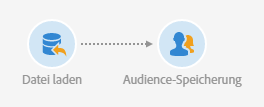
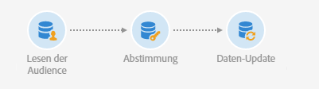

# Eine Audience vom Typ &quot;Datei&quot; mit der Datenbank abstimmen {#example--reconcile-a-file-audience-with-the-database}

In diesem Beispiel wird gezeigt, wie die Aktivität **[!UICONTROL Audience lesen]** verwendet werden kann, um eine direkt von einem Dateiimport erstellte Audience abzustimmen.

Wenn Sie eine Datei importieren, können Sie ihren Inhalt direkt in einer Audience speichern. Diese Audience ist eine Audience des Typs Datei und mit keiner Datenbank-Ressource verknüpft.

Der Import-Workflow läuft folgendermaßen ab:



* Eine [Datei laden](../../automating/using/load-file.md)-Aktivität lädt eine Datei mit Profildaten hoch, die aus einem externen Tool extrahiert wurden.

   Beispiel:

   ```
   lastname;firstname;birthdate;email;crmID
   Smith;Hayden;23/05/1989;hayden.smith@example.com;124365
   Mars;Daniel;17/11/1987;dannymars@example.com;123545
   Smith;Clara;08/02/1989;hayden.smith@example.com;124567
   Durance;Allison;15/12/1978;allison.durance@example.com;120987
   Lucassen;Jody;28/03/1988;jody.lucassen@example.com;127634
   Binder;Tom;19/01/1982;tombinder@example.com;128653
   Binder;Tommy;19/01/1915;tombinder@example.com;134576
   Connor;Jade;10/10/1979;connor.jade@example.com;132452
   Mack;Clarke;02/03/1985;clarke.mack@example.com;149876
   Ross;Timothy;04/07/1986;timross@example.com;157643
   ```

* Mit der Aktivität [Audience-Speicherung](../../automating/using/save-audience.md) werden die eigehenden Daten als Audience gespeichert. Da die Daten noch nicht abgestimmt wurden, ist diese Audience eine Audience vom Typ Datei, deren Daten noch nicht als Profildaten erkannt werden.

Der Abstimmungs-Workflow läuft folgendermaßen ab:



* Mit der Aktivität [Audience lesen](../../automating/using/read-audience.md) wird die im Import-Workflow erstellte Datei-Audience hochgeladen. Die Audience-Daten wurden noch nicht mit der Adobe-Campaign-Datenbank abgestimmt.
* In der Aktivität [Abstimmung](../../automating/using/reconciliation.md) werden die eingehenden Daten im Tab **[!UICONTROL Identifizierung]** als Profile identifiziert. Beispielsweise kann das **E-Mail**-Feld als Abstimmungskriterium verwendet werden.
* Durch die Aktivität [Daten-Update](../../automating/using/update-data.md) werden die eingehenden Daten eingefügt und die Profil-Ressource der Datenbank entsprechend aktualisiert. Da die Daten bereits als Profile identifiziert wurden, können Sie die Option **[!UICONTROL Über die Zielgruppendimension]** und danach **[!UICONTROL Profile]** im Tab **[!UICONTROL Identifizierung]** der Aktivität auswählen. Fügen Sie danach einfach die Liste der Felder hinzu, die im jeweiligen Tab zu aktualisieren sind.
