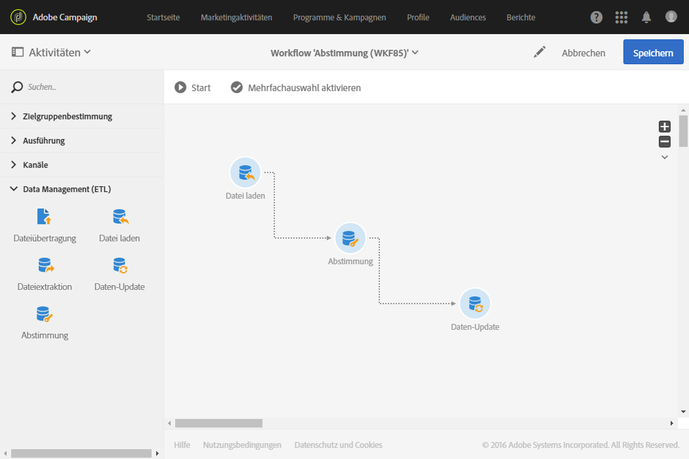
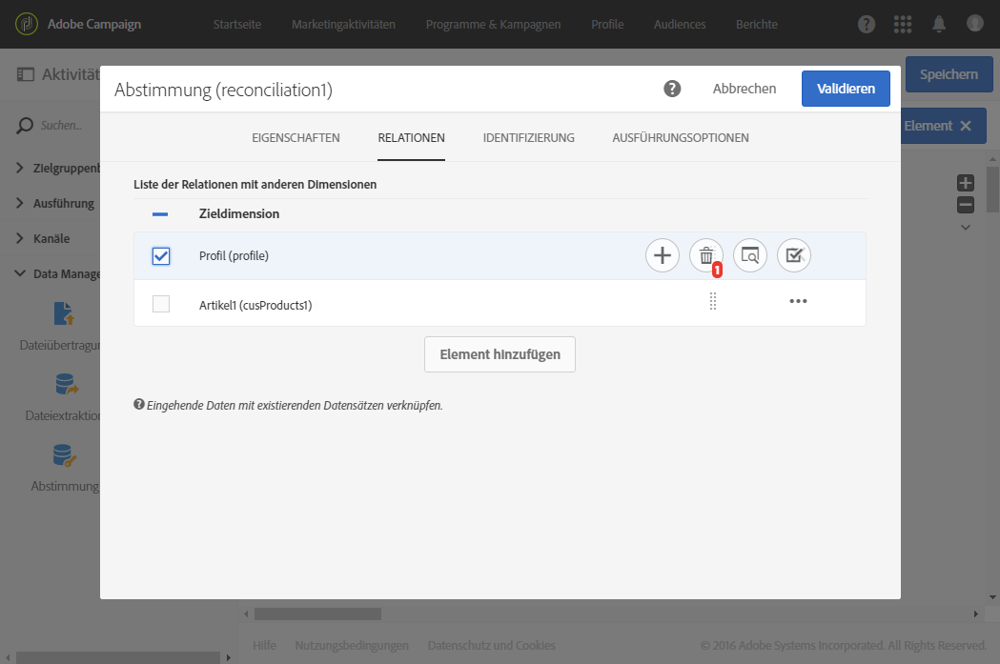
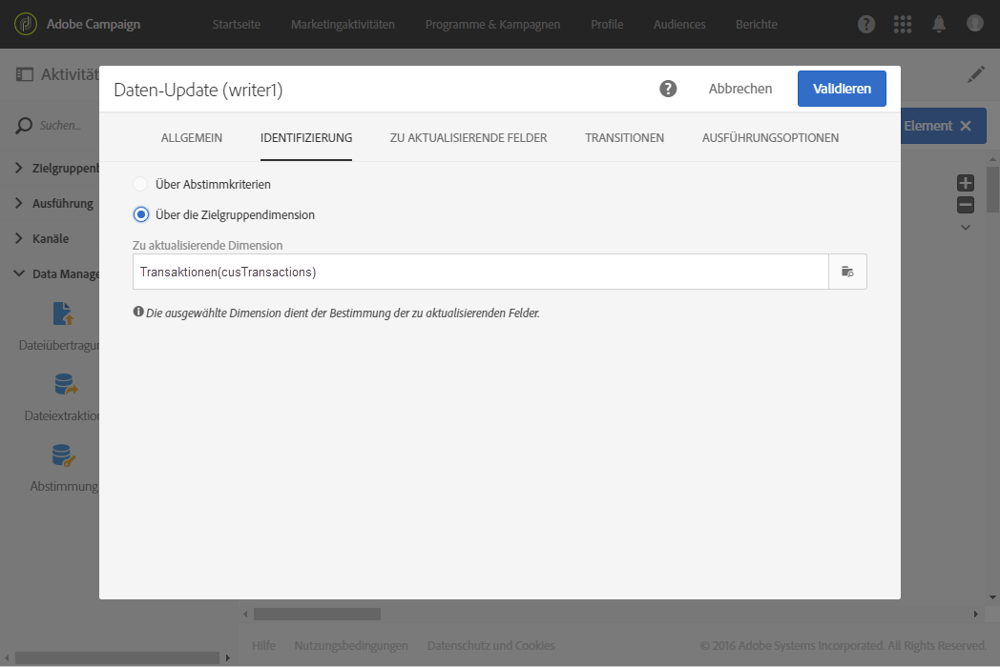
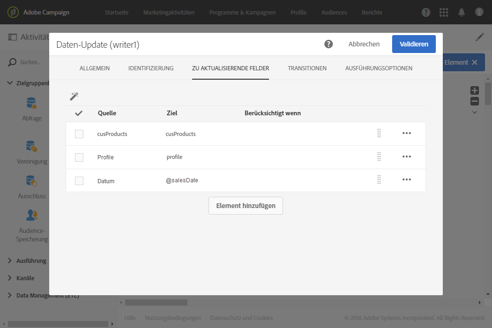

# Datenabstimmung mithilfe von Relationen {#reconciliation-relations}

Das folgende Beispiel zeigt einen Workflow zur Aktualisierung der Datenbankdaten anhand von in einer Datei enthaltenen, den Verkauf betreffenden Daten. Die Verkaufsinformationen enthalten Daten, die Elemente anderer Dimensionen wie z. B. die E-Mail von Kunden oder Artikelnummern referenzieren.

>[!NOTE]
>
>Die für dieses Beispiel verwendeten Ressourcen **Transaktionen** und **Artikel** sind nicht standardmäßig in Adobe Campaign enthalten. Sie sind also im Voraus mittels der Funktion [Benutzerdefinierte Ressourcen](../../developing/using/data-model-concepts.md) erstellt worden. Sowohl die den E-Mail-Adressen der importierten Datei entsprechenden Profile als auch die Produkte wurden im Voraus in die Datenbank geladen.

Der Workflow besteht aus folgenden Aktivitäten:



* [Datei laden](../../automating/using/load-file.md) zum Laden und Erkennen der Daten der zu importierenden Datei. Die importierte Datei enthält folgende Daten:

   * Transaktionsdatum
   * E-Mail-Adresse des Kunden
   * Artikelnummer des gekauften Produkts

   ```
   date;client;product
   2015-05-19 09:00:00;mail1@email.com;ZZ1
   2015-05-19 09:01:00;mail2@email.com;ZZ2
   2015-05-19 09:01:01;mail3@email.com;ZZ2
   2015-05-19 09:01:02;mail4@email.com;ZZ2
   2015-05-19 09:02:00;mail5@email.com;ZZ3
   2015-05-19 09:03:00;mail6@email.com;ZZ4
   2015-05-19 09:04:00;mail7@email.com;ZZ5
   2015-05-19 09:05:00;mail8@email.com;ZZ7
   2015-05-19 09:06:00;mail9@email.com;ZZ6
   ```

* [Abstimmung](../../automating/using/reconciliation.md) zur Zuweisung der Verkaufsdaten zu Datenbankprofilen sowie Produkten. Es ist also notwendig, eine Relation der Dateidaten mit der Profil- sowie mit der Produkttabelle zu definieren. Diese Konfiguration erfolgt im **[!UICONTROL Relationen]**-Tab der Aktivität:

   * Relation zu den **Profilen**: die Spalte **Kunde** der Datei ist dem Feld **E-Mail** der Dimension **Profile** zugeordnet.
   * Relation zu den **Produkten**: die Spalte **Produkte** der Datei ist dem Feld **productCode** der Dimension **Profile** zugeordnet.

   Die eingehenden Daten werden um Spalten zur Referenzierung der Fremdschlüssel der verbundenen Dimensionen erweitert.

   

* [Daten-Update](../../automating/using/update-data.md) zur Bestimmung der anhand der importierten Daten zu aktualisierenden Datenbankfelder. Da die Daten in der vorangehenden Aktivität bereits als der Dimension **Transaktionen** zugehörig identifiziert wurden, besteht nun hier die Möglichkeit der direkten Verwendung der Identifizierungsoption **[!UICONTROL Über die Zielgruppendimension]**.

   Bei der Verwendung der Option zur automatischen Erkennung der zu aktualisierenden Felder werden die in der vorangehenden Aktivität konfigurierten Relationen (zu Profilen und Artikeln) der Liste **[!UICONTROL Zu aktualisierende Felder]** hinzugefügt. Dabei müssen Sie sich außerdem vergewissern, dass die den jeweiligen Transaktionsdaten entsprechenden Felder korrekt zu dieser Liste hinzugefügt werden.

   

   
