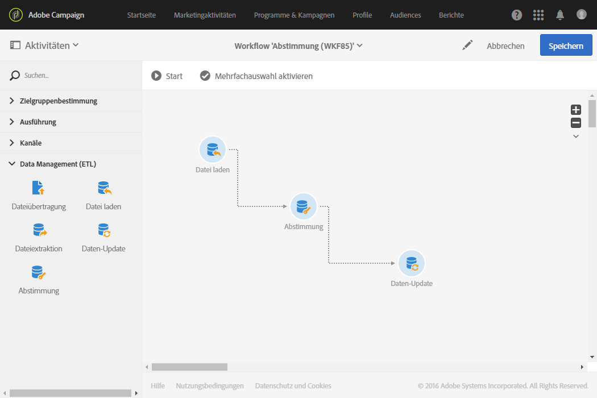
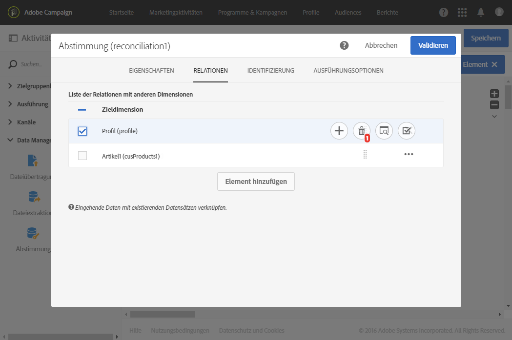

# Abstimmung{#reconciliation}

## Beschreibung {#description}


Mithilfe der Aktivität **[!UICONTROL Abstimmung]lässt sich eine Verbindung zwischen nicht-identifizierten Daten und bereits existierenden Ressourcen herstellen.**

## Anwendungskontext {#context-of-use}

Die Aktivität **[!UICONTROL Abstimmung]dient hauptsächlich der Datenverwaltung und wird zwei bestimmten Anwendungskontexten gerecht:**

* Hinzufügung von Relationen: Mithilfe des **[!UICONTROL Relationen]-Tabs lassen sich Beziehungen zwischen eingehenden Daten und mehreren Dimensionen der Adobe-Campaign-Datenbank hinzufügen.**

   Beispielsweise kann eine Datei neben Verkaufsdaten Informationen enthalten, die der Identifizierung der verkauften Produkte sowie des Kunden dienen. Die Daten der Datei betreffen also (zusätzlich zum **Verkauf**) zwei weitere Dimensionen: die Dimensionen **Produkte** und **Profile.** Folglich müssen Relationen zwischen letzteren beiden und der **Verkauf**-Dimension hergestellt werden (siehe hierzu nachstehendes Beispiel).

   Bei der Definition einer Relation werden die eingehenden Daten um eine Spalte zur Referenzierung des Fremdschlüssels der verknüpften Dimension erweitert.

   >[!NOTE]
   >
   >Dieser Vorgang setzt voraus, dass die Daten der verknüpften Dimensionen bereits in der Datenbank vorhanden sind. Wenn Sie beispielsweise eine Verkaufsaktivitäten enthaltende Datei importieren möchten, in der verzeichnet ist, welches Produkt wann von welchem Kunden gekauft wurde, müssen sowohl das Produkt als auch der Kunde bereits in der Datenbank angelegt sein. Identifizierung der Daten:

* Mithilfe des Tabs **[!UICONTROL Identifizierung]lassen sich eingehende Daten den Spalten einer bereits in der Adobe-Campaign-Datenbank existierenden Dimension zuordnen.** Die aus der Aktivität ausgehenden Daten werden so als der bestimmten Dimension zugehörig identifiziert.

   Im Anschluss können Sie zum Beispiel eine Audience speichern, die Datenbank aktualisieren etc.

Die Aktivität **[!UICONTROL Abstimmung]kann beispielsweise auf eine Datenladeaktivität folgen, die nicht standardmäßige Daten in die Datenbank importiert.**

## Konfiguration {#configuration}

1. Ziehen Sie eine **[!UICONTROL Abstimmung]in den Workflow-Arbeitsbereich und schließen Sie diese an eine Transition mit einer Population an, deren Zieldimension nicht direkt Adobe Campaign entstammt.** Lesen Sie diesbezüglich auch den Abschnitt [Zielgruppendimensionen und Ressourcen](../../automating/using/query.md#targeting-dimensions-and-resources).
1. Markieren Sie die Aktivität und öffnen Sie sie mithilfe der 
1. Nutzen Sie zur Definition von Beziehungen zwischen eingehenden Daten und anderen Dimensionen der Datenbank den Tab **[!UICONTROL Relationen].**

   Fügen Sie so viele Relationen wie nötig hinzu. Wählen Sie für jede Relation zunächst die verknüpfte Dimension aus, geben Sie anschließend in der Detailansicht der Relation die entsprechenden Felder an.

1. Gehen Sie zur bloßen Identifizierung der eingehenden Daten in den Tab **[!UICONTROL Identifizierung]** und aktivieren Sie die Option **Dokument zur Zielgruppenbestimmung aufgrund der Arbeitsdaten identifizieren[!UICONTROL .]**

   Wählen Sie die Zielgruppendimension aus, mit der Sie die eingehenden Daten abstimmen möchten.

   Fügen Sie Abstimmkriterien hinzu, mithilfe derer ein Datensatz der eingehenden Transition einem Datensatz der ausgewählten Zielgruppendimension zugeordnet werden kann. Bei mehreren Abstimmkriterien müssen alle erfüllt sein, damit eine Zuordnung der Daten möglich ist.

   Wählen Sie den **[!UICONTROL Umgang mit nicht identifizierten Quellzeilen]aus:**

   * **[!UICONTROL Ignorieren]**: Nur die identifizierbaren Daten werden in der ausgehenden Transition beibehalten.
   * **[!UICONTROL In die Ausgabepopulation einschließen]**: Alle Daten der eingehenden Transition werden in der ausgehenden Transition beibehalten.

1. Validieren Sie die Konfiguration der Aktivität und speichern Sie Ihren Workflow.

## Beispiel 1: Definition der Relation {#example-1--relation-definition}

Das folgende Beispiel zeigt einen Workflow zur Aktualisierung der Datenbankdaten anhand von in einer Datei enthaltenen, den Verkauf betreffenden Daten. Die Verkaufsinformationen enthalten Daten, die Elemente anderer Dimensionen wie z. B. die E-Mail von Kunden oder Artikelnummern referenzieren.

>[!NOTE]
>
>Die für dieses Beispiel verwendeten Ressourcen **Transaktionen** und **Artikel** sind nicht standardmäßig in Adobe Campaign enthalten. Sie sind also im Voraus mittels der Funktion [Benutzerdefinierte Ressourcen](../../developing/using/data-model-concepts.md) erstellt worden. Sowohl die den E-Mail-Adressen der importierten Datei entsprechenden Profile als auch die Produkte wurden im Voraus in die Datenbank geladen.

Der Workflow besteht aus folgenden Aktivitäten:



* **[!UICONTROL Datei laden]zum Laden und Erkennen der Daten der zu importierenden Datei.** Die importierte Datei enthält folgende Daten:

   * Transaktionsdatum
   * E-Mail-Adresse des Kunden
   * Artikelnummer des gekauften Produkts
   ```
   date;client;product
   2015-05-19 09:00:00;mail1@email.com;ZZ1
   2015-05-19 09:01:00;mail2@email.com;ZZ2
   2015-05-19 09:01:01;mail3@email.com;ZZ2
   2015-05-19 09:01:02;mail4@email.com;ZZ2
   2015-05-19 09:02:00;mail5@email.com;ZZ3
   2015-05-19 09:03:00;mail6@email.com;ZZ4
   2015-05-19 09:04:00;mail7@email.com;ZZ5
   2015-05-19 09:05:00;mail8@email.com;ZZ7
   2015-05-19 09:06:00;mail9@email.com;ZZ6
   ```

* **[!UICONTROL Abstimmung]zur Zuweisung der Verkaufsdaten zu Datenbankprofilen sowie Produkten.** Es ist also notwendig, eine Relation der Dateidaten mit der Profil- sowie mit der Produkttabelle zu definieren. Diese Konfiguration erfolgt im **[!UICONTROL Relationen]-Tab der Aktivität:**

   * Relation zu den **Profilen**: die Spalte **Kunde** der Datei ist dem Feld **E-Mail** der Dimension **Profile** zugeordnet.
   * Relation zu den **Produkten**: die Spalte **Produkte** der Datei ist dem Feld **productCode** der Dimension **Profile** zugeordnet.
   Die eingehenden Daten werden um Spalten zur Referenzierung der Fremdschlüssel der verbundenen Dimensionen erweitert.

   

* **[!UICONTROL Daten-Update]zur Bestimmung der anhand der importierten Daten zu aktualisierenden Datenbankfelder.** Da die Daten in der vorangehenden Aktivität bereits als der Dimension **Transaktionen** zugehörig identifiziert wurden, besteht nun hier die Möglichkeit der direkten Verwendung der Identifizierungsoption **[!UICONTROL Über die Zielgruppendimension].**

   Bei der Verwendung der Option zur automatischen Erkennung der zu aktualisierenden Felder werden die in der vorangehenden Aktivität konfigurierten Relationen (zu Profilen und Artikeln) der Liste **[!UICONTROL Zu aktualisierende Felder hinzugefügt]**. Dabei müssen Sie sich außerdem vergewissern, dass die den jeweiligen Transaktionsdaten entsprechenden Felder korrekt zu dieser Liste hinzugefügt werden.

   

   

## Beispiel 2: Identifizierung {#example-2--identification}

Das folgende Beispiel zeigt einen Workflow zur Erstellung einer Profil-Audience, die direkt von einer importierten Datei mit neuen Kunden ausgeht. Er setzt sich aus folgenden Aktivitäten zusammen:


* **[!UICONTROL Datei laden]zum Laden und Erkennen der Daten der zu importierenden Datei.** Die importierte Datei enthält folgende Daten:

   ```
   lastname;firstname;email;dateofbirth
   jackman;megan;megan.jackman@testmail.com;07/08/1975
   phillips;edward;phillips@testmail.com;09/03/1986
   weaver;justin;justin_w@testmail.com;11/15/1990
   martin;babeth;babeth_martin@testmail.net;11/25/1964
   reese;richard;rreese@testmail.com;02/08/1987
   cage;nathalie;cage.nathalie227@testmail.com;07/03/1989
   xiuxiu;andrea;andrea.xiuxiu@testmail.com;09/12/1992
   grimes;daryl;daryl_890@testmail.com;12/06/1979
   tycoon;tyreese;tyreese_t@testmail.net;10/08/1971
   ```

* **[!UICONTROL Abstimmung]zur Zuordnung aller Spalten der geladenen Datei zu einer Spalte der Profildimension.** Die nicht identifizierbaren Datensätze der Datei (fehlende Daten, inkompatible Datentypen etc.) werden zum Zweck der Wahrung der Integrität der die endgültige Audience betreffenden Daten ignoriert.

   

* **[!UICONTROL Audience-Speicherung]zum Speichern der Profil-Audience.**

   

