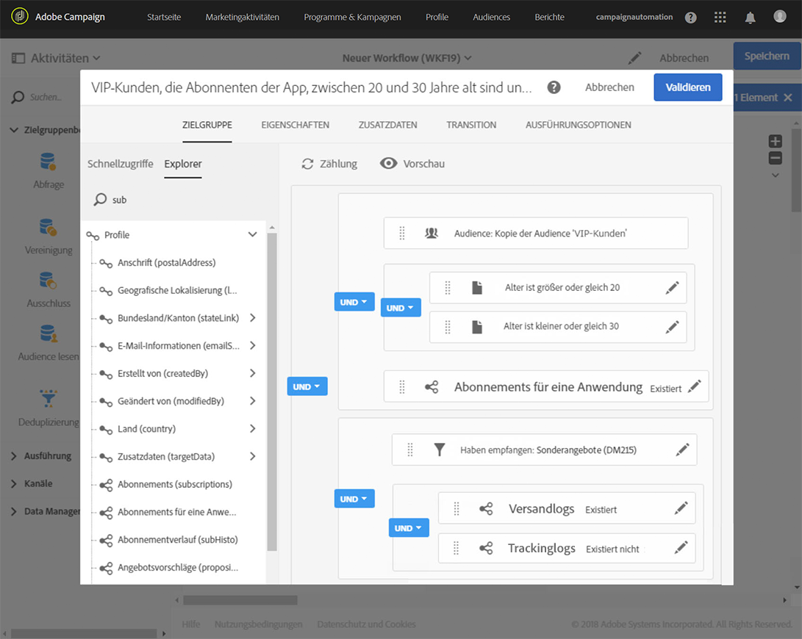

# Wiederkehrende Push-Benachrichtigung mithilfe von Workflows versenden {#sending-a-recurring-push-notification-with-a-workflow}

In diesem Beispiel wird eine personalisierte Push-Benachrichtigung am ersten Tag des Monats um 20 Uhr an die Abonnenten Ihrer Mobile App in ihrer jeweiligen Zeitzone gesendet.

Gehen Sie wie folgt vor, um den Workflow zu erstellen:

1. Die Aktivität [Planung](../../automating/using/scheduler.md) ermöglicht es Ihnen, den Workflow schon Tage vor dem Versand zu aktivieren, damit Sie die Benachrichtigung jedem Abonnenten um 20 Uhr in seiner Zeitzone senden können:

   * Wählen Sie im Feld **[!UICONTROL Ausführungsfrequenz]** die Option „Monatlich“ aus.
   * Wählen Sie im Feld **[!UICONTROL Uhrzeit]** 20 Uhr aus.
   * Wählen Sie aus, an welchem Tag im Monat der Versand stattfinden soll.
   * Wählen Sie ein Startdatum für Ihren Workflow aus. Dieses sollte mindestens einen Tag vor dem Beginn des Versands sein. Ansonsten könnten Empfänger die Nachricht einen Tag zu spät erhalten, wenn die ausgewählte Uhrzeit in ihrer Zeitzone bereits vorüber ist.
   * Wählen Sie im Tab **[!UICONTROL Ausführungsoptionen]** im Feld **[!UICONTROL Zeitzone]** aus, in welcher Zeitzone Ihr Workflow starten soll. In unserem Beispiel beginnt der Workflow um 20 Uhr (Pacific Time) eine Woche vor dem ersten Tag im Monat. Damit bleibt genügend Zeit, die Sendungen für alle Zeitzonen zu erstellen.

   >[!NOTE]
   >
   >Standardmäßig ist die ausgewählte Zeitzone die in den Eigenschaften des Workflows definierte Zeitzone (siehe [Workflow erstellen](../../automating/using/building-a-workflow.md)).

   

1. Mithilfe der Aktivität [Abfrage](../../automating/using/query.md) können Sie als Zielgruppe Ihre VIP-Kunden im Alter zwischen 20 und 30 Jahren festlegen, die Ihre mobile App abonniert und die von Ihnen gesendete E-Mail nicht geöffnet haben:

   * Wählen Sie eine Audience (Ihre VIP-Kunden) aus und legen Sie einen Altersfilter fest.
   * Ziehen Sie das Element **App-Abonnements** in den Arbeitsbereich. Wählen Sie **Existiert** und dann die Mobile App aus, die Sie verwenden möchten.
   * Wählen Sie die E-Mail aus, die Sie an Ihre Kunden geschickt haben.
   * Ziehen Sie das Element **Versandlogs (logs)** in den Arbeitsbereich und wählen Sie **Existiert** aus, um alle Kunden in die Zielgruppe einzuschließen, die die E-Mail erhalten haben.
   * Ziehen Sie das Element **Trackinglogs (tracking)** in den Arbeitsbereich und wählen Sie **Existiert nicht** aus, um nur Kunden in die Zielgruppe einzuschließen, die die E-Mail nicht geöffnet haben.

      

1. Definieren Sie dann über die Aktivität [Push-Benachrichtigungsversand](../../automating/using/push-notification-delivery.md) den Inhalt der Nachricht. Sie haben die Möglichkeit, sie unter Verwendung von Personalisierungsfeldern an den jeweiligen Empfänger anzupassen:

   * Wählen Sie die Option **[!UICONTROL Wiederkehrende Benachrichtigung]** aus.
   * Definieren Sie den Inhalt der Push-Benachrichtigung. Nähere Informationen zum Inhalt von Push-Benachrichtigungen erhalten Sie in [diesem Abschnitt](../../channels/using/preparing-and-sending-a-push-notification.md).
   * Wählen Sie in der Kachel **[!UICONTROL Planung]** die Option **[!UICONTROL Nachrichten werden automatisch in der unten spezifizierten Zeitzone gesendet]** aus. In unserem Beispiel wird im Workflow **[!UICONTROL Planung]** als **[!UICONTROL Zeitzone des Kontaktdatums]** „Pacific“ ausgewählt.
   * Wählen Sie im Feld **[!UICONTROL Versandzeitpunkt für jeden Empfänger optimieren]** die Option **[!UICONTROL In der Zeitzone des Empfängers senden]** aus.

      

1. Wählen Sie nun zur Ausführung des wiederkehrenden Workflows die Schaltfläche **[!UICONTROL Starten]** aus.

   

Ihr Workflow wird jetzt ausgeführt. Er beginnt an dem in der **[!UICONTROL Planung]** ausgewählten Startdatum, also um 20 Uhr Pacific Time, und die wiederkehrende Push-Benachrichtigung wird jeden ersten Tag im Monat um 20 Uhr in der Zeitzone des Kunden gesendet.
