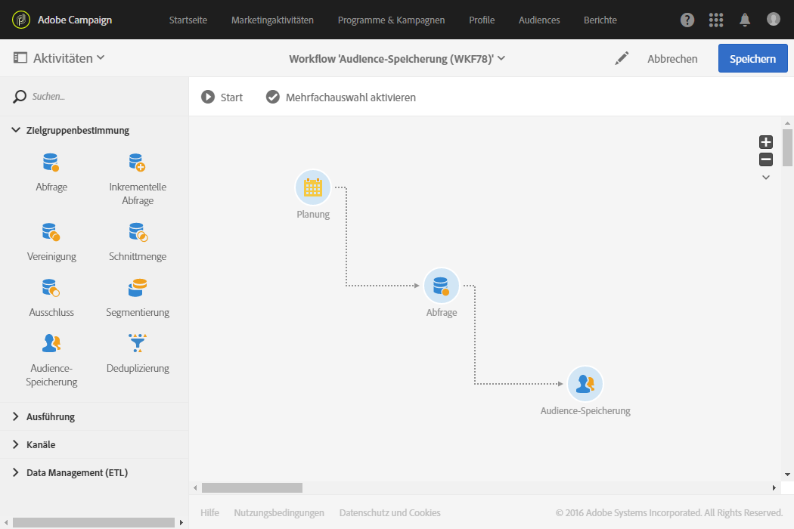
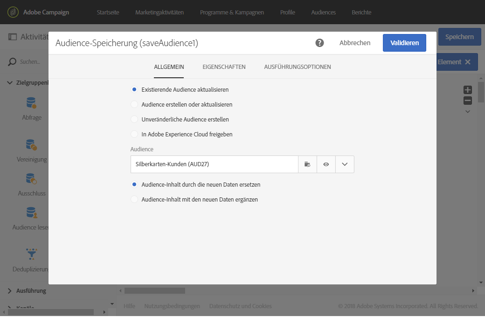

# Zielgruppe speichern{#save-audience}

## Beschreibung {#description}

Mithilfe der **[!UICONTROL Zielgruppe-speichern]**-Aktivität können existierende Zielgruppen aktualisiert oder neue erstellt werden. Die hierfür erforderlichen Populationen werden im Vorfeld durch andere Workflow-Aktivitäten ermittelt. Auf diese Weise erstellte oder aktualisierte Zielgruppen sind vom Typ **Liste** oder **Datei**. Sie werden zur bereits bestehenden Zielgruppe-Liste in Adobe Campaign hinzugefügt. Auf diese kann im Menü über **[!UICONTROL Zielgruppen]** zugegriffen werden.

>[!NOTE]
>
>Wenn die Zielgruppe, die über die Aktivität **[!UICONTROL Zielgruppe speichern]** erstellt wurde, mit Zusatzdaten angereichert wurde, können Sie diese Daten nicht zur Personalisierung eines Einzelversands verwenden. Diese Daten können nur über einen in einem Workflow ausgeführten Versand verwendet werden.

Außerdem ermöglicht diese Aktivität den Export von Profilen in Form von Adobe-Experience-Cloud-Zielgruppen/Segmenten. Diese Zielgruppen können anschließend in anderen Lösungen in Adobe Experience Cloud verwendet werden. Weiterführende Informationen zu freigegebenen Zielgruppen finden Sie in [Campaign und People Core Service verwenden](../../integrating/using/about-campaign-audience-manager-or-people-core-service-integration.md).

## Anwendungskontext     {#context-of-use}

Die **[!UICONTROL Zielgruppe-speichern]**-Aktivität wird in erster Linie verwendet, um innerhalb eines Workflows berechnete Populationen in dauerhaft wiederverwendbare Zielgruppen umzuwandeln.

## Konfiguration {#configuration}

1. Ziehen Sie eine **[!UICONTROL Zielgruppe-speichern]**-Aktivität in den Workflow-Arbeitsbereich.
1. Schließen Sie sie an Zielgruppenbestimmungs-Aktivitäten wie beispielsweise Abfragen, Schnittmengen, Vereinigungen oder Ausschlüsse an.
1. Markieren Sie die Aktivität und öffnen Sie sie mithilfe der in der Schnellaktion angezeigten Schaltfläche .
1. Wählen Sie die Aktion aus, die Sie ausführen möchten:

   * **[!UICONTROL Existierende Zielgruppe aktualisieren]** – wählen Sie mithilfe der Dropdown-Liste eine existierende Zielgruppe aus und definieren Sie die Art der Aktualisierung:

      * **[!UICONTROL Zielgruppe-Inhalt durch die neuen Daten ersetzen]** – der gesamte Zielgruppe-Inhalt wird ersetzt. die zuvor enthaltenen Daten gehen verloren. Nur die in der eingehenden Transition an die Zielgruppe-speichern-Aktivität übermittelten Daten werden beibehalten.
      * **[!UICONTROL Zielgruppe-Inhalt mit den neuen Daten ergänzen]** – bereits in der Zielgruppe enthaltene Daten werden beibehalten und mit den in der eingehenden Transition an die Zielgruppe-speichern-Aktivität übermittelten Daten ergänzt.

   * **[!UICONTROL Neue Zielgruppe erstellen und aktualisieren]** – geben Sie den Namen der Zielgruppe an und wählen Sie den Aktualisierungstyp aus. Die Zielgruppe wird erstellt, sofern sie nicht bereits existiert. Falls sie bereits existiert, wird sie entsprechend dem ausgewählten Modus aktualisiert:

      * **[!UICONTROL Zielgruppe-Inhalt durch die neuen Daten ersetzen]** – der gesamte Zielgruppe-Inhalt wird ersetzt. die zuvor enthaltenen Daten gehen verloren. Nur die in der eingehenden Transition an die Zielgruppe-speichern-Aktivität übermittelten Daten werden beibehalten.

        Achtung, bei dieser Option werden Zielgruppendimension und -typ der aktualisierten Audience gelöscht.

      * **[!UICONTROL Zielgruppe-Inhalt mit den neuen Daten ergänzen]** – bereits in der Zielgruppe enthaltene Daten werden beibehalten und mit den in der eingehenden Transition an die Zielgruppe-speichern-Aktivität übermittelten Daten ergänzt.

        Achtung, bei dieser Option wird ein Fehler ausgelöst, wenn Zielgruppendimension oder -typ der aktualisierten Zielgruppe nicht mit der aktuellen Konfiguration des Workflows kompatibel sind. Es ist beispielsweise nicht möglich, eine Zielgruppe vom Typ Datei mit Profilen zu ergänzen, die aus einer Abfrage hervorgehen.

   * **[!UICONTROL Neue Zielgruppe erstellen]** – geben Sie den Namen der zu erstellenden Zielgruppe an. Der Zielgruppe-Titel wird automatisch mit dem Datum und der Uhrzeit der Erstellung ergänzt. Auf diese Weise wird gewährleistet, dass bei jeder Ausführung des Workflows eindeutige Titel erzeugt werden.
   * **[!UICONTROL In der Adobe Experience Cloud freigeben]** - wählen Sie diese Option, wenn Sie Zielprofile ausgewählt haben und Sie diese in die Adobe Experience Cloud exportieren möchten. Wählen Sie dann eine bereits existierende freigegebene Zielgruppe aus bzw. erstellen Sie eine neue.

     Wählen Sie außerdem eine **[!UICONTROL Freigegebene Datenquelle]** aus, die der Ressource der in der Zielgruppe enthaltenen Daten entspricht, um die korrekte Abstimmung der Daten in Adobe Experience Cloud zu gewährleisten.

     Bei Verwendung dieser Option wird die freigegebene Zielgruppe nicht zu der im **[!UICONTROL Audiences]**-Menü enthaltenen Liste der Audiences in Adobe Campaign hinzugefügt.

     >[!NOTE]
     >
     >Diese Option ist nur dann verfügbar, wenn durch Ihren Administrator die Funktion der Zielgruppenfreigabe an die Adobe Experience Cloud konfiguriert wurde. Weiterführende Informationen finden Sie in [Campaign und People Core Service verwenden](../../integrating/using/about-campaign-audience-manager-or-people-core-service-integration.md).

   Der Typ der gespeicherten oder zur Aktualisierung verfügbaren Zielgruppen hängt von den im Workflow vorangeschalteten Aktivitäten ab.

   Die erstellte oder aktualisierte Audience ist vom Typ **[!UICONTROL Datei]**, wenn die Zielgruppendimension der Audience zum Zeitpunkt der Speicherung unbekannt ist (beispielsweise weil sie aus einem Dateiimport stammt).

   Die erstellte oder aktualisierte Audience ist vom Typ **[!UICONTROL Liste]**, wenn die Zielgruppendimension der Audience zum Zeitpunkt der Speicherung bekannt ist (beispielsweise weil sie aus einer Abfrage stammt).

   Der Inhalt der gespeicherten Zielgruppe ist anschließend in der Detailansicht der Zielgruppe verfügbar, auf die Sie im Menü **[!UICONTROL Zielgruppen]** zugreifen können. Die in dieser Ansicht gezeigten Spalten entsprechen den Spalten der in die Speicheraktivität des Workflows eingehenden Transition. Dies sind beispielsweise die Spalten der importierten Datei, über eine Abfrage hinzugefügte Zusatzdaten etc.

1. Validieren Sie die Konfiguration der Aktivität und speichern Sie Ihren Workflow.

## Beispiel {#example}

Das vorliegende Beispiel zeigt einen Workflow zur regelmäßigen Aktualisierung einer Zielgruppe, die aus einer Zielguppenbestimmung hervorgeht.

* Er wird unter Verwendung einer **[!UICONTROL Planungsaktivität]** einmal im Monat ausgeführt.
* Mithilfe einer **[!UICONTROL Abfrage]** werden alle Abonnenten der verschiedenen in der Anwendung verwalteten Anwendungsdienste abgerufen.
* Die Aktivität **[!UICONTROL Zielgruppe speichern]** aktualisiert in diesem Fall die angegebene Zielgruppe, indem die Profile, die seit der letzten Ausführung des Workflows den Informationsdienst abbestellt haben, gelöscht und die neuen Abonnenten hinzugefügt werden.

Die Konfiguration der **[!UICONTROL Zielgruppe-speichern]**-Aktivität stellt sich wie folgt dar:

