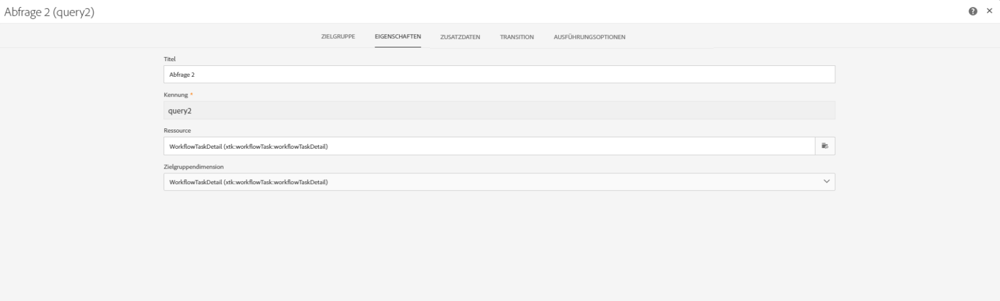
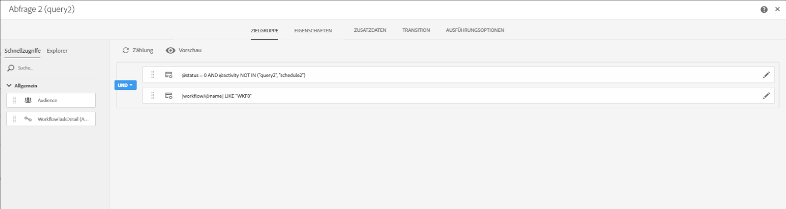
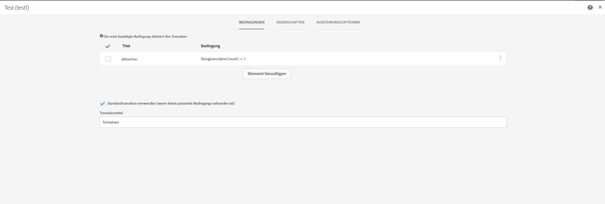
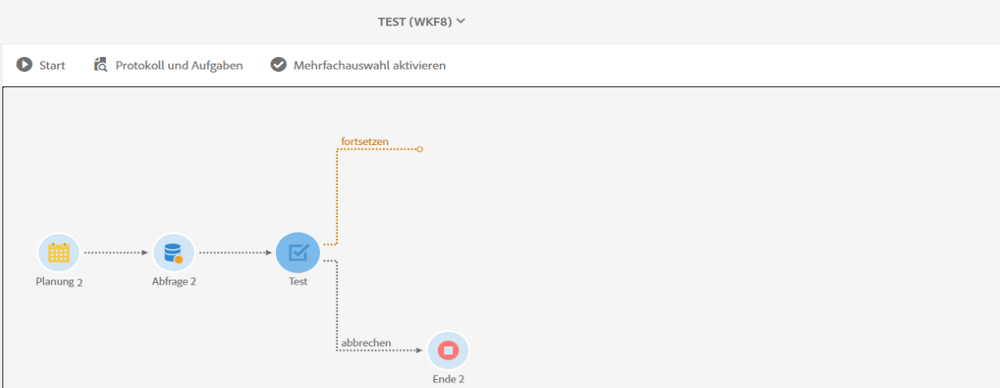

# Überschneidende Ausführung geplanter Workflows{#preventing-overlapping-execution-of-scheduled-workflows}

## Informationen zur Ausführung geplanter Workflows

In Campaign Standard garantiert die Workflow-Engine, dass eine Workflow-Instanz nur von einem Prozess ausgeführt wird. Das Sperren von Aktivitäten wie Importen, langwierigen Abfragen oder dem Schreiben in die Datenbank verhindert die Ausführung einer anderen Aufgabe während der Ausführung.

Andererseits blockieren nicht blockierende Aktivitäten nicht die Ausführung anderer Aufgaben (normalerweise warten Aktivitäten auf ein Ereignis wie die Aktivität **[!UICONTROL Planung]**).

Dies kann zu einem Szenario führen, bei dem ein zeitplanbasierter Workflow mit der Ausführung beginnen kann, auch wenn die vorherige Ausführung desselben Workflows noch nicht abgeschlossen ist, was möglicherweise zu unerwarteten Datenproblemen führt.

Daher müssen Sie beim Entwerfen eines geplanten Workflows, der mehrere Aktivitäten umfasst, sicherstellen, dass der Workflow erst nach seinem Abschluss neu geplant wird. Dazu müssen Sie Ihren Workflow so konfigurieren, dass seine Ausführung verhindert wird, wenn eine oder mehrere Aufgaben einer vorherigen Ausführung noch ausstehen.

## Workflow konfigurieren

Um zu überprüfen, ob eine oder mehrere Aufgaben aus einer vorherigen Workflow-Ausführung noch ausstehen, müssen Sie eine **[!UICONTROL Abfrageaktivität]** und eine **[!UICONTROL Testaktivität]** verwenden.

1. Fügen Sie die Aktvität **[!UICONTROL Abfrage]** nach der Aktivität **[!UICONTROL Planung]** hinzu und konfigurieren Sie sie dann wie folgt:

1. Ändern Sie die Ressource der Aktivität in **[!UICONTROL WorkflowTaskDetail]**, was bedeutet, dass die aktuellen Aufgaben des Workflows ausgewählt werden.

   

1. Konfigurieren Sie die Abfrage mit den folgenden Regeln:

   

   * Die erste Regel filtert sowohl die aktuelle Aufgabe (query2) als auch die nächste zum aktuellen Workflow gehörende Zeitplanaufgabe (schedule2) heraus.

     >[!NOTE]
     >
     >Wenn eine **[!UICONTROL Planungsaktivität]** startet, wird sofort eine weitere Zeitplanaufgabe hinzugefügt, die zum nächsten geplanten Zeitpunkt ausgeführt wird und den Workflow startet. Daher ist es wichtig, sowohl die Abfrage als auch die Zeitplanaufgaben zu filtern, wenn nach ausstehenden Aufgaben aus einer vorherigen Ausführung gesucht wird.

   * Die zweite Regel ermittelt, ob Aufgaben aus einer früheren Ausführung des Workflows noch aktiv (ausstehend) sind, was dem Ausführungsstatus 0 entspricht.

1. Fügen Sie die Aktivität **[!UICONTROL Test]** hinzu, um die Anzahl der ausstehenden Aufgaben zu prüfen, die von der Aktivität **[!UICONTROL Abfrage]** zurückgegeben werden. Konfigurieren Sie dazu zwei ausgehende Transitionen.

   

   * Bei der ersten Transition wird die Ausführung des Workflows fortgesetzt, wenn keine ausstehenden Aufgaben vorhanden sind.
   * Die zweite Transition bricht die Ausführung des Workflows ab, wenn ausstehende Aufgaben vorliegen.

   

Sie können jetzt den Rest des Workflows nach Bedarf konfigurieren. Wenn die Ausführung des Workflows aufgrund ausstehender Aufgaben abgebrochen wird, kann der Workflow diese Schritte durchlaufen, wenn er wieder gemäß Zeitplan ausgeführt wird. Dadurch wird sichergestellt, dass der Workflow nur ausgeführt wird, wenn keine aktiven (ausstehenden) Aufgaben von einer vorherigen Ausführung vorhanden sind.
