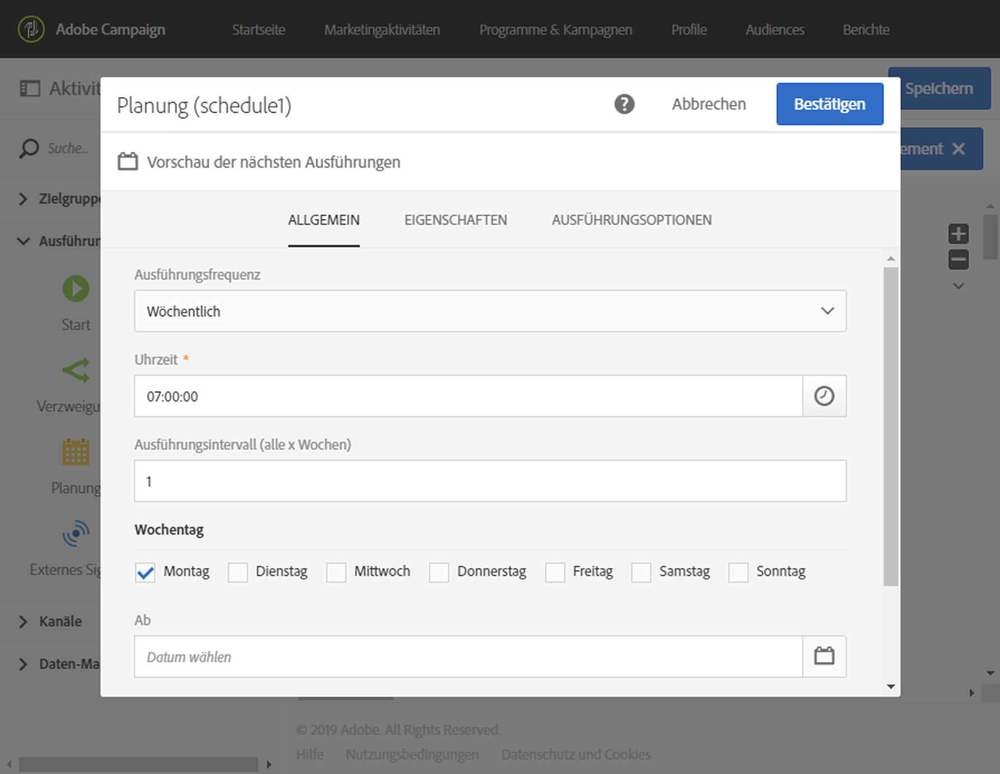

# Planung{#scheduler}

## Beschreibung {#description}

Die Aktivität **[!UICONTROL Planung]** ermöglicht die Festlegung des Starts eines Workflows oder einer Aktivität auf einen bestimmten Zeitpunkt.

## Anwendungskontext {#context-of-use}

Eine **[!UICONTROL Planung]** entspricht einem programmierten Start, daher sind die gleichen Regeln zu beachten wie für die **[!UICONTROL Start]**-Aktivität. So darf die Planung beispielsweise keine eingehende Transition aufweisen.

Je Workflow-Zweig darf zudem nur eine **[!UICONTROL Planung]** verwendet werden. Außerdem muss eine Zeitzone definiert werden. Dadurch können Sie Ihren Workflow in einer bestimmten Zeitzone starten. Andernfalls wird der Workflow in der in den Eigenschaften des Workflows definierten Zeitzone ausgeführt (siehe [Workflow erstellen](../../automating/using/building-a-workflow.md)).

>[!CAUTION]
>
>Das **[!UICONTROL Ausführungsintervall]** der Aktivität kann nicht weniger als 10 Minuten betragen. Dies bedeutet, dass kein Workflow automatisch öfter als einmal alle 10 Minuten durchgeführt werden kann.

## Konfiguration  {#configuration}

1. Ziehen Sie eine **[!UICONTROL Planung]** in den Workflow.
1. Markieren Sie die Aktivität und öffnen Sie sie mithilfe der im Schnellzugriff angezeigten Schaltfläche .
1. Definieren Sie die **[!UICONTROL Ausführungsfrequenz]**:

   * **[!UICONTROL Einmal]** - der Workflow wird nur einmal ausgeführt.
   * **[!UICONTROL Mehrmals pro Tag]** - der Workflow wird wiederholt zu bestimmten Zeiten am Tag ausgeführt. Sie können Ausführungen zu bestimmten Zeiten oder in regelmäßigen Abständen einrichten.
   * **[!UICONTROL Täglich]** - der Workflow wird jeden Tag einmal zu einem bestimmten Zeitpunkt ausgeführt.
   * **[!UICONTROL Wöchentlich]** - der Workflow wird wiederholt zu bestimmten Zeiten in der Woche ausgeführt.
   * **[!UICONTROL Monatlich]** - der Workflow wird wiederholt zu bestimmten Zeiten im Monat ausgeführt. Sie können die Monate auswählen, in denen der Workflow ausgeführt werden soll. Sie können für die Ausführung von Workflows auch bestimmte Wochentage des Monats auswählen, z. B. am zweiten Dienstag des Monats.
   * **[!UICONTROL Jährlich]** - der Workflow wird wiederholt zu bestimmten Zeiten im Jahr ausgeführt.

1. Definieren Sie die Ausführungsdetails. Je nach gewählter Frequenz sind verschiedene Parameter (Uhrzeit, Ausführungsintervall, bestimmte Tage etc.) zu konfigurieren.

   >[!NOTE]
   >
   >Das Feld **[!UICONTROL Ausführungsintervall]** ermöglicht es, den Rhythmus des Workflow-Starts weiter zu verfeinern. Wenn Sie beispielsweise eine tägliche Ausführungsfrequenz wählen und bei der Ausführungsintervall den Wert **2** (Tage) angeben, wird der Workflow alle zwei Tage gestartet. Dieser Wert kann nicht weniger als 10 Minuten betragen. Wenn die Ausführungsintervall den Standardwert (= **0**) aufweist, wird nur die Ausführungsfrequenz berücksichtigt.

1. Definieren Sie den Ablauf der Ausführungsplanung:

   * **[!UICONTROL Nie]** - der Workflow wird auf Dauer in den angegebenen Intervallen ausgeführt.
   * **[!UICONTROL Nach einer bestimmten Anzahl an Ausführungen]** - der Workflow wird **X** Mal in den angegebenen Intervallen ausgeführt, wobei X gleich dem im Feld **[!UICONTROL Ausführungsanzahl]** angegebenen Wert ist.
   * **[!UICONTROL Bei Erreichen eines bestimmten Datums]** - der Workflow wird in den angegebenen Intervallen ausgeführt, bis das im Feld „Bis zum“ angegebene Datum erreicht ist.

1. Überprüfen Sie den Zeitplan der nächsten zehn Ausführungen Ihres Workflows, indem Sie **[!UICONTROL Vorschau der nächsten Ausführungen]** auswählen.

1. Wählen Sie im Tab **[!UICONTROL Ausführungsoptionen]** im Feld **[!UICONTROL Zeitzone]** aus, in welcher Zeitzone Ihre Planung ausgeführt werden soll.

   Weiterführende Informationen zum Versand von Nachrichten entsprechend der Zeitzone der Empfänger finden Sie in diesem [Abschnitt](../../sending/using/sending-messages-at-the-recipient-s-time-zone.md) und in diesem [Beispiel](../../automating/using/push-notification-delivery.md#sending-a-recurring-push-notification-with-a-workflow) eines wiederkehrenden Workflows.

1. Validieren Sie die Konfiguration der Aktivität und speichern Sie Ihren Workflow.

## Beispiel {#example}

Unten stehende Abbildung zeigt eine Planung für einen Workflow, der für einen unbegrenzten Zeitraum alle zwei Wochen montags um 7 Uhr ausgeführt werden soll.

