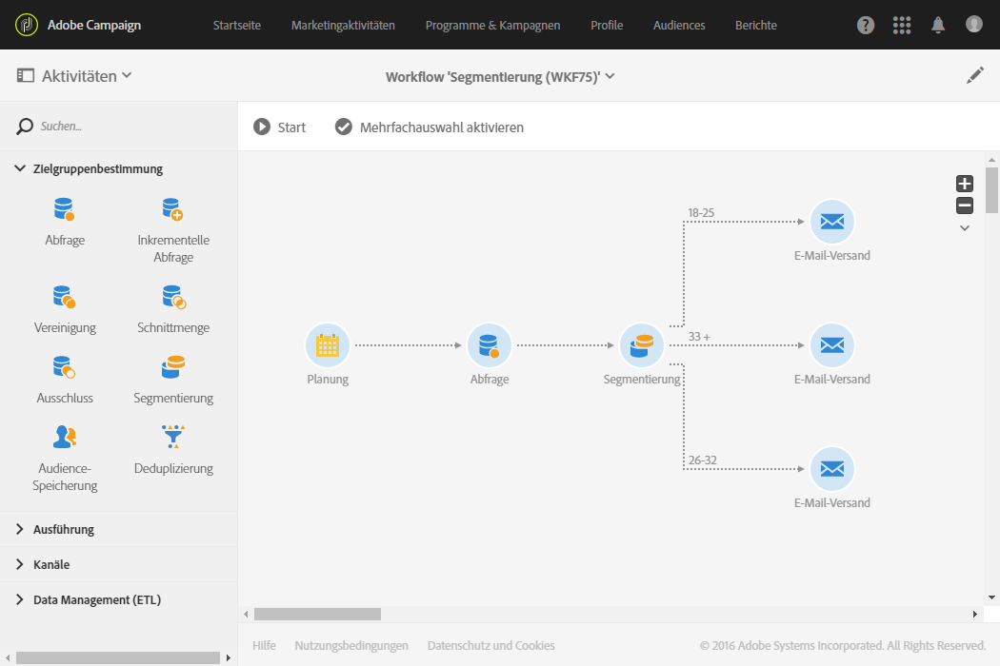
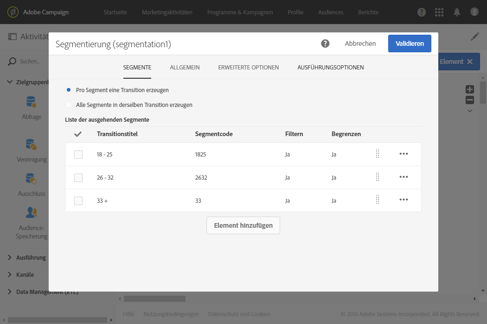
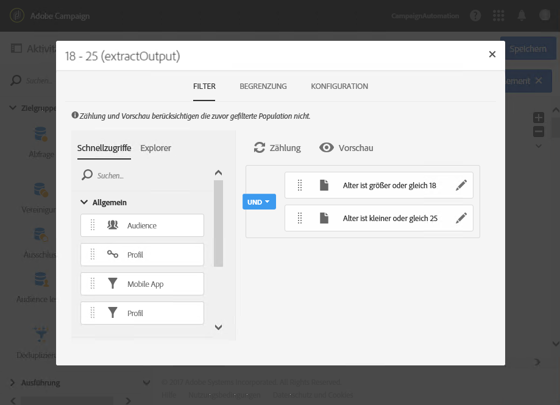
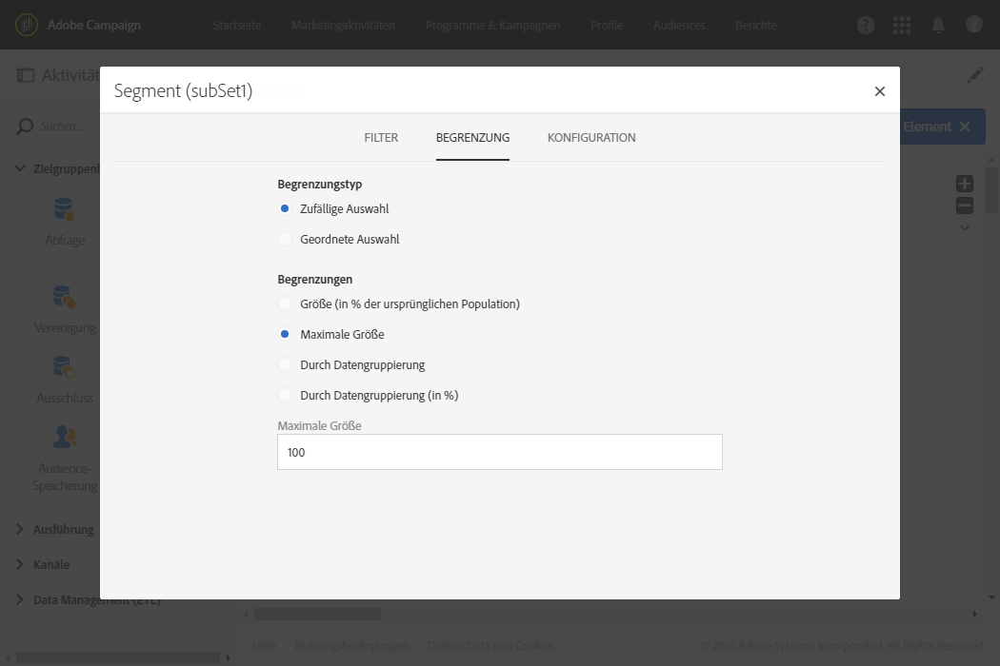

# Segmentierung nach Altersklassen {#segmentation-age-groups}

Das folgende Beispiel zeigt eine auf der Altersklasse beruhende Segmentierung von Datenbankprofilen.

Der Zweck des Workflows besteht im Versand einer E-Mail pro Altersklasse. Es wird angenommen, dass dieser Workflow Teil einer Testkampagne sein soll. Kein Segment darf daher mehr als 100 Profile enthalten. Letztere werden nach dem Zufallsprinzip ausgewählt, um begrenzte und dabei repräsentative Audiences zu erhalten.

Der Workflow ist wie folgt gestaltet:

* Mittels der Aktivität [Planung](../../automating/using/segmentation.md) wird das Ausführungsdatum des Workflows bestimmt.
* Mittels einer [Abfrage](../../automating/using/query.md)-Aktivität werden Profile ausgewählt, in denen Geburtsdatum und E-Mail-Adresse angegeben sind.
* Mittels einer [Segmentierung](../../automating/using/segmentation.md) werden drei auf verschiedene ausgehende Transitionen verteilte Segmente erstellt: 18–25 Jahre, 26–32 Jahre und älter als 32 Jahre. Die Auswahl der in den jeweiligen Segmenten enthaltenen Profile geschieht wie folgt:

  

   * Filterung der Profile nach Alter je nach für das Segment definierter Altersklasse;

     

   * Begrenzung der Segmentgröße durch eine **[!UICONTROL Zufällige Auswahl]**, die mit der Beschränkung **[!UICONTROL Maximale Größe]** von 100 einhergeht.

     

* Mittels der an die ausgehenden Transitionen angeschlossenen [E-Mail-Versand](../../automating/using/email-delivery.md)-Aktivitäten lässt sich für jedes Segment ein spezifischer Inhalt erstellen.
