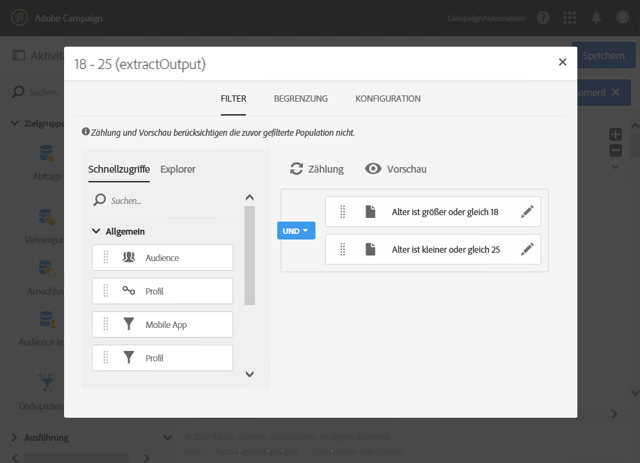

# Segmentierung{#segmentation}

## Beschreibung {#description}

Mit der **[!UICONTROL Segmentierung]** lassen sich von einer durch frühere Aktivitäten berechneten Population ausgehend ein oder mehrere Segment(e) erstellen. Diese können bei Abschluss der Aktivität in einer einzigen oder verschiedenen Transition(en) verarbeitet werden.

>[!NOTE]
>
>Ein Mitglied der eingehenden Population kann standardmäßig nur einem einzigen Segment angehören. Die Anwendung der Filter erfolgt in der Reihenfolge der Segmente in der Aktivität.

## Anwendungskontext {#context-of-use}

Die **[!UICONTROL Segmentierung]** ist im Allgemeinen hinter Zielgruppen-Aktivitäten platziert (Abfrage, Schnittmenge, Vereinigung, Ausschluss etc.), sodass die Segmente auf der Basis der vorher bestimmten Standardpopulation erstellt werden können.

## Konfiguration {#configuration}

1. Ziehen Sie per Drag &amp; Drop eine **[!UICONTROL Segmentierung]** in Ihren Workflow.
1. Markieren Sie die Aktivität und öffnen Sie sie mithilfe der im Schnellzugriff angezeigten Schaltfläche .
1. Wählen Sie auf der Registerkarte &quot; **[!UICONTROL Allgemein]** &quot;den **[!UICONTROL Ressourcentyp]** aus, auf dem die Segmentierung durchgeführt werden soll:

   * **[!UICONTROL Datenbank-Ressource]**, wenn sich die Segmentierung auf bereits in der Datenbank existierende Daten bezieht. Wählen Sie die **[!UICONTROL Filterdimension]** entsprechend den Daten aus, die Sie segmentieren möchten. Standardmäßig bezieht sich die Segmentierung auf **Profile**.
   * **[!UICONTROL Temporäre Ressource]**, wenn sich die Segmentierung auf temporäre Daten des Workflows bezieht: Wählen Sie die **[!UICONTROL Zielmenge]** mit den zu segmentierenden Daten aus. Dieser Fall kann im Anschluss an einen Dateiimport auftreten oder wenn die Daten der Datenbank angereichert wurden.

1. Wählen Sie den gewünschten Typ der ausgehenden Transition aus:

   * **[!UICONTROL Pro Segment eine Transition erzeugen]**: Am Ende der Aktivität wird für jedes konfigurierte Segment eine ausgehende Transition hinzugefügt.
   * **[!UICONTROL Alle Segmente in derselben Transition erzeugen]**: Alle konfigurierten Segmente werden in ein und derselben ausgehenden Transition zusammengefasst. Geben Sie den Titel der Transition an. Die Mitglieder jedes Segments behalten den Segmentcode, der Ihnen zugewiesen worden ist.

1. Fügen Sie mithilfe der Schaltflächen  oder **[!UICONTROL Element hinzufügen]** ein Segment hinzu und geben Sie dessen allgemeine Eigenschaften an:

   * **[!UICONTROL Aktivieren Sie die Transition nicht, wenn die Population leer ist]**: Das Segment wird nur aktiviert, wenn Daten abgerufen werden.
   * **[!UICONTROL Ursprüngliche Population filtern (Abfrage)]**: ermöglicht das Filtern der Population des Segments.
   * **[!UICONTROL Segment-Population begrenzen]**: begrenzt die Größe des Segments.
   * **[!UICONTROL Segment-Population filtern und begrenzen]**: Mithilfe dieser Funktion kann die Population des Segments gefiltert und in ihrer Größe begrenzt werden.
   * **[!UICONTROL Titel]**: Titel des Segments.
   * **[!UICONTROL Segmentcode]**: der Population des Segments zugewiesene Code. Der Segmentcode kann mit einem Standardausdruck und Ereignisvariablen personalisiert werden (siehe [Aktivitäten mit Ereignisvariablen anpassen](../../automating/using/calling-a-workflow-with-external-parameters.md#customizing-activities-with-events-variables)).
   * **[!UICONTROL Segment von der Population ausschließen]**: Hierdurch lässt sich das bestimmte Segment aus der Ausgabepopulation der Aktivität ausschließen. Diese Möglichkeit besteht nur, wenn die Option **[!UICONTROL Alle Segmente in derselben Transition erzeugen]** ausgewählt wurde.

   

1. Greifen Sie auf die Konfigurationsparameter zu, indem Sie in der Segmentliste der Aktivität das entsprechende Kästchen ankreuzen und mithilfe der Schaltfläche  die Detailansicht öffnen.
1. Wenn Sie die Option zum Filtern der Ursprungspopulation angekreuzt haben, öffnen Sie den **[!UICONTROL Filter]**-Tab und bestimmen Sie die Population Ihres Segments. Die Filter basieren auf der in Etappe 4 ausgewählten Filterdimension. Weiterführende Informationen zum Filtern von Populationen finden Sie im Abschnitt [Abfrage-Bearbeitung](../../automating/using/editing-queries.md).

   Wenn sich die Segmentierung auf eine temporäre Ressource bezieht, sind Zählung und Vorschau der Population in diesem Tab nicht verfügbar.

1. Wenn Sie die Option zur Reduzierung der Segmentgröße angekreuzt haben, öffnen Sie den Tab **[!UICONTROL Begrenzung]**.

   Wählen Sie zunächst den **[!UICONTROL Begrenzungstyp]** aus, den Sie anwenden möchten.

   * **[!UICONTROL Zufallsauswahl]**: Die Auswahl der Population des Segments ist willkürlich und berücksichtigt ggf. die im **[!UICONTROL Filter]**-Tab vorgenommene Konfiguration.
   * **[!UICONTROL Geordnete Auswahl]**: Die Population des Segments wird sortiert und die ersten X Elemente werden ausgewählt. Sie müssen folglich die zu berücksichtigenden Spalten sowie die Art der anzuwendenden Sortierung definieren. Wenn Sie z. B. das Feld **Alter** als Sortierungsspalte wählen, dabei eine **[!UICONTROL Absteigende Sortierung]** anwenden und anschließend 100 als Höchstgrenze festsetzen, werden lediglich die Profile der 100 ältesten Personen ausgewählt.

   Legen Sie anschließend die **[!UICONTROL maximale Größe]** des Segments fest.

   * **[!UICONTROL Größe (in % der Ursprungspopulation)]**: Bestimmen Sie mithilfe eines Prozentsatzes der Ursprungspopulation der Aktivität die Größe des Segments.
   * **[!UICONTROL Maximale Größe]**: Bestimmen Sie eine maximale Anzahl an Mitgliedern für die Segmentpopulation.
   * **[!UICONTROL Durch Datengruppierung]**: Die Segmentpopulation kann in Abhängigkeit von Werten eines bestimmten Felds der eingehenden Population begrenzt werden. Wählen Sie das Feld aus, nach dem die Population gruppiert werden soll, und geben Sie die zu verwendenden Werte an.
   * **[!UICONTROL Durch Datengruppierung (in %)]**: Die Segmentpopulation kann in Abhängigkeit von Werten eines bestimmten Felds der eingehenden Population auf einen bestimmten Prozentsatz begrenzt werden. Wählen Sie das Feld aus, nach dem die Population gruppiert werden soll, und geben Sie die zu verwendenden Werte an.

      >[!NOTE]
      >
      >Für jeden Wert kann eine unterschiedliche Begrenzung gewählt werden. Beispielsweise lässt sich eine Gruppierung für das Feld **[!UICONTROL Geschlecht]** festlegen und die Population mit dem Geschlecht **[!UICONTROL Männlich]** auf 10, die Population mit dem Geschlecht **[!UICONTROL Weiblich]** auf 30 Personen begrenzen. Bei der Verwendung mehrerer, der Datengruppierung dienender Felder müssen alle Gruppierungen dieselbe Größe aufweisen.
   

1. Validieren Sie die Konfiguration Ihres Segments.
1. Fügen Sie so viele Segmente wie nötig hinzu, indem Sie die Etappen 6 bis 10 dieser Prozedur erneut durchlaufen.
1. Passen Sie bei Bedarf die Parameter des **[!UICONTROL Erweiterte Optionen]**-Tabs der Aktivität an:

   * Aktivieren Sie die Option **[!UICONTROL Überlappung der Ausgabepopulationen zulassen]**, wenn Ihnen an der Möglichkeit liegt, dass ein Mitglied der Eingangspopulation mehreren Segmenten angehören kann. Die Ausgabepopulation der Aktivität kann in diesem Fall die Eingangspopulation übersteigen.
   * Aktivieren Sie die Option **[!UICONTROL Alle Segmentcodes konkatenieren]**, wenn die Eingangspopulation bereits über einen Segmentcode verfügt und Sie diesen beibehalten möchten. Der innerhalb der Aktivität zugewiesene Segmentcode wird dem ursprünglichen Segmentcode hinzugefügt.
   * Aktivieren Sie die Option **[!UICONTROL Komplement erzeugen]**, wenn Sie die verbleibende Population nutzen möchten.

1. Validieren Sie die Konfiguration der Aktivität und speichern Sie Ihren Workflow.

## Beispiel {#example}

Das folgende Beispiel zeigt eine auf der Altersklasse beruhende Segmentierung von Datenbankprofilen. Der Zweck des Workflows besteht im Versand einer E-Mail pro Altersklasse. Es wird angenommen, dass dieser Workflow Teil einer Testkampagne sein soll. Kein Segment darf daher mehr als 100 Profile enthalten. Letztere werden nach dem Zufallsprinzip ausgewählt, um begrenzte und dabei repräsentative Audiences zu erhalten.

Der Workflow ist wie folgt gestaltet:

* Mittels einer **[!UICONTROL Planung]**-Aktivität wird das Ausführungsdatum des Workflows bestimmt. Siehe Abschnitt [Planung](../../automating/using/scheduler.md).
* Mittels einer **[!UICONTROL Abfrage]**-Aktivität werden Profile ausgewählt, in denen Geburtsdatum und E-Mail-Adresse angegeben sind. Siehe Abschnitt [Abfrage](../../automating/using/query.md).
* Mittels einer **[!UICONTROL Segmentierung]** werden drei auf verschiedene ausgehende Transitionen verteilte Segmente erstellt: 18-25 Jahre, 26-32 Jahre und älter als 32 Jahre. Die Auswahl der in den jeweiligen Segmenten enthaltenen Profile geschieht wie folgt:

   

   * Filterung der Profile nach Alter je nach für das Segment definierter Altersklasse;

      

   * Begrenzung der Segmentgröße durch eine **[!UICONTROL Zufallsauswahl]**, die mit der Beschränkung **[!UICONTROL Maximale Größe]** von 100 einhergeht.

      

* Mittels der an die ausgehenden Transitionen angeschlossenen **[!UICONTROL E-Mail-Versand]**-Aktivitäten lässt sich für jedes Segment ein spezifischer Inhalt erstellen. Lesen Sie diesbezüglich auch den Abschnitt [E-Mail-Versand](../../automating/using/email-delivery.md).

