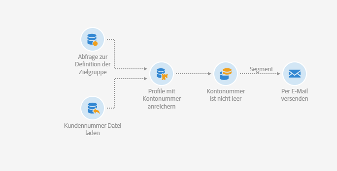
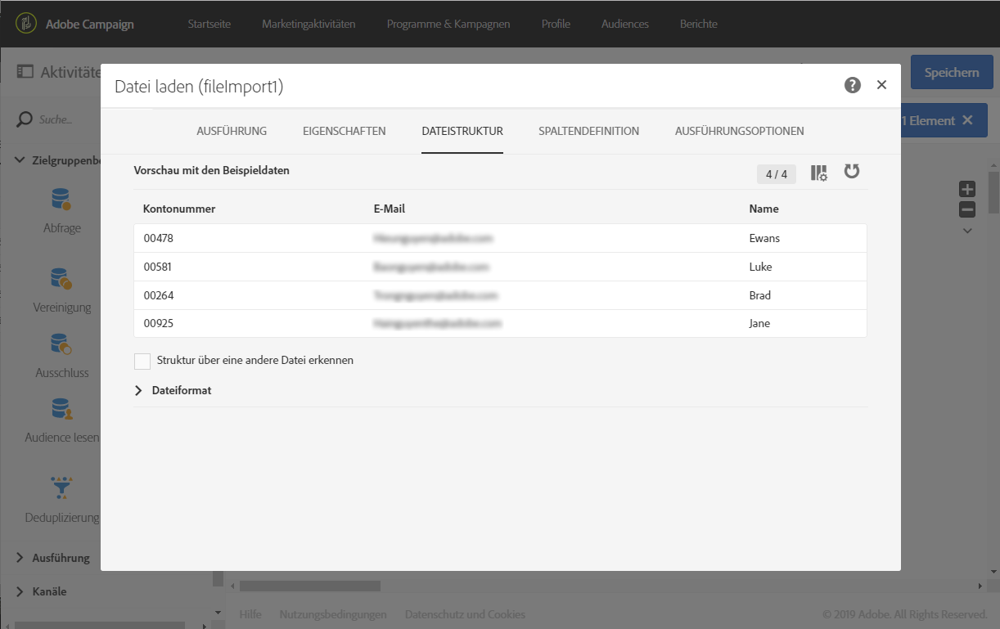
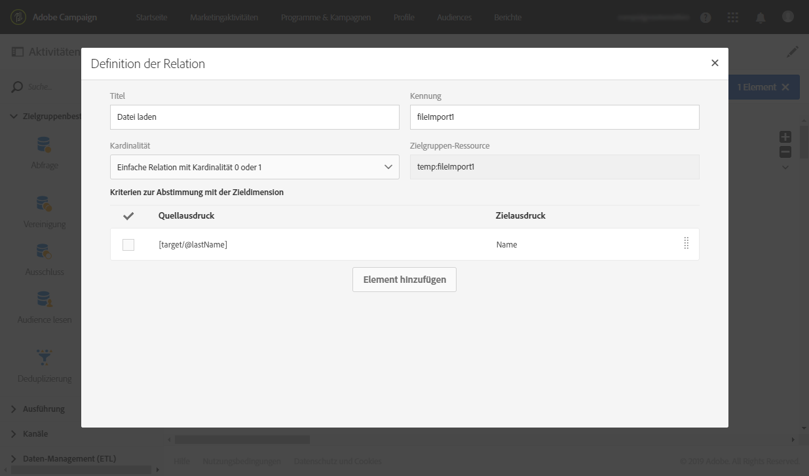
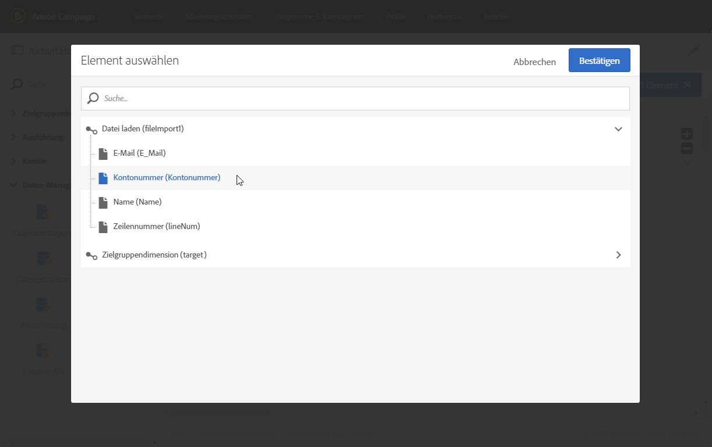
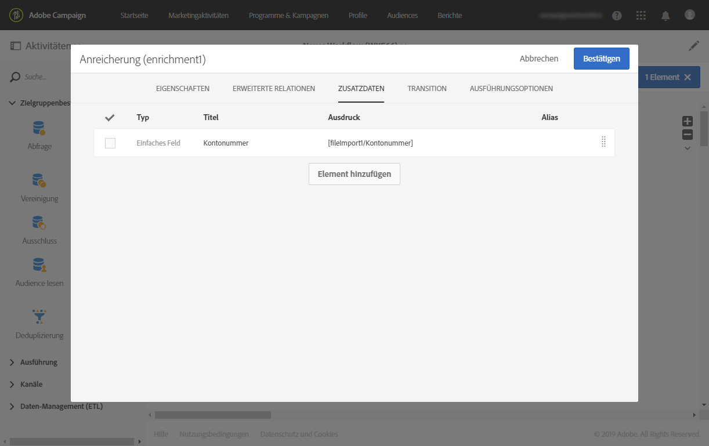
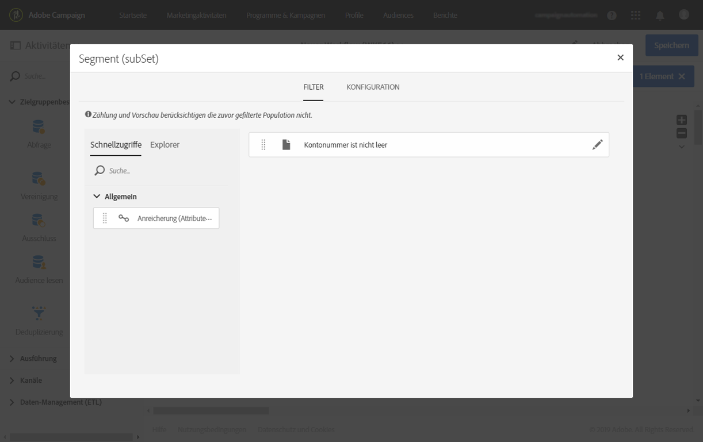
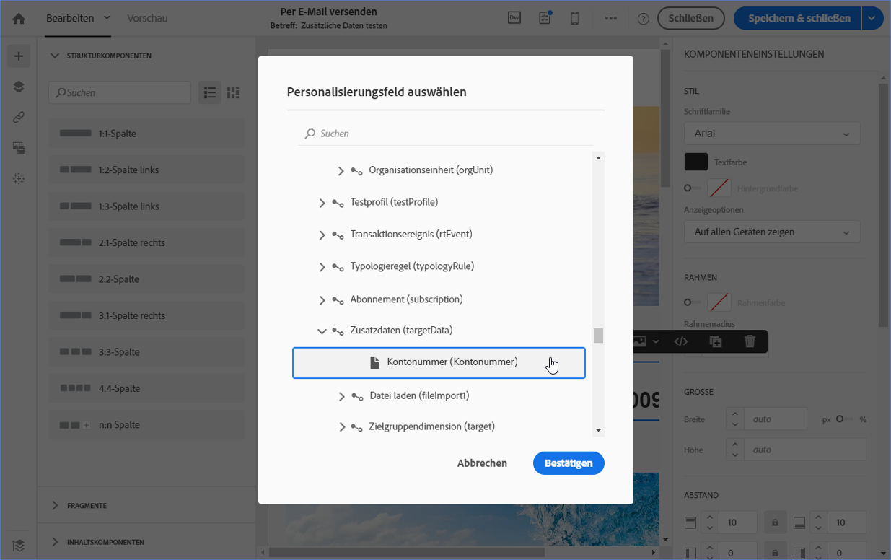
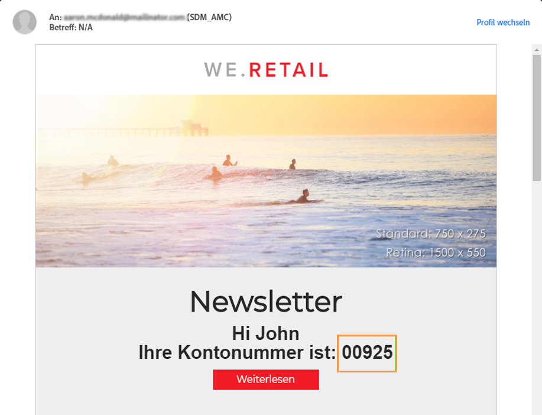

# E-Mail mit erweiterten Feldern senden {#sending-email-enriched-fields}

<!--A new example showing how to send an email containing additional data retrieved from a load file activity has been added. [Read more](example-2-email-with-enriched-fields)-->

Die Aktivität „Datei laden“ ermöglicht das Senden einer erweiterten E-Mail mit zusätzlichen Daten aus einer externen Datei im gleichen Workflow.

Das folgende Beispiel zeigt, wie eine E-Mail mit zusätzlichen Daten gesendet wird, die über die Aktivität „Datei laden“ aus einer externen Datei abgerufen wurden. In diesem Beispiel enthält die externe Datei eine Liste von Profilen mit den zugehörigen Kontonummern. Sie möchten diese Daten importieren, um eine E-Mail mit der entsprechenden Kontonummer an jedes Profil zu senden.

Gehen Sie wie folgt vor, um den Workflow zu erstellen:

1. Ziehen Sie eine [Abfrageaktivität](../../automating/using/query.md) per Drag &amp; Drop in Ihren Workflow und öffnen Sie diese, um das Hauptziel festzulegen.

   <!--The Query activity is presented in the [Query](../../automating/using/query.md) section.-->

1. Ziehen Sie per Drag &amp; Drop eine [Datei laden](../../automating/using/load-file.md)-Aktivität in Ihren Workflow, um einem Profil Daten zuzuweisen. In diesem Beispiel möchten Sie eine Datei mit Kontonummern laden, die einigen Profilen aus der Datenbank entsprechen.

   

1. Ziehen Sie eine [Erweiterungsaktivität](../../automating/using/enrichment.md) per Drag &amp; Drop in Ihren Workflow und verknüpfen Sie diese mit den Aktivitäten &quot;Datei laden&quot; und &quot;Abfrage&quot;.

1. Wählen Sie im Tab **[!UICONTROL Erweiterte Relationen]** der Erweiterungsaktivität die Funktion **[!UICONTROL Einfache Relation mit Kardinalität 0 oder 1]** aus und legen Sie die Felder fest, die für die Abstimmung verwendet werden sollen. Hier verwenden wir die Nachnamen, um die Daten mit den Datenbankprofilen abzustimmen.

   

1. Wählen Sie im Tab **[!UICONTROL Zusätzliche Daten]** die Elemente aus, die Sie in Ihrer E-Mail verwenden möchten. Wählen Sie hier die Kontonummer aus (Spalte in der Datei, die Sie mittels der Aktivität „Datei laden“ aufgerufen haben).

   

   <!---->

   Weitere Informationen dazu finden Sie im Abschnitt [Erweiterung](../../automating/using/enrichment.md).

1. Ziehen Sie eine [Segmentierungsaktivität](../../automating/using/segmentation.md) per Drag &amp; Drop in Ihren Workflow und öffnen Sie diese, um das Hauptziel zu optimieren.

   

   Weitere Informationen dazu finden Sie im Abschnitt [Segmentierung](../../automating/using/segmentation.md).

1. Ziehen Sie einen [E-Mail-Versand](../../automating/using/email-delivery.md) in den Workflow-Arbeitsbereich und öffnen Sie ihn.

   <!--The Email delivery activity is presented in the [Email delivery](../../automating/using/email-delivery.md) section.-->

1. Fügen Sie ein Personalisierungsfeld hinzu und wählen Sie aus dem Knoten **[!UICONTROL Zusätzliche Daten (targetData)]** die zusätzlichen Daten aus, die in der Erweiterungsaktivität festgelegt wurden (hier Kontonummer). Dadurch kann die Kontonummer jedes Profils im E-Mail-Inhalt dynamisch abgerufen werden.

   

1. Speichern Sie die E-Mail und starten Sie den Workflow.

Die E-Mail wird an das Ziel gesendet. Jedes Profil erhält eine E-Mail mit der entsprechenden Kontonummer.

