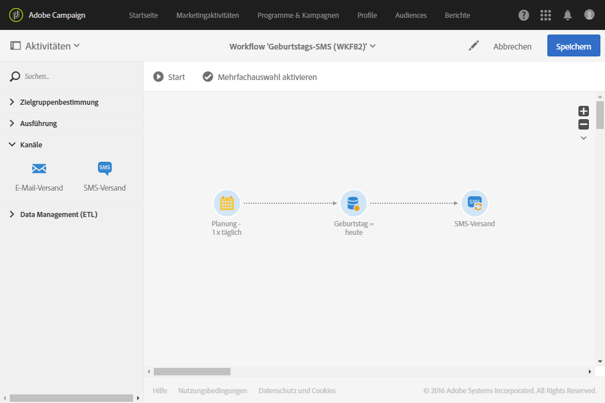
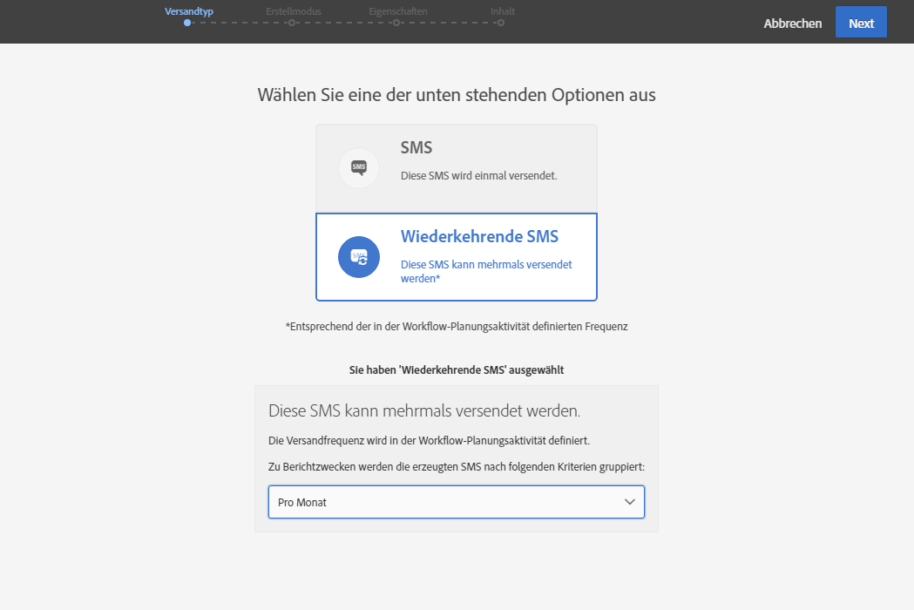

# SMS-Versand{#sms-delivery}

## Beschreibung {#description}

Die **[!UICONTROL SMS-Versandaktivität]** ermöglicht den Versand von SMS innerhalb eines Workflows. Bei einmaligen Versandaktionen handelt es sich um Standard-SMS, die nur einmal gesendet werden.********

Bei einmaligen Versandaktionen handelt es sich um Standard-SMS, die nur einmal gesendet werden.

Wiederkehrende Versandaktionen ermöglichen den wiederholten Versand der gleichen SMS an verschiedene Zielgruppen. Für Berichtzwecke können bei Bedarf die einzelnen Sendungen nach Zeiträumen aggregiert werden.

## Anwendungskontext    {#context-of-use}

Der **[!UICONTROL SMS-Versand]** dient insbesondere der Automatisierung des Nachrichtenversands an eine innerhalb desselben Workflows berechnete Zielgruppe.

In Verbindung mit einer Planungsaktivität können wiederkehrende SMS-Nachrichten konfiguriert werden.

Die SMS-Empfänger werden in vorangeschalteten Zielgruppenbestimmungsaktivitäten des Workflows, wie beispielsweise Abfragen, Schnittmengen etc. definiert.

Die Vorbereitung der Nachricht wird in Abhängigkeit von den Ausführungsparametern des Workflows ausgelöst. Sie können im Nachrichten-Dashboard auswählen, ob eine manuelle Bestätigung zum Nachrichtenversand erforderlich ist oder nicht (standardmäßig erforderlich). Sie können den Workflow entweder manuell starten oder eine Planung verwenden, um die Ausführung zu automatisieren.

## Konfiguration    {#configuration}

1. Ziehen Sie einen **[!UICONTROL SMS-Versand]** in den Workflow-Arbeitsbereich.
1. Markieren Sie die Aktivität und öffnen Sie sie mithilfe der -Schaltfläche aus den angezeigten Quick Actions.

   >[!NOTE]
   >
   >Die Schaltfläche  in den Quick Actions bietet Zugriff auf die allgemeinen Eigenschaften und erweiterten Optionen der Aktivität (nicht des Versands selbst). Sie ist spezifisch für die **[!UICONTROL SMS-Versandaktivität]**. Auf die Eigenschaften der SMS können Sie über die Symbolleiste Ihres Dashboards zugreifen.

1. Wählen Sie den Versandtyp der SMS aus:

   * **[!UICONTROL SMS]**: Die SMS wird ein einziges Mal versendet. Sie können an dieser Stelle entscheiden, ob Sie der Aktivität eine ausgehende Transition hinzufügen möchten oder nicht. Die unterschiedlichen Transitionstypen werden in Etappe 7 dieser Prozedur beschrieben.
   * **[!UICONTROL SMS zum wiederkehrenden Versand]**: Die SMS wird wiederholt versendet. Die Frequenz des Versands wird in einer vorangeschalteten **[!UICONTROL Planung]** definiert. Wählen Sie einen Aggregatzeitraum für die wiederkehrenden Sendungen aus. Auf diese Weise werden alle Sendungen, die im angegebenen Zeitraum versendet wurden, in einer Ansicht zusammengefasst, die auch **wiederkehrende Ausführung** genannt wird. Diese ist in der Marketingaktivitätenliste der Anwendung zugänglich.

      Es besteht beispielsweise die Möglichkeit, die Ausführungen einer täglich gesendeten Geburtstags-SMS pro Monat zu aggregieren. Auf diese Weise lässt sich ein monatlicher Versandbericht für eine täglich gesendete SMS generieren.

1. Wählen Sie einen SMS-Typ aus. Die verschiedenen SMS-Typen entsprechen Vorlagen, die im Menü **[!UICONTROL Ressourcen]** &gt; **[!UICONTROL Vorlagen]** &gt; **[!UICONTROL Versandvorlagen]** definiert sind.
1. Geben Sie die allgemeinen Eigenschaften der SMS an. und ordnen Sie sie gegebenenfalls einer existierenden Kampagne zu. Der Titel der Versandaktivität des Workflows wird mit dem Titel der SMS aktualisiert.
1. Erstellen Sie den SMS-Inhalt. Weiterführende Informationen hierzu finden Sie im Abschnitt [SMS erstellen](../../channels/using/creating-an-sms-message.md).
1. Die **[!UICONTROL SMS-Versandaktivität]** verfügt standardmäßig über keinerlei ausgehende Transition. Sie haben jedoch die Möglichkeit, eine ausgehende Transition zu erzeugen, indem Sie unter Verwendung der in den Quick Actions der Aktivität verfügbaren Schaltfläche  die erweiterten Optionen öffnen und im **[!UICONTROL Allgemein]**-Tab eine der folgenden Optionen aktivieren:****

   * **[!UICONTROL Ausgehende Transition ohne Population hinzufügen]**: ermöglicht die Erstellung einer ausgehenden Transition, die exakt dieselbe Population enthält wie die eingehende Transition.
   * **[!UICONTROL Ausgehende Transition mit Population hinzufügen]**: ermöglicht die Erstellung einer ausgehenden Transition, die die Population enthält, der die SMS gesendet wurde. Der Teil der Zielgruppe, der in der Versandvorbereitung ausgeschlossen wurde (Quarantäne, ungültige Nummer etc.), ist von dieser Transition ausgeschlossen.

1. Validieren Sie die Konfiguration der Aktivität und speichern Sie Ihren Workflow.

Wenn Sie die Aktivität später erneut öffnen, gelangen Sie direkt in das Dashboard der SMS. Nur der Inhalt kann zu diesem Zeitpunkt noch geändert werden.

Standardmäßig wird durch den Versand-Workflow nur die Vorbereitung der Nachricht ausgelöst. Der in einem Workflow erstellte Nachrichtenversand muss noch bestätigt werden, nachdem der Workflow gestartet wurde. Sie können aber im Nachrichten-Dashboard die Option **[!UICONTROL Vor dem Nachrichtenversand Bestätigung einholen]** deaktivieren. Dies ist jedoch nur möglich, wenn die Nachricht in einem Workflow erstellt wurde. Ist diese Option deaktiviert, werden Nachrichten ohne weiteren Hinweis gesendet, sobald die Vorbereitung abgeschlossen ist.

## Bemerkungen    {#remarks}

Auf die von einem Workflow aus erstellten Sendungen kann in der Marketingaktivitätenliste der Anwendung zugegriffen werden. Über das Dashboard lässt sich der Ausführungsstatus des Workflows visualisieren. Die Links im Übersichtsmenü der SMS ermöglichen einen direkten Zugriff auf verknüpfte Elemente (Workflow, Kampagne, Elternversand im Fall einer SMS zum wiederkehrenden Versand).

Die Ausführungen wiederkehrender Sendungen sind jedoch standardmäßig ausgeblendet. Um sie anzuzeigen, aktivieren Sie im Suchmenü der Marketingaktivitäten die Option **[!UICONTROL Wiederkehrende Ausführungen anzeigen]**.

Ausgehend von den Elternsendungen, auf die über die Marketingaktivitätenliste oder direkt über die verknüpften wiederkehrenden Ausführungen zugegriffen werden kann, lässt sich die Gesamtheit aller getätigten Sendungen visualisieren (in Abhängigkeit vom bei der Konfiguration der **[!UICONTROL SMS-Versandaktivität]** festgelegten Aggregat-Zeitraum). Öffnen Sie hierzu mithilfe der -Schaltfläche die Detailansicht der **[!UICONTROL Freigabe]**-Kachel des Elternversands.

## Beispiel {#example}

Das folgende Beispiel zeigt einen Geburtstags-Workflow. Jeden Tag wird eine SMS an alle Profile gesendet, die Geburtstag haben. Gehen Sie wie folgt vor:

* Eine **[!UICONTROL Planung]** startet den Workflow täglich um 8 Uhr.

   

* Die auf die Planung folgende **[!UICONTROL Abfrage]** ruft alle Profile aus der Datenbank ab, die am aktuellen Datum Geburtstag haben und deren Mobiltelefonnummer bekannt ist. Der Geburtstagsfilter ist standardmäßig im Abfragetool enthalten.

   

* **[!UICONTROL SMS]** zum wiederkehrenden Versand - die Sendungen werden pro Monat aggregiert. Auf diese Weise sind alle innerhalb eines Monats gesendeten SMS-Nachrichten in einer einzigen Ansicht enthalten. Innerhalb eines Jahres werden folglich 365 Sendungen ausgeführt, die jedoch innerhalb der Adobe-Campaign-Benutzeroberfläche in nur 12 Ansichten (auch **wiederkehrende Ausführungen** genannt) zusammengefasst werden. Der Verlauf und die Berichte zeigen monatliche Zusammenfassungen und nicht jeden einzelnen Versand.

   

Ein weiteres Beispiel für den SMS-Versand in einem Workflow finden Sie unter [Anwendungsfall: Retargeting-Workflow für eine erneute Versendung an Nicht-Öffner](../../automating/using/workflow-cross-channel-retargeting.md).
