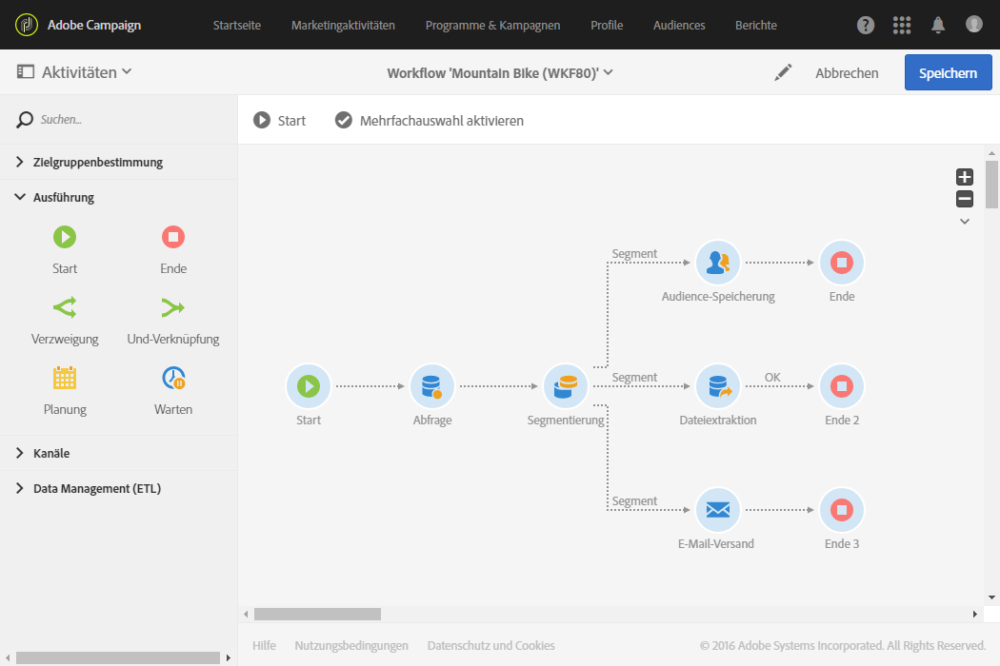

# Start und Ende{#start-and-end}

## Beschreibung {#description}

**[!UICONTROL Start]** und **[!UICONTROL Ende]** markieren grafisch den Anfangs- bzw. den Endpunkt eines Workflows.

## Anwendungskontext {#context-of-use}

Die Ausführung eines Workflows beginnt mit Aktivitäten ohne eingehende Transition und endet, wenn keine weiteren Aufgaben mehr in Gang sind. Die Verwendung der Aktivitäten **[!UICONTROL Start]** und **[!UICONTROL Ende]** dient insbesondere der besseren Übersicht  über Start- und Endpunkte eines Workflows. beispielsweise bei komplexen Workflows.

Es ist empfehlenswert, einen Workflow mit einer **[!UICONTROL Ende]**-Aktivität anstatt mit der letzten Transition abzuschließen. Damit wird gewährleistet, dass der Workflow ordnungsgemäß beendet wird.

## Konfiguration {#configuration}

1. Ziehen Sie einen **[!UICONTROL Start]** oder ein **[!UICONTROL Ende]** in den Workflow-Arbeitsbereich.
1. Platzieren Sie den **[!UICONTROL Start]** vor anderen Aktivitäten wie beispielsweise Abfragen und das **[!UICONTROL Ende]** im Anschluss an eine Aktivitätenfolge.
1. Markieren Sie die Aktivität und öffnen Sie sie mithilfe der in der Schnellaktion angezeigten Schaltfläche .
1. Konfigurieren Sie bei Bedarf die **Ende**-Aktivität dahingehend, dass alle laufenden Aufgaben des Workflows angehalten werden, sobald ihre eingehende Transition aktiviert wird. Aktivieren Sie hierzu die entsprechende Option.
1. Validieren Sie die Konfiguration der Aktivität und speichern Sie Ihren Workflow.

## Einen weiteren Workflow aktivieren     {#triggering-another-workflow}

Über die Registerkarte **[!UICONTROL Externes Signal]** einer **[!UICONTROL Ende]**-Aktivität können Sie einen weiteren Workflow auslösen. Lesen Sie diesbezüglich auch den Abschnitt [Externes Signal](../../automating/using/external-signal.md).

## Beispiel {#example}

Unten stehende Abbildung zeigt einen komplexen Workflow mit einem **[!UICONTROL Start]** und mehreren **[!UICONTROL Ende]**-Aktivitäten. Die Option **[!UICONTROL Alle laufenden Aufgaben anhalten]** wurde beim ersten **[!UICONTROL Ende]** aktiviert. Dies bedeutet, dass nach Abschluss dieser Aufgabe der gesamte Workflow gestoppt wird. Das gleiche Ergebnis kann mit der Schaltfläche  erzielt werden (siehe Abschnitt [Aktionsleiste](../../automating/using/workflow-interface.md#action-bar)).

