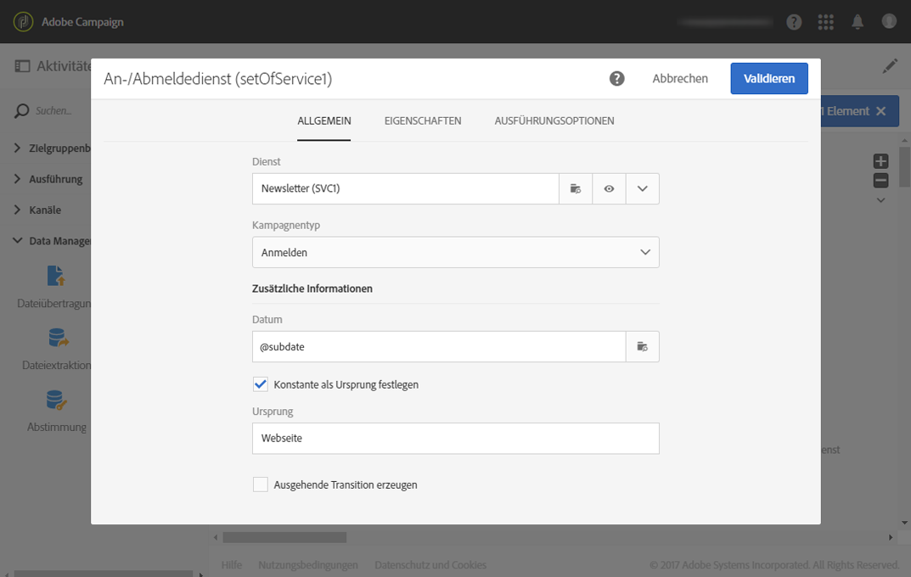

# Profile bei einem spezifischen Dienst nach dem Import einer Datei anmelden {#subscribing-profiles-to-a-specific-service-after-importing-a-file}

In diesem Beispiel wird dargestellt, wie man eine Datei mit Profilen importiert, um diese für einen existierenden Dienst anzumelden. Auf den Dateiimport muss eine Abstimmungsaktivität folgen, damit die importierten Daten als Profile identifiziert werden können. Um sicherzustellen, dass sich keine Duplikate in der Datei befinden, wird eine Deduplizierung auf die Daten angewendet.

Der Workflow stellt sich folgendermaßen dar:


* [Datei laden](../../automating/using/load-file.md)-Aktivität zum Laden der Profildatei und zur Definition der Struktur der importierten Spalten.

  In unserem Beispiel weist die geladene Datei das .csv-Format auf und enthält folgende Daten:

  ```
  lastname;firstname;email;birthdate;subdate
  jackman;megan;megan.jackman@testmail.com;07/08/1975;10/08/2017
  phillips;edward;phillips@testmail.com;09/03/1986;10/08/2017
  weaver;justin;justin_w@testmail.com;11/15/1990;10/08/2017
  martin;babeth;babeth_martin@testmail.net;11/25/1964;10/08/2017
  reese;richard;rreese@testmail.com;02/08/1987;11/08/2017
  cage;nathalie;cage.nathalie227@testmail.com;07/03/1989;11/08/2017
  xiuxiu;andrea;andrea.xiuxiu@testmail.com;09/12/1992;11/08/2017
  grimes;daryl;daryl_890@testmail.com;12/06/1979;12/08/2017
  tycoon;tyreese;tyreese_t@testmail.net;10/08/1971;12/08/2017
  ```

  

* Mit der Aktivität [Abstimmung](../../automating/using/reconciliation.md) werden die Daten der Datei als der Profildimension der Adobe Campaign-Datenbank zugehörig identifiziert. Der Tab **[!UICONTROL Identifizierung]** ist als einziger bereits konfiguriert. Durch ihn lassen sich die Daten der Datei über die E-Mail-Adresse der Profile identifizieren.

  

* [Deduplizierung](../../automating/using/deduplication.md) zur Identifizierung eventueller Duplikate, basierend auf dem **email**-Feld der (aus der Abstimmung hervorgegangenen) temporären Ressource. Sollten die aus der Datei importierten Daten Duplikate enthalten, wird die Anmeldung für einen Dienst für alle Datensätze fehlschlagen.

  

* Mit einer [An-/Abmeldedienst](../../automating/using/subscription-services.md)-Aktivität können Sie den Dienst, für den die Profile angemeldet sein müssen, sowie das dem Abonnementdatum entsprechende Feld und den Ursprung des Abonnements auswählen.

  
