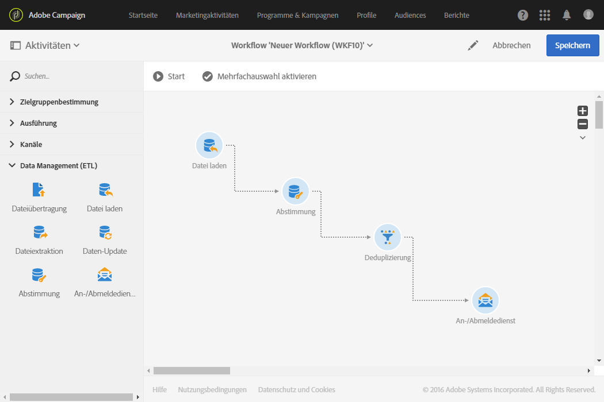
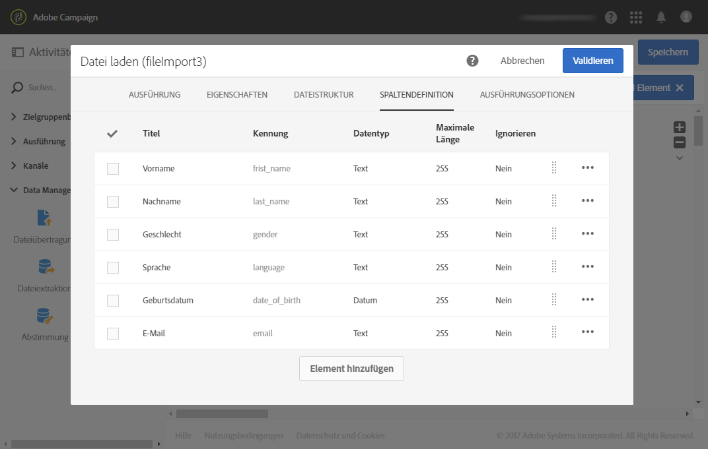
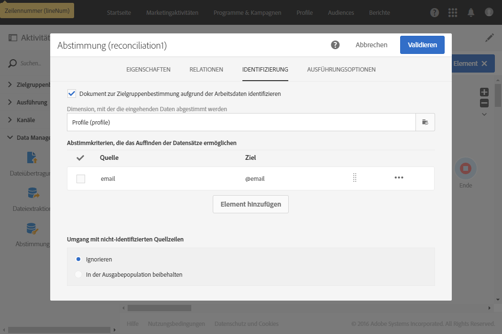
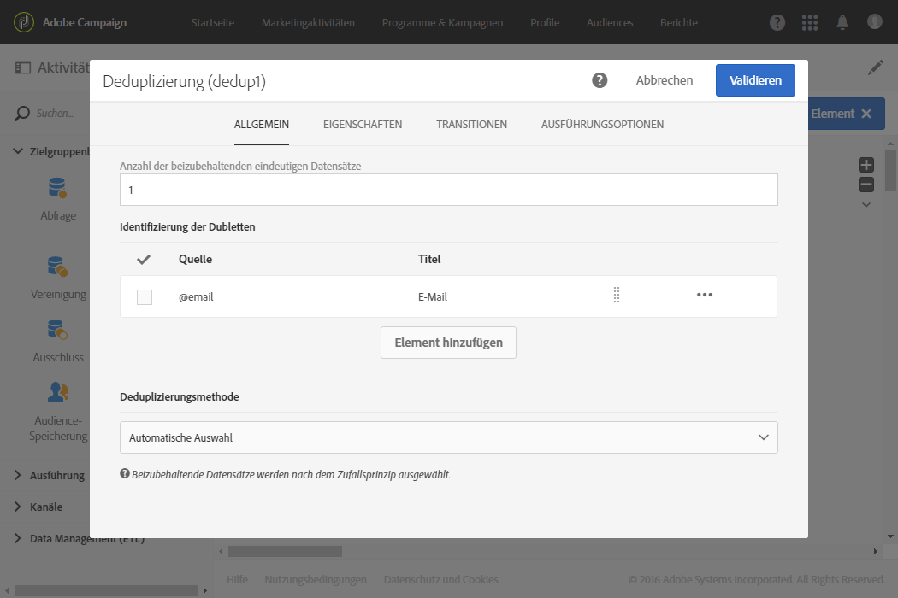
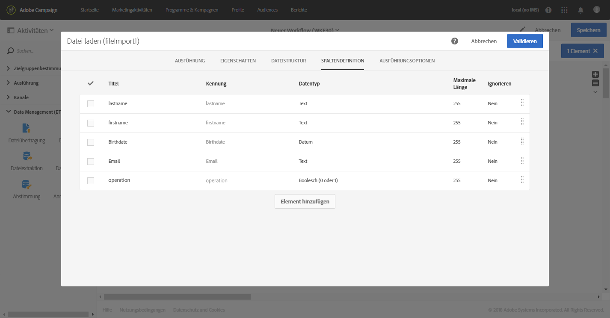
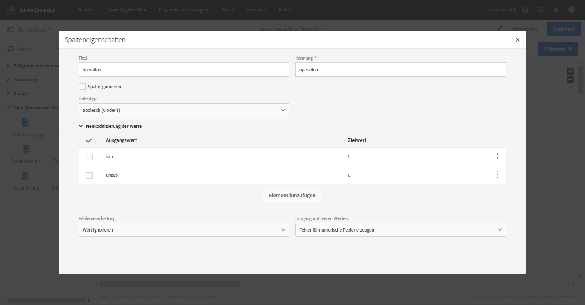
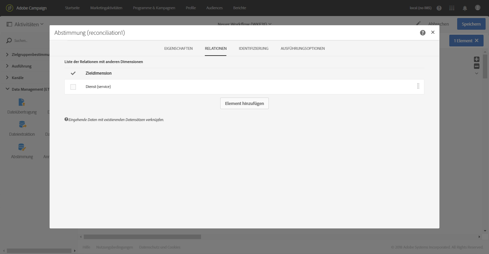
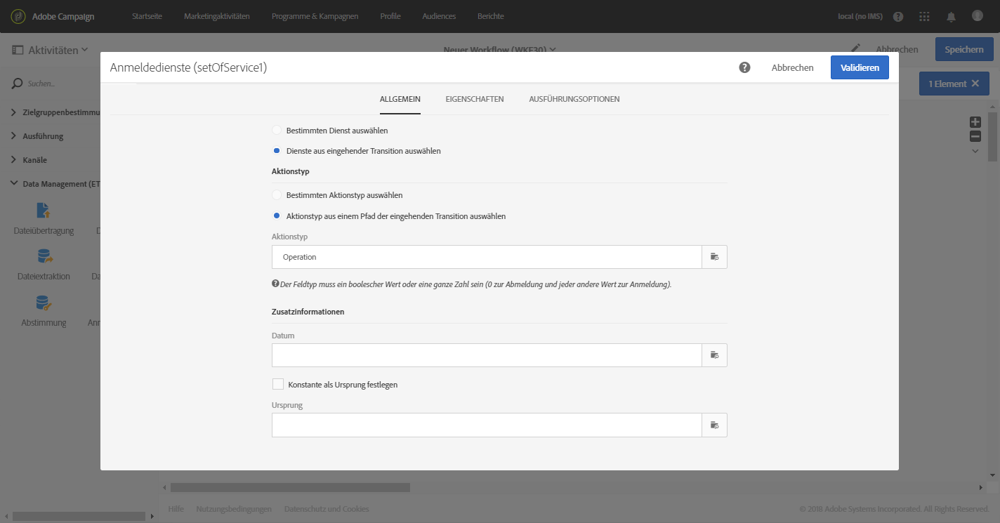

# An-/Abmeldedienst {#subscription-services}

## Beschreibung {#description}


Mithilfe der Aktivität **[!UICONTROL An-/Abmeldedienst]** lassen sich Profile gesammelt für Dienste an- bzw. von Diensten abmelden.

>[!CAUTION]
>
>Wenn An-/Abmeldungen im Rahmen eines Workflows verwaltet werden, empfangen die an- bzw. abgemeldeten Profile nicht die verschiedenen in den Diensteigenschaften definierten Bestätigungs-E-Mails.

## Anwendungskontext {#context-of-use}

Bei der Aktivität **[!UICONTROL An-/Abmeldedienst]** handelt es sich um die einzige Funktionalität in Adobe Campaign, die es gestattet, mehrere Profile gleichzeitig und in einer einzigen Aktion für einen Dienst an- bzw. von einem Dienst abzumelden.

Sie können diese Aktivität beispielsweise im Anschluss an eine Zielgruppenbestimmung oder den Import einer Datei mit identifizierten Daten verwenden.

Wenn dies in den entsprechenden Spalten der Datei spezifiziert wird, können Sie mithilfe dieser Aktivität auch die gewünschte Aktion auswählen (anmelden oder abmelden) sowie den Dienst, auf den sich die Aktion bezieht.

**Verwandte Themen:**

* [Anwendungsfall: Mehrere Abonnementstatus über eine Datei aktualisieren](../../automating/using/updating-subscriptions-from-file.md)
* [Anwendungsfall: Profile aus einer Datei für einen bestimmten Dienst anmelden](../../automating/using/subscribing-profiles-from-file.md)

## Konfiguration {#configuration}

1. Ziehen Sie einen **[!UICONTROL An-/Abmeldedienst]** in den Workflow-Arbeitsbereich.
1. Schließen Sie ihn nach weiteren Zielgruppenbestimmungsaktivitäten an, wie beispielsweise nach einer Abfrage oder einer auf einen Import folgenden Abstimmung.
1. Markieren Sie die Aktivität und öffnen Sie sie mithilfe der im Schnellzugriff angezeigten Schaltfläche .
1. Wählen Sie mit einer der folgenden Optionen den **[!UICONTROL Dienst]** aus, für den Sie An- bzw. Abmeldungen vornehmen möchten:

   * **[!UICONTROL Wählen Sie einen spezifischen Dienst aus]**: Wählen Sie manuell einen Dienst aus.
   * **[!UICONTROL Wählen Sie Dienste aus der eingehenden Transition aus]**: Der Dienst ist in der eingehenden Transition spezifiziert. Beispielsweise können Sie eine Datei importieren, in der der zu verwaltende Dienst für jede Zeile spezifiziert wird. Wenn Sie diese Option wählen, muss zuvor eine Verknüpfung zwischen den Daten und der Ressource **Dienst** erstellt worden sein, wie in [diesem Beispiel](#example--updating-multiple-subscription-statuses-from-a-file) erläutert wird.

      Der Dienst, bei dem der Vorgang ausgeführt werden soll, wird dann für jeden Datensatz dynamisch ausgewählt.

1. Wählen Sie den auszuführenden **[!UICONTROL Kampagnentyp]** mit einer der folgenden Optionen aus:

   * **[!UICONTROL Einen spezifischen Kampagnentyp auswählen]**: Wählen Sie manuell aus, ob Sie Profile **[!UICONTROL anmelden]** oder **[!UICONTROL abmelden]** möchten.
   * **[!UICONTROL Kampagnentyp aus dem Pfad einer eingehender Transition auswählen]**: Wählen Sie die Spalte der eingehenden Daten aus, in der für jeden Datensatz der auszuführende Vorgang spezifiziert ist.

      In dieser Spalte muss der Vorgang als &quot;Boolesch&quot; oder &quot;Integer&quot; angegeben werden. Mit **0** melden Sie einen Datensatz ab und mit **1** melden Sie ihn an.

      Falls die in einer importierten Datei enthaltenen Werte nicht den obigen Anforderungen entsprechen, können Sie die Option [Neukodifizierung der Werte](../../automating/using/load-file.md#column-format) in der Aktivität **[!UICONTROL Datei laden]** verwenden..

1. Wenn die eingehenden Daten eine Spalte enthalten, die dem Abonnementdatum des Profils für den Dienst entspricht, wählen Sie sie aus. Sie können sie leer lassen. In diesem Fall wird aber kein Abonnementdatum bei der Durchführung des Workflows eingerichtet.
1. Definieren Sie den Ursprung des Abonnements. Sie können dazu den Wert eines der Felder der eingehenden Daten oder eine beliebige Konstante verwenden, indem Sie die Option **[!UICONTROL Konstante als Ursprung festlegen]** aktivieren. Sie können diese Option auch leer lassen. In diesem Fall wird aber kein Ursprung bei der Durchführung des Workflows festgelegt.
1. Sie können bei Bedarf eine ausgehende Transition erzeugen. In diesem Fall sind die Daten der ausgehenden Transition mit denen der eingehenden Transition identisch.
1. Validieren Sie die Konfiguration der Aktivität und speichern Sie Ihren Workflow.

   Ihr Workflow kann nun ausgeführt werden. Nach der Ausführung können Sie die an- bzw. abgemeldeten Profile in der Detailansicht des Dienstes einsehen.

## Beispiel: Profile bei einem spezifischen Dienst nach dem Import einer Datei anmelden    {#example--subscribing-profiles-to-a-specific-service-after-importing-a-file}

In diesem Beispiel wird dargestellt, wie man eine Datei mit Profilen importiert, um diese für einen existierenden Dienst anzumelden. Auf den Dateiimport muss eine Abstimmungsaktivität folgen, damit die importierten Daten als Profile identifiziert werden können. Um sicherzustellen, dass sich keine Dubletten in der Datei befinden, wird eine Deduplizierung auf die Daten angewendet.

Der Workflow stellt sich folgendermaßen dar:



* **[!UICONTROL Datei laden]**-Aktivität zum Laden der Profildatei und zur Definition der Struktur der importierten Spalten.

   In unserem Beispiel weist die geladene Datei das .csv-Format auf und enthält folgende Daten:

   ```
   lastname;firstname;email;birthdate;subdate
   jackman;megan;megan.jackman@testmail.com;07/08/1975;10/08/2017
   phillips;edward;phillips@testmail.com;09/03/1986;10/08/2017
   weaver;justin;justin_w@testmail.com;11/15/1990;10/08/2017
   martin;babeth;babeth_martin@testmail.net;11/25/1964;10/08/2017
   reese;richard;rreese@testmail.com;02/08/1987;11/08/2017
   cage;nathalie;cage.nathalie227@testmail.com;07/03/1989;11/08/2017
   xiuxiu;andrea;andrea.xiuxiu@testmail.com;09/12/1992;11/08/2017
   grimes;daryl;daryl_890@testmail.com;12/06/1979;12/08/2017
   tycoon;tyreese;tyreese_t@testmail.net;10/08/1971;12/08/2017
   ```

   

* Mit der Aktivität **[!UICONTROL Abstimmung]** werden die Daten der Datei als der Profildimension der Adobe Campaign-Datenbank zugehörig identifiziert. Der Tab **[!UICONTROL Identifizierung]** ist als einziger bereits konfiguriert. Durch ihn lassen sich die Daten der Datei über die E-Mail-Adresse der Profile identifizieren.

   

* **[!UICONTROL Deduplizierung]** zur Identifizierung eventueller Dubletten, basierend auf dem **email**-Feld der (aus der Abstimmung hervorgegangenen) temporären Ressource. Sollten die aus der Datei importierten Daten Dubletten enthalten, wird die Anmeldung für einen Dienst für alle Datensätze fehlschlagen.

   

* Mit einer **[!UICONTROL An-/Abmeldedienst]**-Aktivität können Sie den Dienst, für den die Profile angemeldet sein müssen, sowie das dem Abonnementdatum entsprechende Feld und den Ursprung des Abonnements auswählen.

   

## Beispiel: Mehrere Abonnementstatus über eine Datei aktualisieren {#example--updating-multiple-subscription-statuses-from-a-file}

Dieses Beispiel zeigt, wie eine Datei mit Profilen importiert wird und ihre Anmeldungen bei mehreren in der Datei spezifizierten Diensten durchgeführt werden. Auf den Dateiimport muss eine Abstimmungsaktivität folgen, damit die importierten Daten als Profile mit einer Verknüpfung zu Diensten identifiziert werden können. Um sicherzustellen, dass sich keine Dubletten in der Datei befinden, wird eine Deduplizierung auf die Daten angewendet.

Der Workflow stellt sich folgendermaßen dar:


* **[!UICONTROL Datei laden]**-Aktivität zum Laden der Profildatei und zur Definition der Struktur der importierten Spalten.

   In unserem Beispiel weist die geladene Datei das .csv-Format auf und enthält folgende Daten:

   ```
   lastname;firstname;email;birthdate;service;operation
   jackman;megan;megan.jackman@testmail.com;07/08/1975;SVC2;sub
   phillips;edward;phillips@testmail.com;09/03/1986;SVC3;unsub
   weaver;justin;justin_w@testmail.com;11/15/1990;SVC3;sub
   martin;babeth;babeth_martin@testmail.net;11/25/1964;SVC3;unsub
   reese;richard;rreese@testmail.com;02/08/1987;SVC3;sub
   cage;nathalie;cage.nathalie227@testmail.com;07/03/1989;SVC3;sub
   xiuxiu;andrea;andrea.xiuxiu@testmail.com;09/12/1992;SVC4;sub
   grimes;daryl;daryl_890@testmail.com;12/06/1979;SVC3;unsub
   tycoon;tyreese;tyreese_t@testmail.net;10/08/1971;SVC2;sub
   ```

   

   Der Vorgang wird in der Datei als &quot;sub&quot; oder &quot;unsub&quot; spezifiziert. Vom System wird ein **boolescher** Wert oder eine **Integer** erwartet, der/die angibt, welcher Vorgang ausgeführt werden soll: Mit &quot;0&quot; wird eine Abmeldung vorgenommen und mit &quot;1&quot; eine Anmeldung. Um diesen Anforderungen zu entsprechen, wird eine Neukodifizierung der Werte im Detail der Spalte &quot;Vorgang&quot; durchgeführt.

   

   Wenn in Ihrer Datei der Vorgang bereits mit &quot;0&quot; und &quot;1&quot; spezifiziert ist, müssen Sie diese Werte nicht erneut kodifizieren. Achten Sie nur darauf, dass die Spalte im Tab **Spaltendefinition** als **Boolesch** oder **[!UICONTROL Integer]** verarbeitet wird.

* Mit der Aktivität **[!UICONTROL Abstimmung]** werden die Daten der Datei als der Profildimension der Adobe Campaign-Datenbank zugehörig identifiziert. Im Tab **[!UICONTROL Identifizierung]** wird das **email**-Feld der Datei dem **email**-Feld der Profilressource zugeordnet.

   

   Im Tab **[!UICONTROL Relationen]** wird eine Verknüpfung mit der Dienstressource erstellt, damit das **service**-Feld der Datei erkannt wird. In unserem Beispiel werden die Werte mit dem **name**-Feld der Dienstressource abgestimmt.

   

* Eine **[!UICONTROL Deduplizierung]** zur Identifizierung eventueller Dubletten wird auf der Basis des **email**-Felds der (aus der Abstimmung hervorgegangenen) temporären Ressource durchgeführt. Die Eliminierung von Dubletten ist wichtig, da andernfalls die Anmeldung für einen Dienst für alle Daten fehlschlägt.

   

* Mit der Aktivität **[!UICONTROL An-/Abmeldedienst]** werden die zu aktualisierenden, von der Transition stammenden Dienste über die in der Aktivität **[!UICONTROL Abstimmung]** erstellte Verknüpfung identifiziert.

   Der **[!UICONTROL Kampagnentyp]** wird über das **operation**-Feld der Datei identifiziert. Hier können nur die Felder „Boolesch“ oder „Integer“ ausgewählt werden. Wenn die Spalte Ihrer Datei, die den auszuführenden Vorgang enthält, nicht in der Liste erscheint, vergewissern Sie sich, dass Sie Ihr Spaltenformat in der Aktivität **[!UICONTROL Datei laden]** richtig eingerichtet haben, wie zuvor in diesem Beispiel erläutert.

   

