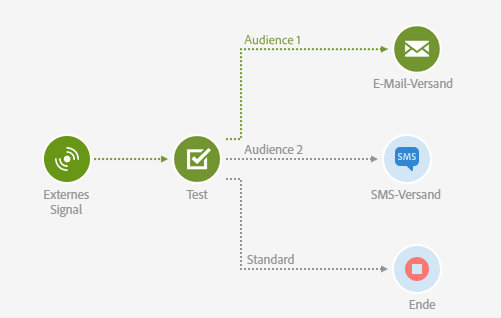
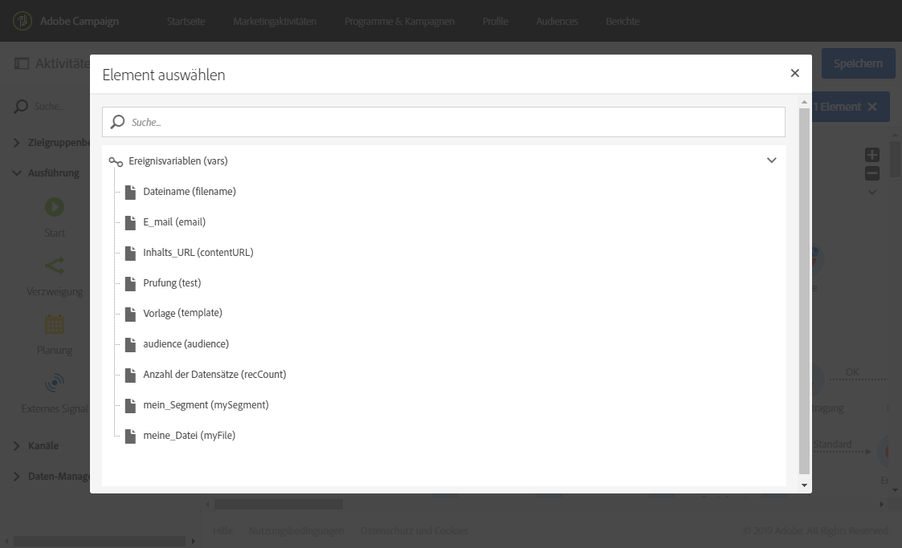
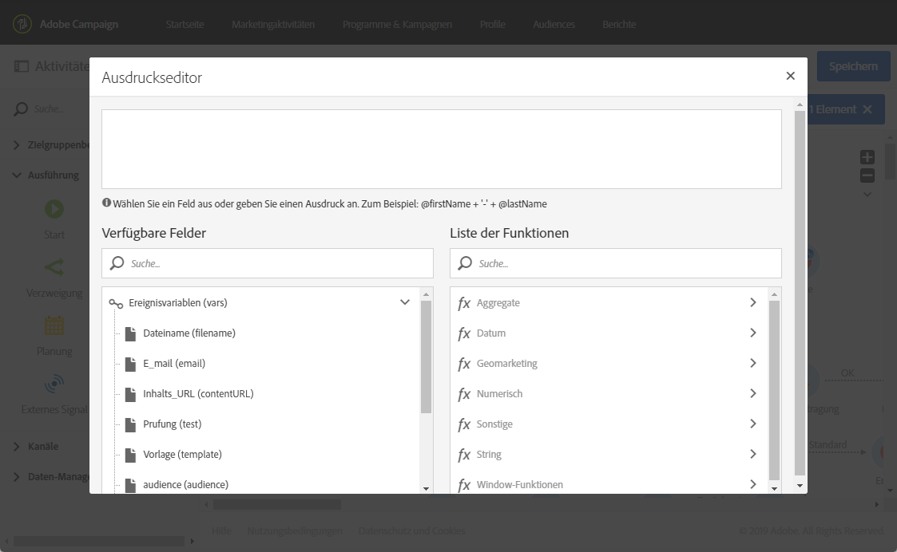

# Test{#test}

## Beschreibung {#description}

Die Aktivität **[!UICONTROL Test]** ermöglicht eine Transition auf der Basis eines Testergebnisses.

## Anwendungskontext {#context-of-use}

Mit einer **Test**-Aktivität wird die erste Transition aktiviert, die die damit verknüpfte Bedingung erfüllt.

Wenn keine Bedingung erfüllt wird und die Option **Use default transition** aktiviert ist, wird eine Standardtransition aktiviert.

Bedingungen können auf **Funktionen** oder **Variablen** basieren, z. B. Ereignisvariablen, die in der Workflow-Aktivität **[!UICONTROL Externes Signal]** deklariert wurden.

**Verwandte Themen:**

* [Funktionsliste](../../automating/using/list-of-functions.md)
* [Workflow mit externen Parametern aufrufen](../../automating/using/calling-a-workflow-with-external-parameters.md)

## Konfiguration {#configuration}

1. Ziehen Sie eine **[!UICONTROL Test]**-Aktivität in den Workflow-Arbeitsbereich.
1. Markieren Sie die Aktivität und öffnen Sie sie mithilfe der in der Schnellaktion angezeigten Schaltfläche .
1. Definieren Sie die Attribute einer jeden Bedingung:

   Zur Bearbeitung des Felds **[!UICONTROL Bedingung]** stehen zwei Schaltflächen zur Verfügung, mit denen Ereignisvariablen aufgerufen und Ausdrücke durch die Kombination von Variablen und Funktionen bearbeitet werden können:

   * : Wählen Sie die Ereignisvariable aus den im Workflow verfügbaren Variablen aus (siehe [diese Seite](../../automating/using/customizing-workflow-external-parameters.md)).

     Beispielsweise können Sie die Anzahl der heruntergeladenen Dateien nach einer [Dateiübertragungsaktivität](../../automating/using/transfer-file.md) mit der Variablen **[!UICONTROL filesCount]** überprüfen.

     

   * : Hier können Sie Ausdrücke durch eine Kombination von Variablen und Funktionen bearbeiten. Weiterführende Informationen zum Ausdruckseditor finden Sie in [diesem Abschnitt](../../automating/using/advanced-expression-editing.md).

     
