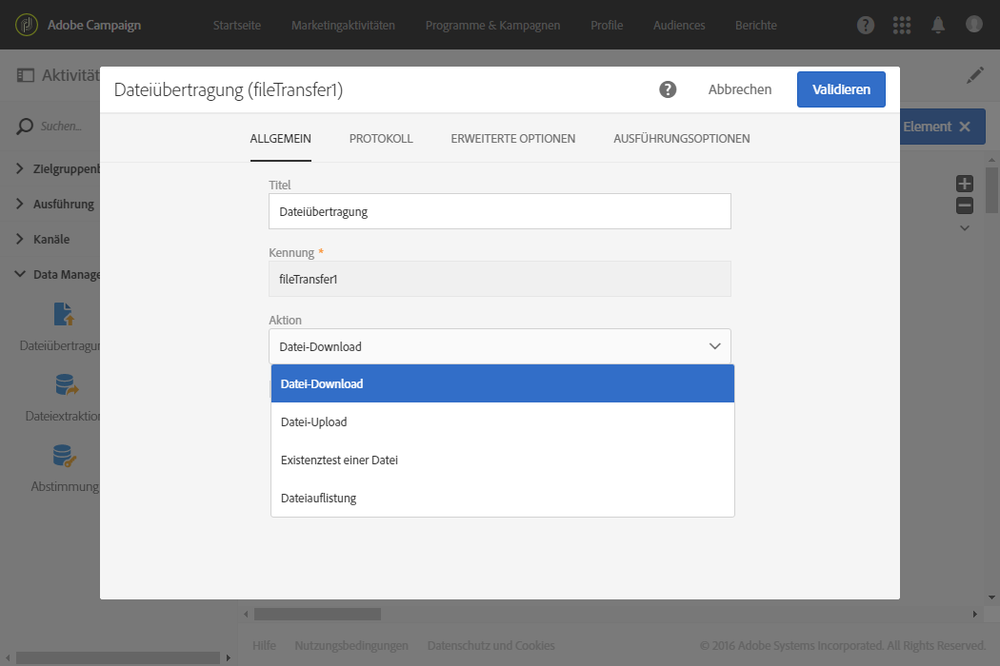
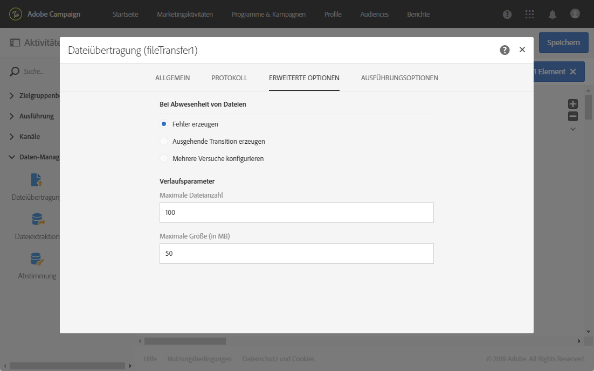
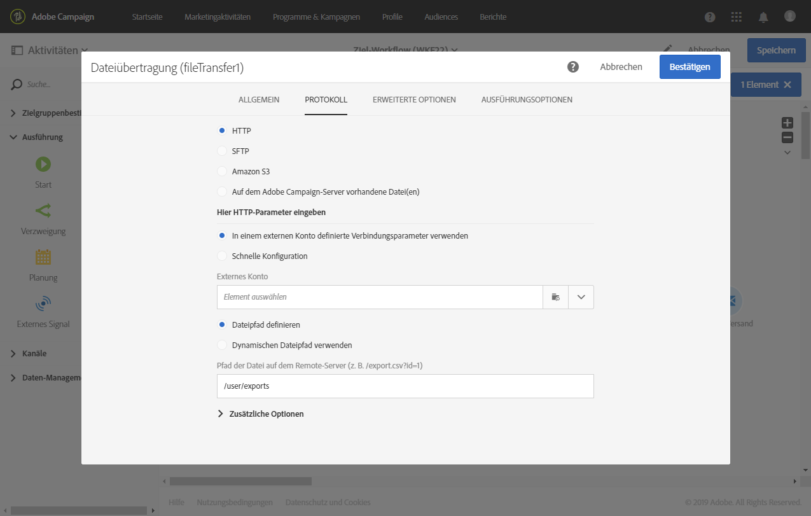
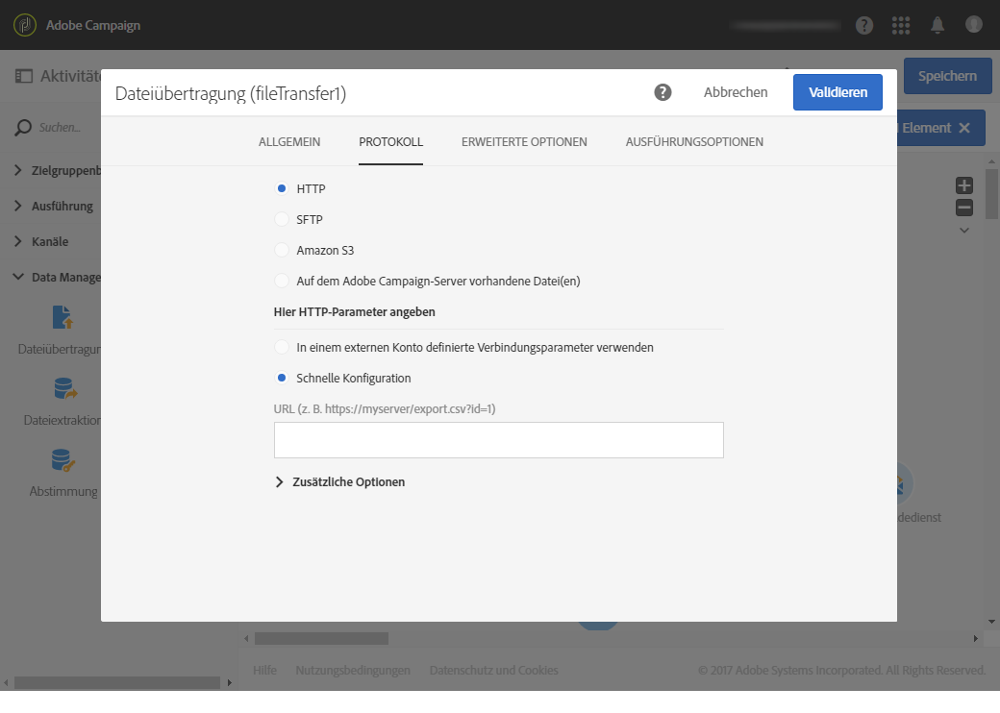
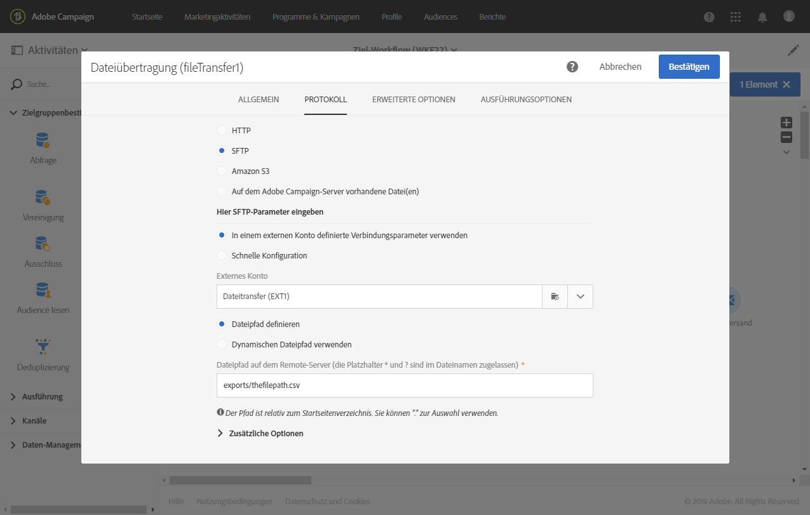
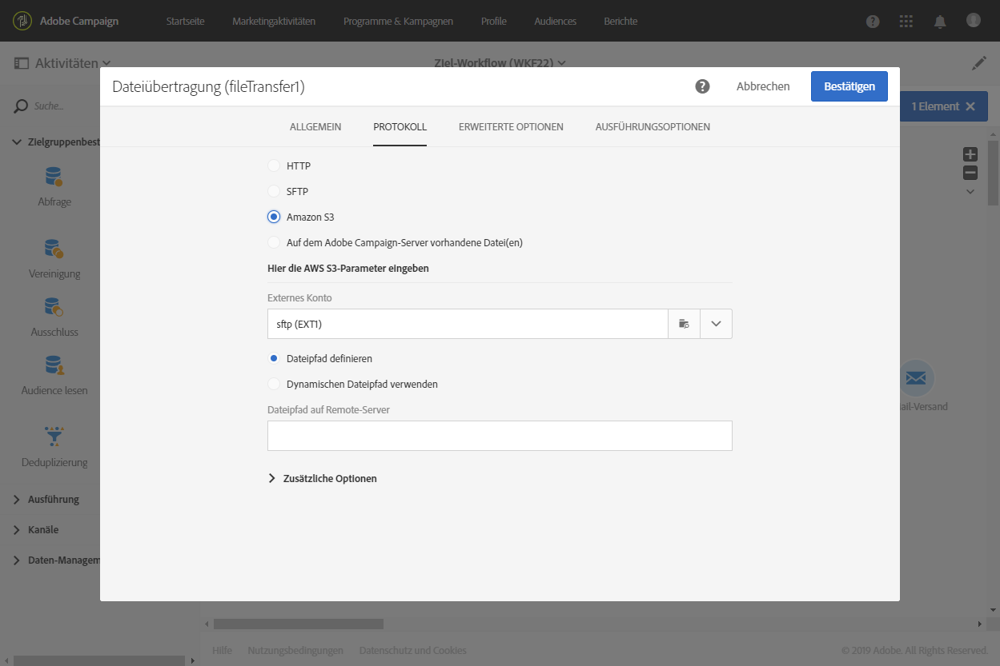
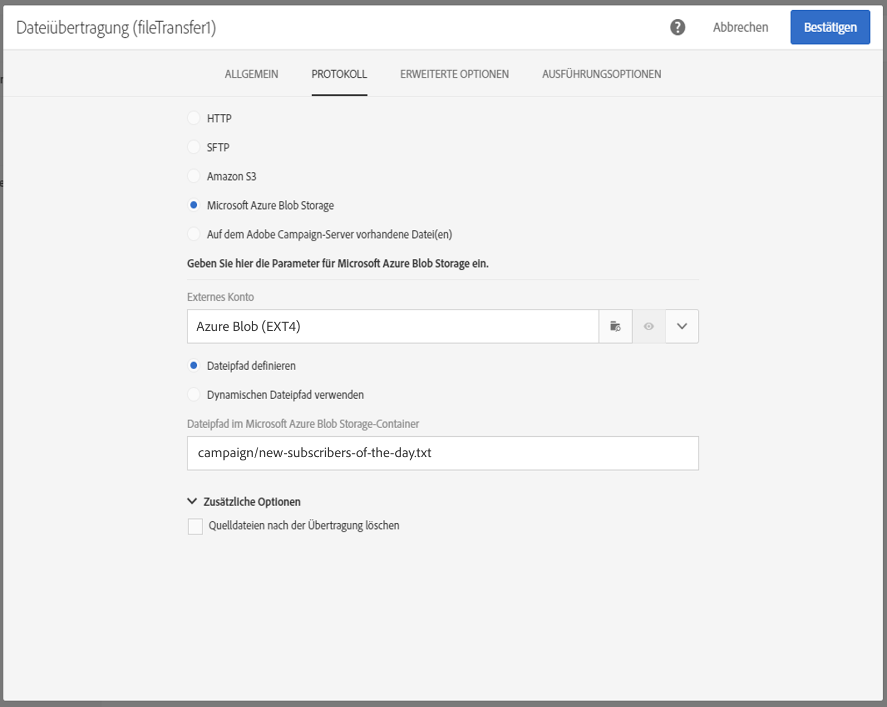

# Dateiübertragung{#transfer-file}

## Beschreibung {#description}

Die **[!UICONTROL Dateiübertragung]** dient dem Empfang und Versand von Dateien. Sie ermöglicht es des Weiteren, die Präsenz von Dateien zu testen und die in Adobe Campaign enthaltenen Dateien aufzulisten.

>[!CAUTION]
>
>Ab Version 20.3 werden mit der Aktivität **[!UICONTROL Dateiübertragung]** heruntergeladene Dateien nach X Tagen gelöscht, wobei X durch das Feld **[!UICONTROL Verlauf in Tagen]** unter dem Menü **[!UICONTROL Ausführung]** in den Workflow-Eigenschaften bestimmt wird.

## Anwendungskontext {#context-of-use}

Die Art der Datenextraktion wird im Zuge der Aktivitätskonfiguration definiert. Bei der zu ladenden Datei kann es sich z. B. um eine Kontaktliste handeln.

Sie können die Aktivität darüber hinaus dazu nutzen, Daten abzurufen, die im Anschluss mithilfe der **[!UICONTROL Datei laden]**-Aktivität strukturiert werden können.

## Konfiguration {#configuration}

1. Ziehen Sie eine **[!UICONTROL Dateiübertragung]** in den Workflow.
1. Markieren Sie die Aktivität und öffnen Sie sie mithilfe der im Schnellzugriff angezeigten Schaltfläche .
1. Wählen Sie mithilfe der entsprechenden Dropdown-Liste die von der Aktivität auszuführende **[!UICONTROL Aktion]** aus:

   

   * **Datei-Download** - dient dem Herunterladen von Dateien.
   * **Datei-Upload** - dient dem Hochladen von Dateien. Durch das Hochladen einer Datei aus Adobe Campaign wird im Menü **[!UICONTROL Export-Audits]** ein Protokolleintrag erstellt. Weiterführende Informationen zu Export-Audits finden Sie im Abschnitt [Log-Exporte überprüfen](../../administration/using/auditing-export-logs.md).
   * **Existenztest einer Datei** - dient der Prüfung des Vorhandenseins einer Datei.
   * **Dateiauflistung**: ermöglicht das Auflisten der auf dem Server vorhandenen Dateien, die auf dem Tab **[!UICONTROL Protokoll]** definiert sind. Diese Aktion wird hauptsächlich zum Debugging verwendet. So lässt sich überprüfen, ob die Aktivität Ihren Anforderungen entsprechend konfiguriert ist, bevor die Dateien vom Remote-Server heruntergeladen werden.

1. Wählen Sie das Protokoll aus, das Sie verwenden möchten:
   * [HTTP](#HTTP-configuration-wf)
   * [SFTP](#SFTP-configuration-wf)
   * [Amazon S3](#S3-configuration-wf)
   * [Microsoft Azure Blob Storage](#azure-blob-configuration-wf)
   * [Auf dem Adobe Campaign-Server vorhandene Datei(en)](#files-server-configuration-wf)

1. Im Bereich **[!UICONTROL Weitere Optionen]**, der je nach gewähltem Protokoll angezeigt wird, ist die Konfiguration weiterer Protokollparameter möglich. Sie haben folgende Möglichkeiten:

   * **[!UICONTROL Quelldateien nach der Übertragung löschen]**
   * **[!UICONTROL Passiven Modus deaktivieren]**
   * **[!UICONTROL Alle Dateien auflisten]**: Die Option ist bei Aktivierung der Aktion **[!UICONTROL Dateiauflistung]** im Tab **[!UICONTROL Allgemein]** auswählbar. Mithilfe dieser Option können alle auf dem Server verfügbaren Dateien in der Ereignisvariable **vars.filenames** verzeichnet werden. Darin sind die Dateinamen durch die Zeichen **&#39;n&#39;** getrennt.

1. Im Bereich **[!UICONTROL Bei Abwesenheit von Dateien]** des Tabs **[!UICONTROL Erweiterte Optionen]** können Sie bestimmen, was geschehen soll, wenn die gewünschten Dateien beim Start der Aktivität nicht auffindbar sind.

   Sie können darüber hinaus Neuversuche definieren. Die einzelnen Versuche erscheinen im Ausführungsprotokoll des Workflows.

   

1. Validieren Sie die Konfiguration der Aktivität und speichern Sie Ihren Workflow.

### Konfiguration mit HTTP {#HTTP-configuration-wf}

Das HTTP-Protokoll ermöglicht den Download einer Datei über ein externes Konto oder mithilfe einer URL.

Bei diesem Protokoll können Sie die Option **[!UICONTROL In einem externen Konto definierte Verbindungsparameter verwenden]** auswählen. Wählen Sie in diesem Fall das gewünschte Konto aus und geben Sie den Pfad der herunterzuladenden Datei an.

Sie können sich auch für die Option **[!UICONTROL Schnelle Konfiguration]** entscheiden. Sie müssen nur die URL in das URL-Feld eingeben.

### Konfiguration mit SFTP {#SFTP-configuration-wf}

Das SFTP-Protokoll ermöglicht den Download einer Datei mithilfe einer URL oder über ein externes Konto.

Bei diesem Protokoll können Sie die Option **[!UICONTROL In einem externen Konto definierte Verbindungsparameter verwenden]** auswählen; wählen Sie anschließend das gewünschte Konto aus und geben Sie den Pfad der herunterzuladenden Datei an.

>[!CAUTION]
>
>Platzhalter werden unterstützt.

Sie können sich auch für die Option **[!UICONTROL Schnelle Konfiguration]** entscheiden. Sie müssen nur die URL in das URL-Feld eingeben.

### Konfiguration mit Amazon S3 {#S3-configuration-wf}

Das S3-Protokoll ermöglicht den Download einer Datei über ein externes Konto oder mithilfe einer URL über den Amazon Simple Storage Service (S3).

1. Wählen Sie ein externes Amazon S3-Konto aus. Weiterführende Informationen hierzu finden Sie auf dieser [Seite](../../administration/using/external-accounts.md#amazon-s3-external-account).

2. Entscheiden Sie, ob Sie einen **[!UICONTROL Dateipfad definieren]** oder einen **[!UICONTROL Dynamischen Dateipfad verwenden]** möchten.

3. Geben Sie den Pfad der herunterzuladenden Datei an.

   

4. Wenn Sie Ihre Quelldateien nach Abschluss der Übertragung löschen möchten, aktivieren Sie die Option **[!UICONTROL Quelldateien nach der Übertragung löschen]**.

### Konfiguration mit Microsoft Azure Blob Storage {#azure-blob-configuration-wf}

Das Microsoft Azure Blob-Protokoll erlaubt Ihnen Zugriff auf einen Blob in einem Microsoft Azure Blob Storage-Konto.

1. Wählen Sie ein externes **[!UICONTROL Microsoft Azure Blob]**-Konto. Weiterführende Informationen hierzu finden Sie auf dieser [Seite](../../administration/using/external-accounts.md#microsoft-azure-external-account).

1. Entscheiden Sie, ob Sie einen **[!UICONTROL Dateipfad definieren]** oder einen **[!UICONTROL Dynamischen Dateipfad verwenden]** möchten.

   

1. Geben Sie den Pfad der herunterzuladenden Datei an; er kann mit verschiedenen Blobs übereinstimmen. In diesem Fall aktiviert die Aktivität **[!UICONTROL Dateiübertragung]** die ausgehende Transition einmal pro gefundenem Blob. Sie werden dann in alphabetischer Reihenfolge verarbeitet.

   >[!CAUTION]
   >
   >Platzhalter für das Finden mehrerer Dateinamen werden nicht unterstützt. Stattdessen müssen Sie ein Präfix eingeben. Alle Blob-Namen, die mit diesem Präfix übereinstimmen, sind geeignet.

   Nachfolgend finden Sie eine Liste mit Beispielen für Dateipfade:

   * **&quot;Campaign/&quot;**: findet alle Blobs im Ordner „Campaign“, der sich im Stammordner des Containers befindet.
   * **&quot;campaign/new-&quot;**: findet alle Blobs mit einem Dateinamen, der mit „new-“ beginnt und sich im Ordner „Campaign“ befindet.
   * **&quot;&quot;**: Wenn Sie einen leeren Pfad hinzufügen, können Sie alle im Container verfügbaren Blobs finden.

### Konfiguration mit Dateien, die auf dem Adobe Campaign-Server vorhanden sind {#files-server-configuration-wf}

Das Protokoll **[!UICONTROL Auf dem Adobe Campaign-Server vorhandene Datei(en)]** entspricht dem Repository, das die abzurufenden Dateien enthält.
Zur Filterung der Dateien ist die Verwendung von Platzhaltern oder Jokern (zum Beispiel * oder ?) möglich.

Entscheiden Sie, ob Sie einen **[!UICONTROL Dateipfad definieren]** oder einen **[!UICONTROL Dynamischen Dateipfad verwenden]** möchten. Mit der Option **[!UICONTROL Dynamischen Dateipfad verwenden]** können Sie einen Standardausdruck und Ereignisvariablen nutzen, um den Dateinamen für die Übertragung zu personalisieren. Weiterführende Informationen dazu finden Sie im Abschnitt [Anpassen von Aktivitäten mit Ereignisvariablen](../../automating/using/calling-a-workflow-with-external-parameters.md#customizing-activities-with-events-variables).

Hinweis: Der Pfad muss relativ zum Speicherort des Adobe Campaign-Servers angegeben werden. Die Dateien befinden sich im Verzeichnis **sftp&lt;yourinstancename>/**. Darüber hinaus können dem Speicherort übergeordnete Verzeichnisse nicht durchsucht werden. Beispiel:

    >**user&amp;lt;yourinstancename>/my_recipients.csv** ist richtig.
    >
    >**../hello/my_recipients.csv** ist falsch.
    >
    >**//myserver/hello/myrecipients.csv** ist falsch.

## Verlaufsparameter    {#historization-settings}

Jedes Mal, wenn die Aktivität **[!UICONTROL Dateiübertragung]** ausgeführt wird, werden die hoch- oder heruntergeladenen Dateien in einem bestimmten Ordner gespeichert. Für jede Aktivität **[!UICONTROL Dateiübertragung]** in einem Workflow wird ein Ordner erstellt. Deshalb ist es wichtig, die Größe dieses Ordners zu begrenzen, um physischen Platz auf dem Server zu sparen.

Zu diesem Zweck können Sie die **[!UICONTROL Verlaufsparameter]** in **[!UICONTROL Erweiterte Optionen]** der Aktivität **[!UICONTROL Dateiübertragung]** definieren.

**[!UICONTROL In Verlaufsparameter]** können Sie eine Höchstzahl an Dateien oder die Gesamtgröße des Ordners für die Aktivität definieren. Standardmäßig sind 100 Dateien und 50 MB zugelassen.

Jedes Mal, wenn die Aktivität ausgeführt wird, wird der Ordner folgendermaßen überprüft:

* Nur Dateien, die mehr als 24 Stunden vor der Durchführung der Aktivität erstellt wurden, werden berücksichtigt.
* Wenn die Anzahl der berücksichtigten Dateien größer ist als der Parameterwert **[!UICONTROL Maximale Dateianzahl]**, werden die ältesten Dateien gelöscht, bis die zulässige **[!UICONTROL Maximale Dateianzahl]** erreicht ist.
* Wenn die Gesamtzahl der berücksichtigten Dateien größer ist als der Wert des Parameters **[!UICONTROL Maximale Größe (in MB)]**, werden die ältesten Dateien gelöscht, bis die zulässige **[!UICONTROL Maximale Größe (in MB)]** erreicht ist.

>[!NOTE]
>
>Wenn die Aktivität nicht ausgeführt wird, wird der Ordner weder überprüft noch geleert. Seien Sie deshalb achtsam beim Transfer großer Dateien.

## Beispiel    {#example}

Das folgende Beispiel zeigt die Konfiguration einer **Dateiübertragung**-Aktivität, die von einer **Datei laden**-Aktivität und schließlich von einer **Daten-Update**-Aktivität gefolgt wird. Ziel ist die Anreicherung der Adobe-Campaign-Datenbank mit neuen Profilen und gegebenenfalls die Aktualisierung existierender Profile mit den durch den Workflow abgerufenen Daten.

1. Ziehen Sie eine **Dateiübertragung** in den Workflow-Arbeitsbereich.
1. Markieren Sie die Aktivität und öffnen Sie sie mithilfe der im Schnellzugriff angezeigten Schaltfläche .
1. Wählen Sie im **[!UICONTROL Protokoll]**-Tab **SFTP** aus.
1. Aktivieren Sie die Option **In einem externen Konto definierte Verbindungsparameter verwenden**.
1. Geben Sie den Namen des externen Kontos an.
1. Geben Sie den **Pfad der Dateien auf dem Remote-Server** an.

   

1. Validieren Sie die Aktivität und speichern Sie den Workflow.

