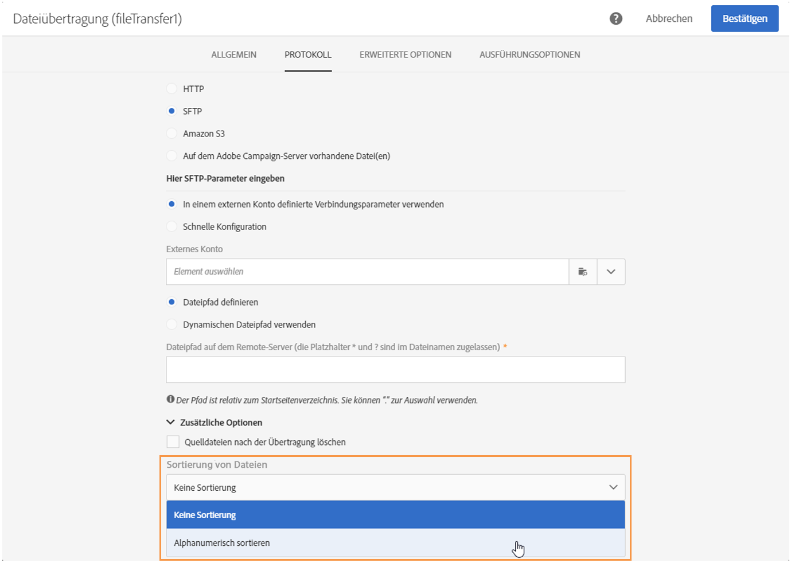

# Dateiübertragung{#transfer-file}

## Beschreibung {#description}

Die **[!UICONTROL Dateiübertragung]**dient dem Empfang und Versand von Dateien. Sie ermöglicht es des Weiteren, die Präsenz von Dateien zu testen und die in Adobe Campaign enthaltenen Dateien aufzulisten.

## Anwendungskontext {#context-of-use}

Die Art der Datenextraktion wird im Zuge der Aktivitätskonfiguration definiert. Bei der zu ladenden Datei kann es sich z. B. um eine Kontaktliste handeln.

Sie können die Aktivität darüber hinaus dazu nutzen, Daten abzurufen, die im Anschluss mithilfe der **[!UICONTROL Datei laden]**-Aktivität strukturiert werden können.

## Konfiguration {#configuration}

1. Ziehen Sie eine **[!UICONTROL Dateiübertragung]**in den Workflow-Arbeitsbereich.
1. Markieren Sie die Aktivität und öffnen Sie sie mithilfe der in den Quick Actions angezeigten Schaltfläche .
1. Wählen Sie mithilfe der entsprechenden Dropdown-Liste die von der Aktivität auszuführende **[!UICONTROL Aktion]**aus:

   

   * **Datei-Download** - dient dem Herunterladen von Dateien.
   * **Datei-Upload** - dient dem Hochladen von Dateien. Durch das Hochladen einer Datei aus Adobe Campaign wird im Menü **[!UICONTROL Export-Audits]**ein Protokolleintrag erstellt. Weiterführende Informationen zu Export-Audits finden Sie im Abschnitt[Log-Exporte überprüfen](../../administration/using/auditing-export-logs.md).
   * **Existenztest einer Datei** - dient der Prüfung des Vorhandenseins einer Datei.
   * **Dateiauflistung** - dient der Auflistung der in Adobe Campaign enthaltenen Dateien.
   Je nach ausgewählter Aktion stehen verschiedene Protokolle zur Verfügung:

   * **HTTP** - ermöglicht den Download einer Datei über ein externes Konto oder mithilfe einer URL.

      * Kreuzen Sie die Option **[!UICONTROL In einem externen Konto definierte Verbindungsparameter verwenden]**an, wählen Sie das entsprechende externe Konto aus und geben Sie den Pfad der herunterzuladenden Datei an.

         

      * Kreuzen Sie die Option **[!UICONTROL Schnelle Konfiguration]**an und geben Sie die URL im entsprechenden Feld ein.

         
   * **S3** – ermöglicht den Download einer Datei über ein externes Konto oder mithilfe einer URL über den Amazon Simple Storage Service (S3).

      * Wählen Sie ein externes Konto aus und geben Sie den Pfad der herunterzuladenden Datei an.

         
   * **SFTP**: Dieses Protokoll ermöglicht den Download einer Datei mithilfe einer URL oder über ein externes Konto.

      * Kreuzen Sie die Option **[!UICONTROL In einem externen Konto definierte Verbindungsparameter verwenden]**an, wählen Sie das entsprechende externe Konto aus und geben Sie den Pfad der herunterzuladenden Datei an.

         

         >[!CAUTION]
         >
         >Die Verwendung von Platzhaltern ist möglich.

      * Kreuzen Sie die Option **[!UICONTROL Schnelle Konfiguration]**an und geben Sie die URL im entsprechenden Feld ein.
      * Wenn Sie die importierten Dateien sortieren möchten, wählen Sie die Option **[!UICONTROL Alphanumerisch sortieren]**im Bereich**[!UICONTROL  Zusätzliche Optionen]** aus. Die Dateien werden daraufhin in der angegebenen Reihenfolge verarbeitet.

         
   * **Datei(en) vom Adobe-Campaign-Server** - entspricht dem Verzeichnis, das die abzurufenden Dateien enthält.

      Zur Filterung der Dateien ist die Verwendung von Platzhaltern oder Jokern (zum Beispiel * oder ?) möglich.

      Füllen Sie das entsprechende Feld aus und validieren Sie die Aktivität, um dieses Protokoll zu verwenden.

      >[!NOTE]
      >
      >Der Pfad muss relativ zum Speicherort des Adobe-Campaign-Servers angegeben werden. Die Dateien befinden sich im Verzeichnis **sftp&lt;yourinstancename>/**. Darüber hinaus können dem Speicherort übergeordnete Verzeichnisse nicht durchsucht werden. Beispiel:

      >**user&lt;yourinstancename>/my_recipients.csv** ist korrekt.
      **../hello/my_recipients.csv** ist inkorrekt.
      **//myserver/hello/myrecipients.csv** ist inkorrekt.
   Wählen Sie das gewünschte Protokoll aus und machen Sie die erforderlichen Angaben.

   Mit der Option **[!UICONTROL Dynamischen Dateipfad verwenden]**, die für jedes Protokoll verfügbar ist, können Sie einen Standardausdruck und Ereignisvariablen verwenden, um den Namen der zu übertragenden Datei zu personalisieren. Weiterführende Informationen dazu finden Sie im Abschnitt[Aktivitäten mit Ereignisvariablen anpassen](../../automating/using/calling-a-workflow-with-external-parameters.md#customizing-activities-with-events-variables).

1. Im Bereich **[!UICONTROL Weitere Optionen]**, der je nach gewähltem Protokoll angezeigt wird, ist die Konfiguration weiterer Protokollparameter möglich. Sie haben folgende Möglichkeiten:

   * **[!UICONTROL Quelldateien nach der Übertragung löschen]**
   * **[!UICONTROL Passiven Modus deaktivieren]**
   * **[!UICONTROL Alle Dateien auflisten]**- bei Aktivierung der Aktion**[!UICONTROL  Dateiauflistung]** auswählbar. Mithilfe dieser Option können alle auf dem Server verfügbaren Dateien in der Ereignisvariable **vars.filenames** verzeichnet werden. Darin sind die Dateinamen durch die Zeichenfolge **&#39;n&#39;** getrennt.

1. Im Bereich **[!UICONTROL Bei Abwesenheit von Dateien]**des Tabs**[!UICONTROL  Erweiterte Optionen]** können Sie bestimmen, was geschehen soll, wenn die gewünschten Dateien beim Start der Aktivität nicht auffindbar sind.

   Sie können darüber hinaus Neuversuche definieren. Die einzelnen Versuche erscheinen im Ausführungsprotokoll des Workflows.

   

1. Validieren Sie die Konfiguration der Aktivität und speichern Sie Ihren Workflow.

## Verlaufsparameter {#historization-settings}

Jedes Mal, wenn die Aktivität **[!UICONTROL Dateiübertragung]**ausgeführt wird, werden die hoch- oder heruntergeladenen Dateien in einem bestimmten Ordner gespeichert. Für jede Aktivität**[!UICONTROL  Dateiübertragung]** in einem Workflow wird ein Ordner erstellt. Deshalb ist es wichtig, die Größe dieses Ordners zu begrenzen, um physischen Platz auf dem Server zu sparen.

Zu diesem Zweck können Sie die **[!UICONTROL Verlaufsparameter]**in**[!UICONTROL  Erweiterte Optionen]** der Aktivität **[!UICONTROL Dateiübertragung]**definieren.

**[!UICONTROL In Verlaufsparameter]**können Sie eine Höchstzahl an Dateien oder die Gesamtgröße des Ordners für die Aktivität definieren. Standardmäßig sind 100 Dateien und 50 MB zugelassen.

Jedes Mal, wenn die Aktivität ausgeführt wird, wird der Ordner folgendermaßen überprüft:

* Nur Dateien, die mehr als 24 Stunden vor der Durchführung der Aktivität erstellt wurden, werden berücksichtigt.
* Wenn die Anzahl der berücksichtigten Dateien größer ist als der Parameterwert **[!UICONTROL Maximale Dateianzahl]**, werden die ältesten Dateien gelöscht, bis die zulässige**[!UICONTROL  Maximale Dateianzahl]** erreicht ist.
* Wenn die Gesamtzahl der berücksichtigten Dateien größer ist als der Wert des Parameters **[!UICONTROL Maximale Größe (in MB)]**, werden die ältesten Dateien gelöscht, bis die zulässige**[!UICONTROL  Maximale Größe (in MB)]** erreicht ist.

>[!NOTE]
Wenn die Aktivität nicht ausgeführt wird, wird der Ordner weder überprüft noch geleert. Seien Sie deshalb achtsam beim Transfer großer Dateien.

## Beispiel {#example}

Das folgende Beispiel zeigt die Konfiguration einer **Dateiübertragung**-Aktivität, die von einer **Datei laden**-Aktivität und schließlich von einer **Daten-Update**-Aktivität gefolgt wird. Ziel ist die Anreicherung der Adobe-Campaign-Datenbank mit neuen Profilen und gegebenenfalls die Aktualisierung existierender Profile mit den durch den Workflow abgerufenen Daten.

1. Ziehen Sie eine **Dateiübertragung** in den Workflow-Arbeitsbereich.
1. Markieren Sie die Aktivität und öffnen Sie sie mithilfe der in den Quick Actions angezeigten Schaltfläche .
1. Wählen Sie im **[!UICONTROL Protokoll]**-Tab** SFTP **aus.
1. Aktivieren Sie die Option **In einem externen Konto definierte Verbindungsparameter verwenden**.
1. Geben Sie den Namen des externen Kontos an.
1. Geben Sie den **Pfad der Dateien auf dem Remote-Server** an.

   

1. Validieren Sie die Aktivität und speichern Sie den Workflow.

