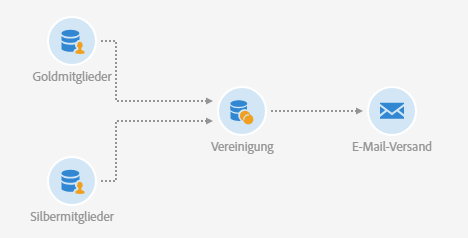

# Vereinigung von zwei eingegrenzten Audiences {#example--union-on-two-refined-audiences}

In diesem Beispiel werden im Workflow zwei **[!UICONTROL Audience lesen]**-Aktivitäten vereint. Ziel dieses Workflows ist es, eine E-Mail an Gold- oder Silber-Mitglieder zu senden, die zwischen 18 und 30 Jahre alt sind. Spezifische Audiences wurden im System bereits erstellt, um Gold- und Silber-Mitglieder zu erfassen.

Der Workflow setzt sich folgendermaßen zusammen:

* Eine erste [Audience lesen](../../automating/using/read-audience.md)-Aktivität ruft die Audience der Gold-Mitglieder ab und schränkt sie ein, indem nur Profile zwischen 18 und 30 Jahren ausgewählt werden.
* Eine zweite **[!UICONTROL Audience lesen]**-Aktivität ruft die Audience der Silber-Mitglieder ab und schränkt sie ein, indem nur Profile zwischen 18 und 30 Jahren ausgewählt werden.
* Die Aktivität [Vereinigung](../../automating/using/union.md) fasst die Populationen der beiden **[!UICONTROL Audience lesen]**-Aktivitäten zu einer endgültigen Population zusammen.
* Die Aktivität [E-Mail-Versand](../../automating/using/email-delivery.md) sendet E-Mails an die Population der Aktivität **[!UICONTROL Vereinigung]**.
