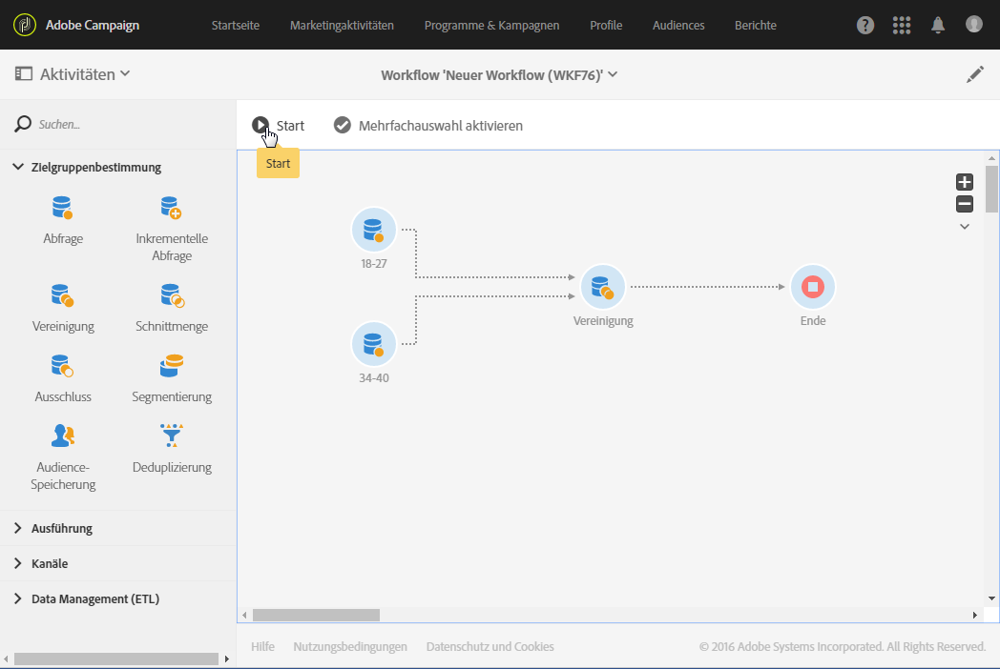

# Vereinigung{#union}

## Beschreibung {#description}

Eine **[!UICONTROL Vereinigung]** dient der Zusammenfassung der Ergebnisse mehrerer Aktivitäten in einer Zielgruppe.

>[!NOTE]
>
>Dabei müssen die Mengen nicht zwingend homogen sein.

## Anwendungskontext      {#context-of-use}

Eine **[!UICONTROL Vereinigung]** wird insbesondere im Rahmen einer Segmentierung, einer Audience-Erstellung oder der Zielgruppenbestimmung verwendet, um die Populationen der eingehenden Transitionen zusammenzuführen.

**Verwandte Themen:**

* [Anwendungsfall: Vereinigung von zwei eingegrenzten Zielgruppen](../../automating/using/union-on-two-refined-audiences.md)

## Konfiguration {#configuration}

1. Ziehen Sie eine **[!UICONTROL Vereinigung]** in den Workflow-Arbeitsbereich.
1. Schließen Sie sie an Aktivitäten wie beispielsweise Abfragen an.
1. Markieren Sie die Aktivität und öffnen Sie sie mithilfe der in der Schnellaktion angezeigten Schaltfläche .
1. Wählen Sie nun den **[!UICONTROL Abstimmtyp]**, um den Umgang mit Duplikaten zu definieren, die aus dem Aufeinandertreffen der eingehenden Populationen stammen:

   * **[!UICONTROL Nur die Schlüssel]** – Standardmodus; die Aktivität behält nur eines der Elemente bei, wenn mehrere aus verschiedenen eingehenden Transitionen stammende Elemente denselben Schlüssel aufweisen. Diese Option kann nur verwendet werden, wenn die eingehenden Populationen homogen sind.
   * **[!UICONTROL Alle gemeinsamen Spalten]** – die Abstimmung erfolgt auf Basis aller Spalten, die in allen eingehenden Transitionen enthalten sind. In diesem Fall ist die Hauptmenge anzugeben, deren Datensatz im Fall eines Duplikats beibehalten wird. Diese Option bietet sich insbesondere an, wenn die eingehenden Populationen unterschiedliche Zielgruppendimensionen aufweisen.
   * **[!UICONTROL Auswahl an Spalten]** – die Abstimmung erfolgt auf Basis der von Ihnen angegebenen Spalten. Wählen Sie zunächst die die Quelldaten enthaltende Hauptmenge aus und dann die für die Herstellung der Relation zu verwendenden Spalten.

1. Kreuzen Sie die Option **[!UICONTROL Nur gemeinsame Zusatzdaten verwenden]** an, wenn Sie nur die in allen eingehenden Transitionen enthaltenen Zusatzdaten beibehalten möchten.
1. Bei Bedarf können Sie außerdem die Option **[!UICONTROL Größe der erzeugten Population begrenzen]** aktivieren. Geben Sie in diesem Fall im Feld **[!UICONTROL Maximale Datensatzanzahl]** die Anzahl an beizubehaltenden Empfängern an.
1. Bei Bedarf können Sie unter Verwendung von [Transitionen](../../automating/using/activity-properties.md) auf erweiterte Optionen zur berechneten Population zugreifen.
1. Validieren Sie die Konfiguration der Aktivität und speichern Sie Ihren Workflow.

## Beispiel  {#example}

Unten stehende Abbildung zeigt die Vereinigung von zwei Abfrageaktivitäten, die alle Profile der Adobe Campaign-Datenbank abrufen, die zwischen 18 und 27 bzw. 34 und 40 Jahre alt sind. Das Ergebnis enthält alle Profile aus den beiden Abfragen bzw. die im vorangehenden Schritt definierte Anzahl.

