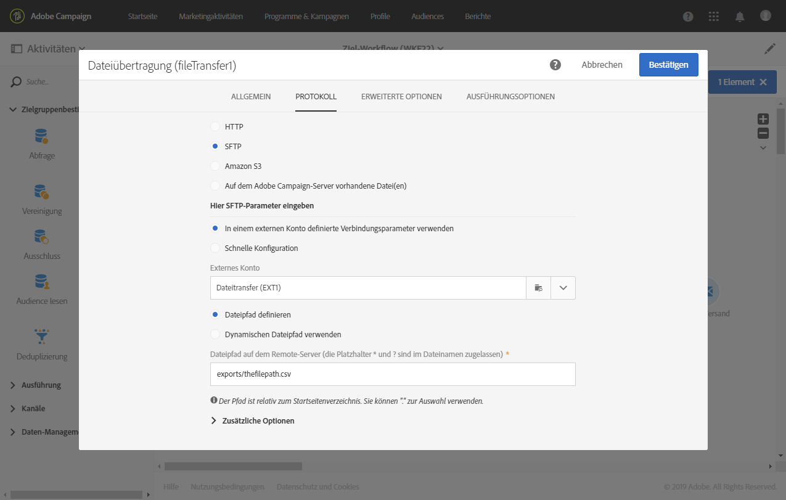

# Daten basierend auf einem automatischen Datei-Download aktualisieren {#updating-data-automatic-file-download}

Die Ladeaktivität dient in erster Linie der Strukturierung von Daten, die mithilfe der Dateiübertragung in die bereits in der Datenbank vorhandenen Daten integriert werden sollen.

Das folgende Beispiel zeigt das Laden einer Datei, die mithilfe einer Dateiübertragung abgerufen wurde. Im Anschluss erlauben die enthaltenen Daten die Aktualisierung der Datenbank. Dieser Workflow dient der Profilanreicherung der Adobe-Campaign-Datenbank oder der Aktualisierung bereits existierender Profile anhand aus der importierten Datei stammender Daten.

Gehen Sie wie folgt vor, um den Workflow zu erstellen:

1. Ziehen Sie eine [Dateiübertragung](../../automating/using/transfer-file.md) in den Workflow-Arbeitsbereich.
1. Markieren Sie die Aktivität und öffnen Sie sie mithilfe der im Schnellzugriff angezeigten Schaltfläche .
1. Konfigurieren Sie die Aktivität so, dass sie die gewünschte Datei abruft. Wählen Sie im **[!UICONTROL Protokoll]**-Tab **SFTP** aus.
1. Aktivieren Sie die Option **In einem externen Konto definierte Verbindungsparameter verwenden**.
1. Geben Sie den Namen des externen Kontos an.
1. Geben Sie den **Pfad der Dateien auf dem Remote-Server** an.

   

1. Validieren Sie die Aktivität.
1. Schließen Sie eine [Datei laden](../../automating/using/load-file.md)-Aktivität an die Aktivität **[!UICONTROL Dateiübertragung]** an.
1. Markieren Sie die Aktivität und öffnen Sie sie mithilfe der in den Quick Actions angezeigten Schaltfläche .
1. Aktivieren Sie im Tab **[!UICONTROL Ausführung]** im Bereich **[!UICONTROL Zu ladende Datei]** die Option **[!UICONTROL Datei der eingehenden Transition verwenden]**.

   

1. Konfigurieren Sie die Aktivität wie oben beschrieben.
1. Schließen Sie nun ein [Daten-Update](../../automating/using/update-data.md) an die **[!UICONTROL Datei laden]**-Aktivität an und konfigurieren Sie es.

Starten Sie den Workflow. Die gewünschte Datei wird geladen, die Daten werden extrahiert und die Adobe-Campaign-Datenbank wird angereichert.
