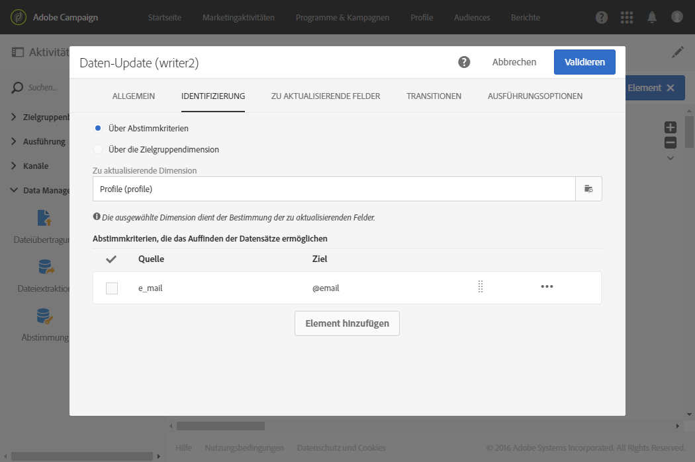
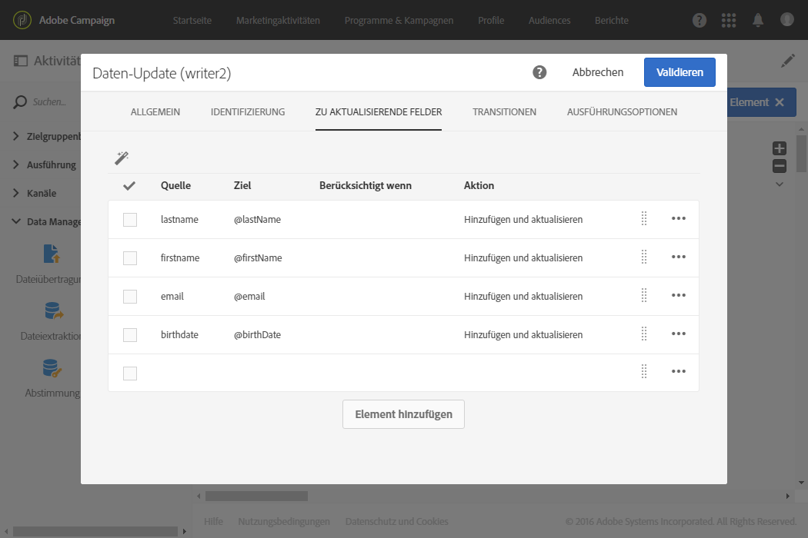

# Datenbank mit externen Daten aktualisieren {#update-database-file}

Im folgenden Beispiel wird die Konfiguration eines **[!UICONTROL Daten-Updates]** im Anschluss an eine **[!UICONTROL Datei laden]**-Aktivität dargestellt. Ziel ist die Anreicherung der Adobe-Campaign-Datenbank mit neuen Profilen und gegebenenfalls die Aktualisierung existierender Profile mit den in der importierten Datei enthaltenen Daten.

In diesem Beispiel wird die **E-Mail-Adresse** als Abstimmschlüssel verwendet. Die in der Aktivität [Datei laden](../../automating/using/load-file.md) geladene Datei ist eine **.txt** -Formatdatei mit den folgenden Beispieldaten:

```
lastname;firstname;email;birthdate
jackman;megan;megan.jackman@testmail.com;07/08/1975
phillips;edward;phillips@testmail.com;09/03/1986
weaver;justin;justin_w@testmail.com;11/15/1990
martin;babeth;babeth_martin@testmail.net;11/25/1964
reese;richard;rreese@testmail.com;02/08/1987
cage;nathalie;cage.nathalie227@testmail.com;07/03/1989
xiuxiu;andrea;andrea.xiuxiu@testmail.com;09/12/1992
grimes;daryl;daryl_890@testmail.com;12/06/1979
tycoon;tyreese;tyreese_t@testmail.net;10/08/1971
```

Die Aktivität [Daten-Update](../../automating/using/update-data.md) wurde wie folgt konfiguriert:




