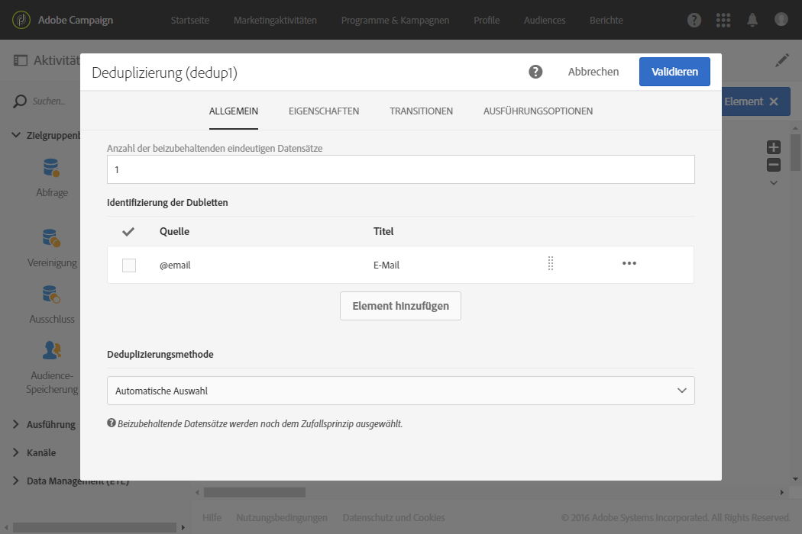

# Mehrere Abonnementstatus über eine Datei aktualisieren {#updating-multiple-subscription-statuses-from-a-file}

Dieses Beispiel zeigt, wie eine Datei mit Profilen importiert wird und ihre Anmeldungen bei mehreren in der Datei spezifizierten Diensten durchgeführt werden. Auf den Dateiimport muss eine Abstimmungsaktivität folgen, damit die importierten Daten als Profile mit einer Verknüpfung zu Diensten identifiziert werden können. Um sicherzustellen, dass sich keine Dubletten in der Datei befinden, wird eine Deduplizierung auf die Daten angewendet.

Der Workflow stellt sich folgendermaßen dar:


* [Datei laden](../../automating/using/load-file.md)-Aktivität zum Laden der Profildatei und zur Definition der Struktur der importierten Spalten.

   In unserem Beispiel weist die geladene Datei das .csv-Format auf und enthält folgende Daten:

   ```
   lastname;firstname;email;birthdate;service;operation
   jackman;megan;megan.jackman@testmail.com;07/08/1975;SVC2;sub
   phillips;edward;phillips@testmail.com;09/03/1986;SVC3;unsub
   weaver;justin;justin_w@testmail.com;11/15/1990;SVC3;sub
   martin;babeth;babeth_martin@testmail.net;11/25/1964;SVC3;unsub
   reese;richard;rreese@testmail.com;02/08/1987;SVC3;sub
   cage;nathalie;cage.nathalie227@testmail.com;07/03/1989;SVC3;sub
   xiuxiu;andrea;andrea.xiuxiu@testmail.com;09/12/1992;SVC4;sub
   grimes;daryl;daryl_890@testmail.com;12/06/1979;SVC3;unsub
   tycoon;tyreese;tyreese_t@testmail.net;10/08/1971;SVC2;sub
   ```

   

   Der Vorgang wird in der Datei als &quot;sub&quot; oder &quot;unsub&quot; spezifiziert. Vom System wird ein **boolescher** Wert oder eine **Integer** erwartet, der/die angibt, welcher Vorgang ausgeführt werden soll: Mit &quot;0&quot; wird eine Abmeldung vorgenommen und mit &quot;1&quot; eine Anmeldung. Um diesen Anforderungen zu entsprechen, wird eine Neukodifizierung der Werte im Detail der Spalte &quot;Vorgang&quot; durchgeführt.

   

   Wenn in Ihrer Datei der Vorgang bereits mit &quot;0&quot; und &quot;1&quot; spezifiziert ist, müssen Sie diese Werte nicht erneut kodifizieren. Achten Sie nur darauf, dass die Spalte im Tab **Spaltendefinition** als **Boolesch** oder **[!UICONTROL Integer]** verarbeitet wird.

* Mit der Aktivität [Abstimmung](../../automating/using/reconciliation.md) werden die Daten der Datei als der Profildimension der Adobe Campaign-Datenbank zugehörig identifiziert. Im Tab **[!UICONTROL Identifizierung]** wird das **email**-Feld der Datei dem **email**-Feld der Profilressource zugeordnet.

   

   Im Tab **[!UICONTROL Relationen]** wird eine Verknüpfung mit der Dienstressource erstellt, damit das **service**-Feld der Datei erkannt wird. In unserem Beispiel werden die Werte mit dem **name**-Feld der Dienstressource abgestimmt.

   

* Eine [Deduplizierung](../../automating/using/deduplication.md) zur Identifizierung eventueller Dubletten wird auf der Basis des **email**-Felds der (aus der Abstimmung hervorgegangenen) temporären Ressource durchgeführt. Die Eliminierung von Dubletten ist wichtig, da andernfalls die Anmeldung für einen Dienst für alle Daten fehlschlägt.

   

* Mit der Aktivität [Anmeldedienste](../../automating/using/subscription-services.md) werden die zu aktualisierenden, von der Transition stammenden Dienste über die in der Aktivität **[!UICONTROL Abstimmung]** erstellte Verknüpfung identifiziert.

   Der **[!UICONTROL Kampagnentyp]** wird über das **operation**-Feld der Datei identifiziert. Hier können nur die Felder „Boolesch“ oder „Integer“ ausgewählt werden. Wenn die Spalte Ihrer Datei, die den auszuführenden Vorgang enthält, nicht in der Liste erscheint, vergewissern Sie sich, dass Sie Ihr Spaltenformat in der Aktivität **[!UICONTROL Datei laden]** richtig eingerichtet haben, wie zuvor in diesem Beispiel erläutert.

   
