# Anwendungsbeispiel {#use-case}

Im folgenden Anwendungsbeispiel wird gezeigt, wie Sie einen Workflow mit Parametern innerhalb Ihrer Workflows abrufen können.

Dabei soll ein Workflow durch einen API-Aufruf mit externen Parametern ausgelöst werden. Durch diesen Workflow werden aus einer Datei Daten in Ihre Datenbank geladen und eine entsprechende Zielgruppe erstellt. Nach der Erstellung der Zielgruppe wird ein zweiter Workflow ausgelöst, durch den eine Nachricht gesendet wird, die mit den externen, im API-Aufruf definierten Parametern personalisiert wurde.

Führen Sie dazu folgende Aktionen aus:

1. Führen Sie einen **API-Aufruf** aus, um Workflow 1 mit externen Parametern auszulösen. Siehe [Schritt 1: API-Aufruf konfigurieren](../../automating/using/use-case-calling-workflow.md#step-1--configuring-the-api-call).
1. **Erstellen Sie Workflow 1**: Mit dem Workflow wird eine Datei übertragen und in die Datenbank geladen. Danach wird getestet, ob die Daten leer sind oder nicht, und schließlich werden die Profile in der Zielgruppe gespeichert. Abschließend wird Workflow 2 ausgelöst. Siehe [Schritt 2: Workflow 1 konfigurieren](../../automating/using/use-case-calling-workflow.md#step-2--configuring-workflow-1).
1. **Erstellen Sie Workflow 2**: Mit diesem Workflow wird die Zielgruppe gelesen, die in Workflow 1 erstellt wurde. Danach wird eine personalisierte Nachricht an die Profile gesendet, wobei ein Segment-Code verwendet wird, in den die Parameter eingefügt werden. Siehe [Schritt 3: Workflow 2 konfigurieren](../../automating/using/use-case-calling-workflow.md#step-3--configuring-workflow-2).


## Voraussetzungen {#prerequisites}

Vor dem Konfigurieren des Workflows müssen Workflow 1 und 2 jeweils mit der Aktivität **[!UICONTROL Externes Signal]** erstellt werden. Auf diese Weise können Sie diese Signalaktivitäten auswählen, wenn Sie die Workflows aufrufen.

## Schritt 1: API-Aufruf konfigurieren        {#step-1--configuring-the-api-call}

Führen Sie einen API-Aufruf aus, um Workflow 1 mit Parametern auszulösen. Weiterführende Informationen zur Syntax des API-Aufrufs finden Sie in der [Dokumentation zu Campaign Standard-REST-APIs](../../api/using/triggering-a-signal-activity.md).

In diesem Beispiel soll der Workflow mit den unten stehenden Parametern aufgerufen werden:

* **fileToTarget**: der Name der Datei, die in die Datenbank importiert werden soll.
* **discountDesc**: die Beschreibung, die im Versand für den Rabatt angezeigt werden soll.

```
-X POST https://mc.adobe.io/<ORGANIZATION>/campaign/<TRIGGER_URL>
-H 'Authorization: Bearer <ACCESS_TOKEN>' 
-H 'Cache-Control: no-cache' 
-H 'X-Api-Key: <API_KEY>' 
-H 'Content-Type: application/json;charset=utf-8' 
-H 'Content-Length:79' 
-i
-d {
-d "source:":"API",
-d "parameters":{
-d "fileToTarget":"profile.txt",
-d "discountDesc":"Running shoes"
-d } 
```

## Schritt 2: Workflow 1 konfigurieren        {#step-2--configuring-workflow-1}

Workflow 1 wird folgendermaßen erstellt:

* **[!UICONTROL Aktivität Externes Signal]**; Hier müssen die externen Parameter deklariert werden, damit sie im Workflow verwendet werden können.
* **[!UICONTROL Aktivität Dateiübertragung]**: Importiert die Datei mit dem in den Parametern definierten Namen.
* Aktivität **[!UICONTROL Datei laden]**: Lädt Daten aus der importierten Datei in die Datenbank.
* **[!UICONTROL Aktivität Daten-Update]**: Fügt Daten aus der importierten Datei in die Datenbank ein oder aktualisiert die Datenbank.
* **[!UICONTROL Aktivität Test]**: Prüft, ob importierte Daten verfügbar sind.
* **[!UICONTROL Zielgruppe-speichern]**-Aktivität: Wenn die Datei Daten enthält, werden die Profile in einer Zielgruppe gespeichert.
* **[!UICONTROL Aktivität Ende]**: Ruft Workflow 2 mit den gewünschten Parametern auf.

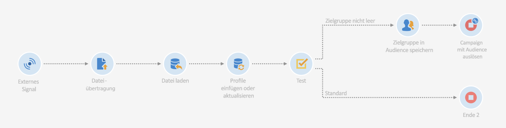

Führen Sie zur Konfiguration des Workflows die folgenden Schritte aus:

1. Deklarieren Sie die im API-Aufruf definierten Parameter. Öffnen Sie dazu die Aktivität **[!UICONTROL Externes Signal]** und fügen Sie dann die Namen und Typen der Parameter hinzu.

   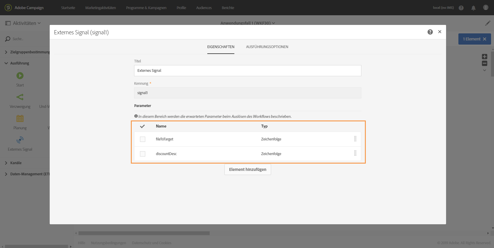

1. Fügen Sie die Aktivität **[!UICONTROL Dateiübertragung]** hinzu, um Daten in die Datenbank zu importieren. Ziehen Sie dazu die Aktivität in den Arbeitsbereich, öffnen Sie sie und wählen Sie den Tab **[!UICONTROL Protokoll]** aus.
1. Wählen Sie die Option **[!UICONTROL Dynamischen Dateipfad verwenden]** aus und verwenden Sie dann den Parameter **fileToTarget** als die zu übertragende Datei:

   ```
   $(vars/@fileToTarget)
   ```

   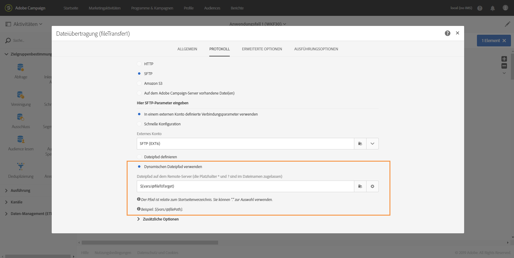

1. Laden Sie die Daten aus der Datei in die Datenbank.

   Ziehen Sie dazu die Aktivität **[!UICONTROL Datei laden]** in den Workflow und konfigurieren Sie sie nach Bedarf.

1. Fügen Sie Daten aus der importierten Datei in die Datenbank ein und aktualisieren Sie die Datenbank.

   Ziehen Sie dazu die Aktivität **[!UICONTROL Daten-Update]** in den Arbeitsbereich und wählen Sie den Tab **[!UICONTROL Identifizierung]** aus, um ein Abstimmkriterium hinzuzufügen (in diesem Fall das Feld **E-Mail**).

   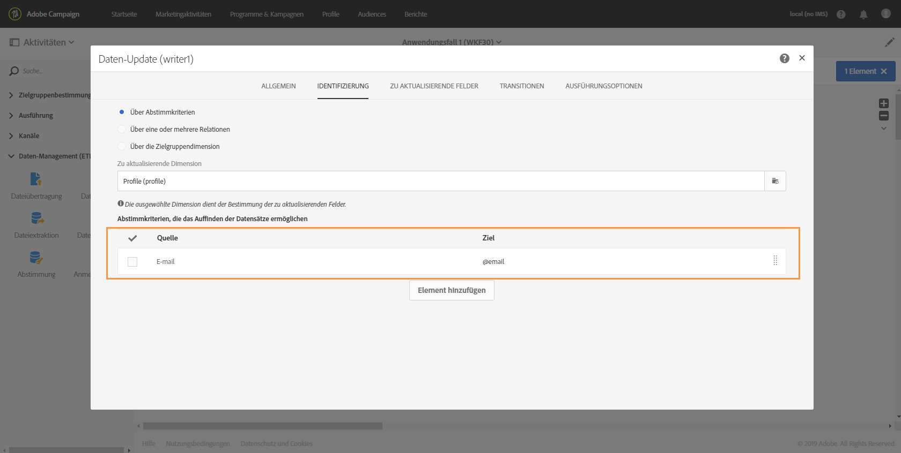

1. Wählen Sie den Tab **[!UICONTROL Zu aktualisierende Felder]** aus und spezifizieren Sie die in der Datenbank zu aktualisierenden Felder (in diesem Fall die Felder **Vorname** und **E-Mail**).

   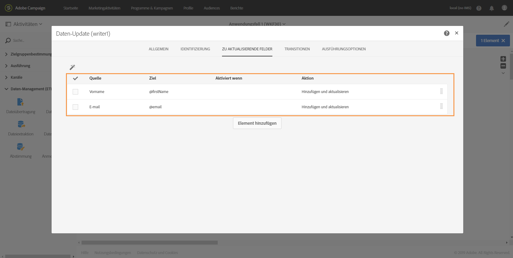

1. Überprüfen Sie, ob die Daten aus der Datei abgerufen wurden. Ziehen Sie dazu die Aktivität **[!UICONTROL Test]** in den Workflow und wählen Sie die Schaltfläche **[!UICONTROL Element hinzufügen]** aus, um eine Bedingung hinzuzufügen.
1. Benennen und definieren Sie die Bedingung. In diesem Fall soll getestet werden, ob die ausgehende Transition Daten mit der unten stehenden Syntax enthält.

   ```
   $long(vars/@recCount)>0
   ```

   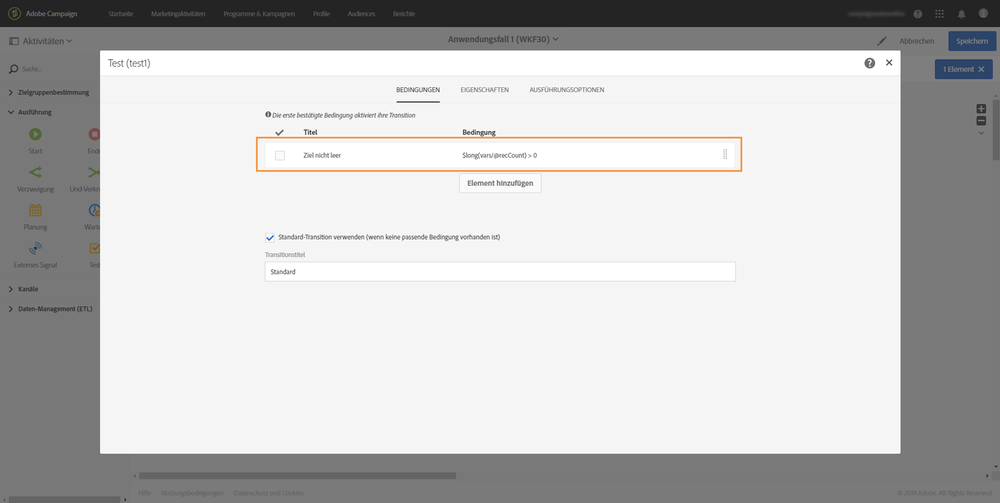

1. Wenn Daten abgerufen werden, speichern Sie sie in einer Zielgruppe. Fügen Sie zu diesem Zweck die Aktivität **[!UICONTROL Zielgruppe speichern]** zur Transition **Target not empty** hinzu und öffnen Sie sie.
1. Wählen Sie die Option **[!UICONTROL Dynamischen Titel verwenden]** aus und fügen Sie dann den Parameter **fileToTarget** als den Titel der Zielgruppe ein:

   ```
   $(vars/@fileToTarget)
   ```

   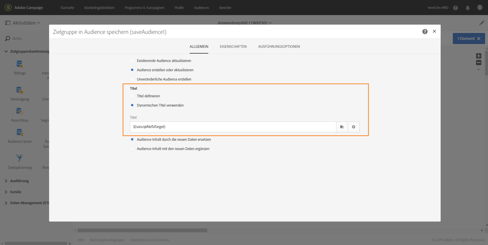

1. Ziehen Sie die Aktivität **[!UICONTROL Ende]** in den Arbeitsbereich. Dadurch wird Workflow 2 mit Parametern aufgerufen. Öffnen Sie dann die Aktivität.
1. Wählen Sie den Tab **[!UICONTROL Externes Signal]** aus und spezifizieren Sie den auszulösenden Workflow sowie die damit verknüpfte Signalaktivität.
1. Definieren Sie die in Workflow 2 zu verwendenden Parameter sowie deren Werte.

   In diesem Fall sollen die Parameter übermittelt werden, die ursprünglich im API-Aufruf definiert wurden (**fileToTarget** und **discountDesc**), sowie der zusätzlichen Parameter **segmentCode** mit einem konstanten Wert (&quot;20 % Rabatt&quot;).

   

Workflow 1 ist somit konfiguriert. Erstellen Sie jetzt Workflow 2. Weiterführende Informationen hierzu finden Sie in [diesem Abschnitt](../../automating/using/use-case-calling-workflow.md#step-3--configuring-workflow-2).

## Schritt 3: Workflow 2 konfigurieren        {#step-3--configuring-workflow-2}

Workflow 2 wird folgendermaßen erstellt:

* **[!UICONTROL Aktivität Externes Signal]**: Die Parameter müssen deklariert werden, damit sie im Workflow verwendet werden können.
* Aktivität **[!UICONTROL Zielgruppe lesen]**: Liest die in Workflow 1 gespeicherte Zielgruppe.
* Aktivität **[!UICONTROL E-Mail-Versand]**: Sendet eine wiederkehrende durch Parameter personalisierte Nachricht an die entsprechende Zielgruppe.

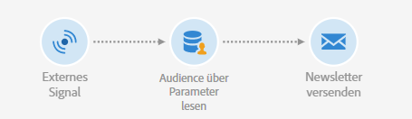

Führen Sie zur Konfiguration des Workflows die folgenden Schritte aus:

1. Deklarieren Sie die in Workflow 1 definierten Parameter.

   Öffnen Sie dazu die Aktivität **[!UICONTROL Externes Signal]**, und fügen Sie dann den Namen und den Typ eines jeden Parameters hinzu, der in der Aktivität **[!UICONTROL Ende]** von Workflow 1 definiert wurde.

   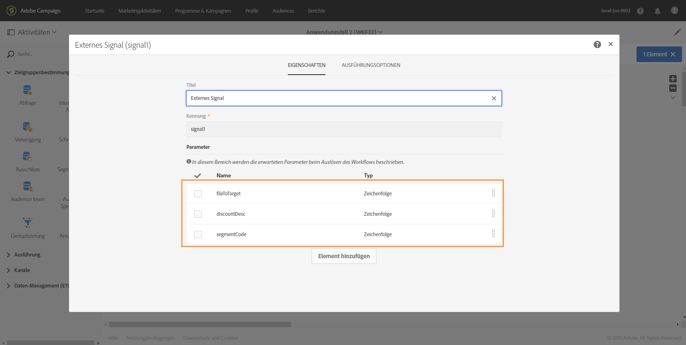

1. Verwenden Sie die in Workflow 1 gespeicherte Zielgruppe. Platzieren Sie zu diesem Zweck die Aktivität **[!UICONTROL Zielgruppe lesen]** in den Workflow und öffnen Sie sie.
1. Wählen Sie die Option **[!UICONTROL Dynamische Audience verwenden]** aus und verwenden Sie den Parameter **fileToTarget** als den Namen der zu lesenden Zielgruppe:

   ```
   $(vars/@fileToTarget)
   ```

   

1. Benennen Sie die ausgehende Transition entsprechend dem Parameter **segmentCode**.

   Wählen Sie dazu den Tab **[!UICONTROL Transition]** und danach die Option **[!UICONTROL Dynamischen Segmentcode verwenden]** aus.

1. Verwenden Sie den Parameter **segmentCode** als den Namen der ausgehenden Transition:

   ```
   $(vars/@segmentCode)
   ```

   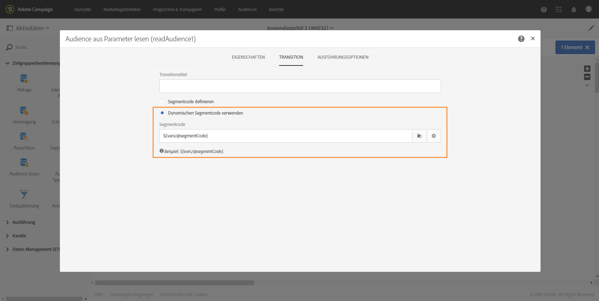

1. Platzieren Sie die Aktivität **[!UICONTROL E-Mail-Versand]** in den Workflow, um eine Nachricht an die Zielgruppe zu senden.
1. Identifizieren Sie die in der Nachricht zu verwendenden Parameter, um sie mit dem Parameter **discountDesc** zu personalisieren. Öffnen Sie dazu die erweiterten Optionen der Aktivität und fügen Sie den Namen und den Wert des Parameters hinzu.

   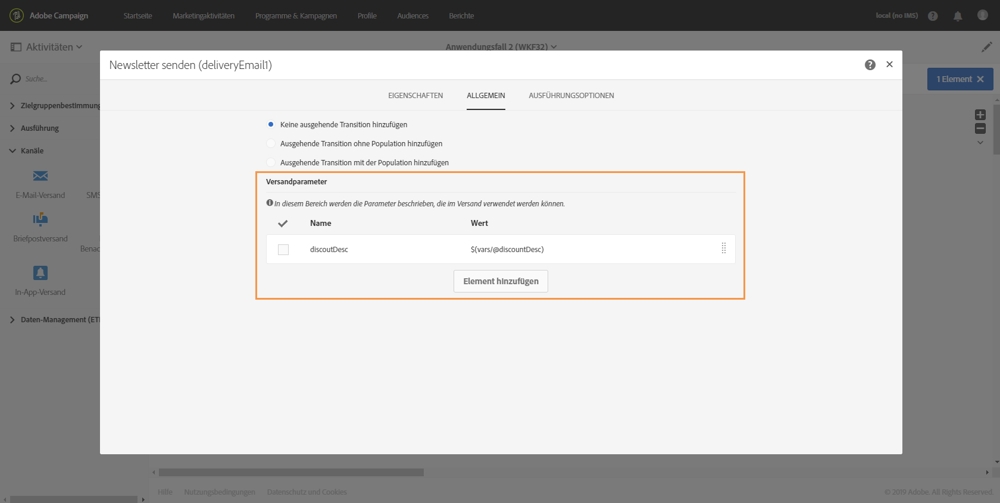

1. Sie können die Nachricht jetzt konfigurieren. Öffnen Sie die Aktivität und wählen Sie **[!UICONTROL Wiederholende E-Mail]** aus.

   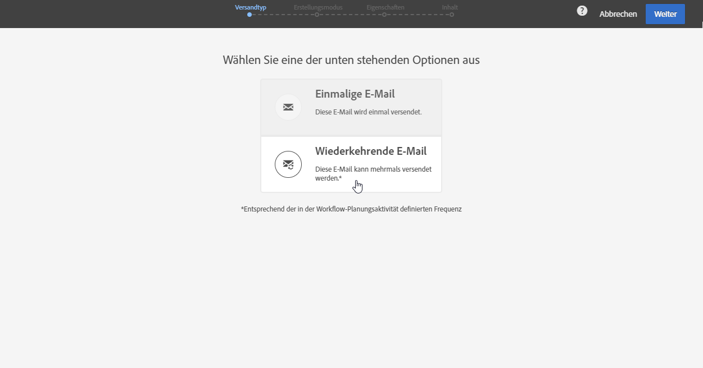

1. Wählen Sie die zu verwendende Vorlage aus und definieren Sie die E-Mail-Eigenschaften entsprechend Ihren Anforderungen.
1. Verwenden Sie den Parameter **discountDesc** als ein Personalisierungsfeld. Wählen Sie das Feld dazu aus der Liste der Personalisierungsfelder aus.

   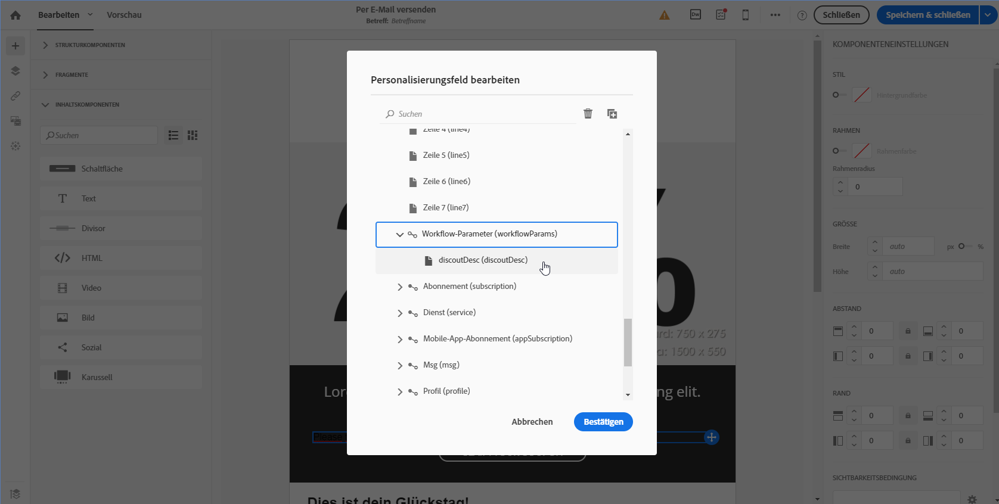

1. Jetzt können Sie die Konfiguration der Nachricht abschließen und diese wie üblich versenden.

   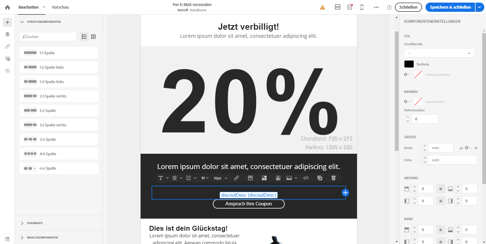

## Workflows ausführen        {#executing-the-workflows}

Nach dem Erstellen der Workflows können diese ausgeführt werden. Achten Sie darauf, dass die beiden Workflows gestartet werden, bevor der API-Aufruf ausgeführt wird.
