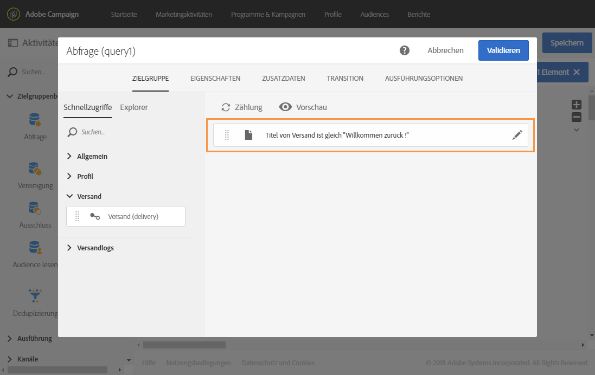
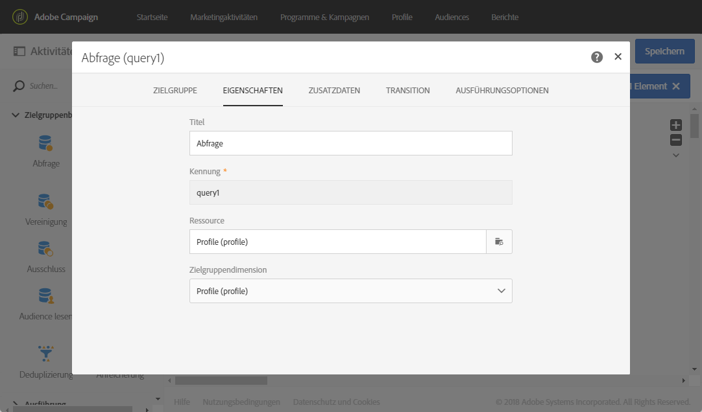
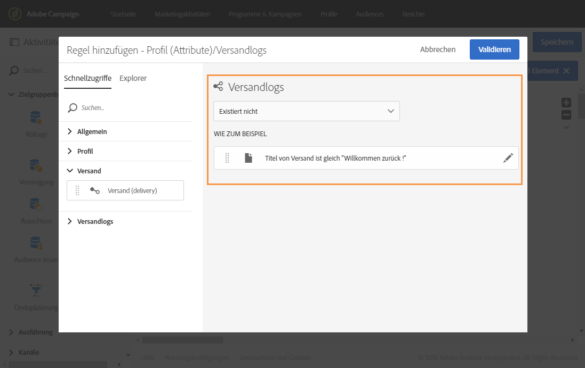

# Von den Zielgruppendimensionen abweichende Ressourcen verwenden {#using-resources-different-from-targeting-dimensions}

In diesen Anwendungsfällen wird erläutert, wie eine Ressource verwendet werden kann, die sich von der Zielgruppendimension unterscheidet, um beispielsweise nach einem bestimmten Datensatz in einer entfernten Tabelle zu suchen.

Weiterführende Informationen zu Zielgruppendimensionen und Ressourcen finden Sie in [diesem Abschnitt](../../automating/using/query.md#targeting-dimensions-and-resources)

**Beispiel 1: Sie möchten Profile identifizieren, die im Versand mit dem Titel „Willkommen zurück!“ enthalten waren**.

* In diesem Fall möchten wir Profile erfassen. Wir wählen für die Zielgruppendimension **[!UICONTROL Profile (profile)]** aus.
* Wir möchten die ausgewählten Profile nach dem Versandtitel filtern. Deshalb wählen wir für die Ressource **[!UICONTROL Versandlogs]**. Auf diese Weise filtern wir direkt in der Versandlog-Tabelle, wodurch die Ausführung beschleunigt wird.

**Beispiel 2: Sie möchten Profile identifizieren, die nicht im Versand mit dem Titel &quot;Willkommen zurück!&quot; enthalten waren.**

Im vorherigen Beispiel haben wir eine von der Zielgruppendimension abweichende Ressource verwendet. Dieses Vorgehen ist nur möglich, wenn Sie einen Datensatz suchen, der in der entfernten Tabelle **vorhanden ist** (in unserem Beispiel Versandlogs).

Wenn wir einen Datensatz suchen, der in der entfernten Tabelle **nicht vorhanden** ist (z. B. Profile, die nicht in einem bestimmten Versand enthalten waren), müssen wir dieselbe Ressource und Zielgruppendimension verwenden, da der Datensatz nicht in der entfernten Tabelle (Versandlogs) vorhanden ist.

* In diesem Fall möchten wir Profile erfassen. Wir wählen für die Zielgruppendimension **[!UICONTROL Profile (profile)]** aus.
* Wir möchten die ausgewählten Profile nach dem Versandtitel filtern. Es ist nicht möglich, direkt nach Versandlogs zu filtern, da wir nach einem Datensatz suchen, der nicht in der Versandlog-Tabelle vorhanden ist. Deshalb wählen wir für die Ressource **[!UICONTROL Profil (profile)]** und erstellen unsere Abfrage auf der Basis der Profiltabelle.

