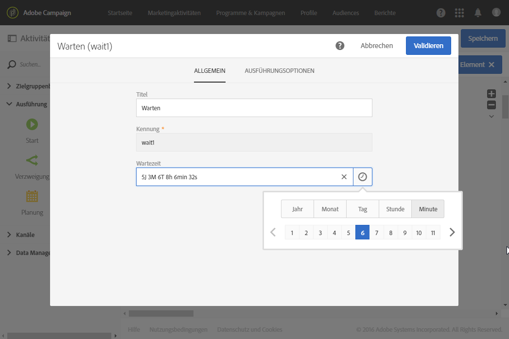
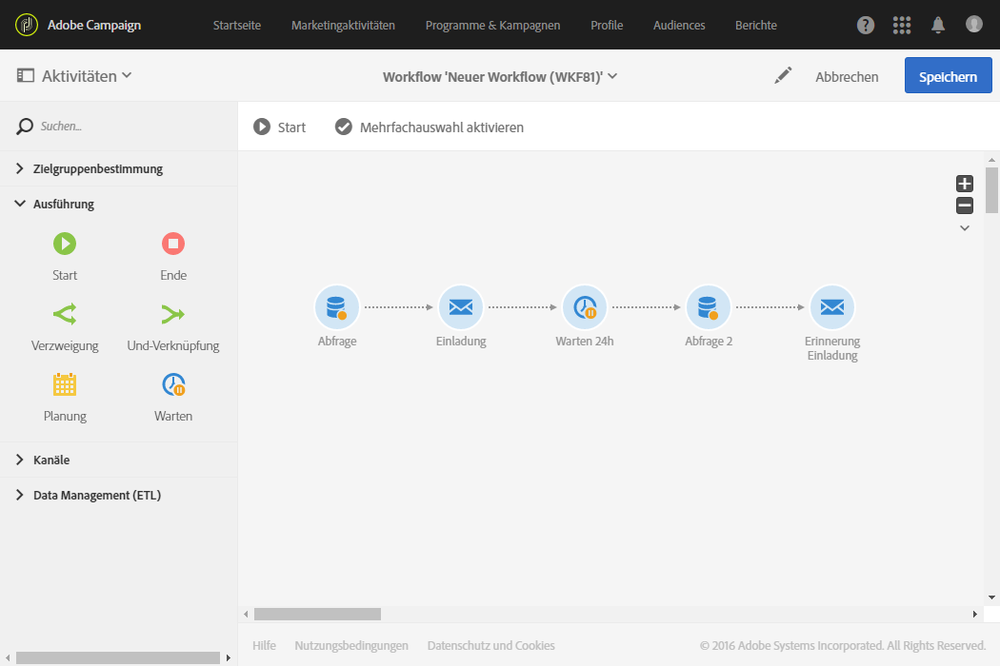

# Warten{#wait}

## Beschreibung {#description}

Die **[!UICONTROL Warten]**-Aktivität ermöglicht das zeitweise Aussetzen der Ausführung eines Teils eines Workflows. Die ausgehende Transition der Aktivität wird nach einer Frist aktiviert, die zwischen einigen Sekunden und mehreren Monaten liegen kann, wodurch die Ausführung der im Anschluss folgenden Aktivitäten ermöglicht wird.

## Anwendungskontext     {#context-of-use}

Die **[!UICONTROL Warten]**-Aktivität ermöglicht es, einen bestimmten Zeitraum zwischen der Ausführung zweier Aktivitäten zu definieren. Beispielsweise kann man mehrere Tage nach einer E-Mail-Versandaktivität warten, dann die während dieses Zeitraums erfolgten Öffnungen und Klicks analysieren, bevor man weitere Verarbeitungsschritte (Erinnerungs-E-Mail, Zielgruppenerstellung etc.) unternimmt.

## Konfiguration     {#configuration}

1. Ziehen Sie eine **[!UICONTROL Warten]**-Aktivität in den Workflow-Arbeitsbereich.
1. Markieren Sie die Aktivität und öffnen Sie sie mithilfe der in der Schnellaktion angezeigten Schaltfläche .
1. Bestimmen Sie die **[!UICONTROL Dauer]** der Wartezeit zwischen der Aktivierung der eingehenden und der ausgehenden Transition der Aktivität.

   Sie können die Dauer manuell eingeben oder das dafür vorgesehene Auswahltool des Felds verwenden.

   

1. Validieren Sie die Konfiguration der Aktivität und speichern Sie Ihren Workflow.

## Beispiel {#example}

Das folgende Beispiel erläutert die Aktivität **[!UICONTROL Warten]** anhand eines typischen Fallbeispiels. Darin wird eine E-Mail mit einer Einladung zu einem Event verschickt. 24 Stunden nach dem Versand werden die E-Mail-Versandlogs analysiert und eine Erinnerungs-E-Mail an die Personen gesendet, die die erste E-Mail erhalten, sich aber nicht angemeldet haben.

Der Workflow stellt sich folgendermaßen dar:

* Eine erste **[!UICONTROL Abfrage]** ermöglicht die Bestimmung der Zielgruppe, an die die Einladungs-E-Mail versandt wird.
* Ein **[!UICONTROL E-Mail-Versand]** dient dazu, erstmalig die Einladung an die auf diese Weise ausgewählten Profile zu senden.
* Eine **[!UICONTROL Warten]**-Aktivität von 24 Stunden platziert eine Pause zwischen dem Versand der Einladung und dem Fortgang des Workflows.
* Eine zweite **[!UICONTROL Abfrage]** ermöglicht die Bestimmung der Zielgruppe mit den Profilen, die die erste Mail erhalten, aber nicht den darin enthaltenen Anmelde-Link angeklickt haben.
* Ein zweiter **[!UICONTROL E-Mail-Versand]** dient dazu, eine Einladungs-Erinnerung an die in der zweiten Abfrage ausgewählten Personen zu senden.
