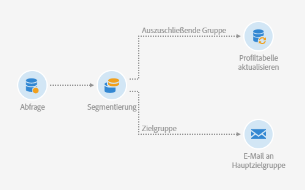
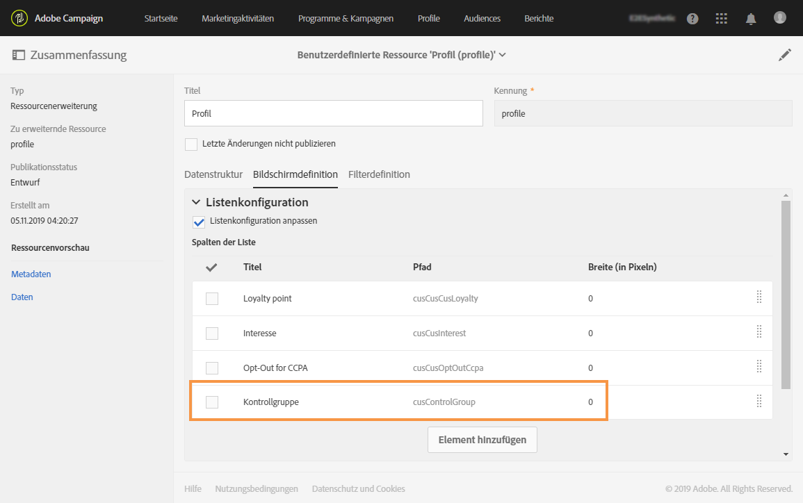
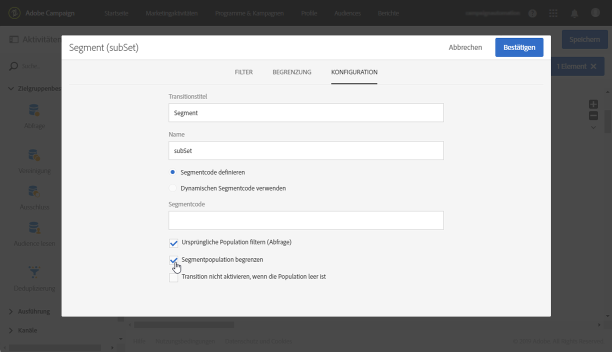
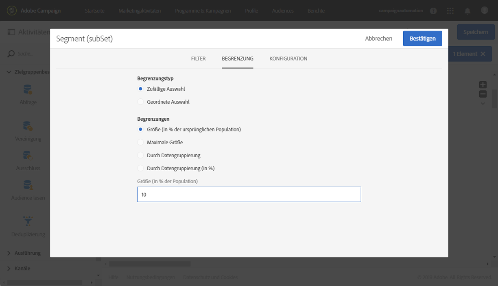
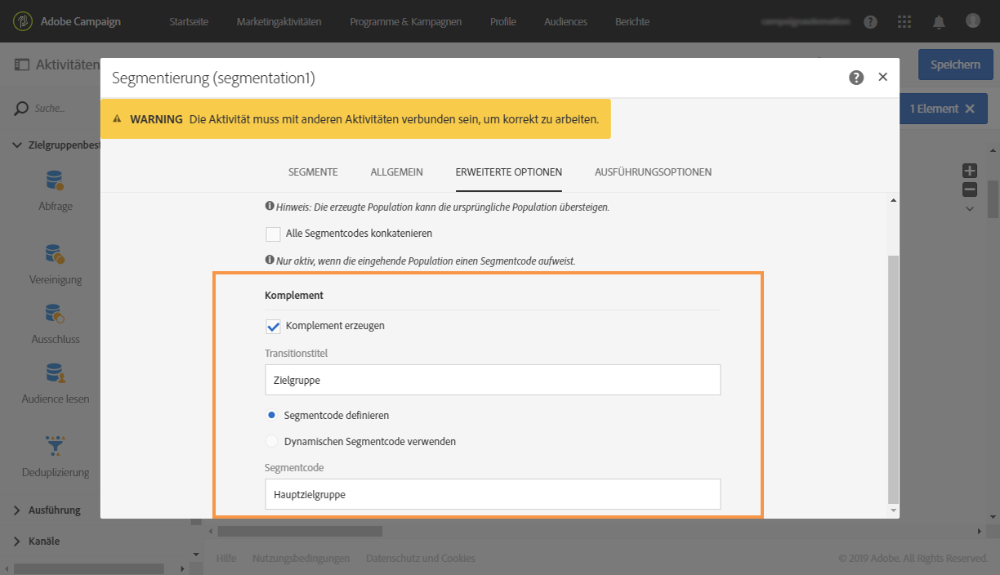
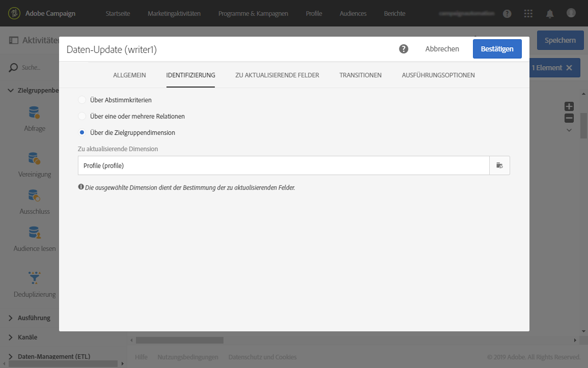
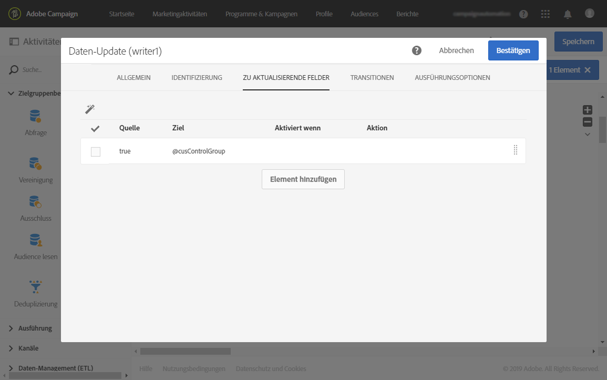
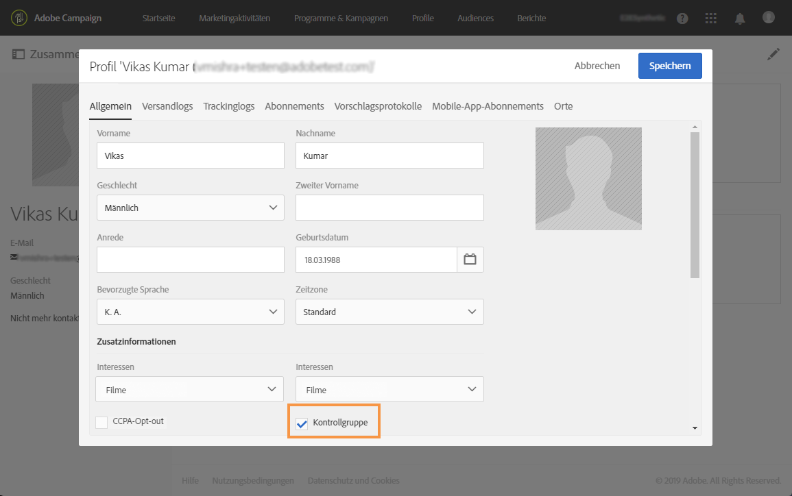
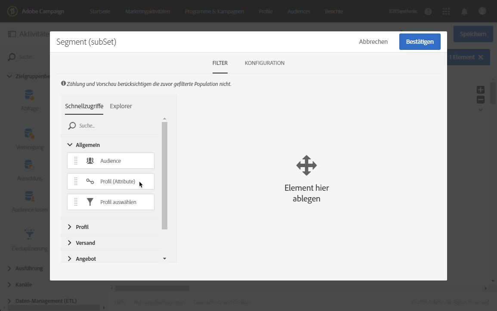

# Kontrollgruppe erstellen {#building-control-group}

Um die Wirkung eines Versands zu messen, können Sie einige Profile aus Ihrer Zielgruppe ausschließen, sodass diese keine Nachricht erhalten. Das Verhalten dieser Kontrollgruppe kann anschließend mit dem der Zielgruppe verglichen werden, die die Nachricht erhalten hat.

Sie können in Adobe Campaign Standard dazu einen Workflow mit folgenden Aktivitäten erstellen:
* Eine [Abfrageaktivität](../../automating/using/query.md) zur Auswahl einer bestimmten Population.
* Eine [Segmentierungsaktivität](../../automating/using/segmentation.md), um eine zufällige Kontrollgruppe von dieser Population zu isolieren.
* Eine [E-Mail-Versandaktivität](../../automating/using/email-delivery.md), um eine Nachricht an die Hauptzielgruppe zu senden.
* Eine [Daten-Aktualisierungsaktivität](../../automating/using/update-data.md), um die Profile zu aktualisieren, die von der Zielgruppe ausgeschlossen wurden (die zufällige Kontrollgruppe).

## Profilressource erweitern {#extending-profile}

Zunächst müssen Sie die Ressource **[!UICONTROL Profil]** um ein neues Feld für die Kontrollgruppe erweitern. Nachdem der Workflow ausgeführt wurde, wird dieses Feld auf die Profile überprüft, die aus der Zielgruppe ausgeschlossen wurden.

1. Klicken Sie unter **[!UICONTROL Administration]** > **[!UICONTROL Entwicklung]** > **[!UICONTROL Benutzerdefinierte Ressourcen]** auf **[!UICONTROL Erstellen]**.
1. Wenn Sie die Ressource noch nicht erweitert haben, wählen Sie zuerst **[!UICONTROL Existierende Ressource erweitern]** und danach die Ressource **[!UICONTROL Profil]** aus.
1. Fügen Sie im Tab **[!UICONTROL Datenstruktur]** ein neues Feld für die Kontrollgruppe hinzu und wählen Sie für das Feld **[!UICONTROL Typ]** den Wert **[!UICONTROL Boolesch]** aus.

   

1. Öffnen Sie im Tab **[!UICONTROL Bildschirmdefinition]** den Bereich **[!UICONTROL Konfiguration des Detailbildschirms]** und wählen Sie das soeben erstellte Feld aus, damit es für jedes Profil angezeigt wird.

   

1. Speichern Sie Ihre Änderungen.
1. Aktualisieren Sie die Datenbankstruktur, um die erweiterte **[!UICONTROL Profil]**-Ressource zu publizieren. Siehe [Benutzerdefinierte Ressource publizieren](../../developing/using/updating-the-database-structure.md#publishing-a-custom-resource).

Weiterführende Informationen zum Erweitern einer benutzerdefinierten Ressource finden Sie im Abschnitt [Schritte zum Hinzufügen einer Ressource](../../developing/using/key-steps-to-add-a-resource.md).

## Workflow erstellen     {#creating-a-workflow}

1. Wählen Sie dazu in **[!UICONTROL Marketingaktivitäten]** die Option **[!UICONTROL Erstellen]** und dann **[!UICONTROL Workflow]** aus.
1. Wählen Sie als Workflow-Typ **[!UICONTROL Neuer Workflow]** und danach **[!UICONTROL Weiter]** aus.
1. Geben Sie die Eigenschaften des Workflows ein und wählen Sie **[!UICONTROL Erstellen]** aus.

Die detaillierten Schritte zum Erstellen eines Workflows werden im Abschnitt [Workflow erstellen](../../automating/using/building-a-workflow.md) beschrieben.

## Abfrageaktivität erstellen. {#create-a-query-activity}

1. Ziehen Sie unter **[!UICONTROL Aktivitäten]** > **[!UICONTROL Zielgruppenbestimmung]** eine [Abfrageaktivität](../../automating/using/query.md) in den Arbeitsbereich.
1. Doppelklicken Sie auf die Aktivität, um Ihre Zielgruppe zu definieren.
1. Ziehen Sie beispielsweise unter **[!UICONTROL Schnellzugriffe]** die Option **[!UICONTROL Profil]** in den Arbeitsbereich, wählen Sie **[!UICONTROL Alter]** mit dem Operator **[!UICONTROL Größer als]** aus und geben Sie in das Feld **[!UICONTROL Wert]** &quot;25&quot; ein.
1. Wählen Sie **[!UICONTROL Bestätigen]** aus.

## Segmentierungsaktivität erstellen. {#creating-a-segmentation-activity}

1. Ziehen Sie eine [Segmentierungsaktivität](../../automating/using/segmentation.md) in den Arbeitsbereich und doppelklicken Sie darauf.
1. Wählen Sie im Tab **[!UICONTROL Segmente]** ein Segment aus, das bearbeitet werden soll.
1. Wählen Sie in diesem Segment im Tab **[!UICONTROL Konfiguration]** die Option **[!UICONTROL Segmentpopulation begrenzen]** aus.

   

1. Stellen Sie sicher, dass im Tab **[!UICONTROL Begrenzung]** die Option **[!UICONTROL Zufällige Auswahl]** ausgewählt ist.

   

1. Definieren Sie einen Prozentsatz der Ursprungspopulation, z. B. 10 %, und wählen Sie **[!UICONTROL Bestätigen]** aus. Die Kontrollgruppe beträgt somit 10 % der Zielgruppe und die Auswahl erfolgt zufällig.
1. Wählen Sie im Tab **[!UICONTROL Erweiterte Optionen]** die Option **[!UICONTROL Komplement erzeugen]** aus und füllen Sie die Felder **[!UICONTROL Transitionstitel]** und **[!UICONTROL Segmentcode]** aus.

   

1. Wählen Sie **[!UICONTROL Bestätigen]** aus.

## E-Mail-Aktivität erstellen {#creating-an-email-activity}

1. Ziehen Sie unter **[!UICONTROL Aktivitäten]** > **[!UICONTROL Kanäle]** eine [E-Mail-Versandaktivität](../../automating/using/email-delivery.md) hinter das Hauptzielgruppensegment.
1. Wählen Sie zur Bearbeitung die Aktivität und danach  aus.
1. Wählen Sie **[!UICONTROL Einmalige E-Mail]** und danach **[!UICONTROL Weiter]** aus.
1. Wählen Sie eine E-Mail-Vorlage und danach **[!UICONTROL Weiter]** aus.
1. Geben Sie die E-Mail-Eigenschaften ein und wählen Sie **[!UICONTROL Weiter]** aus.
1. Um das Layout Ihrer E-Mail zu bearbeiten, wählen Sie **[!UICONTROL E-Mail-Designer verwenden]** aus.
1. Bearbeiten und speichern Sie Ihre Inhalte.
1. Deaktivieren Sie im Nachrichten-Dashboard im Bereich **[!UICONTROL Planung]** die Option **[!UICONTROL Vor dem Nachrichtenversand Bestätigung einholen]**.

## Daten-Update-Aktivität erstellen {#creating-update-data-activity}

1. Ziehen Sie die Aktivität [Daten-Update](../../automating/using/update-data.md) hinter das Kontrollgruppensegment.
1. Markieren Sie die Aktivität und öffnen Sie sie mithilfe der in den Quick Actions angezeigten Schaltfläche .
1. Wählen Sie im Tab **[!UICONTROL Allgemein]** in der Dropdown-Liste **[!UICONTROL Aktionstyp]** die Option **[!UICONTROL Aktualisieren]** aus.
1. Wählen Sie im Tab **[!UICONTROL Identifizierung]** die Option **[!UICONTROL Über die Zielgruppendimension]** aus.
1. Wählen Sie die **[!UICONTROL Profil]**-Ressource aus, die Sie zuvor als die zu aktualisierende Dimension erweitert haben.

   

1. Wählen Sie im Tab **[!UICONTROL Zu aktualisierende Felder]** das Kontrollgruppenfeld aus, das Sie der Ressource **[!UICONTROL Profil]** als **[!UICONTROL Ziel]** hinzugefügt haben, und geben Sie als Bedingung &quot;true&quot; ein.

   

1. Wählen Sie **[!UICONTROL Bestätigen]** aus.

## Workflow ausführen {#running-the-workflow}

Wählen Sie **[!UICONTROL Starten]** aus, um den Workflow auszuführen.

Dadurch wird die Population der Kontrollgruppe ausgeschlossen und die Nachricht wird an die verbleibende Hauptzielgruppe gesendet.

Die **[!UICONTROL Profil]**-Ressource wird wie folgt aktualisiert: Wenn sich ein Profil in der Kontrollgruppe befand, wird das entsprechende Feld markiert.

Sie können nun die Reaktion der Nachrichtenempfänger mit der kleinen Gruppe vergleichen, die vom Empfang der Nachricht ausgeschlossen wurde und diese nicht erhalten hat.

## Dieselbe Kontrollgruppe wiederverwenden {#reusing-same-control-group}

Das obige Beispiel ermöglicht die Erstellung einer globalen Kontrollgruppe, da diese unabhängig von den Sendungen als Profilattribut gespeichert wird. Das neue Feld &quot;Kontrollgruppe&quot;, das im Zuge der **[!UICONTROL Profil]**-Ressourcenerweiterung erstellt wurde, wird aktualisiert, nachdem der obige Workflow abgeschlossen ist.

Wenn Sie das nächste Mal dieselbe Kontrollgruppe verwenden möchten, können Sie das Segment im neuen Feld &quot;Kontrollgruppe&quot; verwenden, anstatt eine weitere zufällige Segmentierung vorzunehmen.

Gehen Sie dazu wie folgt vor:
1. Wählen Sie beim Erstellen der **[!UICONTROL Segmentierungsaktivität]** im Tab **[!UICONTROL Segmente]** das zu bearbeitende Segment aus.
1. Stellen Sie sicher, dass im Tab **[!UICONTROL Konfiguration]** dieses Segments nicht die Option **[!UICONTROL Segmentpopulation begrenzen]** ausgewählt ist.
1. Ziehen Sie im Tab **[!UICONTROL Filter]** die Option **[!UICONTROL Profile (Attribute)]** in den Hauptarbeitsbereich.

   

1. Wählen Sie im Fenster **[!UICONTROL Regel hinzufügen – Profile (Attribute)]** die Option &quot;Kontrollgruppe&quot; aus (das Feld, das Sie der **[!UICONTROL Profilressource]** hinzugefügt haben) und dann als Filterbedingung **[!UICONTROL Ja]**.

   
