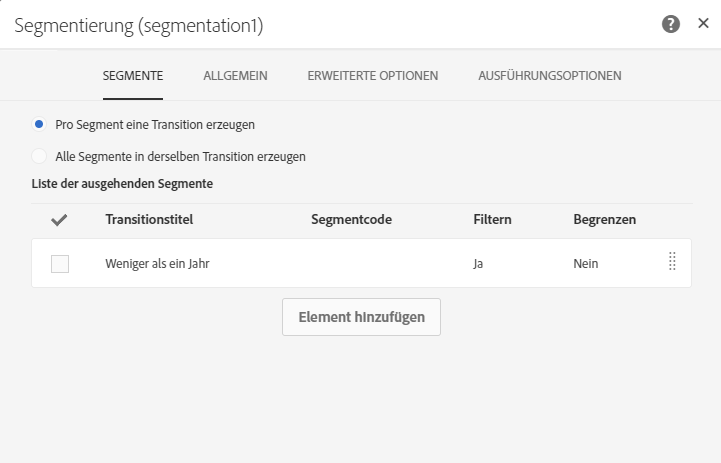
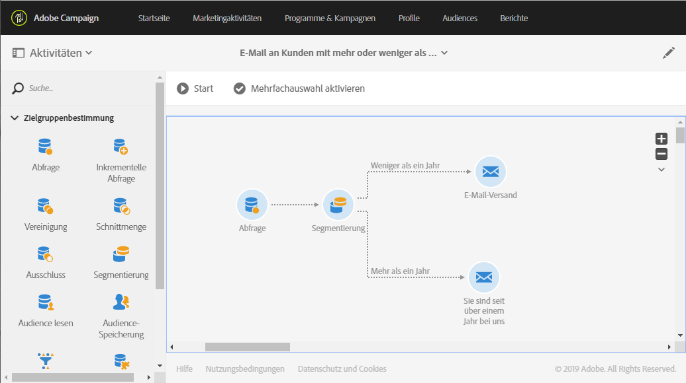

# Sendungen mit einem Komplement erstellen {#deliveries-with-complement}

Sie können Kunden folgende E-Mails senden: eine E-Mail an Kunden, die vor weniger als einem Jahr in die Datenbank aufgenommen wurden, und eine andere E-Mail an Kunden, die vor mehr als einem Jahr aufgenommen wurden.

1. Wählen Sie dazu in **[!UICONTROL Marketingaktivitäten]** die Option **[!UICONTROL Erstellen]** und dann **[!UICONTROL Workflow]** aus.
1. Wählen Sie als Workflow-Typ **[!UICONTROL Neuer Workflow]** und danach **[!UICONTROL Weiter]** aus.
1. Geben Sie die Eigenschaften des Workflows ein und wählen Sie **[!UICONTROL Erstellen]** aus.

## Erstellen Sie eine Abfrageaktivität {#create-a-query-activity}

1. Ziehen Sie unter **[!UICONTROL Aktivitäten]** > **[!UICONTROL Zielgruppenbestimmung]** eine [Abfrageaktivität](../../automating/using/query.md) in den Arbeitsbereich.
1. Doppelklicken Sie auf die Aktivität.
1. Ziehen Sie in **[!UICONTROL Verknüpfungen]** das Element **[!UICONTROL Profile]** in den Arbeitsbereich und wählen Sie **[!UICONTROL E-Mail]** mit dem Operator **[!UICONTROL Ist nicht leer]** aus.
1. Ziehen Sie in **[!UICONTROL Verknüpfungen]** das Element **[!UICONTROL Profile]** in den Arbeitsbereich und wählen Sie **[!UICONTROL Nicht mehr per E-Mail kontaktieren]** mit dem Wert **[!UICONTROL Nein]** aus.
1. Wählen Sie **[!UICONTROL Bestätigen]** aus.

## Erstellen Sie eine Segmentierungsaktivität. {#create-a-segmentation-activity}

1. Ziehen Sie in **[!UICONTROL Aktivitäten]** > **[!UICONTROL Targeting]**, eine [Segmentierungsaktivität](../../automating/using/segmentation.md) in den Arbeitsbereich und doppelklicken Sie darauf.
1. Bewegen Sie den Mauszeiger über das Segment und wählen Sie dann  aus, um Kunden auszuwählen, die dieses Jahr zur Datenbank hinzugefügt wurden.
1. Ziehen Sie **[!UICONTROL Profile]** in den Arbeitsbereich und wählen Sie **[!UICONTROL Erstellt]** mit dem Filtertyp **[!UICONTROL Relativ]** aus.
1. Ändern Sie die **[!UICONTROL Genauigkeit]** in **[!UICONTROL Jahr]** und wählen Sie **[!UICONTROL Dieses Jahr]** aus.
1. Wählen Sie zweimal **[!UICONTROL Bestätigen]** aus.
1. Aktivieren Sie in **[!UICONTROL Erweiterte Optionen]** die Option **[!UICONTROL Komplement erstellen]**, um ein Segment zu erstellen, mit dem die verbleibenden Empfänger ausgewählt werden.
1. Wählen Sie **[!UICONTROL Bestätigen]** aus.
1. Wählen Sie **[!UICONTROL Speichern]** aus.

>[!NOTE]
>
>Wenn die Struktur der Regel beachtet werden soll, wählen Sie **[!UICONTROL Erweiterter Modus]** aus.

## E-Mail-Versand erstellen {#create-an-email-delivery}

1. Ziehen Sie in **[!UICONTROL Aktivitäten]** > **[!UICONTROL Kanäle]** hinter jedes Segment eine Aktivität [E-Mail-Versand](../../automating/using/email-delivery.md).
1. Wählen Sie die Aktivität aus und danach , um die Bearbeitung zu ermöglichen.
1. Wählen Sie **[!UICONTROL Einmalige E-Mail]** und danach **[!UICONTROL Weiter]** aus.
1. Wählen Sie eine E-Mail-Vorlage und danach **[!UICONTROL Weiter]** aus.
1. Geben Sie die E-Mail-Eigenschaften ein und wählen Sie **[!UICONTROL Weiter]** aus.
1. Um das Layout Ihrer E-Mail zu erstellen, wählen Sie **[!UICONTROL Email Designer]** aus.
1. Fügen Sie Elemente ein oder wählen Sie eine bestehende Vorlage aus.
1. Personalisieren Sie Ihre E-Mail mit Angeboten für den jeweiligen Versand.
1. Wählen Sie **[!UICONTROL Vorschau]** aus, um Ihr Layout zu überprüfen.
1. Wählen Sie **[!UICONTROL Speichern]** aus.

Weiterführende Informationen dazu finden Sie im Abschnitt zum [Gestalten einer E-Mail](../../designing/using/designing-from-scratch.md#designing-an-email-content-from-scratch).

