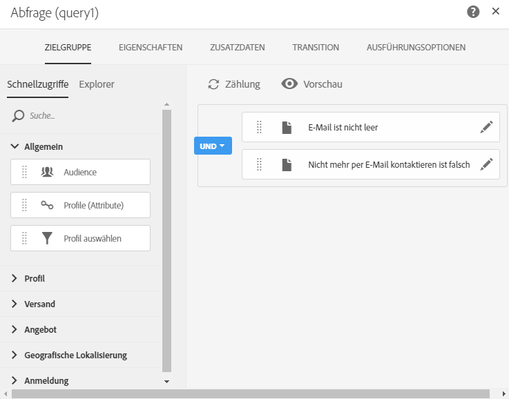

# Workflow-Anwendungsfall: Erstellung ergänzender Lieferungen {#deliveries-with-complement}

Sie können eine E-Mail an Kunden senden: einer für Kunden, die vor weniger als einem Jahr gegründet wurden, einer für Kunden, die vor mehr als einem Jahr gegründet wurden.

1. In **[!UICONTROL Marketing Activities]**, click **[!UICONTROL Create]** and select **[!UICONTROL Workflow]**.
1. Wählen Sie **[!UICONTROL Neuer Workflow]** als Workflowtyp aus, und klicken Sie auf **[!UICONTROL Weiter]**.
1. Geben Sie die Eigenschaften des Workflows ein, und klicken Sie auf **[!UICONTROL Erstellen]**.

## Erstellen einer Abfrageaktivität {#create-a-query-activity}

1. Bei **[!UICONTROL Aktivitäten]** &gt; **[!UICONTROL Targeting]** ziehen und löschen Sie eine **[!UICONTROL Abfrageaktivität]**.
1. Doppelklicken Sie auf die Aktivität.
1. Ziehen Sie in **[!UICONTROL Tastenkombinationen]** die **[!UICONTROL Profile]** , und wählen Sie **[!UICONTROL E-Mail]** mit dem Operator **[!UICONTROL ist nicht leer]**.
1. Ziehen Sie in **[!UICONTROL Tastenkombinationen]** die **[!UICONTROL Profile]** , und wählen Sie **[!UICONTROL nicht mehr per E-Mail]** mit dem Wert **[!UICONTROL nein]** aus.
1. Wählen Sie **[!UICONTROL Bestätigen]**.

## Erstellen einer Segmentierungsaktivität {#create-a-segmentation-activity}

1. Bei **[!UICONTROL Aktivitäten]** &gt; **[!UICONTROL Targeting]** ziehen Sie eine **[!UICONTROL Segmentierungsaktivität]** und doppelklicken Sie darauf.
1. Klicken Sie über das Segment und klicken Sie auf  die Zielgruppe, die dieses Jahr in der Datenbank aufgenommen wurde.
1. Ziehen und Ablegen von **[!UICONTROL Profilen]** und wählen Sie **[!UICONTROL Erstellen]** mit dem Filtertyp **[!UICONTROL Relativ]**.
1. Ändern Sie den **[!UICONTROL Genauigkeitsgrad]** in **[!UICONTROL Jahr]** , und wählen Sie **[!UICONTROL Dieses Jahr]** aus.
1. Klicken Sie auf **[!UICONTROL Zweimal bestätigen]** .
1. Aktivieren Sie in **[!UICONTROL Erweiterte Optionen]** die Option Ergänzung **[!UICONTROL generieren]** , um ein Segment für die verbleibenden Empfänger zu erstellen.
1. Wählen Sie **[!UICONTROL Bestätigen]**.
1. Wählen Sie **[!UICONTROL Speichern aus]**.

>[!NOTE]
>
>Um die Struktur der Regel zu beobachten, klicken Sie auf **[!UICONTROL Erweiterter Modus]**.

## Creating an Email delivery {#create-an-email-delivery}

1. Bei **[!UICONTROL Aktivitäten]** &gt; **[!UICONTROL Channels]** ziehen Sie eine E-Mail-Zustellung nach jedem Segment und lassen Sie sie fallen.
1. Klicken Sie auf die Aktivität und wählen Sie  zu bearbeiten.
1. Wählen Sie **[!UICONTROL E-Mail]** als Einzelversand aus, und klicken Sie auf **[!UICONTROL Weiter]**.
1. Wählen Sie eine E-Mail-Vorlage aus, und klicken Sie auf **[!UICONTROL Weiter]**.
1. Geben Sie die E-Mail-Eigenschaften ein und klicken Sie auf **[!UICONTROL Weiter]**.
1. Um das Layout Ihrer E-Mail zu erstellen, klicken Sie auf **[!UICONTROL E-Mail-Designer]**.
1. Fügen Sie Elemente ein oder wählen Sie eine vorhandene Vorlage aus.
1. Personalisieren Sie Ihre E-Mail mit spezifischen Angeboten für jede Lieferung.
1. Klicken Sie auf **[!UICONTROL Vorschau]** , um Ihr Layout zu überprüfen.
1. Wählen Sie **[!UICONTROL Speichern aus]**.

Weitere Informationen finden Sie unter [Entwerfen einer E-Mail](../../designing/using/designing-from-scratch.md#designing-an-email-content-from-scratch).

**Verwandte Themen:**

* [Abfrage](../../automating/using/query.md)
* [Segmenttätigkeit](../../automating/using/segmentation.md)
* [E-Mail-Versand](../../automating/using/email-delivery.md)
