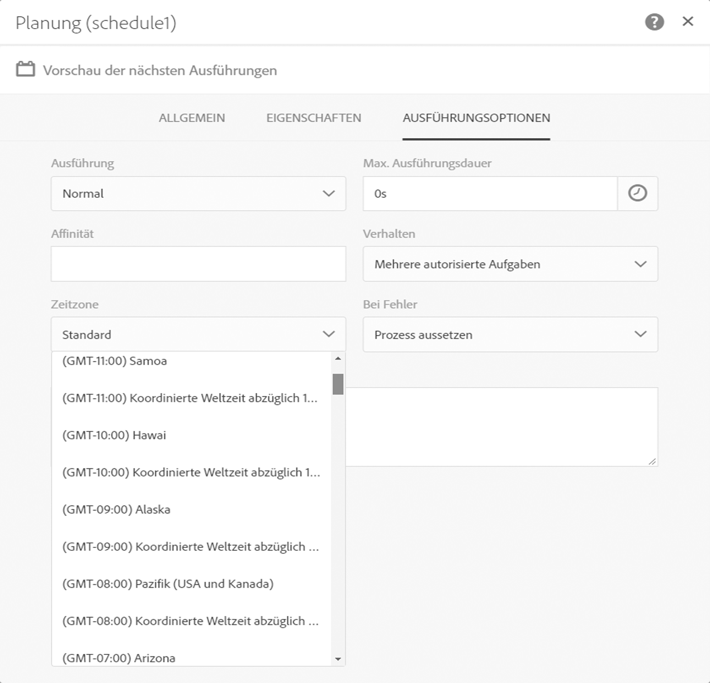
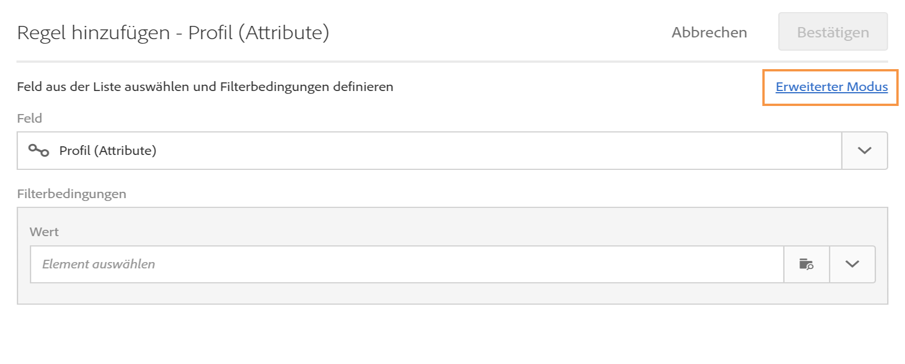
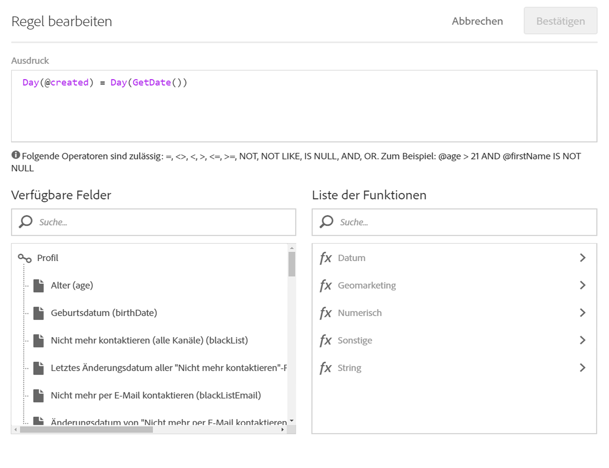
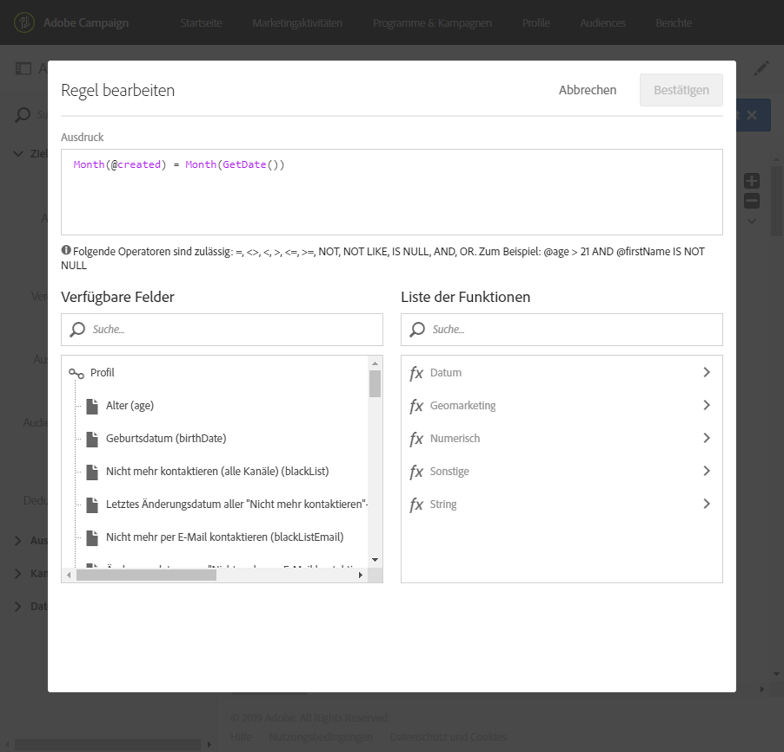

# Sendungen zum Erstellungsdatum von Profilen erstellen {#creation-date-query}

Sie können am Jahrestag der Profilerstellung eines Kunden diesem ein Angebot per E-Mail senden.

1. Wählen Sie dazu in **[!UICONTROL Marketingaktivitäten]** die Option **[!UICONTROL Erstellen]** und dann **[!UICONTROL Workflow]** aus.
1. Wählen Sie als Workflow-Typ **[!UICONTROL Neuer Workflow]** und danach **[!UICONTROL Weiter]** aus.
1. Geben Sie die Eigenschaften des Workflows ein und wählen Sie **[!UICONTROL Erstellen]** aus.

## Planungsaktivität erstellen {#creating-a-scheduler-activity}

1. Ziehen Sie in **[!UICONTROL Aktivitäten]** > **[!UICONTROL Ausführung]** eine [](../../automating/using/scheduler.md)Planungsaktivität in den Arbeitsbereich.
1. Doppelklicken Sie auf die Aktivität.
1. Konfigurieren Sie Ihren Versand.
1. Wählen Sie in **[!UICONTROL Ausführungsfrequenz]** die Option **[!UICONTROL Täglich]** aus.
1. Wählen Sie eine **[!UICONTROL Zeit]** und das **[!UICONTROL Ausführungsintervall]** für Ihren Workflow aus.
1. Wählen Sie ein **[!UICONTROL Anfangsdatum]** und die **[!UICONTROL Gültigkeit]** für Ihren Workflow aus.
1. Bestätigen Sie die Aktivität und speichern Sie den Workflow.

>[!NOTE]
>
>Um Ihren Workflow mit einer bestimmten Zeitzone zu verbinden, richten Sie im Tab **[!UICONTROL Ausführungsoptionen]** im Feld **[!UICONTROL Zeitzone]** die Zeitzone für Ihren Zeitplan ein. Standardmäßig ist die ausgewählte Zeitzone die in den Eigenschaften des Workflows definierte Zeitzone (siehe [Workflow erstellen](../../automating/using/building-a-workflow.md)).



## Abfrageaktivität erstellen {#creating-a-query-activity}

1. Um Empfänger auszuwählen, ziehen Sie eine [](../../automating/using/query.md)Abfrageaktivität in den Arbeitsbereich und doppelklicken Sie darauf.
1. Fügen Sie **[!UICONTROL Profile]** hinzu und wählen Sie **[!UICONTROL Nicht mehr per E-Mail kontaktieren]** mit dem Wert **[!UICONTROL Nein]** aus.

### Profile abrufen, die am Versandtag erstellt wurden {#retriving-profiles-created-on-the-same-day}

1. Ziehen Sie in **[!UICONTROL Profil]** das Feld **[!UICONTROL Erstellt]** in den Arbeitsbereich. Wählen Sie **[!UICONTROL Erweiterter Modus]** aus.
   
1. Doppelklicken Sie in der **[!UICONTROL Funktionsliste]** im Knoten **[!UICONTROL Datum]** auf **[!UICONTROL Tag]**.
1. Fügen Sie dann das Feld **[!UICONTROL Erstellt]** als Argument ein.
1. Wählen Sie als Operator **[!UICONTROL Gleich (=)]** aus.
1. Wählen Sie für den Wert in der **[!UICONTROL Funktionsliste]** im Knoten **[!UICONTROL Datum]** die Option **[!UICONTROL Tag]** aus.
1. Fügen Sie die Funktion **[!UICONTROL GetDate()]** als Argument ein.

Somit haben Sie die Profile abgerufen, deren Erstellungsdatum mit dem aktuellen Datum identisch ist.

Das Ergebnis sollte folgendermaßen aussehen:

```Day(@created) = Day(GetDate())```



Wählen Sie **[!UICONTROL Bestätigen]** aus.

### Profile abrufen, die im Versandmonat erstellt wurden{#retriving-profiles-created-on-the-same-month}

1. Wählen Sie im **[!UICONTROL Abfrageeditor]** die erste Abfrage aus und duplizieren Sie sie.
1. Öffnen Sie das Duplikat.
1. Ersetzen Sie in der Abfrage **[!UICONTROL Tag]** durch **[!UICONTROL Monat]**.
1. Wählen Sie **[!UICONTROL Bestätigen]** aus.



Das Ergebnis sollte folgendermaßen aussehen:

``` Month(@created) = Month(GetDate()) ```

Die endgültige Abfrage sieht folgendermaßen aus:

```Day(@created) = Day(GetDate()) AND Month(@created) = Month(GetDate())```


## E-Mail-Versand erstellen{#creating-an-email-delivery}.

1. Ziehen Sie die Aktivität [E-Mail-Versand](../../automating/using/email-delivery.md) in den Arbeitsbereich.
1. Wählen Sie die Aktivität aus und danach , um die Bearbeitung zu ermöglichen.
1. Wählen Sie **[!UICONTROL Wiederkehrende E-Mail]** und danach **[!UICONTROL Weiter]** aus.
1. Wählen Sie eine E-Mail-Vorlage und danach **[!UICONTROL Weiter]** aus.
1. Geben Sie die E-Mail-Eigenschaften ein und wählen Sie **[!UICONTROL Weiter]** aus.
1. Um das Layout Ihrer E-Mail zu erstellen, wählen Sie **[!UICONTROL Email Designer]** aus.
1. Fügen Sie Elemente ein oder wählen Sie eine bestehende Vorlage aus.
1. Personalisieren Sie Ihre E-Mail mit Feldern und Links.
Weiterführende Informationen dazu finden Sie im Abschnitt zum [Gestalten einer E-Mail](../../designing/using/designing-from-scratch.md#designing-an-email-content-from-scratch).
1. Wählen Sie **[!UICONTROL Vorschau]** aus, um Ihr Layout zu überprüfen.
1. Wählen Sie **[!UICONTROL Speichern]** aus.

**Verwandte Themen:**

* [E-Mail-Kanal](../../channels/using/creating-an-email.md)
